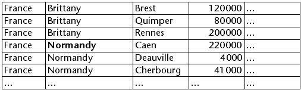

<!--REF #_command_.OBJECT SET SCROLL POSITION.Syntax-->**OBJECT SET SCROLL POSITION**   ( * ; *objeto* {; *posicionL* {; *posicionH*}}{; *} )<!-- END REF-->
<!--REF #_command_.OBJECT SET SCROLL POSITION.Params-->
| Parámetro | Tipo |  | Descripción |
| --- | --- | --- | --- |
| * | Operador | &#8594;  | Si se especifica, objeto es un nombre de objeto (cadena) Si se omite, objeto es una tabla o una variable |
| objeto | any | &#8594;  | Nombre del objeto (si se especifica *) o Tabla o variable (si se omite *) |
| posicionL | Integer | &#8594;  | Número de línea a mostrar |
| posicionH | Integer | &#8594;  | Número de columna a mostrar (list box) o Desplazamiento horizontal en píxeles (imágenes) |
| * | Operador | &#8594;  | Mostrar la línea en primera posición después del desplazamiento |

<!-- END REF-->

#### Descripción 

<!--REF #_command_.OBJECT SET SCROLL POSITION.Summary-->El comando OBJECT SET SCROLL POSITION permite desplazar el contenido de varios tipos de objetos: líneas de un subformulario, de un formulario listado mostrado utilizando los comandos [MODIFY SELECTION](modify-selection.md), [DISPLAY SELECTION](display-selection.md)  o de una lista jerárquica, líneas y columnas de un list box o incluso los píxeles de una imagen.<!-- END REF-->  
  
**Nota:** el desplazamiento por programación de un objeto continúa siendo posible incluso si las barras de desplazamiento están ocultas en el formulario.

Si pasa el primer parámetro opcional *\**, indica que el parámetro *objeto* es el nombre de un objeto de un subformulario, una lista jerárquica, un list box o campo/variable imagen (en este caso, pase una cadena en *objeto*). Si no pasa nada en este parámetro, indica que el parámetro *objeto* es una tabla (tabla de formulario listado o de subformulario) o una variable ([ListRef](# "Una referencia a una lista jerárquica") de lista jerárquica, list box o imagen) o un campo.   

El parámetro *posicion* permite especificar el número de la línea a mostrar o en el caso de una imagen, la coordenada vertical del pixel a mostrar.   
 Si no pasa el parámetro *posicion*, el comando provoca el desplazamiento vertical de las líneas de la lista de manera que la primera línea seleccionada en la lista sea visible. Si ninguna línea está seleccionada o si al menos una seleccionada ya es visible, el comando no hace nada.

Si pasa este parámetro, el comando provoca el desplazamiento vertical de las líneas de la lista de manera que la línea seleccionada sea visible (seleccionada o no). Si la línea ya es visible, el comando no hace nada, excepto si se pasa el segundo parámetro *\** (ver a continuación). 

* Para los formularios listados y los subformularios, este número corresponde al número de un registro en la selección actual, es decir su posición.
* En el caso de listas jerárquicas, el comando tiene en cuenta el estado expandido/contraído de los elementos.
* Para los list box, este número corresponde al número de la línea entre todas las líneas del objeto (incluyendo las líneas ocultas). Si el número pasado en *posicion* corresponde a una línea oculta en el listbox, el comando muestra la primera línea visible siguiente.  
**Nota**: recuerde que este comando se basa siempre en la representación estándar (no jerárquica) de un listbox, incluso si se muestra en modo jerárquico. Por lo tanto, el resultado puede variar dependiendo de si el listbox se muestra en modo estándar o jerárquico (ver ejemplo).
* Para imágenes mostradas en el formulario, *posicionLinea* indica el punto de coordenada vertical de la imagen a mostrar en el objeto. Pase 0 en *posicionLinea* para no desplazar la imagen en la dimensión vertical. El valor debe expresarse en píxeles relativos al origen de la imagen. Si el punto de coordenada vertical ya es visible en el objeto, el comando no hace nada (excepto cuando pasa el segundo parámetro *\** ver más adelante). La imagen debe mostrarse en el formato "Imagen truncada (no centrada)".
El parámetro *posicionH* puede utilizarse en el contexto de un list box o una imagen. 
* Para los list boxes, puede pasar un número de columna en *posicionH*. La ejecución del comando provocará el desplazamiento horizontal del list box de manera que esta columna sea visible. Si la columna ya es visible, el comando no hace nada. Como para el desplazamiento vertical, si pasa el segundo parámetro opcional *\**, la columna se vuelve visible para el comando (si el list box se desplaza) se ubicará en la primera posición (ver a continuación).
* Para una imagen mostrada en un formulario, *posicionH* indica el punto de coordenada horizontal de la imagen a mostrar en el objeto. El valor debe expresarse en píxeles en relación al origen de la imagen. Si el punto de coordenada horizontal ya es visible en el objeto, el comando no hace nada (excepto cuando pasa el segundo parámetro *\** ver más adelante).

Si pasa el segundo parámetro opcional *\** *:*

* La línea se vuelve visible por el comando (si la lista se desplazó) se ubicará en la primera posición de la lista. Si la línea se ubica al final de la lista, esta opción no tiene efecto.
* En el contexto de una imagen, las coordenadas demandadas serán posicionadas en el origen de la variable imagen (0,0), incluso si las coordenadas ya son visibles en el objeto.

**Nota:** el comando [HIGHLIGHT RECORDS](highlight-records.md) tiene un parámetro opcional *\** que permite delegar la gestión de desplazamiento en los formularios al comando OBJECT SET SCROLL POSITION . 

#### Ejemplo 1 

Este ejemplo ilustra la diferencia de funcionamiento del comando con un list box mostrado en modo estándar y jerárquico:

```4d
 OBJECT SET SCROLL POSITION(*;"mylistbox";4;2;*) // mostrar en la primera posición la cuarta línea y la cuarta línea y la segunda columna
```

Si esta instrucción se aplica a un list box mostrado en modo estándar:



... las líneas y las columnas del list box se desplazan:


Por otra parte, si la misma instrucción se aplica al list box mostrado en modo jerárquico, las líneas se desplazn pero no las columnas porque la segunda columna hacer pate de la jerarquía:


#### Ejemplo 2 

Usted quieres desplazarse por una imagen que se incluye en una variable de formulario. Este montaje muestra la parte visible de la imagen, así como el punto a mostrar (166 píxeles verticalmente y 200 píxeles horizontalmente):


Para desplazarse por la parte visible y mostrar el punto rojo al origen de la variable imagen, puede escribir: 

```4d
 OBJECT SET SCROLL POSITION(*;"myVar";166;200;*)
```

A continuación, se obtiene el siguiente resultado: 


Asegúrese de no omitir el segundo parámetro *\** en este caso, de lo contrario la imagen no se desplazará porque el punto definido ya se muestra.

#### Ver también 

[HIGHLIGHT RECORDS](highlight-records.md)  
[LISTBOX SELECT ROW](listbox-select-row.md)  
[OBJECT GET SCROLL POSITION](object-get-scroll-position.md)  

#### Propiedades
|  |  |
| --- | --- |
| Número de comando | 906 |
| Hilo seguro | &check; |
| Prohibido en el servidor ||


