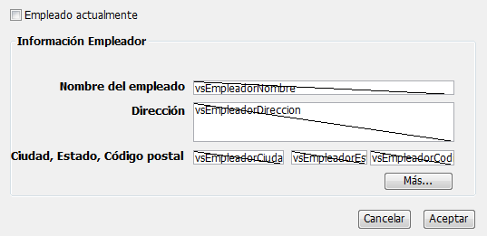
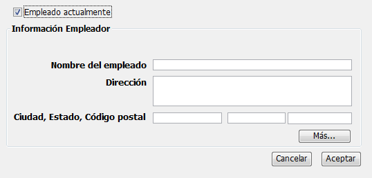
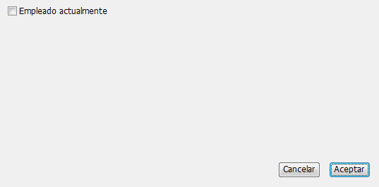

<!--REF #_command_.OBJECT SET VISIBLE.Syntax-->**OBJECT SET VISIBLE** ( {* ;} *objeto* ; *visible* )<!-- END REF-->
<!--REF #_command_.OBJECT SET VISIBLE.Params-->
| Parámetro | Tipo |  | Descripción |
| --- | --- | --- | --- |
| * | Operador | &#8594;  | Si se especifica, objeto es un nombre de objeto (cadena) Si se omite, objeto es un campo o una variable |
| objeto | any | &#8594;  | Nombre de objeto (si se especifica *), o Campo o variable (si se omite *) |
| visible | Boolean | &#8594;  | True para visible, False para invisible |

<!-- END REF-->

*Este comando no es hilo seguro, no puede ser utilizado en código apropiativo.*


#### Descripción 

<!--REF #_command_.OBJECT SET VISIBLE.Summary-->El comando OBJECT SET VISIBLE muestra u oculta los objetos especificados por *objeto*.<!-- END REF-->

Si especifica el parámetro opcional *\**, indica que el parámetro *objeto* designa el nombre de un objeto (una cadena). Si no pasa el parámetro \*, indica que el parámetro *objeto* es un campo o una variable. En este caso, usted especifica una referencia de un campo o de una variable (campo o variable tipo objeto únicamente) en lugar de una cadena. Para mayor información sobre nombres de objetos, consulte la sección . 

Si pasa *visible* igual a [TRUE](true.md "TRUE"), los objetos son mostrados. Si pasa *visible* igual a [FALSE](false.md "FALSE"), los objetos se ocultan. 

#### Ejemplo 

Este es un formulario típico en el entorno Diseño:



Los objetos en el área de grupo **Información del empleador** cada uno tiene un nombre de objeto que contiene la expresión “empleador” (incluyendo el área de grupo). Cuando la casilla de selección **Empleado actualmente**  está seleccionada, los objetos deben ser visibles; cuando la casilla no está seleccionada, los objetos deben ser invisibles.   
Este es el método de objeto de la casilla de selección:

```4d
 &NBSP;&NBSP; // Método de objeto de Casilla de selección cbEmpleadoActualmente
 Case of
    :(FORM Event=On Load)
       cbEmpleadoActualmente:=1
 
    :(FORM Event=On Clicked)
  // Ocultar o mostrar todos los objetos cuyo nombre contiene "emp"
       OBJECT SET VISIBLE(*;"@emp@";cbEmpleadoActualmente&NBSP;#&NBSP;0)
  // Pero siempre conservar la casilla de selección visible
       OBJECT SET VISIBLE(cbEmpleadoActualmente;True)
 End case
```

Por lo tanto, en ejecución, el formulario se ve así:



o:



#### Ver también 

[OBJECT Get visible](object-get-visible.md)  
[OBJECT SET ENTERABLE](object-set-enterable.md)  