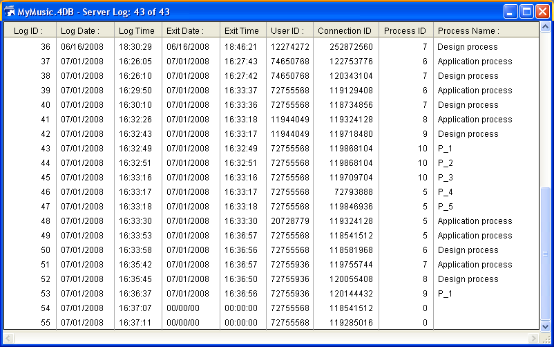

<!--REF #_command_.On Server Open Connection database method.Syntax-->$1, $2, $3 -> On Server Open Connection database method -> $0<!-- END REF-->
<!--REF #_command_.On Server Open Connection database method.Params-->
| Parameter | Type |  | Description |
| --- | --- | --- | --- |
| $1 | Integer | &#8592; | User ID number used internally by 4D Server to identify users |
| $2 | Integer | &#8592; | Connection ID number used internally by 4D Server to identify a connection |
| $3 | Integer | &#8592; | Obsolete: Always returns 0 (but must be declared) |
| $0 | Integer | &#8592; | 0 or omitted = connection accepted; other value = connection refused |

<!-- END REF-->

#### When is the On Server Open Connection Database Method Called? 

<!--REF #_command_.On Server Open Connection database method.Summary-->The **On Server Open Connection database method** is called once on the Server machine each time a connection process is started by a 4D remote workstation.<!-- END REF--> The **On Server Open Connection database method** is NOT invoked by any 4D environment other than 4D Server.

The **On Server Open Connection database method** is called each time:

* a remote 4D connects (because the Application process starts)
* a remote 4D opens the Design environment (because the Design process starts)
* a remote 4D starts a global process (whose name does not begin with "$") which requires the creation of a cooperative process on the server **(\*)**. This process can be created using the [New process](new-process.md) command, a menu command or using the Execute Method dialog box.

In each case with a remote 4D, several processes are started—One on the client machine and one or two others (as needed) on the server machine. On the client machine, the process executes code and send requests to 4D Server. On the server machine, the **4D Client Process** (preemptive process) maintains the database environment for the client process (i.e., current selections and locking of records for user processes) and replies to requests sent by the process running on the client machine. The **4D Client Database process** (cooperative process) is in charge of monitoring the corresponding 4D Client process.

**(\*)** Beginning with 4D v13, for optimization purposes, the server processes (a preemptive process for access to the database engine and a cooperative process for access to the language) are only created when necessary when executing client-side code. For example, here are the details of a 4D code sequence running in a new client process:  

```4d
  // global process begins without a new process on the server, like a local process.
 CREATE RECORD([Table_1])
 [Table_1])field1_1:="Hello world"
 SAVE RECORD([Table_1]) // creation here of preemptive process on server
 $serverTime:=Current time(*) // creation here of cooperative process on server
  // call to On Server Open Connection
```

**Important**: Web connections and SQL connections do not invoke the **On Server Open Connection database method**. When a Web browser connects to 4D Server, the *On Web Authentication Database Method* (if any) and/or the [On Web Connection database method](on-web-connection-database-method.md) are invoked. When 4D Server receives an SQL query, the [On SQL Authentication database method](on-sql-authentication-database-method.md) (if one exists) is called. For more information, see the description of this database method in the 4D Language Reference manual.

**Important**: When a Stored Procedure is started, the **On Server Open Connection database method** is NOT invoked. *Stored Procedures* are server processes, not 4D Client processes. They execute code on the Server machine, but do not reply to requests exchanged by a 4D client (or other clients) and 4D Server. 

#### How is the On Server Open Connection Database Method Called? 

The **On Server Open Connection database method** is executed on the 4D Server machine within the 4D Client process that provoked the call to the method.

For example, if a remote 4D connects to a 4D Server interpreted database, the user process, the Design process and the client registration process (by default) for that client are started. The On Server Open Connection database method is therefore executed three times in a row—the first time within the Application process, the second time within the client registration process, and the third time within the Design process. If the three process are respectively the sixth, seventh and eighth process to be started on the Server machine, and if you call [Current process](current-process.md) from within the **On Server Open Connection database method**, the first time [Current process](current-process.md) returns 6, the second time 7 and the third time 8.

Note that **On Server Open Connection database method** executes on the Server machine. It executes within the 4D Client process running on the Server machine, independent of the process running on the client side. In addition, at the moment when the method is invoked, the 4D Client process has not yet been named ([Process info](../commands/process-info.md) will not at this point return the name of the 4D Client process).

The **On Server Open Connection database method** has no access to the process variable table of the process running on the Client side. This table resides on the Client machine, not on the Server machine. 

When the **On Server Open Connection database method** accesses a process variable, it works with a private and dynamically created process variable table for the 4D Client process. 

4D Server passes three Long Integer parameters to the **On Server Open Connection database method** and expects a Long Integer result. The method must therefore be explicitly declared with three Long Integer parameters as well as a Long Integer function result:

```4d
 var $0;$1;$2;$3 : Integer
```

If you do not return a value in *$0*, thereby leaving the variable undefined or initialized to zero, 4D Server assumes that the database method accepts the connection. If you do not accept the connection, you return a non-null value in *$0*.

This table details the information provided by the three parameters passed to the database method:

| **Parameter** | **Description**                                                            |
| ------------- | -------------------------------------------------------------------------- |
| $1            | User ID number used internally by 4D Server to identify users              |
| $2            | Connection ID number used internally by 4D Server to identify a connection |
| $3            | Obsolete: Always returns 0 but must be declared                            |

These ID numbers are not directly usable as sources of information to be passed as, for example, parameters to a 4D command. However, they provide a way to uniquely identify a 4D Client process between the **On Server Open Connection database method** and the [On Server Close Connection database method](on-server-close-connection-database-method.md). At any moment of a 4D Server session, the combination of these values is unique. By storing this information in an interprocess array or a table, the two database methods can exchange information. In the example at the end of this section, the two database methods use this information to store the date and time of the beginning and end of a connection in the same record of a table.

#### Example 1 

The following example shows how to maintain a log of the connections to the database using the **On Server Open Connection database method** and the **On Server Close Connection Database Method**. The *\[Server Log\]* table (shown below) is used to keep track of the connection processes:


The information stored in this table is managed by the **On Server Open Connection database method** and the **On Server Close Connection Database Method** listed here:

```4d
  // On Server Open Connection Database Method
 var $0;$1;$2;$3 : Integer
  // Create a [Server Log] record
 CREATE RECORD([Server Log])
 [Server Log]Log ID:=Sequence number([Server Log])
  // Save the Log Date and Time
 [Server Log]Log Date:=Current date
 [Server Log]Log Time:=Current time
  // Save the connection information
 [Server Log]User ID:=$1
 [Server Log]Connection ID:=$2
 SAVE RECORD([Server Log])
  // Returns no error so that the connection can continue
 $0:=0
 
  // On Server Close Connection Database Method
 var $1;$2;$3 : Integer
  // Retrieve the [Server Log] record
 QUERY([Server Log];[Server Log]User ID=$1;*)
 QUERY([Server Log]; & ;[Server Log]Connection ID=$2;*)
 QUERY([Server Log]; & ;[Server Log]Process ID=0)
  // Save the Exit date and time
 [Server Log]Exit Date:=Current date
 [Server Log]Exit Time:=Current time
  // Save the process information
 [Server Log]Process ID:=Current process
 PROCESS PROPERTIES([Server Log]Process ID;$vsProcName;$vlProcState;$vlProcTime)
 [Server Log]Process Name:=$vsProcName
 SAVE RECORD([Server Log])
```

Here are some entries in the \[Server Log\] showing several remote connections:



#### Example 2 

The following example prevents any new connection from 2 to 4 A.M.

```4d
  // On Server Open Connection Database Method
 var $0;$1;$2;$3 : Integer
 
 If((?02:00:00?<=Current time)&(Current time
```


#### Properties

|  |  |
| --- | --- |
| Command number | 16001 |
| Thread safe | &cross; |


