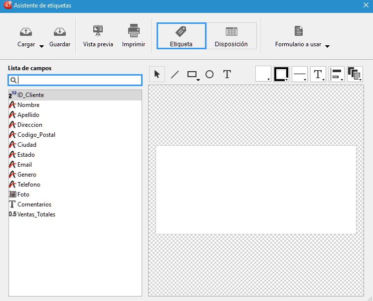

<!--REF #_command_.PRINT LABEL.Syntax-->**PRINT LABEL** ( {*tabla* }{;}{ *doc* {; * | >}} )<!-- END REF-->
<!--REF #_command_.PRINT LABEL.Params-->
| Parámetro | Tipo |  | Descripción |
| --- | --- | --- | --- |
| tabla | Table | &#8594;  | Tabla a imprimir, o Tabla por defecto, si se omite |
| doc | Text | &#8594;  | Nombre del documento de etiquetas del disco |
| * &#124; > | &#8594;  | * para suprimir las cajas de diálogo de impresión, o > para no reiniciar los parámetros de impresión |

<!-- END REF-->

#### Descripción 

<!--REF #_command_.PRINT LABEL.Summary-->**PRINT LABEL** le permite imprimir etiquetas con los datos de la selección de *tabla*.<!-- END REF-->

Si no especifica el parámetro *documento*, **PRINT LABEL** imprime la selección actual de *tabla* como etiquetas, utilizando el formulario de salida actual. No puede utilizar este comando para imprimir subformularios. Para mayor información sobre la creación de formularios para etiquetas, consulte el Manual de Diseño.

Si especifica el parámetro *documento*, **PRINT LABEL** le permite tener acceso al Asistente de etiquetas (mostrado a continuación) o imprimir un documento de etiquetas existente almacenado en el disco. Ver el ejemplo a continuación.



Por defecto, **PRINT LABEL** muestra la caja de diálogo de impresión. Si el usuario cancela una de las cajas de diálogo de impresión, el comando se cancela y las etiquetas no se imprimen.

Puede suprimir esta caja de diálogo utilizando el parámetro opcional asterisco (*\**) o el parámetro opcional “mayor que” (*\>*):   
• El parámetro \* causa una impresión con los parámetros de impresión actuales.  
• Además, el parámetro > provoca un trabajo de impresión sin reinicializar los parámetros de impresión actuales. Este parámetro es útil para ejecutar varias llamadas sucesivas a **PRINT LABEL** (por ejemplo al interior de un bucle) mientras mantiene los parámetros de impresión personalizados previamente definidos. Para ver un ejemplo sobre el uso de este parámetro, consulte la descripción del comando [PRINT RECORD](print-record.md).  
Note que este parámetro no tiene efecto si se utiliza el asistente de creación de etiquetas.

Si no se utiliza el asistente de creación de etiquetas, la variable sistema OK toma el valor 1 si todas las etiquetas se imprimen; de lo contrario, toma el valor 0 (cero) (por ejemplo, si el usuario hizo clic en el botón **Cancelar** en las caja de diálogo de impresión).

Si especifica el parámetro *documento*, las etiquetas se imprimen con los parámetros definidos en *documento*. Si *documento* es una cadena vacía (""), **PRINT LABEL** presentará una caja de diálogo estándar de apertura de documentos, permitiendo al usuario seleccionar el archivo de etiquetas a utilizar. Si *documento* es el nombre de un documento que no existe (por ejemplo, si pasa *char(1)* en *documento)*, el asistente de creación de etiquetas aparece, permitiendo al usuario definir su formato de etiquetas.

**Nota:**si la *tabla* fue declarada “invisible” en el entorno Diseño, no se mostrará el asistente de etiquetas.

**4D Server:** este comando puede ejecutarse en 4D Server en el marco de un procedimiento almacenado. En este contexto:

* Asegúrese de que ninguna caja de diálogo aparezca en el equipo servidor (excepto por una necesidad específica). Para hacer esto, es necesario llamar al comando con el parámetro *\** o *\>* .
* La sintaxis que hace que el editor de etiquetas aparezca no funciona con 4D Server; en este caso, la variable sistema OK toma el valor 0.
* En el caso de un problema relacionado de impresora (sin papel, impresora desconectada, etc.), no se genera un mensaje de error.

#### Ejemplo 1 

El siguiente ejemplo imprime las etiquetas utilizando el formulario de salida de una tabla. El ejemplo utiliza dos métodos. El primero es un método de proyecto que designa el formulario de salida a utilizar y luego imprime las etiquetas: 

```4d
 ALL RECORDS([Direcciones]) // Selección de todos los registros
 FORM SET OUTPUT([Direcciones];"Imprimir Etiqueta") // Selección del formulario de salida
 PRINT LABEL([Direcciones]) // Impresión de etiquetas
 FORM SET OUTPUT([Direcciones];"Salida") // Restablecimiento del formulario de salida por defecto
```

El segundo método es el método de formulario del formulario *"Imprimir Etiqueta"*. El formulario contiene una variable llamada *vEtiq*, que se utiliza para mantener los campos concatenados. Si el segundo campo de direcciones (Dir2) está vacío, es eliminado por el método. Note que esta operación es realizada automáticamente por el asistente de creación de etiquetas. El método de formulario crea la etiqueta para cada registro:

```4d
  //Método de formulario [Direcciones]; "Etiqueta salida"
 Case of
    :(FORM Event=On Load)
       vEtiq:=[Direcciones]Nom1+" "+[Direcciones]Nom2+Char(13)+[Direcciones]Dir1+Char(13)
       If([Direcciones]Dir2#"")
          vEtiq:=vLabel+[Direcciones]Dir2+Char(13)
       End if
       vEtiq:=vEtiq+[Direcciones]Ciudad+", "+[Direcciones]Estado+" "+[Direcciones]CodigoPostal
 End case
```

#### Ejemplo 2 

El siguiente ejemplo le permite al usuario efectuar una búsqueda en la tabla \[Personas\], y luego imprime automáticamente las etiquetas “Mis etiquetas”:

```4d
 QUERY([Personas])
 If(OK=1)
    PRINT LABEL([Personas];"Mis etiquetas";*)
 End if
```

#### Ejemplo 3 

El siguiente ejemplo le permite al usuario efectuar una búsqueda en la tabla \[Personas\], y después le permite al usuario elegir las etiquetas a imprimir:

```4d
 QUERY([Personas])
 If(OK=1)
    PRINT LABEL([Personas];"")
 End if
```

#### Ejemplo 4 

El siguiente ejemplo le permite al usuario efectuar una búsqueda en la tabla \[Personas\] y luego muestra el Asistente de etiquetas de manera que el usuario pueda diseñar, guardar, cargar e imprimir todo tipo de etiquetas:

```4d
 QUERY([Personas])
 If(OK=1)
    PRINT LABEL([Personas];Char(1))
 End if
```

#### Ver también 

[PRINT SELECTION](print-selection.md)  
[QR REPORT](qr-report.md)  

#### Propiedades
|  |  |
| --- | --- |
| Número de comando | 39 |
| Hilo seguro | &check; |
| Modifica variables | OK |


