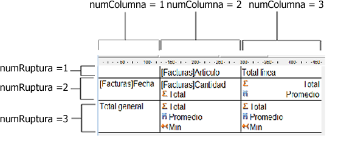

<!--REF #_command_.QR GET TOTALS DATA.Syntax-->**QR GET TOTALS DATA** ( *area* ; *numColumna* ; *numRuptura* ; *operador* ; *texto* )<!-- END REF-->
<!--REF #_command_.QR GET TOTALS DATA.Params-->
| Parámetro | Tipo |  | Descripción |
| --- | --- | --- | --- |
| area | Integer | &#8594;  | Referencia del área |
| numColumna | Integer | &#8594;  | Número de columna |
| numRuptura | Integer | &#8594;  | Número de ruptura |
| operador | Integer | &#8592; | Operador de la celda |
| texto | Text | &#8592; | Contenido de la celda |

<!-- END REF-->

*Este comando no es hilo seguro, no puede ser utilizado en código apropiativo.*

#### Descripción 

<!--REF #_command_.QR GET TOTALS DATA.Summary-->##### Informe en lista 

El comando QR GET TOTALS DATA permite recuperar el contenido de una línea de ruptura específica.<!-- END REF-->

*area* es la referencia del área del informe rápido.

*numColumna* es el número de la columna de la celda cuyos datos serán recuperados.

*numRuptura* es el número de la línea de ruptura cuyos datos serán recuperados (subtotal o total general). Para una línea de subtotal, *numRuptura* corresponde al número de la línea. Para el total general, *numRuptura* vale -3 (también puede utilizar la constante *qr grand total*).

*operador* devuelve la suma de todos los operadores presentes en la celda. Puede utilizar las constantes del tema para tratar los valores devueltos:

| Constante             | Tipo         | Valor |
| --------------------- | ------------ | ----- |
| qr sum                | Entero largo | 1     |
| qr average            | Entero largo | 2     |
| qr min                | Entero largo | 4     |
| qr max                | Entero largo | 8     |
| qr count              | Entero largo | 16    |
| qr standard deviation | Entero largo | 32    |

Si *operador* devuelve 0, la celda no contiene ningún operador.

*texto* devuelve el texto en la celda.

**Nota:** *operador* y *texto* son mutuamente exclusivos, de manera que sólo uno de los dos parámetros devuelve un valor.

##### Informe tabla cruzada 

El comando QR GET TOTALS DATA permite recuperar el contenido de una celda específica. 

*area* es la referencia del área del informe rápido.

*numColumna* es el número de la columna de la celda cuyos datos van a ser recuperados.

*numruptura* es el número de la línea de la celda cuyos datos van a ser recuperados.

*operador* devuelve la suma de todos los operadores presentes en la celda. Puede utilizar las constantes del tema  para procesar el valor devuelto (ver el párrafo anterior). 

*texto* devuelve el texto en la celda.

La siguiente imagen muestra cómo los parámetros *numColumna* y *numRuptura* son combinados en una tabla cruzada:

Si pasa un número de *area* inválido, se genera el error -9850.  
Si el parámetro *numColumna* es incorrecto, se genera el error -9852\.   
Si el parámetro *numRuptura* es incorrecto, se genera el error -9853.

#### Ver también 

[QR SET TOTALS DATA](qr-set-totals-data.md)  