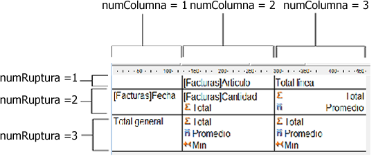

<!--REF #_command_.QR SET TOTALS DATA.Syntax-->**QR SET TOTALS DATA** ( *area* ; *numColumna* ; *numRuptura* ; operador | valor )<!-- END REF-->
<!--REF #_command_.QR SET TOTALS DATA.Params-->
| Parámetro | Tipo |  | Descripción |
| --- | --- | --- | --- |
| area | Integer | &#8594;  | Referencia del área |
| numColumna | Integer | &#8594;  | Número de columna |
| numRuptura | Integer | &#8594;  | Número de ruptura |
| operador &#124; valor | Entero largo, Cadena | &#8594;  | Operador para la celda o contenido de la celda |

<!-- END REF-->

*Este comando no es hilo seguro, no puede ser utilizado en código apropiativo.*

#### Descripción 

<!--REF #_command_.QR SET TOTALS DATA.Summary-->**Nota:** este comando no puede crear un subtotal.<!-- END REF--> 

##### Modo listado 

El comando QR SET TOTALS DATA permite definir el contenido de una línea de ruptura específica (total o subtotal).

*area* es la referencia del área del informe rápido.

*numColumna* es el número de columna de la celda que quiere definir.

*numRuptura* es el número de la línea de ruptura a modificar (subtotal o total general). Para una línea de subtotal, *numRuptura* corresponde al número del orden de la ruptura. Para el total general, *numRuptura* es igual a -3 o la constante *qr grand total*.

*operador* es el valor acumulado de todos los operadores presentes en la celda. Utilice las constantes del tema *QR Operadores* para definir este parámetro:

**ConstanteValor**

*qr sum* *1*  
*qr average* *2*  
*qr min* *4*  
*qr max* *8*  
*qr count* *16*  
*qr standard deviation* *32*  
  
Si *operador* es igual a 0, no hay operador.

*valor* es el texto a ubicar en la celda.

**Nota:** operador/valor son mutuamente exclusivos, de manera que puede definir un operador o un texto. 

Puede pasar los siguientes valores:  
\- # para el valor que provocó la ruptura o el subtotal.  
\- ##S se reemplazará por la suma.  
\- ##A se reemplazará por el promedio.  
\- ##C se reemplazará por el número  
\- ##X se reemplazará por el máximo.  
\- ##N se reemplazará por el mínimo.  
\- ##D se reemplazará por la desviación estándar.  
\- ##xx, donde xx es un número de columna. Este código se reemplazará por el valor de la columna, utilizando su propio formato. Si esta columna no existe, entonces no se reemplazará. 

##### Informe tabla cruzada 

El comando QR SET TOTALS DATA permite definir el contenido de una celda específica. 

*area* es la referencia del área del informe rápido.

*numColumna* es el número de columna de la celda que se va a definir.

*numRuptura* es el número de la línea de la celda que se va a definir.

*operador* contiene el valor acumulado de todos los operadores presentes en la celda. Puede utilizar las constantes del tema *QR Operators* para definir este parámetro (ver el párrafo anterior).   
*valor* es el texto a ubicar en la celda.

La siguiente imagen muestra cómo los parámetros *numColumna* y *numRuptura* son combinados en modo tabla cruzada:

##### Tipos de datos soportados 

Puede pasar dos tipos de datos:

* Título  
Un título se pasa vía el parámetro *valor*. Este valor es una cadena y puede pasarse únicamente con las siguientes celdas: *colNum=3 breakNum=1* y *colNum=1* *breakNum=3*.
* Operador  
Un operador o una combinación de operadores (como se describió anteriormente) puede ser pasado por las siguientes celdas:  
*numColumna*\=2, *numRuptura*\=2  
*numColumna*\=3, *numRuptura*\=2  
*numColumna*\=2, *numRuptura*\=3

Note que estos dos últimos valores afectan igualmente a la celda (Columna 3; Línea 3). Si por ejemplo un cálculo se efectúa en la celda (Columna 2; Línea 3), el contenido de la celda (Columna 3; Línea 3) será modificado en consecuencia.

Si pasa un número de *area* inválido, se genera el error -9850.  
Si el parámetro *numColumna* es incorrecto, se genera el error -9852\.   
Si el parámetro *numRuptura* es incorrecto, se genera el error -9853.

#### Ver también 

[QR GET TOTALS DATA](qr-get-totals-data.md)  