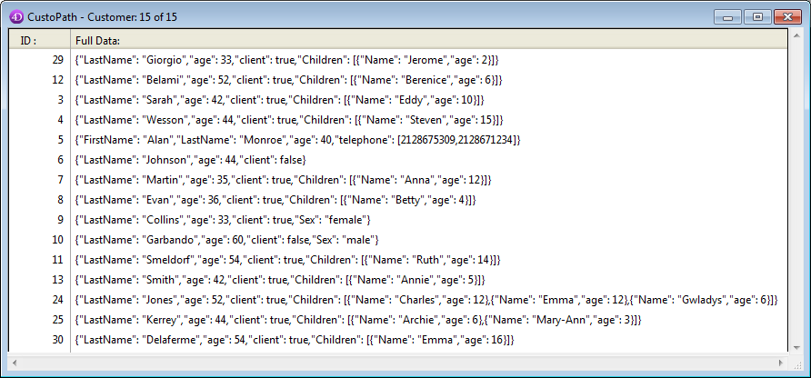

<!--REF #_command_.QUERY BY ATTRIBUTE.Syntax-->**QUERY BY ATTRIBUTE** ( {*tabla*}{;}{*opConj* ;} *campoObjeto* ; *rutaAtributo* ; *opBusq* ; *valor* {; *} )<!-- END REF-->
<!--REF #_command_.QUERY BY ATTRIBUTE.Params-->
| Parámetro | Tipo |  | Descripción |
| --- | --- | --- | --- |
| tabla | Table | &#8594;  | Tabla para la cual devolver una selección de registros o Tabla por defecto si se omite |
| opConj | * | &#8594;  | Operador de conjunción ausar para combinar varias búsquedas (si las hay) |
| campoObjeto | Field | &#8594;  | Campo objeto cuyos atributos utilizar para la búsqueda |
| rutaAtributo | Text | &#8594;  | Nombre o ruta de atributo |
| opBusq | Text, * | &#8594;  | Operador de búsqueda (comparador) |
| valor | Text, Number, Date, Time | &#8594;  | Valor a comparar |
| * | Operador | &#8594;  | Espera de ejecución de la búsqueda |

<!-- END REF-->

#### Descripción 

<!--REF #_command_.QUERY BY ATTRIBUTE.Summary-->**QUERY BY ATTRIBUTE** busca los registros que coincidan con la cadena de consulta definida utilizando los parámetros *campoObjeto*, *rutaAtributo*, *opBusq* y *valor*, y devuelve una selección de registros para *tabla*.<!-- END REF-->

**QUERY BY ATTRIBUTE** cambia la selección actual de *tabla* para el proceso actual y vuelve el primer registro de la nueva selección el registro actual. Si se omite el parámetro *tabla*, el comando se aplica a la tabla por defecto. Si no se ha definido ninguna tabla por defecto, se produce un error.

El parámetro opcional *opC* *onj* se utilizar para combinar varias llamadas a **QUERY BY ATTRIBUTE** en caso de búsquedas múltiples. Los operadores de conjunción disponibles son los mismos que los del comando [QUERY](query.md):

| **Conjunción** | **Símbolo a utilizar con QUERY BY ATTRIBUTE** |
| -------------- | --------------------------------------------- |
| AND            | &                                             |
| OR             | \|                                            |
| Except         | #                                             |

El parámetro *opC* *onj* no se utiliza para la primera llamada a **QUERY BY ATTRIBUTE** de una búsqueda múltiple, o si la búsqueda es una búsqueda simple. Si lo omite dentro de una búsqueda múltiple, el operador AND (&) se utiliza por defecto.

 En *campoObjeto*, pase el campo objeto cuyos atributos desea buscar. Si pertenece a una tabla Uno relacionada a *tabla* con una relación automática o manual, el *campoObjeto* pueden pertenecer a otra tabla.  
**QUERY BY ATTRIBUTE** soporta los atributos personalizados 4D Write Pro cuando los documentos son almacenados en campos Objeto. Para mayor información, consulte la sección *Almacenar los documentos 4D Write Pro en los campos objeto 4D*.

En *rutaAtributo*, pase la ruta del atributo cuyos valores desea comparar para cada registro, por ejemplo "niños.niñas.edad". Si pasa un simple nombres, por ejemplo "lugar", designa el atributo correspondiente ubicado en el primer nivel del campo objeto.  
Si un atributo "x" es un array, **QUERY BY ATTRIBUTE** buscará registros que contengan un atributo "x" en el cual al menos un elemento coincida con los criterios. Para buscar entre los atributos de array, es necesario indicar al comando **QUERY BY ATTRIBUTE** que el atributo "x" es un array añadiendo ".\[\]" a su nombre en el parámetro *rutaAtributo* (ver ejemplo 3). Puede añadir una letra entre brackets (i.e. "\[b\]") para enlazar los argumentos (ver el párrafo *Asociar los criterios para las búsquedas en los elementos de array* abajo).

**Notas:** 

* Tenga en cuenta que los nombres de atributos tienen en cuenta las mayúsculas y minúsculas: puede tener diferentes nombres de atributos "MyAtt" y "myAtt" en el mismo registro.
* Los nombres de atributos se recortan para eliminar espacios adicionales. Por ejemplo, "mi primer atributo .mi segundo atributo" se interpreta como "mi primer atributo.mi segundo atributo".
* No puede consultar los atributos cuyo nombre contengan caracteres especiales como "." o "\[\]", porque serán evaluados incorrectamente como tokens en la cadena de consulta. Para más información, por favor consulte el párrafo *Identificadores de propiedades de objetos*.

El parámetro *opBusq* es el operador de comparación que se aplica entre *campoObjeto* y *valor*. Puede pasar uno de los símbolos que se muestran aquí:

| **Comparación**   | **Símbolo a utilizar con** **QUERY BY ATTRIBUTE** |
| ----------------- | ------------------------------------------------- |
| Igual a           | \=                                                |
| Diferente de (\*) | #                                                 |
| Menor que         | <                                                 |
| Mayor que         | \>                                                |
| Menor o igual a   | <=                                                |
| Mayor o igual a   | \>=                                               |

(\*) Cuando se utiliza con los elementos del array, el operador # significa "no contiene ninguno". 

**Nota:** se puede especificar el operador de comparación como una expresión texto en lugar de un símbolo. Consulte la descripción del comando [QUERY](query.md) para más información. 

*valor* valor es el dato contra el que se va a comparar *rutaAtributo*. El valor que puede ser cualquier expresión del mismo tipo que *rutaAtributo*. El valor se evalúa una vez, al inicio de la búsqueda. El valor no se evalúa para cada registro. Para buscar una cadena dentro de una cadena (una búsqueda "contains"), utilice el símbolo arroba (@) en *valor* para aislar la cadena a buscar, como se muestra en este ejemplo: "@Smith@". Note que en este caso, la búsqueda sólo se beneficia parcialmente desde el índice (compacidad de almacenamiento de datos).

Esta es la estructura de una consulta por atributos:

```4d
 QUERY BY ATTRIBUTE([Table] ;[Table]ObjectField ;"attribute1.attribute2";=;value)
```

**Nota**: un criterio implícito para todos los operadores (excepto #) es que el campo Objeto contiene un atributo. Sin embargo, para el operador #, puede definirse (ver más adelante).

##### Uso del operador # 

Al consultar por atributo utilizando el operador **#**, debe tener en cuenta los casos en que un atributo puede no estar presente en un registro. Por ejemplo, considere la siguiente afirmación:

```4d
 QUERY BY ATTRIBUTE([People];[People]Animals;"dog.name";#;"Rex")
```

Esta búsqueda devolverá los registros de personas que tienen un perro cuyo nombre no es "Rex", así como también los registros de personas que no tienen perro, o que tienen perro si nombre, *es decir,* registros para los cuales la el valor de la propiedad "dog.name" es **null**. El concepto subyacente es: si el motor de consulta no conoce los datos para compararlos con los criterios de búsqueda, no puede decidir si coinciden o no. Por lo tanto, el registro se excluye de la consulta.

Para usar un ejemplo más genérico:

```4d
 QUERY BY ATTRIBUTE([Table];[Table]ObjectField;"attribute1.attribute2";#;value)
```

Esta búsqueda devolverá todos los registros para los que *\[Table\]ObjectField* contiene un objeto que contiene un atributo attribute1, que es en sí un objeto que contiene un atributo attribute2 cuyo valor no es el valor. NO va a devolver los registros donde:

* el campo objeto no contiene *attribute1*
* el campo objeto no contiene **attribute1.attribute*2
* el campo objeto contiene **attribute1.attribute*2=null

Este principio también aplica a los atributos array. Por ejemplo, la búsqueda devolverá los registros de las personas que tienen una o varias direcciones, pero ninguna en Paris.

```4d
 QUERY BY ATTRIBUTE([People];[People]OB_Field;"locations[].city";#;"paris")
```

**Nota:** Para obtener específicamente los registros donde el atributo no está definido, puede utilizar un objeto vacío (ver ejemplo 2). Note sin embargo que la búsqueda de valores NULL en elementos array no es soportada.

##### Crear búsquedas múltiples 

Aquí están las reglas a seguir para la construcción de varias búsquedas por atributo:

* La primera línea no debe contener una conjunción.
* Cada argumento de búsqueda sucesivo puede comenzar con una conjunción. Si lo omite, el operador AND (&) se utiliza por defecto.
* Todas las líneas, excepto la última, deben utilizar el parámetro *\**.
* **QUERY BY ATTRIBUTE** se puede combinar con los comandos [QUERY](query.md) (ver ejemplo).
* Para realizar la búsqueda, no especifique el parámetro *\** en el último comando **QUERY BY ATTRIBUTE**. Alternativamente, puede ejecutar el comando [QUERY](query.md) sin parámetros distintos a la tabla.

**Nota:** cada tabla mantiene su propia construcción de búsqueda actual. Esto significa que puede crear varias búsquedas simultáneamente, una para cada tabla.

No importa la forma en que una búsqueda se haya definido:

* Si la operación de búsqueda va a tomar algún tiempo para llevarse a cabo, 4D muestra automáticamente un mensaje que contiene un termómetro de progreso. Estos mensajes se pueden activar y desactivar mediante el uso de los comandos [MESSAGES ON](messages-on.md) y [MESSAGES OFF](messages-off.md). Si se muestra un termómetro de progreso, el usuario puede hacer clic en el botón Detener para interrumpir la búsqueda. Si se completa la consulta, OK toma el valor 1\. De lo contrario, si la consulta se interrumpe, OK toma el valor 0 (cero).
* Si no se especifica ningún campo objeto indexado, la búsqueda se optimiza cada vez que es posible (los campos indexados se buscan primero), resultando en una búsqueda que toma la menor cantidad de tiempo posible.

##### Valores fecha en el objeto 

Las fechas se almacenan en los objetos en función de los parámetros de la base; por defecto, se tiene en cuenta la zona horaria (ver el selector JSON use local time en el comando [SET DATABASE PARAMETER](set-database-parameter.md)). 

```json
!1973-05-22! -> "1973-05-21T23:00:00.000Z"
```

Este ajuste también se tiene en cuenta durante las búsquedas, por lo que no tiene que preocuparse por ello si siempre utiliza su base en el mismo lugar y si los parámetros son los mismos en todos los equipos que acceden a los datos. En este caso, la siguiente búsqueda devolverá correctamente los registros cuyo atributo Birthday sea igual a !1973-05-22! (guardada como "1973-05-21T23:00:00.00Z"):

```4d
 QUERY BY ATTRIBUTE([Persons];[Persons]OB_Info;"Birthday";=;!1973-05-22!)
```

Si no desea utilizar el parámetro GMT, puede modificar estos parámetros utilizando la siguiente instrucción:

```4d
 SET DATABASE PARAMETER(JSON use local time;0)
```

Tenga en cuenta que el alcance de este parámetro está limitado al process. Si ejecuta esta instrucción, el 1 de octubre de 1965 se almacenará "1965-10-01T00: 00: 00.000Z" pero usted deberá ajustar el mismo parámetro antes de lanzar sus búsquedas:

```4d
 SET DATABASE PARAMETER(JSON use local time;0)
 QUERY BY ATTRIBUTE([Persons];[Persons]OB_Info;"Birthday";=;!1976-11-27!)
```

##### Utilización de la propiedad virtual longitud 

Puede utilizar la propiedad virtual "longitud" con este comando. Esta propiedad está disponible automáticamente para todos los atributos de tipo array y devuelve el tamaño del array, es decir, el número de elementos que contiene. Se puede utilizar en el contexto de la ejecución del comando **QUERY BY ATTRIBUTE** (ver ejemplo 4).

##### Asociar los criterios para las búsquedas en los elementos de array 

(Nuevo en 4D v16 R2) Al buscar en atributos array con varios argumentos de búsqueda unidos por el operador AND, puede que quiera asegurarse de que sólo se devuelvan los registros que contengan elementos que coincidan con todos los argumentos y no los registros donde se pueden encontrar argumentos en diferentes elementos. Para ello, debe vincular los argumentos de búsqueda a elementos del array, de modo que solo se encuentren elementos únicos que contengan argumentos vinculados.  

Por ejemplo, con los dos registros siguientes:

```json
{
    "name":"martin",
    "locations" : [ {
                "kind":"home",
                "city":"paris" 
            } ]
} , {
    "name":"smith",
    "locations" : [ {
                "kind":"home",
                "city":"lyon" 
            } , {
                "kind":"office",
                "city":"paris" 
            } ]
}
```

Usted quiere encontrar la gente con un tipo de ubicación "home" en la ciudad "Paris". Si escribe:

```4d
 QUERY BY ATTRIBUTE([People];[People]OB_Field;"locations[].city";=;"paris";*)
 QUERY BY ATTRIBUTE([People];[People]OB_Field;"locations[].kind";=;"home")
```

... la búsqueda devolverá "martin" y "smith" porque "smith" tiene un elemento "locations" cuyo "kind" es "home" y un elemento "locations" cuya "city" es "paris", aunque son elementos diferentes.  

Si sólo desea obtener los registros donde los argumentos coincidentes estén en el mismo elemento, debe **asociar los criterios**. Para vincular criterios de búsqueda: 

* Agregue una letra entre el \[\] de la primera ruta a asociar y repita la misma letra en todos los argumentos vinculados. Por ejemplo: **locations\[a\].city** y **locations\[a\].kind**. Puede utilizar cualquier letra del alfabeto latino (no sensible a mayúsculas y minúsculas).
* Para agregar diferentes criterios vinculados en la misma búsqueda, utilice otra letra (vea los ejemplos a continuación). Puede crear hasta 26 combinaciones de criterios en una sola búsqueda.

Con los registros anteriores, si escribe:

```4d
 QUERY BY ATTRIBUTE([People];[People]OB_Field;"locations[a].city";=;"paris";*)
 QUERY BY ATTRIBUTE([People];[People]OB_Field;"locations[a].kind";=;"home")
```

... la búsqueda sólo devolverá "martin" porque tiene un elemento "locations" cuyo "kind" es "home" y cuya "city" es "paris". La consulta no devolverá "smith" porque los valores "home" y "paris" no están en el mismo elemento de array. Vea los ejemplos a continuación para ver más ejemplos de esta funcionalidad.

**Nota:** utilizar la sintaxis relacionada en una sola línea de búsqueda dará los mismos resultados que una búsqueda estándar, excepto cuando se utiliza el operador "#": en este caso, se pueden devolver resultados no válidos. Por lo tanto, esta sintaxis específica no es soportada.

#### Ejemplo 1 

En este ejemplo, el atributo "age" es una cadena o un entero y queremos encontrar personas cuyas edades estén entre 20 y 29\. Las primeras dos líneas buscan el atributo como un entero (>=20 y <30) y las últimas consultan el campo como una cadena (comienza por "2" pero es diferente de "2".)

```4d
 QUERY BY ATTRIBUTE([Persons];[Persons]OB_Info;"age";>=;20;*)
 QUERY BY ATTRIBUTE([Persons];&;[Persons]OB_Info;"age";<;30;*)
 QUERY BY ATTRIBUTE([Persons];|;[Persons]OB_Info;"age";=;"2@";*)
 QUERY BY ATTRIBUTE([Persons];&;[Persons]OB_Info;"age";#;"2") //sin * para lanzar la ejecución
```

#### Ejemplo 2 

El comando **QUERY BY ATTRIBUTE** se puede utilizar para encontrar registros en los que algunos atributos se definen (o no). Para ello, debe utilizar un objeto vacío.

```4d
  //Buscar los registros donde el correo electrónico se define en el campo objeto
 var $undefined : Object
 QUERY BY ATTRIBUTE([Persons];[Persons]Info;"email";#;$undefined)
```

```4d
  //Buscar los registros donde el código postal no está definido en el campo objeto
 var $undefined : Object
 QUERY BY ATTRIBUTE([Persons];[Persons]Info;"zip code";=;$undefined)
```

#### Ejemplo 3 

Usted quiere buscar un campo que contiene los atributos array. Con los dos registros siguientes:

```json
{
    "name":"martin",
    "locations" : [ {
                "kind":"office",
                "city":"paris" 
            } ]
} , {
    "name":"smith",
    "locations" : [ {
                "kind":"home",
                "city":"lyon" 
            } , {
                "kind":"office",
                "city":"paris" 
            } ]
}
```

 ... **QUERY BY ATTRIBUTE** encontrará personas con una ubicación en "paris" utilizando esta instrucción:

```4d
  //indica el atributo array con la sintaxis "[]"
 QUERY BY ATTRIBUTE([People];[People]OB_Field;"locations[].city";=;"paris")
  //Selecciona "martin" y "smith"
```

**Nota:** si ha definido varios criterios en el mismo atributo array, los criterios coincidentes no se aplicarán necesariamente al mismo elemento de array. En el siguiente ejemplo, la búsqueda devolverá "smith" porque tiene un elemento "locations" cuyo "kind" es "home" y un elemento "locations" cuya "city" es "paris", Incluso si no es el mismo elemento:

```4d
 QUERY BY ATTRIBUTE([People];[People]OB_Field;"locations[].kind";=;"home";*)
 QUERY BY ATTRIBUTE([People];&;[People]OB_Field;"locations[].city";=;"paris")
  //Selecciona "smith"
```

#### Ejemplo 4 

Este ejemplo ilustra el uso de la propiedad "longitud" virtual. Su base tiene un campo objeto \[Customer\]full\_Data con los siguientes datos:



Usted quiere obtener los registros de los clientes que tienen dos o más hijos. Para ello, se puede escribir:

```4d
 QUERY BY ATTRIBUTE([Customer];[Customer]full_Data;"Children.length";>=;2)
```

#### Ejemplo 5 

Estos ejemplos ilustran las diversas combinaciones disponibles de argumentos de consulta vinculados en arrays. Asumiendo que tiene los siguientes registros:

*Record1:*  
\[Person\]Name: "Sam"  
\[Person\]ObjectField:   
 "Children": \[ {  
 "Name": "Harry",  
 "Age": "15",  
 "Toy": \[ {  
 "Name": "Car",  
 "Color": "Blue"   
 }, {  
 "Name": "Teddy Bear",  
 "Color": "Brown"   
 } \]  
 }, {  
 "Name": "Betty",  
 "Age": "9",  
 "Toy": \[ {  
 "Name": "Car",  
 "Color": "Green"   
 }, {  
 "Name": "Puzzle",  
 "Color": "Blue"   
 } \]  
 } \]

*Record2:*  
\[Person\]Name: "Louis"  
\[Person\]ObjectField:  
 "Children": \[ {  
 "Name": "Harry",  
 "Age": "15",  
 "Toy": \[ {  
 "Name": "Water gun",  
 "Color": "Blue"   
 } \]  
 }, {  
 "Name": "Betty",  
 "Age": "3",  
 "Toy": \[ {  
 "Name": "Car",  
 "Color": "Blue"   
 }, {  
 "Name": "Puzzle",  
 "Color": "Green"   
 } \]  
 } \]

*Record3:*  
\[Person\]Name: "Victor"  
\[Person\]ObjectField:   
 "Children": \[ {  
 "Name": "Harry",  
 "Age": "9",  
 "Toy": \[ {  
 "Name": "Doll",  
 "Color": "Pink"   
 }, {  
 "Name": "Puzzle",  
 "Color": "Blue"   
 } \]  
 }, {  
 "Name": "Betty",  
 "Age": "15",  
 "Toy": \[ {  
 "Name": "Water gun",  
 "Color": "Blue"   
 } \]  
 } \]

Para encontrar personas que tienen un hijo llamado "Betty" que tiene 15 años:

```4d
 QUERY BY ATTRIBUTE([Person];[Person]ObjectField;"Children[a].Name";=;"Betty";*)
 QUERY BY ATTRIBUTE([Person];&;[Person]ObjectField;"Children[a].Age";=;"15")
  //returns "Victor"
 
 QUERY BY ATTRIBUTE([Person];[Person]ObjectField;"Children[].Name";=;"Betty";*)
 QUERY BY ATTRIBUTE([Person];&;[Person]ObjectField;"Children[].Age";=;"15")
  //returns "Sam", "Louis" and "Victor"
```

Para encontrar personas que tienen un hijo llamado "Betty" que tiene 15 años y un hijo llamado "Harry" que tiene 9 años:

```4d
 QUERY BY ATTRIBUTE([Person];[Person]ObjectField;"Children[a].Name";=;"Betty";*)
 QUERY BY ATTRIBUTE([Person];&;[Person]ObjectField;"Children[a].Age";=;"15";*)
 QUERY BY ATTRIBUTE([Person];[Person]ObjectField;"Children[b].Name";=;"Harry";*)
 QUERY BY ATTRIBUTE([Person];&;[Person]ObjectField;"Children[b].Age";=;"9")
  //returns "Victor"
 
 QUERY BY ATTRIBUTE([Person];[Person]ObjectField;"Children[].Name";=;"Betty";*)
 QUERY BY ATTRIBUTE([Person];&;[Person]ObjectField;"Children[].Age";=;"15";*)
 QUERY BY ATTRIBUTE([Person];[Person]ObjectField;"Children[].Name";=;"Harry";*)
 QUERY BY ATTRIBUTE([Person];&;[Person]ObjectField;"Children[].Age";=;"9")
  //devuelve"Sam" y "Victor"
```

Para buscar personas que tienen un hijo de 15 años llamado "Harry" con un juguete "blue car" (buscar en un array de arrays):

```4d
 QUERY BY ATTRIBUTE([Person];[Person]ObjectField;"Children[a].Name";=;"Harry";*)
 QUERY BY ATTRIBUTE([Person];&;[Person]ObjectField;"Children[a].Age";=;"15";*)
 QUERY BY ATTRIBUTE([Person];&;[Person]ObjectField;"Children[a].Toy[b].Name";=;"Car";*)
 QUERY BY ATTRIBUTE([Person];&;[Person]ObjectField;"Children[a].Toy[b].Color";=;"Blue")
  //returns "Sam"
 
 QUERY BY ATTRIBUTE([Person];[Person]ObjectField;"Children[].Name";=;"Harry";*)
 QUERY BY ATTRIBUTE([Person];&;[Person]ObjectField;"Children[].Age";=;"15";*)
 QUERY BY ATTRIBUTE([Person];&;[Person]ObjectField;"Children[].Toy[].Name";=;"Car";*)
 QUERY BY ATTRIBUTE([Person];&;[Person]ObjectField;"Children[].Toy[].Color";=;"Blue")
  //devuelve "Sam" y "Louis"
```

#### Variables y conjuntos del sistema 

Si la búsqueda se lleva a cabo correctamente, la variable sistema OK toma el valor 1.  
La variable OK toma el valor 0 si: - el usuario hace clic en Cancelar en la caja de diálogo de búsqueda,  
\- en modo 'búsqueda y bloqueo' (ver el comando [SET QUERY AND LOCK](set-query-and-lock.md "SET QUERY AND LOCK")), la búsqueda encuentra al menos un registro bloqueado. En este caso igualmente, el conjunto sistema LockedSet se actualiza.

#### Ver también 

  
*Estructura de los objetos de lenguaje 4D*  
[QUERY SELECTION BY ATTRIBUTE](query-selection-by-attribute.md)  