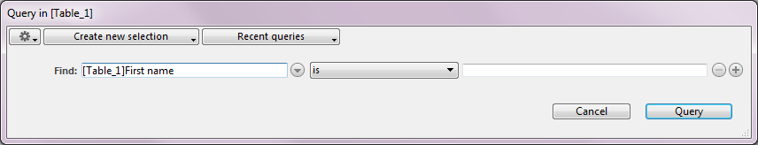

<!--REF #_command_.QUERY.Syntax-->**QUERY** ( {*tabla* }{;}{ *criterioBusqueda* {; *}} )<!-- END REF-->
<!--REF #_command_.QUERY.Params-->
| Parámetro | Tipo |  | Descripción |
| --- | --- | --- | --- |
| tabla | Table | &#8594;  | Tabla para la cual devolver una selección de registros o Tabla por defecto, si se omite |
| criterioBusqueda | Expression | &#8594;  | Criterio de búsqueda |
| * | Operador | &#8594;  | Continuar la ejecución de la búsqueda |

<!-- END REF-->

#### Descripción 

<!--REF #_command_.QUERY.Summary-->El comando QUERY busca los registros que corresponden al criterio especificado en *criterioBusqueda* y devuelve una selección de registros de *tabla*.<!-- END REF--> QUERY modifica la selección actual de *tabla* para el proceso actual y vuelve el primer registro de la nueva selección el registro actual.

Si omite el parámetro *tabla*, el comando se aplica a la tabla por defecto. Si no se ha definido una tabla por defecto, se genera un error.

Si no especifica *criterioBusqueda* ni el parámetro *\**, QUERY muestra la caja de diálogo del editor de búsquedas para *tabla* (excepto cuando es la última fila de una búsqueda múltiple, ver ejemplo 2):



Para mayor información sobre la utilización de este editor, consulte el Manual de Diseño. 

El usuario construye la búsqueda, luego hace clic en el botón Buscar o Buscar en la selección. Si la búsqueda se realiza sin interrupciones, la variable sistema OK toma el valor 1\. Si el usuario hace clic en Cancelar, el comando QUERY es interrumpido sin realizar la búsqueda y la variable OK toma el valor *0* (cero). 

#### Ejemplo 1 

El ejemplo siguiente muestra el editor de búsquedas para la tabla \[Productos\]:

```4d
 QUERY([Productos])
```

#### Ejemplo 2 

La línea siguiente muestra el editor de búsquedas para la tabla por defecto (si se ha definido)

```4d
 QUERY
```

Si especifica el parámetro *criterioBusqueda*, el editor de búsquedas no se muestra y la búsqueda se define por programación. Para búsquedas simples (búsquedas en un solo campo) usted llama QUERY una vez con el parámetro *criterioBusqueda*. Para búsquedas complejas (búsquedas en múltiples campos o con múltiples condiciones), llame QUERY tantas veces como sea necesario con el parámetro *criterioBusqueda*, y el parámetro opcional \*, excepto para la última llama QUERY, la cual inicia la búsqueda.

#### Ejemplo 3 

El siguiente ejemplo busca las \[Personas\] cuyo nombre comienza por “a”:

```4d
 QUERY([Personas];[Personas]Nombre="a@")
```

#### Ejemplo 4 

El siguiente ejemplo busca las \[Personas\] cuyo nombre comienza por “a” o “b”:  
  
```4d
 QUERY([Personas];[Personas]Nombre="a@";*) // * indica que hay otro criterio de búsqueda
 QUERY([Personas];|;[Personas]Nombre="b@") // Sin * indica el fin de la definición de los criterios de búsqueda y el inicio de la ejecución de la búsqueda.
 
```

**Nota:** el modo de interpretación del carácter @ en las búsquedas puede modificarse en una opción de las preferencias. Para mayor información, consulte la sección *Operadores de comparación*.

#### Construcción de una línea de búsqueda 

* El parámetro *criterioBusqueda* utiliza la siguiente sintaxis:

 { operador; } campo comparador valor

* El operador se utiliza para unir las llamadas a QUERY cuando se definen búsquedas múltiples. Los operadores disponibles son los mismos del editor de búsquedas:

| **Operador** | **Símbolo a utilizar con QUERY** |
| ------------ | -------------------------------- |
| AND          | &                                |
| OR           | \|                               |
| Except       | #                                |

El operador es opcional y no es necesario para la primera llamada a QUERY de una búsqueda múltiple, o si la búsqueda es una búsqueda simple.

* El *campo* es el campo a buscar. El *campo* puede pertenecer a otra tabla si pertenece a una tabla Uno relacionada a *tabla* con relación automática o manual. La tabla a la cual se aplica QUERY debe ser la tabla Muchos.
* El *operador* es el elemento que permite comparar *campo* y *criterioBusqueda*. Esta es la lista de posibles comparadores:

| **Comparador**  | **Símbolo a utilizar con QUERY** |
| --------------- | -------------------------------- |
| Igual a         | \=                               |
| Diferente de    | #                                |
| Menor que       | <                                |
| Mayor que       | \>                               |
| Menor o igual a | <=                               |
| Mayor o igual a | \>=                              |

**Nota:** es posible definir el comparador bajo la forma de una expresión alfanumérica en lugar de un símbolo. En ese caso, es obligatorio utilizar punto y comas para disociar los elementos de la cadena de búsqueda. Este principio permite por ejemplo crear secuencias de búsquedas parámetrables variando el comparador, o construir interfaces de búsqueda usuario personalizadas. Consulte el ejemplo 21.

* El *valor* es el dato que se compara con el contenido de *campo*. El valor puede ser una expresión del mismo tipo que *campo*. El tipo de valor se evalúa una vez, al comienzo de la búsqueda y no para cada registro. Si la búsqueda se refiere al contenido de una cadena de caracteres, utilice en valor el símbolo arroba (@) para aislar el contenido a buscar, por ejemplo "@Perez@". Es de anotar, en este caso, que usted se beneficiará sólo de forma parcial de una búsqueda indexada (compactibidad de almacenamiento).  
La búsqueda por palabras claves está sólo disponible para campos tipo Alfa y Texto. Por favor consulte la sección *Operadores de comparación* para más información acerca de este tipo de búsqueda.

Estas son las reglas a tener en cuenta para la construcción de búsquedas múltiples:

* La primera línea no debe contener un operador.
* La siguientes líneas deben comenzar con un operador.
* Todas las líneas, excepto la última, deben utilizar el parámetro \*.
* Para iniciar la búsqueda, no pase el parámetro \* durante la construcción de su última línea. Alternativamente, puede ejecutar el comando QUERY sin otros parámetros diferentes a la tabla (el editor de búsquedas no se muestra; en su lugar, se ejecuta la búsqueda múltiple).

**Nota:** cada tabla mantiene su propia construcción de búsqueda actual. Esto significa que puede crear múltiples búsquedas simultáneamente, una por cada tabla. Debe utilizar el parámetro tabla o especificar una tabla por defecto.

Sin importar de qué manera se ha definido una búsqueda:

* Si la operación de búsqueda va a tomar algún tiempo, 4D muestra automáticamente un mensaje que contiene un termómetro de progreso. Estos mensajes pueden ser activados o desactivados utilizando los comandos [MESSAGES ON](messages-on.md) y [MESSAGES OFF](messages-off.md). Si se muestra el termómetro de progreso, el usuario puede hacer clic en el botón Detener para interrumpir la búsqueda. Si la búsqueda se completa, OK toma el valor 1\. De lo contrario, si la búsqueda es interrumpida, OK toma el valor 0 (cero).
* Si los campos indexados son especificados, la búsqueda es optimizada cada vez que sea posible (se busca primero en los campo indexados) reduciendo al máximo la duración de la operación. El comando usa los índices compuestos para las búsquedas utilizando *AND* (&)

#### Ejemplo 5 

Buscamos los registros para que correspondan a personas con el apellido López:

```4d
 QUERY([Personas];[Personas]Apellido="López")
```

**Nota:** si el campo Apellido está indexado, nos beneficiamos de una búsqueda acelerada utilizando el índice.

**Recordatorio:** esta búsqueda encontrará registros como “López”, “lópez”, “LÓPEZ”, etc. Si quiere que la búsqueda tenga en cuenta las mayúsculas y minúsculas, defina criterios suplementarios que utilicen los códigos ASCII. 

#### Ejemplo 6 

El siguiente ejemplo busca los registros de personas llamadas Carlos López. El campo Apellido está indexado. El campo Nombre no está indexado.  
  
```4d
 QUERY([Personas];[Personas]Last Name="lópez";*) // Buscar todas las personas de apellido López
 QUERY([Personas]; & ;[Personas]First Name="carlos") // llamadas Carlos
```

Cuando se realiza la búsqueda, primero se efectúa una búsqueda rápida en el campo indexado Apellido, y se reduce la selección de registros a las personas de apellido López. La búsqueda luego busca secuencialmente en el campo Nombre en esta selección de registros.

#### Ejemplo 7 

El siguiente ejemplo aprovechará automáticamente un índice compuesto de los campos *\[People\]First Name*+*\[People\]Last Name* (si existe) para encontrar los registros de todas las personas llamadas John Smith.

```4d
 QUERY([People];[People]First Name="john";*) // Buscar a cada persona llamada John
 QUERY([People];&;[People]Last Name="smith") // con apellido Smith
```

Para más información, consulte *Índices compuestos*.

#### Ejemplo 8 

El siguiente ejemplo busca registros de personas de apellido López o Gómez. El campo Apellido está indexado.

```4d
 QUERY([Personas];[Personas]Apellido="lópez";*) // Buscar todas las personas de apellido López…
 QUERY([Personas];|;[Personas]Apellido="gómez") // ...o Gómez
```

El comando QUERY utiliza el índice del campo Apellido para ambas búsquedas. Las dos búsquedas se efectúan, y sus resultados se colocan en conjuntos internos que son combinados eventualmente utilizando una operación de unión. 

#### Ejemplo 9 

El siguiente ejemplo busca los registros de personas que no trabajan en una empresa. La búsqueda se realiza probando si el nombre de la empresa es una cadena vacía. 

```4d
 QUERY([Personas];[Personas]Empresa="") // Buscar las personas sin empresa
```

#### Ejemplo 10 

El siguiente ejemplo busca cada persona cuyo apellido es López, y trabaja para una empresa en Barcelona. La segunda búsqueda utiliza un campo de otra tabla. Esta búsqueda se puede efectuar porque la tabla \[Personas\] está relacionada a la tabla \[Empresa\] por una relación muchos a uno: 

```4d
 QUERY([Personas];[Personas]Apellido="lópez";*) // Buscar todas las personas de apellido López…
 QUERY([Personas];&;[Empresa]Ciudad ="Barcelona") // ... que trabajan para una empresa en Barcelona
```

#### Ejemplo 11 

El siguiente ejemplo busca el registro de cada persona cuyo inicial del nombre esté entre la letra A (incluida) y M (incluida):

```4d
 QUERY([Personas];[Personas]Nombre<"n") // Encontrar todas las personas entre A y M
```

#### Ejemplo 12 

El siguiente ejemplo busca los registros de las personas que viven en Madrid o Barcelona:

```4d
 QUERY([Personas];[Personas]CodigoPostal="28@";*) // Buscar toda las personas que viven en Madrid…
 QUERY([Personas];|;[Personas]ZIP CodigoPostal="08@") // ...o en Barcelona
```

#### Ejemplo 13 

Búsqueda por palabra clave: el siguiente ejemplo busca en toda la tabla \[Productos\] los registros cuyo campo Descripción contenga la palabra "fácil":

```4d
 QUERY([Productos];[Productos]Descripcion%"fácil") // Buscar productos cuya descripción contenga la palabra clave fácil
```

#### Ejemplo 14 

El siguiente ejemplo busca los registros que corresponden a la referencia de la factura introducida en una caja de diálogo:

```4d
 vBuscar:=Request("Introducir una referencia de factura:") // Obtener una referencia de factura del usuario
 If(OK=1) // Si el usuario hace clic en OK
    QUERY([Factura];[Factura]Ref=vBuscar) // Buscar la referencia de factura que corresponda a vBuscar
 End if
```

#### Ejemplo 15 

El siguiente ejemplo busca los registros de facturas introducidas en 1996\. Buscamos todos los registros introducidos entre el 31/12/95 y 1/1/97:

```4d
 QUERY([Facturas];[Facturas]FechaFactura >!31/12/95!;*) // Buscar facturas después de 31/12/95…
 QUERY([Facturas];&;[Facturas]FechaFactura 
```

#### Ejemplo 16 

El siguiente ejemplo busca los empleados cuyo salario está entre $10 000 y $50 000\. La búsqueda incluye los empleados que ganan $10 000, pero excluye a los que ganan $50 000:

```4d
 QUERY([Empleados];[Empleados]Salario >=10000;*) // Buscar los empleados que tengan un salario entre…
 QUERY([Empleados];&;[Empleados]Salario <50000) // ...$10 000 y $50 000
```

#### Ejemplo 17 

El siguiente ejemplo busca los empleados del departamento de mercadeo con salarios superiores a $20 000\. Se busca primero en el campo Salario porque está indexado. Observe que la segunda búsqueda utiliza un campo de otra tabla. Esto es posible porque la tabla \[Dept\] está relacionada a la tabla \[Empleados\] por una relación automática de muchos a uno. Aunque el campo \[Dept\]Nombre está indexado, la búsqueda no es indexada porque la relación debe ser activada secuencialmente para cada registro en la tabla \[Empleados\]:

```4d
 QUERY([Empleados];[Empleados]Salario >20000;*) // Buscar los empleados con salarios superiores a $20 000 y...
 QUERY([Empleados];&;[Dept]Nombre="mercadeo") // ...que trabajen en el departamento de mercadeo
```

#### Ejemplo 18 

Se tienen tres tablas relacionadas de muchos a uno: \[Ciudad\] -> \[Departamento\] -> \[Region\]. El siguiente ejemplo busca las regiones cuyas ciudades comienzan con "New".

```4d
 QUERY([Region];[Ciudad]Nombre="New") // Buscar todas las regiosnes cuyas ciudades comienzan por "New"
```

#### Ejemplo 19 

El siguiente ejemplo busca la información igual al valor de la variable *miVar*.

```4d
 QUERY([Leyes];[Leyes]Texto =miVar) // Buscar todas las leyes que son iguales al valor de miVar
```

La búsqueda puede tener muchos resultados diferentes, dependiendo del valor de *miVar*. La búsqueda se realizará también de manera diferente. Por ejemplo: 

* Si *miVar* es igual a *"Copyright@"*, la selección contiene todas las leyes que contienen textos que comienzan por Copyright.
* Si *miVar* es igual a *"@Copyright@"*, la selección contiene todas las leyes que contienen al menos una ocurrencia de Copyright.

#### Ejemplo 20 

El siguiente ejemplo añade o no líneas a una búsqueda compleja dependiendo del valor de las variables. De esta forma, sólo los criterios válidos son tenidos en cuenta para la búsqueda. 

```4d
 QUERY([Factura];[Factura]Pagada=False;*)
 If($ciudad#"") // si se ha especificado un nombre de ciudad `
    QUERY([Factura];[Factura]Ciudad_entrega=$ciudad;*)
 End if
 
 If($Codigo_Postal#"") // si se ha especificado un código postal
 
    QUERY([Factura];[Factura]Codigo_Postal=$Codigo_Postal;*)
 End if
 QUERY([Factura]) // Ejecución de la búsqueda sobre los criterios
```

#### Ejemplo 21 

Este ejemplo ilustra la utilización de un operador de comparación como expresión alfanumérica. El valor del operador de comparación está definido a través de un menú desplegable ubicado en una caja de diálogo de búsqueda personalizada: 

```4d
 var $oper : Text
 $oper:=_popup_operator{_popup_operator} //$oper igual por ejemplo "#" o "="
```

```4d
 If(OK=1)
    QUERY([Factura];[Factura]Cantidad;$oper;$cantidad)
 End if
```

#### Ejemplo 22 

El uso de los índices de palabras claves puede acelerar de manera importante sus aplicaciones.

```4d
 QUERY([IMAGENES];[IMAGENES]Fotos%"gatos") // buscar fotos asociadas con la palabra clave "gatos"
```

#### Variables y conjuntos del sistema 

Si la búsqueda se lleva a cabo correctamente, la variable sistema OK toma el valor 1.  
La variable OK toma el valor 0 si: - el usuario hace clic en Cancelar en la caja de diálogo de búsqueda,  
\- en modo 'búsqueda y bloqueo' (ver el comando [SET QUERY AND LOCK](set-query-and-lock.md "SET QUERY AND LOCK")), la búsqueda encuentra al menos un registro bloqueado. En este caso igualmente, el conjunto sistema LockedSet se actualiza.

#### Ver también 

[QUERY SELECTION](query-selection.md)  