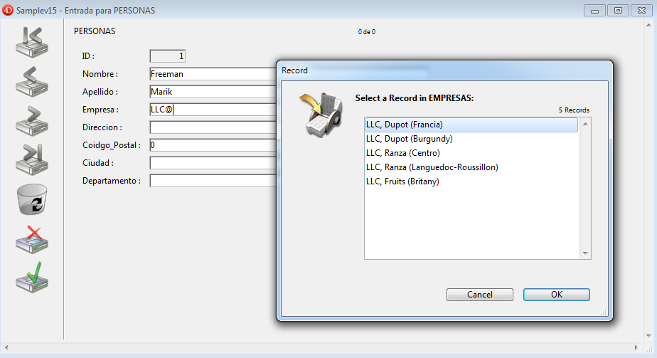
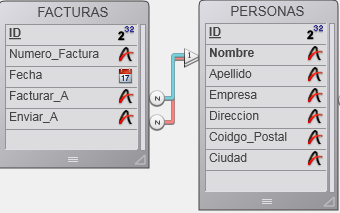
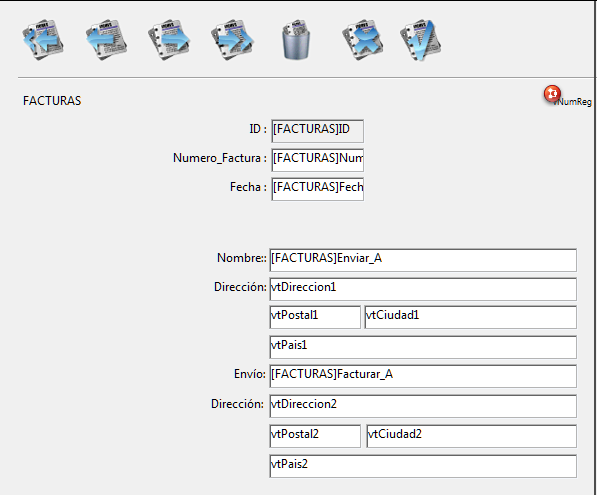

<!--REF #_command_.RELATE ONE.Syntax-->**RELATE ONE** ( tablasN | CampoN {; *discriminante*} )<!-- END REF-->
<!--REF #_command_.RELATE ONE.Params-->
| Parámetro | Tipo |  | Descripción |
| --- | --- | --- | --- |
| tablasN &#124; CampoN | Tabla, Campo | &#8594;  | Tabla para la cual definir todas las relaciones automáticas o Campo con la relación manual con la tabla Uno |
| discriminante | Field | &#8594;  | Campo discriminante de la tabla 1 |

<!-- END REF-->

*Este comando no es hilo seguro, no puede ser utilizado en código apropiativo.*


#### Descripción 

<!--REF #_command_.RELATE ONE.Summary-->RELATE ONE acepta dos sintaxis.<!-- END REF--> 

La primera sintaxis del comando, RELATE ONE(tablaN), activa todas las relaciones *Muchos a Uno* automáticas para la tabla *tablaN* en el proceso actual. Esto significa que para cada campo de la tabla *tablaN* que tenga una relación Muchos a Uno automática, el comando seleccionará el registro relacionado en cada tabla relacionada. Esto cambia el registro actual en la(s) tabla(s) relacionadas para el proceso.

La segunda sintaxis, RELATE ONE(campoN{;discriminante}), busca el registro relacionado con *campoN*. No es necesario que la relación sea automática. Si existe, RELATE ONE carga en memoria el registro relacionado, volviéndolo el registro y la selección actual de la tabla.

El parámetro opcional *discriminante* debe ser un campo de la tabla relacionada. Puede ser únicamente de tipo Alfa, Texto, numérico, Fecha, Hora o Booleano. En particular, no puede ser tipo Imagen o BLOB.

Si *campoN* se especifica y si más de un registro se encuentra en la tabla relacionada, RELATE ONE muestra una lista de registros que corresponden al valor de *campoN*, permitiendo al usuario seleccionar un registro. En esta lista, la columna de la izquierda muestra los valores de los campos relacionados, y la columna de la derecha los valores de *discriminante*.

Se podría encontrar más de un registro si *campoN* termina con el carácter arroba (@). Si sólo hay una coincidencia, no aparece la lista. 

En la pantalla abajo, se está introduciendo y se muestra una lista de selección en el primer plano. 



El siguiente comando se utiliza para que aparezca la lista de selección: 

```4d
 RELATE ONE([Personnel]Company;[Companies]Region)
```

Un usuario introducido LLC@ para ver la lista de todas las empresas cuyos nombres comienzan por LLC, así como también su región.

Especificar un campo en *discriminante* es lo mismo que definir un campo discriminante en la caja de diálogo de definición de las propiedades de una relación en el entorno Diseño. Para mayor información sobre la definición de un campo discriminante, consulte el *Manual de Diseño* de 4D.

##### 

**Nota:** este comando no soporta campos de tipo Objeto.

#### Ejemplo 

En el siguiente ejemplo, la tabla *\[Facturas\]* está relacionada a la tabla *\[Clientes\]* por dos relaciones manuales. Una relación parte del campo *\[Facturas\]A nombre de* al campo *\[Clientes\]ID* y la otra relación va de *\[Facturas\]Enviar a* a *\[Clientes\]ID*.  
  
Esta es el formulario de la tabla \[Invoices\] que muestra la información "Facturar a" y "Enviar a":  
  
 

Como las dos relaciones apuntan a la misma tabla, *\[Clientes\]*, no es posible obtener la información de facturación y envío al mismo tiempo. Por lo tanto, la información debe ser mostrada utilizando variables y llama a **RELATE ONE**. Si los campos *\[Clientes\]* se mostraron en su lugar, sólo se mostrarán los datos de una de las relaciones.

Los siguientes métodos son los métodos de objeto de los campos *\[Facturas\]Facturar a* y *\[Facturas\]Enviar a*. Estos métodos se ejecutan cuando se introducen los campos. 

Este es el método de objeto para el campo *\[Facturas\]Facturar a*:

```4d
 RELATE ONE([Facturas]Enviar a)
 vAddress1:=[Clientes]Direccion
 vCity1:=[Clientes]Ciudad
 vState1:=[Clientes]Estado
 vZIP1:=[Clientes]CodigoPostal
```

Este es el método de objeto para el campo *\[Facturas\]Enviar a:*

```4d
 RELATE ONE([Facturas]Enviar a)
 vAddress2:=[Clientes]Direccion
 vCity2:=[Clientes]Ciudad
 vState2:=[Clientes]Estado
 vZIP2:=[Clientes]CodigoPostal
```

#### Variables y conjuntos del sistema 

Si el comando se ejecuta correctamente y si los registros relacionados se han cargado, la variable sistema OK toma el valor 1\. Si el usuario hizo clic en **Cancelar** en la caja de diálogo de selección del registro (que aparece cuando el registro relacionado ha sido modificado), la variable ***OK*** toma el valor 0\. 

#### Ver también 

[OLD RELATED ONE](old-related-one.md)  
[RELATE MANY](relate-many.md)  