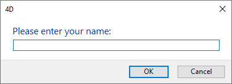
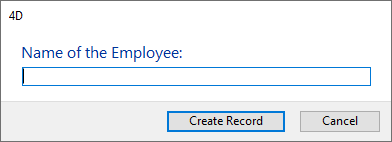

<!--REF #_command_.Request.Syntax-->**Request** ( *mensaje* {; *respuestaDefecto* {; *titulobotonOK* {; *titulobotoncancel*}}} )  : Text<!-- END REF-->
<!--REF #_command_.Request.Params-->
| Parámetro | Tipo |  | Descripción |
| --- | --- | --- | --- |
| mensaje | Text | &#8594;  | Mensaje a mostrar en la caja de diálogo |
| respuestaDefecto | Text | &#8594;  | Valor por defecto en el área de entrada de texto |
| titulobotonOK | Text | &#8594;  | Título del botón Aceptar |
| titulobotoncancel | Text | &#8594;  | Título del botón Cancelar |
| Resultado | Text | &#8592; | Valor introducido por el usuario |

<!-- END REF-->

#### Descripción 

<!--REF #_command_.Request.Summary-->El comando **Request** muestra una caja de diálogo compuesta de un mensaje, un área de entrada de texto, un botón **OK** y un botón **Cancelar**.<!-- END REF-->

El mensaje a mostrar se pasa en el parámetro *mensaje*. Si el mensaje no se ajusta al área de mensaje (por lo general alrededor de 50 caracteres, varía dependiendo del sistema y de la fuente utilizada), puede aparecer truncado.

Por defecto, título del botón **OK** es “Aceptar” y el del botón **Cancelar** es “Cancelar.” Para cambiar los títulos de estos botones, pase los nuevos títulos en los parámetros opcionales *titulobotonOK* y *titulobotoncancel*. Si es necesario, el ancho de los botones se redimensiona hacia la izquierda, de acuerdo al ancho de los títulos personalizados que usted pase.

El botón **OK** es el botón por defecto. Si el usuario hace clic en el botón **OK** o presiona **Intro** para aceptar la caja de diálogo, la variable sistema **OK** toma el valor 1\. Si el usuario hace clic en el botón **Cancelar** para cancelar la caja de diálogo, la variable sistema OK toma el valor 0.

El usuario puede introducir texto en el área de entrada de texto. Para especificar un valor por defecto, pase el texto por defecto en el parámetro *respuestaDefecto*. Si el usuario hace clic en el botón **OK**, **Request** devuelve el texto. Si el usuario hace clic en **Cancelar**, **Request** devuelve una cadena vacía (""). Si la respuesta debe ser un valor numérico o una fecha, convierta la cadena devuelta por **Request** al tipo deseado con la ayuda de las funciones [Num](num.md) or [Date](date.md).

**Nota:** no llame el comando **Request** desde un método de formulario o de objeto que maneje los eventos de formulario On Activate o On Deactivate; esto provocará un bucle infinito.

**Consejo:** si necesita obtener varias piezas de información del usuario, diseñe un formulario y preséntelo con [DIALOG](dialog.md), en lugar de presentar una sucesión de cajas de diálogo de tipo **Request**.

#### Ejemplo 1 

La línea:

```4d
 $vsPrompt:=Request("Por favor introduzca su nombre:")
```

Mostrará la siguiente caja de diálogo (en Windows):



#### Ejemplo 2 

La línea: 

```4d
 vsPrompt:=Request("Name of the Employee:";"";"Create Record";"Cancel")
 If(OK=1)
    ADD RECORD([Employees])
  //Nota: vsPrompt luego es copiado en el campo [Employees]Last name
  //durante el evento On Load en el método de formulario
 End if
```

Mostrará la siguiente caja de diálogo (en Windows):



#### Ejemplo 3 

La línea: 

```4d
 $vdPrompt:=Date(Request("Introduzca la nueva fecha:";String(Current date)))
```

Mostrará la siguiente caja de diálogo (en Windows):


#### Ver también 

[ALERT](alert.md)  
[CONFIRM](confirm.md)  

#### Propiedades
|  |  |
| --- | --- |
| Número de comando | 163 |
| Hilo seguro | &check; |
| Modifica variables | OK |
| Prohibido en el servidor ||


