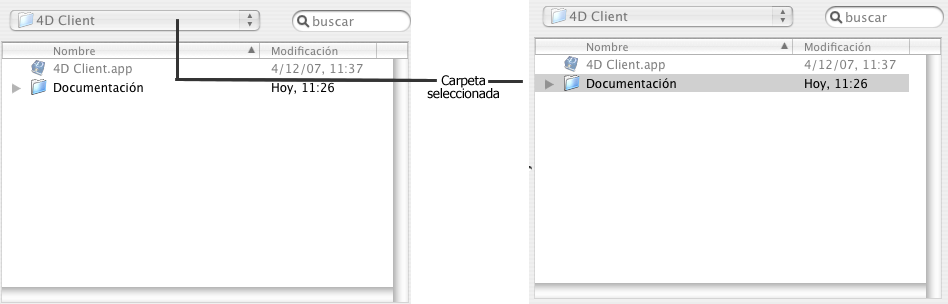

<!--REF #_command_.Select folder.Syntax-->**Select folder** ( {*mensaje* }{;}{ *rutaDefecto* {; *opciones*}} ) : Text<!-- END REF-->
<!--REF #_command_.Select folder.Params-->
| Parámetro | Tipo |  | Descripción |
| --- | --- | --- | --- |
| mensaje | Text | &#8594;  | Título de la ventana |
| rutaDefecto | Text, Integer | &#8594;  | • Ruta de acceso por defecto o • Ruta vacía para mostrar el usuario por defecto carpeta (“Mis documentos” bajo Windows, “Documentos” bajor Mac OS), o • Número de ruta de acceso memorizada |
| opciones | Integer | &#8594;  | Opciones de selección bajo Mac OS |
| Resultado | Text | &#8592; | Ruta de acceso al archivo seleccionado |

<!-- END REF-->

#### Descripción 

<!--REF #_command_.Select folder.Summary-->El comando **Select folder** muestra una caja de diálogo que le permite seleccionar manualmente una carpeta y luego recuperar la ruta de acceso completa a esa carpeta.<!-- END REF--> El parámetro opcional *rutaDefecto* puede utilizarse para designar la ubicación de una carpeta que inicialmente será mostrada en la caja de diálogo de selección de la carpeta.

**Nota:** este comando no modifica la carpeta actual de la aplicación 4D.

El comando **Select folder** muestra una caja de diálogo estándar de navegación a través de los volúmenes y las carpetas. 

El parámetro opcional *mensaje* le permite mostrar un mensaje en la caja de diálogo. En los siguientes ejemplos, el mensaje es "Seleccione una carpeta de destino":

**Windows**


**macOS** 


 Puede utilizar el parámetro *rutaDefecto* para ofrecer una ubicación de carpeta por defecto en la caja de diálogo de selección de carpeta. Puede pasar en este parámetro tres tipos de valores: 
* Una ruta de acceso de una carpeta válida utilizando la sintaxis de la plataforma actual.
* Una cadena vacía (“”) para mostrar la carpeta del usuario por defecto del sistema (“Mis documentos” bajo Windows, “Documentos” bajo macOS).
* El número de ruta de acceso memorizada (de 1 a 32 000) para mostrar la carpeta asociada. Esto significa que puede almacenar en memoria la ruta de acceso de la carpeta abierta cuando el usuario hace clic en el botón de selección; en otras palabras, la carpeta elegida por el usuario. Cuando se llama un número arbitrario (por ejemplo, 5) el comando muestra la carpeta del usuario por defecto del sistema (equivalente a pasar una cadena vacía). El usuario puede entonces navegar entre las carpetas en su disco duro. Cuando el usuario hace clic en el botón de selección, la ruta de acceso se memoriza y se asocia con el número 5\. Cuando posteriormente se llama el número 5, se utilizará por defecto la ruta de acceso memorizada. En caso de selección de una nueva ubicación, la ruta número 5 se actualizará, y así sucesivamente.  
Este mecanismo puede utilizarse para memorizar hasta 32 000 rutas de acceso. Bajo Windows, cada ruta se conserva durante la sesión. Bajo macOS, las rutas quedan memorizadas de una sesión a otra. Si la ruta es incorrecta, el parámetro *rutaDefecto* se ignora.

**Nota:** este mecanismo es idéntico al utilizado por el comando [Select document](select-document.md). Los números de rutas de acceso memorizadas se comparten entre los dos comandos.

El parámetro *opciones* le permite beneficiarse de funciones adicionales bajo macOS. En este parámetro, puede pasar una de las siguientes constantes, del tema *Documentos sistema*: 

| Constante        | Tipo         | Valor | Comentario                                                                                                                                                                                                                                                                                                                                                                                                             |
| ---------------- | ------------ | ----- | ---------------------------------------------------------------------------------------------------------------------------------------------------------------------------------------------------------------------------------------------------------------------------------------------------------------------------------------------------------------------------------------------------------------------- |
| Package open     | Entero largo | 2     | (Mac OS únicamente): autoriza la apertura de paquetes como carpetas y por lo tanto la visualización/selección de sus contenidos. Por defecto, si no se utiliza esta constante, el comando no permitirá la apertura de paquetes.                                                                                                                                                                                        |
| Use sheet window | Entero largo | 16    | (Mac OS únicamente): muestra la caja de diálogo de selección en forma de una ventana hoja (esta opción se ignora en Windows). <br/>Las ventanas hojas son específicas para la interfaz Mac OS X con animación gráfica (para mayor información, consulte la sección [DISPLAY SELECTION](display-selection.md)). Por defecto, si esta constante no se utiliza, el comando mostrará una caja de diálogo estándar. |

Puede pasar una constante o la combinación de dos. Estas opciones sólo son tenidas en cuenta bajo macOS. Bajo Windows, el parámetro *opciones* es ignorado si se pasa. 

El usuario selecciona una carpeta y luego hace clic en el botón **Seleccionar carpeta** (en Windows) o **Abrir** (en macOS). La ruta de acceso a la carpeta luego es devuelta por la función.

* En Windows, la ruta de acceso devuelta tiene el siguiente formato:  
“C:\\Carpeta1\\Carpeta2\\CarpetaSeleccionada\\”
* En macOS, la ruta de acceso devuelta tiene el siguiente formato:  
“Disco:Carpeta1:Carpeta2:CarpetaSeleccionada:”

**Nota:** bajo macOS, dependiendo de si el nombre de la carpeta se selecciona o no en la caja de diálogo, la ruta de acceso devuelta podría ser diferente.



**4D Server:** esta función permite visualizar los volúmenes conectados a las estaciones de trabajo de los clientes. No es posible llamar esta función desde un procedimiento almacenado.

Si el usuario valida la caja de diálogo, la variable sistema **OK** toma el valor 1\. Si el usuario hace clic en el botón **Cancelar**, la variable sistema **OK** toma el valor 0 y la función devuelve una cadena vacía.

**Nota:** en Windows, si el usuario selecciona algunos elementos incorrectos, tales como “Puesto de trabajo”, “Papelera”, etc., la variable sistema **OK** toma el valor 0, incluso si el usuario valida la caja de diálogo.

#### Ejemplo 

El siguiente ejemplo le permite seleccionar la carpeta en la cual se almacenarán las imágenes de la librería de imágenes:  
  
```4d
 $PictFolder:=Select folder("Seleccione una carpeta para sus imágenes")
 PICTURE LIBRARY LIST(pictRefs;pictNames)
 For($n;1;Size of array(pictNames))
    GET PICTURE FROM LIBRARY(pictRefs{$n};$vStoredPict)
    WRITE PICTURE FILE($PictFolder+pictNames{$n};$vStoredPict)
 End for
```

  

#### Ver también 

[CREATE FOLDER](create-folder.md)  
[FOLDER LIST](folder-list.md)  
[Select document](select-document.md)  