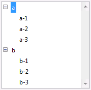
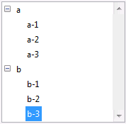
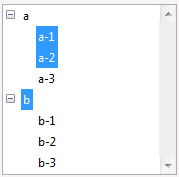

<!--REF #_command_.SELECT LIST ITEMS BY POSITION.Syntax-->**SELECT LIST ITEMS BY POSITION** ( {* ;} *lista* ; *posicionElem* {; *posicionArray*} )<!-- END REF-->
<!--REF #_command_.SELECT LIST ITEMS BY POSITION.Params-->
| Parámetro | Tipo |  | Descripción |
| --- | --- | --- | --- |
| * | Operador | &#8594;  | Si se especifica, lista es un nombre de objeto (cadena) Si se omite, lista es un número de referencia de lista |
| lista | Integer, Text | &#8594;  | Número de referencia de lista (si se omite *) o Nombre del objeto de tipo lista (si se pasa *) |
| posicionElem | Integer | &#8594;  | Posición del elemento en la(s) lista(s) desplegada(s) /contraída(s) |
| posicionArray | Integer array | &#8594;  | Array de posiciones en la(s) lista(s) desplegada(s) /contraída(s) |

<!-- END REF-->

#### Descripción 

<!--REF #_command_.SELECT LIST ITEMS BY POSITION.Summary-->El comando SELECT LIST ITEMS BY POSITION selecciona el(los) elemento(s) cuya posición se pasa en *posicionElem* y opcionalmente en *posicionArray* en la lista cuyo número de referencia o nombre de objeto se pasa en *lista*.<!-- END REF-->

Si pasa el primer parámetro opcional \*, indica que el parámetro *lista* es un nombre de objeto (cadena) correspondiente a una representación de lista en el formulario. Si no pasa este parámetro, indica que el parámetro *lista* es una referencia de lista jerárquica (RefLista). Si utiliza sólo una representación de lista, puede utilizar indiferentemente una u otra sintaxis. Por el contrario, si usted utiliza varias representaciones de una misma lista, la lista basada en el nombre del objeto es necesaria ya que cada representación puede tener su propia configuración desplegada/contraída.  

**Nota:** si utiliza el carácter @ en el nombre de la lista y el formulario contiene varias listas que responden a este nombre, el comando SELECT LIST ITEMS BY POSITION sólo aplicará al primer objeto cuyo nombre corresponde. 

La posición de los elementos siempre se expresa utilizando el estado desplegado/contraído de la lista y sus sublistas. Usted pasa un valor de posición entre 1 y el valor devuelto por [Count list items](count-list-items.md "Count list items"). Si pasa un valor fuera de este rango, no se selecciona ningún elemento.

Si no pasa el parámetro *posicionArray*, el parámetro *posicionElem* representa la posición del elemento a seleccionar. 

El parámetro opcional *posicionArray* le permite seleccionar varios elementos simultáneamente de la *lista*. En *posicionArray*, debe pasar un array donde cada línea indique la posición de un elemento a seleccionar.  
  
Cuando pasa este parámetro, el elemento designado por el parámetro *posicionElem* designa el nuevo elemento actual de la lista en la selección resultante, el cual puede pertenecer o no al conjunto de elementos definido por el array. El elemento actual es, más particularmente, el que pasa a modo edición si se utiliza el comando [EDIT ITEM](edit-item.md "EDIT ITEM"). 

**Nota:** para que varios elementos puedan ser seleccionados simultáneamente en una lista jerárquica (manualmente o por programación), la propiedad *multi-seleccionable* debe haber sido activada para la lista. Esta propiedad se define utilizando el comando [SET LIST PROPERTIES](set-list-properties.md "SET LIST PROPERTIES").

#### Ejemplo 

Dada la lista jerárquica llamada *hList,* mostrada en el entorno Aplicación:



Después de la ejecución de este código:

```4d
 SELECT LIST ITEMS BY POSITION(hList;Count list items(hList))
```

El último elemento visible de la lista es seleccionado:



Después de la ejecución de las siguientes líneas de código:

```4d
 SET LIST PROPERTIES(hList;0;0;18;0;1)
  //Es imperativo pasar 1 como último parámetro para permitir las selecciones múltiples
 ARRAY LONGINT($arr;3)
 $arr{1}:=2
 $arr{2}:=3
 $arr{3}:=5
 SELECT LIST ITEMS BY POSITION(hList;3;$arr)
  //El tercer elemento se designa como elemento actual
```

Se seleccionan los elementos segundo, tercero y quinto de la lista jerárquica 



#### Ver también 

[EDIT ITEM](edit-item.md)  
[SELECT LIST ITEMS BY REFERENCE](select-list-items-by-reference.md)  
[Selected list items](selected-list-items.md)  

#### Propiedades
|  |  |
| --- | --- |
| Número de comando | 381 |
| Hilo seguro | &check; |
| Prohibido en el servidor ||


