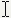
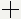
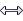
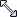
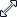
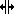
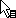
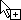

<!--REF #_command_.SET CURSOR.Syntax-->**SET CURSOR** {( *cursor* )}<!-- END REF-->
<!--REF #_command_.SET CURSOR.Params-->
| Parámetro | Tipo |  | Descripción |
| --- | --- | --- | --- |
| cursor | Integer | &#8594;  | Número de cursor sistema |

<!-- END REF-->

#### Descripción 

<!--REF #_command_.SET CURSOR.Summary-->El comando SET CURSOR cambia el puntero (gráfico) del ratón por el del sistema cuyo número de identificación se pasa en *cursor*.<!-- END REF-->

Este comando debe llamarse en el contexto del [Form event code](../commands/form-event-code.md) On Mouse Move. 

Para restablecer el cursor de ratón estándar, llame el comando sin parámetro.

Los siguientes son algunos cursores que pueden pasarse en el parámetro *cursor*:

| **Number** | **Cursor**                                    |
| ---------- | --------------------------------------------- |
| 1          |    |
| 2          |    |
| 4          |  |
| 9000       |  |
| 9001       |  |
| 9003       |  |
| 9004       |  |
| 9005       |  |
| 9006       |  |
| 9021       |  |
| 351        |  |
| 9010       |  |
| 9011       |  |
| 9013       |  |
| 9014       |  |
| 9015       |  |
| 9016       |  |
| 9017       |  |
| 9019       |  |
| 9020       |  |
| 559        |  |
| 560        |  |

**Nota:** la disponibilidad y la apariencia de los cursores puede variar dependiendo del sistema operativo.

#### Ejemplo 

Usted quiere que se muestre el cursor  cuando el ratón pase sobre una área variable en el formulario. Puede escribir en el método objeto de la variable:

```4d
 If(Form event code=On Mouse Move)
    SET CURSOR(9019)
 End if
```


#### Propiedades

|  |  |
| --- | --- |
| Número de comando | 469 |
| Hilo seguro | &cross; |


