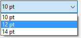

<!--REF #_command_.SET LIST ITEM PARAMETER.Syntax-->**SET LIST ITEM PARAMETER** ( {* ;} *lista* ; refElem | * ; *selector* ; *valor* )<!-- END REF-->
<!--REF #_command_.SET LIST ITEM PARAMETER.Params-->
| Parámetro | Tipo |  | Descripción |
| --- | --- | --- | --- |
| * | Operador | &#8594;  | Si se especifica, lista es un nombre de objeto (cadena) Si se omite, lista es un número de referencia de lista |
| lista | Integer, Text | &#8594;  | Número de referencia de lista (si se omite *) o Nombre del objeto de tipo lista (si se pasa *) |
| refElem &#124; * | Operador, Entero largo | &#8594;  | Número de referencia del elemento o 0 para el último elemento añadido a la lista o * para el elemento actual de la lista |
| selector | Text | &#8594;  | Constante de parámetro |
| valor | Text, Boolean, Real | &#8594;  | Valor del parámetro |

<!-- END REF-->

#### Descripción 

<!--REF #_command_.SET LIST ITEM PARAMETER.Summary-->El comando SET LIST ITEM PARAMETER permite modificar el parámetro *selector* para el elemento *refElem* de la lista jerárquica cuya referencia o nombre de objeto se pasa en el parámetro *lista*.<!-- END REF-->

Si pasa el primer parámetro opcional *\*,* indica que el parámetro *lista* es un nombre de objeto (cadena) correspondiente a una representación de la lista en el formulario. Si no pasa este parámetro, indica que el parámetro *lista* es una referencia de lista jerárquica (*refLista*). Si utiliza una sola representación de lista o trabaja con los elementos estructurales (se omite el segundo *\**), puede utilizar indiferentemente una u otra sintaxis. Por el contrario, si utiliza varias representaciones de la misma lista y trabaja con el elemento actual (se pasa el segundo *\**), se requiere la sintaxis basada en el nombre del objeto ya que cada representación puede tener su propio elemento actual.

Puede pasar un número de referencia en *refElem*. Si este número no corresponde a ningún elemento de la lista, el comando no hace nada. Puede pasar también 0 en *refElem* para indicar el último elemento añadido a la lista (utilizando *Listas jerárquicas*).

Finalmente, puede pasar *\** en *refElem: e*n este caso, el comando será aplicado al elemento actual de la lista. Si se seleccionan varios elementos manualmente, el elemento actual es el último seleccionado. Si ningún elemento está seleccionado, el comando no hace nada.  
  
En *selector*, puede pasar:

* una de las siguientes constantes (del tema “*Listas jerárquicas*”): 
 
|Constante                  | Tipo   | Valor                      | Comentario                                                                                                                                                                                                                                                                                                    |  
| -------------------------- | ------ | -------------------------- | ------------------------------------------------------------------------------------------------------------------------------------------------------------------------------------------------------------------------------------------------------------------------------------------------------------- |  
| Additional text            | Cadena | 4D\_additional\_text       | Esta constante se utiliza para agregar texto a la derecha del elemento *refElem*. Este título adicional siempre se mostrará en la parte derecha de la lista, incluso cuando el usuario mueva el cursor de desplazamiento horizontal. Cuando utilice esta constante, pase el texto que se mostrará en *valor*. |  
| Associated standard action | Cadena | 4D\_standard\_action\_name | Asociar una acción estándar con el *refElem*. En este caso, debe pasar en el parámetro *valor* un nombre de acción estándar con un parámetro, por ejemplo "fontSize?value=10pt". Para más información, consulte la sección *Acciones estándar* del manual de *Diseño*.                                        |
* o un **selector personalizado**: también puede pasar un texto personalizado y asociarlo con un valor de tipo texto, numérico o booleano. Este valor será almacenado con el elemento y podrá recuperarse utilizando el comando [GET LIST ITEM PARAMETER](get-list-item-parameter.md). Este principio permite configurar todo tipo de interfaz asociado con las listas jerárquicas. Por ejemplo, en una lista de nombres de clientes, puede guardar la edad de cada persona y mostrarla únicamente cuando el elemento correspondiente sea seleccionado.

#### Ejemplo 

Usted desea definir como lista de opciones de un menú emergente jerárquico una lista personalizada de valores de tamaño de fuente utilizando la funcionalidad de acciones estándar:

```4d
 $myList:=New list
 APPEND TO LIST($myList;ak standard action title;1)
 APPEND TO LIST($myList;ak standard action title;2)
 APPEND TO LIST($myList;ak standard action title;3)
 SET LIST ITEM PARAMETER($myList;1;Associated standard action;"fontSize?value=10pt")
 SET LIST ITEM PARAMETER($myList;2;Associated standard action;"fontSize?value=12pt")
 SET LIST ITEM PARAMETER($myList;3;Associated standard action;"fontSize?value=14pt")
 OBJECT SET LIST BY REFERENCE(*;"popup";Choice list;$myList)
```



#### Ver también 

[APPEND TO LIST](append-to-list.md)  
[Action info](action-info.md)  
[GET LIST ITEM PARAMETER](get-list-item-parameter.md)  
[GET LIST ITEM PARAMETER ARRAYS](get-list-item-parameter-arrays.md)  
[INSERT IN LIST](insert-in-list.md)  

#### Propiedades
|  |  |
| --- | --- |
| Número de comando | 986 |
| Hilo seguro | &check; |
| Prohibido en el servidor ||


