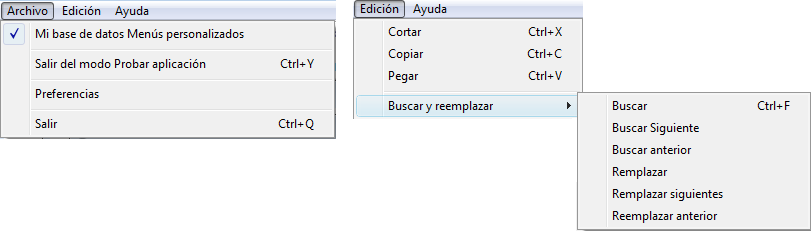

<!--REF #_command_.SET MENU BAR.Syntax-->**SET MENU BAR** ( *barra* {; *proceso*}{; *} )<!-- END REF-->
<!--REF #_command_.SET MENU BAR.Params-->
| Parámetro | Tipo |  | Descripción |
| --- | --- | --- | --- |
| barra | Integer, Text, Text | &#8594;  | Número o nombre de la barra de menús o Referencia de menú |
| proceso | Integer | &#8594;  | Número de referencia del proceso |
| * | Operador | &#8594;  | Guardar el estado de la barra de menús |

<!-- END REF-->

*Este comando no es hilo seguro, no puede ser utilizado en código apropiativo.*


#### Descripción 

<!--REF #_command_.SET MENU BAR.Summary-->MENU BAR reemplaza la barra de menús actual con la especificada por *barra* en el proceso actual únicamente.<!-- END REF--> En el parámetro *barra*, puede pasar el número o nombre de la nueva barra. Igualmente puede pasar una referencia única de menú (tipo [MenuRef](# "Unique ID (16-character alphanumeric) of a menu"), cadena de 16 caracteres). Cuando trabaja con referencias, los menús pueden ser utilizados como barras de menú y viceversa (ver la sección *Gestión de menús*). 

**Nota:** el nombre de una barra de menús puede contener hasta 31 caracteres y debe ser único.

Si pasa el parámetro opcional *proceso* cambia la barra de menús del proceso especificado por *barra*.

**Nota:** si pasa un parámetro MenuRef en *barra*, el parámetro *proceso* es inútil y se ignorará.

El parámetro opcional *\** le permite conservar el estado de la barra de menús. Si este parámetro se omite, MENU BAR reinicializa la barra de menús cuando el comando se ejecuta.

Por ejemplo, imagine que SET MENU BAR(1) se ejecuta. Luego, varios comandos de menú se desactivan utilizando el comando [DISABLE MENU ITEM](disable-menu-item.md "DISABLE MENU ITEM").

Si SET MENU BAR(1) se ejecuta una segunda vez, desde el mismo proceso o desde un proceso diferente, todos los comandos de menú regresarán a su estado de activación inicial.

Si SET MENU BAR(1;\*) se ejecuta, la barra de menús conservará su estado anterior, y los comandos de menú que estaban inactivos permanecerán inactivos.

**Nota:** si pasa un parámetro MenuRef en *barra*, el parámetro *\** es inútil y se ignorará.

Cuando un usuario entra al entorno Aplicación, se muestra la primera barra de menús (Barra #1). Puede cambiar esta barra de menús por defecto abriendo la base y especificando la barra de menús deseada en el Método de base On Startup o en el método de inicio asociado a un usuario individual.

#### Ejemplo 1 

El siguiente ejemplo cambia la barra de menús actual por la barra de menús #3 y restablece el estado de los comandos de menú a sus estados originales:

```4d
 SET MENU BAR(3)
```

#### Ejemplo 2 

El siguiente ejemplo cambia la barra de menús actual por la barra de menús llamada “BarraForm1” y guarda el estado de los comandos de menús. Comandos de menús que fueron desactivados previamente aparecerán inactivos.

```4d
 SET MENU BAR("BarraForm1";*)
```

#### Ejemplo 3 

El siguiente ejemplo reemplaza la barra de menús actual por la barra de menús #3 mientras los registros son modificados. Una vez los registros sean modificados, la barra de menús #2 se restaura. El estado de los comandos de menú se conserva:

```4d
 SET MENU BAR(3)
 ALL RECORDS([Clientes])
 MODIFY SELECTION([Clientes])
 SET MENU BAR(2;*)
```

#### Ejemplo 4 

En este ejemplo, crearemos por programación, una barra de menús incluyendo los siguientes menús Archivo y Edición: 



```4d
  //Metodo de creación menú Archivo
 var 16;MenuArchivo : Text // MenuArchivo contendrá la referencia de menu Archivo
 MenuArchivo:=Create menu
 INSERT MENU ITEM(MenuArchivo;-1;"Mi base de datos "+Get indexed string(131;29))
 SET MENU ITEM MARK(MenuArchivo;1;Char(18))
 INSERT MENU ITEM(MenuArchivo;-1;"(-")
 INSERT MENU ITEM(MenuArchivo;-1;"Salir del modo Test Application mode/Y")
 SET MENU ITEM PROPERTY(MenuArchivo;3;Associated standard action;ak return to design mode)
 INSERT MENU ITEM(MenuArchivo;-1;"(-")
 INSERT MENU ITEM(MenuArchivo;-1;"Preferencias")
 SET MENU ITEM PROPERTY(MenuArchivo;5;Associated standard action;ak database settings) //Preferencias
 INSERT MENU ITEM(MenuArchivo;-1;"(-")
 INSERT MENU ITEM(MenuArchivo;-1;Get indexed string(131;30))
 SET MENU ITEM PROPERTY(MenuArchivo;7;Associated standard action;ak quit) //Salir
 SET MENU ITEM SHORTCUT(MenuArchivo;7;Character code("Q"))
 
  //Método de creación del menú Buscar y reemplazar
 var MenuBuscaryReemplazar : Text //MenuBuscaryReemplazar contendrá la referencia del menú Buscar y reemplazar
 MenuBuscaryReemplazar:=Create menu
 APPEND MENU ITEM(MenuBuscaryReemplazar;"Buscar;Buscar Siguiente;Buscar anterior;(-;Remplazar;Remplazar siguientes;Reemplazar anterior")
 SET MENU ITEM SHORTCUT(MenuBuscaryReemplazar;1;Character code("F"))
 SET MENU ITEM SHORTCUT(MenuBuscaryReemplazar;5;Character code("R"))
 SET MENU ITEM METHOD(MenuBuscaryReemplazar;1;"MiMetodoBuscar")
 
  //Método de creación del menú Edición
 var MenuEdicion : Text //EditMenu contendrá la referencia del menú Edición
 MenuEdicion:=Create menu
 APPEND MENU ITEM(MenuEdicion;"Cortar;Copiar;Pegar")
 SET MENU ITEM SHORTCUT(MenuEdicion;1;Character code("X"))
 SET MENU ITEM PROPERTY(MenuEdicion;1;Associated standard action;ak cut)
 SET MENU ITEM SHORTCUT(MenuEdicion;2;Character code("C"))
 SET MENU ITEM PROPERTY(MenuEdicion;2;Associated standard action;ak copy)
 SET MENU ITEM SHORTCUT(MenuEdicion;3;Character code("V"))
 SET MENU ITEM PROPERTY(MenuEdicion;3;Associated standard action;ak paste)
 INSERT MENU ITEM(MenuEdicion;-1;"(-")
 INSERT MENU ITEM(MenuEdicion;-1;"Buscar y reemplazar";MenuBuscaryReemplazar) // línea que tendrá el submenú
 
 main_Bar:=Create menu // Cree la barra de menús con los otros menús
 INSERT MENU ITEM(main_Bar;-1;Get indexed string(79;1);MenuArchivo)
 APPEND MENU ITEM(main_Bar;"Edición";MenuEdición)
 
 SET MENU BAR(main_Bar)
```

#### Ver también 

*Gestión de menús*  