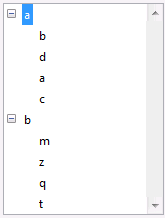
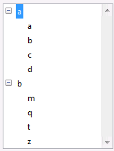
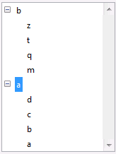

<!--REF #_command_.SORT LIST.Syntax-->**SORT LIST** ( *lista* {; > ou <} )<!-- END REF-->
<!--REF #_command_.SORT LIST.Params-->
| Parámetro | Tipo |  | Descripción |
| --- | --- | --- | --- |
| lista | Integer | &#8594;  | Número de referencia de lista |
| > ou < | Operador | &#8594;  | Criterio de ordenación: > ordenar en orden ascendente, u < ordenar en orden descendente |

<!-- END REF-->

*Este comando no es hilo seguro, no puede ser utilizado en código apropiativo.*


#### Descripción 

<!--REF #_command_.SORT LIST.Summary-->El comando SORT LIST ordena la lista cuyo número de referencia se pasa en *lista*.<!-- END REF-->

Para ordenar en orden ascendente, pase *\>*. Para ordenar en orden descendente, pase <. Si omite el parámetro de criterio de ordenación, SORT LIST ordena por defecto en orden ascendente. 

SORT LIST ordena todos los niveles de la lista; primero ordena los elementos de la lista, luego ordena los elementos en cada sublista (si hay), etc., a través de todos los niveles de la lista. Esta es la razón por la cual usted generalmente aplicará SORT LIST a una lista en un formulario. La ordenación de una sublista no es de mucho interés porque el orden cambiará por una llamada a un nivel superior.

SORT LIST no cambia el estado actual de la lista y de las eventuales sublistas desplegado/contraído, ni del elemento actual. Sin embargo, como el elemento actual puede ser movido por la operación de ordenación, [Selected list items](selected-list-items.md "Selected list items") podría devolver una posición diferente antes y después de la ordenación.

#### Ejemplo 

Dada la lista llamada *hList,* mostrada aquí en el entorno Aplicación:



 Después de la ejecución de este código:

```4d
  // Ordenar la lista y sublistas en orden ascendente
 SORT LIST(hList;>)
```

La lista se verá así:



Después de la ejecución de este código:

```4d
  // Ordenar la lista y sus sublistas en orden decreciente
 SORT LIST(hList;<)
 REDRAW LIST(hList) // NO olvide llamar REDRAW LIST de lo contrario la lista no se actualizará
```

La lista se ve de esta forma:



#### Ver también 

[Selected list items](selected-list-items.md)  