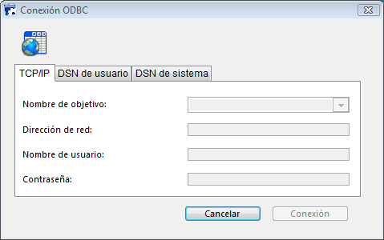

<!--REF #_command_.SQL LOGIN.Syntax-->**SQL LOGIN** {( *entradaDatos* ; *nomUsuario* ; *contraseña* ; * )}<!-- END REF-->
<!--REF #_command_.SQL LOGIN.Params-->
| Parámetro | Tipo |  | Descripción |
| --- | --- | --- | --- |
| entradaDatos | Text | &#8594;  | Nombre de publicación de base 4D o <br/>Dirección IP de la base remota o <br/>Nombre de la fuente de datos en el administrador ODBC o<br/>"" para mostrar el diálogo de selección |
| nomUsuario | Text | &#8594;  | Nombre del usuario registrado en la fuente de datos |
| contraseña | Text | &#8594;  | Contraseña del usuario registrado en la fuente de datos |
| * | Operador | &#8594;  | Aplicado a Begin SQL/End SQL Si se omite: no aplicar (base de datos local); si se pasa: aplicar |

<!-- END REF-->

#### Descripción 

<!--REF #_command_.SQL LOGIN.Summary-->El comando **SQL LOGIN** permite conectarse a una fuente de datos SQL especificada en el parámetro *entradaDatos* y designa el objetivo de las búsquedas SQL ejecutadas posteriormente en el proceso actual: 

* vía el comando [SQL EXECUTE](sql-execute.md),
* vía el código ubicado dentro de las etiquetas Begin SQL / End SQL (si se pasa el parámetro *\**).<!-- END REF-->

La fuente de datos SQL puede ser:

* una base 4D Server externa a la que acceda directamente,
* una fuente ODBC externa,
* la base 4D local (base interna).

En *entradaDatos*, puede pasar uno de los siguientes valores: una dirección IP, un nombre de publicación de base 4D, un nombre de fuente de datos ODBC, una cadena vacía o la constante SQL\_INTERNAL. 

* **Dirección IP**  
Sintaxis: **IP:<Dirección IP>{:<Puerto TCP>}**  
En este caso, el comando abre una conexión directa con la base 4D Server ejecutada en la máquina con la dirección IP definida. En la máquina "objetivo", debe iniciarse el servidor SQL. Si pasa un número de puerto TCP, debe haber sido especificado como puerto de publicación del servidor SQL en la base "objetivo". Si no pasa el número de puerto TCP, se utilizará el número de puerto por defecto (19812). El número de puerto TCP del servidor SQL puede modificarse en la página "SQL" de las Propiedades de la base. Consulte los ejemplos 4 y 5.  
Si activa el TLS para el servidor SQL "objetivo" (opción disponible en las Propiedades de la base), debe añadir la palabra clave ":ssl" al final de la dirección IP y el número de puerto TCP (obligatorio en ese caso) para que el servidor pueda manejar la petición correctamente (ver el ejemplo 6).
* **Nombre de la publicación de base 4D**  
Sintaxis: 4D:<Nombre\_de\_Publicación>  
En este caso, el comando abre una conexión directa con la base 4D Server cuyo nombre de publicación en la red corresponde al nombre especificado. El nombre de la publicación de red de una base se define en la página "Cliente-Servidor/Configuración" de las Propiedades de la base.  
Consulte el ejemplo 4.  
**Nota:** el número de puerto TCP del servidor SQL 4D objetivo (que publica la base 4D) y el número de puerto TCP del servidor SQL de la aplicación 4D que abre la conexión deben ser idénticos.
* **nombre de fuente de datos ODBC válida**  
Sintaxis: **ODBC:<Mi\_DSN> o <Mi\_DSN>**  
En este caso, el parámetro *entradaDatos* contiene el nombre de la fuente de datos como ha sido definida en el administrador del driver ODBC.  
**Notas:**
* * Por razones de compatibilidad con las versiones anteriores de 4D, es posible omitir el prefijo "ODBC:". Sin embargo, por razones de legibilidad del código, se recomienda utilizar este prefijo. Consulte el ejemplo 2.  
   * En Windows, el nombre de la fuente de datos distingue entre mayúsculas y minúsculas. Por ejemplo, si la fuente de datos se definió como "4D\_v16", pasar el valor "4D\_V16" fallará.  
   * En Windows y Mac, el prefijo "ODBC:" debe introducirse con letras mayúsculas. Si pasa "odbc:", la conexión fallará.
* **cadena vacía**  
Sintaxis: *""*  
En este caso, el comando muestra la caja de diálogo de conexión de manera que la fuente de datos a conectar pueda introducirse manualmente:  
    
  
    
Esta caja de diálogo incluye varias páginas. La página TCP/IP incluye los siguientes elementos:  
   * Nombre de objetivo: este menú se crea utilizando dos listas:  
   * * la lista de bases abiertas recientemente en conexión directa. El mecanismo para actualizar esta lista es idéntico al de la aplicación 4D, excepto que la carpeta que contiene los archivos .4DLink se llama "Favorites SQL vXX" en lugar de "Favorites vXX".  
         * la lista de aplicaciones 4D Server cuyo servidor SQL se inicia y cuyo puerto TCP para las conexiones SQL es el mismo que para la aplicación fuente. Esta lista se actualiza dinámicamente en cada nueva llamada al comando **SQL LOGIN** sin el parámetro *entradaDatos*. Si el carácter "^" se ubica antes de un nombre de la base, indica que la conexión se efectúo en modo seguro vía TLS.  
   * Dirección de red: esta área muestra la dirección y posiblemente el puerto TCP de la base seleccionada en el menú Nombre de objetivo. También puede introducir una dirección IP en esta área y luego hacer clic en el botón de conexión para conectar la base 4D Server correspondiente. También puede especificar el puerto TCP introduciendo dos puntos (:) seguidos por el número de puerto después de la dirección. Por ejemplo: 192.168.93.105:19855  
   * Nombre de usuario y Contraseña: estas áreas pueden utilizarse para introducir los identificadores de conexión.  
   * Las páginas DSN de usuario y DSN de sistema muestran, respectivamente, la lista de usuario y fuentes de datos ODBC del sistema en el driver ODBC de la máquina. Estas páginas pueden utilizarse para seleccionar una fuente de datos e introducir identificadores para abrir una conexión con una fuente de datos externa ODBC.  
    
Si se establece la conexión, la variable sistema OK toma el valor 1\. De lo contrario, toma el valor 0 y se genera un error. Este error puede interceptarse vía un método de gestión de errores instalado por el comando [ON ERR CALL](on-err-call.md).
* **Constante SQL\_INTERNAL**  
Sintaxis: SQL\_INTERNAL  
En este caso, el comando redirecciona las búsquedas SQL posteriores a la base 4D interna.

**Atención:** los prefijos utilizados en el parámetro *entradaDatos* (IP, ODBC, 4D) deben escribirse en mayúsculas. 

*nombreUsuario* contiene el nombre del usuario autorizado a conectarse a la fuente de datos externa. Por ejemplo, con Oracle®, el nombre de usuario puede ser “Samuel”.

*contraseña* contiene la contraseña del usuario autorizado a conectarse a la fuente de datos externos. Por ejemplo, conOracle®, la contraseña puede ser “tiger”.

**Nota:** en el caso de una conexión directa, si pasa una cadena vacía en los parámetros *nombreUsuario* y *contraseña*, la conexión sólo se aceptará si las contraseñas 4D no están activas en la base objetivo. De lo contrario, la conexión se rechazará. 

El parámetro opcional *\** puede utilizarse para cambiar el objetivo del código SQL ejecutado dentro de las etiquetas Begin SQL/End SQL. Si no pasa este parámetro, el código ubicado dentro de las etiquetas Begin SQL/End SQL aún se enviará al motor SQL interno de 4D, sin tener en cuenta la configuración especificada por el comando **SQL LOGIN** . Si pasa este parámetro, el código SQL ejecutado dentro de las etiquetas Begin SQL/End SQL se enviará a la fuente especificada en el parámetro *entradaDatos*. 

Para cerrar la conexión actual y liberar la memoria, simplemente ejecute el comando [SQL LOGOUT](sql-logout.md). Todas las búsquedas SQL se envían a la base 4D SQL interna.   
Si llama nuevamente a **SQL LOGIN**  sin haber cerrado explícitamente la conexión actual, la conexión se cerrará automáticamente. 

**Nota:** en caso de falla de un intento de conexión externa vía **SQL LOGIN**, la base 4D interna se convierte automáticamente en la fuente de datos actual.

Estos parámetros son opcionales; si no se pasa ningún parámetro, el comando produce la visualización de la caja de diálogo Seleccionar origen de datos ODBC, que le permite seleccionar la fuente de datos externos: 

El alcance de este comando es el proceso; en otras palabras, si quiere ejecutar dos conexiones distintas, debe crear dos procesos y ejecutar cada conexión en cada proceso. 

**Atención:** no es posible abrir una conexión ODBC en el contexto descrito abajo. Estas configuraciones conllevan al bloqueo de la aplicación:

* conexión vía ODBC desde la aplicación en ejecución hacia ella misma
* conexión vía ODBC desde una aplicación 4D a 4D Server cuando una conexión cliente/servidor clásica ya está abierta entre estas dos aplicaciones.

#### Ejemplo 1 

Esta instrucción provoca la visualización de la caja de diálogo Seleccionar origen de datos ODBC: 

```4d
 SQL LOGIN
```

#### Ejemplo 2 

Apertura de una conexión vía el protocolo ODBC con la fuente de datos externa "MyOracle". Las búsquedas SQL ejecutadas vía el comando [SQL EXECUTE](sql-execute.md "SQL EXECUTE") y búsquedas incluidas dentro de las etiquetas [Begin SQL](begin-sql.md "Begin SQL")/[End SQL](end-sql.md "End SQL") se redireccionará para esta conexión. Esta instrucción conectará la fuente de datos ODBC llamada “MyOracle” utilizando Scott/tiger como nombre/contraseña: 

```4d
 SQL LOGIN("ODBC:MyOracle";"Scott";"tiger";*)
```

#### Ejemplo 3 

Apertura de una conexión con el motor SQL interno de 4D:

```4d
 SQL LOGIN(SQL_INTERNAL;$user;$password)
```

#### Ejemplo 4 

Apertura de una conexión directa con la aplicación 4D Server ejecutada en la máquina con la dirección IP 192.168.45.34 y respondiendo en el puerto TCP por defecto. Las búsquedas SQL ejecutadas vía el comando [SQL EXECUTE](sql-execute.md "SQL EXECUTE") se redireccionan a esta conexión; las búsquedas incluidas dentro de las etiquetas [Begin SQL](begin-sql.md "Begin SQL")/[End SQL](end-sql.md "End SQL") no se redireccionarán. 

```4d
 SQL LOGIN("IP:192.168.45.34";"Juan";"azerty")
```

#### Ejemplo 5 

Apertura de una conexión directa con la aplicación 4D Server ejecutada en la máquina con la dirección IP 192.168.45.34 y respondiendo al puerto TCP 20150\. Las búsquedas SQL ejecutadas vía el comando [SQL EXECUTE](sql-execute.md "SQL EXECUTE") y las búsquedas incluidas dentro de las etiquetas [Begin SQL](begin-sql.md "Begin SQL")/[End SQL](end-sql.md "End SQL") se redireccionarán a esta conexión. 

```4d
 SQL LOGIN("IP:192.168.45.34:20150";"Juan";"azerty";*)
```

#### Ejemplo 6 

Apertura de una conexión directa en SSL con la aplicación 4D Server ejecutada en la máquina con la dirección IP 192.168.45.34 y responder en el puerto TCP por defecto. Debe tener activado SSL para el servidor SQL en la aplicación 4D Server:

```4d
 SQL LOGIN("IP:192.168.45.34:19812:ssl";"Admin";"sd156") // Note the ":ssl" after of the IP address and TCP port
```

#### Ejemplo 7 

Apertura de una conexión directa con la aplicación 4D Server ejecutada en la máquina que tiene la dirección IPv6 2a01: e35:2e41:c960:dc39:3eb0:f29b:3747 y responde en el puerto TCP 20150\. Las consultas SQL ejecutadas a través del comando [SQL EXECUTE](sql-execute.md) serán redirigidas a esta conexión; Las consultas incluidas en las etiquetas [Begin SQL](begin-sql.md)/[End SQL](end-sql.md) no se redirigirán.

```4d
 SQL LOGIN("IP:[2a01:e35:2e41:c960:dc39:3eb0:f29b:3747]:20150";"John";"qwerty")
```

#### Ejemplo 8 

Apertura de una conexión directa con la aplicación 4D Server que publica en la red local una base cuyo nombre de publicación es "Accounts\_DB." El puerto TCP utilizado por el servidor SQL de ambas bases (definido en la página "SQL" de las Propiedades de la base) debe ser el mismo (19812 por defecto). Las búsquedas SQL ejecutadas vía el comando [SQL EXECUTE](sql-execute.md "SQL EXECUTE") se redireccionarán a esta conexión; las búsquedas incluidas dentro de las etiquetas [Begin SQL](begin-sql.md "Begin SQL")/[End SQL](end-sql.md "End SQL") no se redireccionarán. 

```4d
 SQL LOGIN("4D:Accounts_DB";"Juan";"azerty")
```

#### Ejemplo 9 

Este ejemplo muestra las posibilidades de conexión ofrecidas por el comando SQL LOGIN:   
  
```4d
 ARRAY TEXT(aNombres;0)
 ARRAY LONGINT(aEdades;0)SQL LOGIN("ODBC:MyORACLE";"Marc";"azerty")
 If(OK=1) //La siguiente búsqueda se redireccionará a la base de datos ORACLE externa
    SQL EXECUTE("SELECT Nombre, edad FROM PERSONS";aNombres;aEdades)
  //La siguiente búsqueda se enviará a la base de datos 4D local
    Begin SQL
       SELECT Nombre, Edad
       FROM PERSONS
       INTO :aNombres, :aEdades;
    End SQL //El siguiente comando SQL LOGIN cierra la conexión actual
  //con la base de datos ORACLE externa y abre una nueva conexión
  //con una base de datos MySQL externa
    SQL LOGIN("ODBC:MySQL";"Juan";"qwerty";*)
    If(OK=1)
  //La siguiente búsqueda será redireccionada a la base de datos MySQL externa
       SQL EXECUTE("SELECT Nombre, Edad FROM PERSONS";aNombres;aEdades)
  //La siguiente búsqueda también será redireccionada a la base de datos MySQL externa
       Begin SQL
          SELECT Nombre, Edad
          FROM PERSONS
          INTO :aNombres, :aEdades;
       End SQL
       SQL LOGOUT
  //La siguiente búsqueda se enviará a la base de datos 4D local
       Begin SQL
          SELECT Nombre, Edad
          FROM PERSONS
          INTO :aNombres, :aEdades;
       End SQL
    End if
 End if
```

#### Variables y conjuntos del sistema 

Si la conexión es exitosa, el variable sistema OK toma el valor 1; de lo contrario, toma el valor 0\. 

#### Ver también 

[Begin SQL](begin-sql.md)  
[End SQL](end-sql.md)  
[SQL LOGOUT](sql-logout.md)  

#### Propiedades
|  |  |
| --- | --- |
| Número de comando | 817 |
| Hilo seguro | &check; |
| Modifica variables | OK |
| Prohibido en el servidor ||


