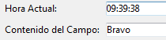
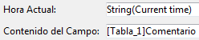

<!--REF #_command_.ST SET OPTIONS.Syntax-->**ST SET OPTIONS** ( {* ;} *objeto* ; *opcion* ; *valor* {; *opcion2* ; *valor2* ; ... ; *opcionN* ; *valorN*} )<!-- END REF-->
<!--REF #_command_.ST SET OPTIONS.Params-->
| Parámetro | Tipo |  | Descripción |
| --- | --- | --- | --- |
| * | Operador | &#8594;  | Si se especifica, objeto es un nombre de objeto (cadena)<br/>Si se omite, objeto es un campo o una variable |
| objeto | any | &#8594;  | Nombre del objeto (si se especifica *) o<br/>Campo o variable (si se omite *) |
| opcion | Integer | &#8594;  | Opción a definir |
| valor | Integer | &#8594;  | Nuevo valor de la opción |

<!-- END REF-->

#### Descripción 

<!--REF #_command_.ST SET OPTIONS.Summary-->El comando **ST SET OPTIONS** modifica una o varias opciones de funcionamiento del campo o de la variable de texto con estilo designada por el parámetro *objeto* .<!-- END REF-->  
  
Si pasa el parámetro opcional *\** indica que el parámetro *objeto* es un nombre de objeto (cadena). Si no pasa este parámetro, indica que el parámetro *objeto* es un campo o una variable. En este caso, se pasa una referencia de campo o variable en lugar de una cadena (campo o variable objeto únicamente).  
  
Pase el código de la opción a modificar en *opcion* y su nuevo *valor* en *valor*. 

El parámetro *opcion* soporta la siguiente constante del tema "*Texto multiestilo*":  
  
| Constante                   | Tipo         | Valor | Comentario                                                                              |
| --------------------------- | ------------ | ----- | --------------------------------------------------------------------------------------- |
| ST Expressions display mode | Entero largo | 1     | El parámetro *valor* puede contener ST Values o ST References<br/><br/> |

En el parámetro *valor*, puede pasar una de las siguientes constantes:

| Constante     | Tipo         | Valor | Comentario                                        |
| ------------- | ------------ | ----- | ------------------------------------------------- |
| ST References | Entero largo | 1     | Muestra las cadenas fuente de las expresiones     |
| ST Values     | Entero largo | 0     | Muestra los valores calculados de las expresiones |

Visualización de los valores:



Visualización de las expresiones:



#### Ejemplo 

El siguiente código permite cambiar el modo de visualización del área:

```4d
 ST GET OPTIONS(*;"StyledText_t";ST Expressions display mode;$exprValue)
 If($exprValue=1)
    ST SET OPTIONS(*;"StyledText_t";ST Expressions display mode;ST Values)
 Else
    ST SET OPTIONS(*;"StyledText_t";ST Expressions display mode;ST References)
 End if
```

#### Ver también 

[ST GET OPTIONS](st-get-options.md)  

#### Propiedades
|  |  |
| --- | --- |
| Número de comando | 1289 |
| Hilo seguro | &check; |
| Prohibido en el servidor ||


