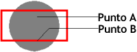

<!--REF #_command_.SVG Find element ID by coordinates.Syntax-->**SVG Find element ID by coordinates** ( {* ;} *objetoImagen* ; *x* ; *y* ) : Text<!-- END REF-->
<!--REF #_command_.SVG Find element ID by coordinates.Params-->
| Parámetro | Tipo |  | Descripción |
| --- | --- | --- | --- |
| * | Operador | &#8594;  | Si se especifica, pictureObject es un nombre de objeto (cadena) Si se omite, pictureObject es un campo o variable |
| objetoPicture | Picture | &#8594;  | Nombre de objeto (si se especifica *) o Campo o variable (si se omite *) |
| x | Integer | &#8594;  | X coordenada en píxeles |
| y | Integer | &#8594;  | Y coordenada en píxeles |
| Resultado | Text | &#8592; | ID del elemento encontrado en la ubicación X,Y |

<!-- END REF-->

*Este comando no es hilo seguro, no puede ser utilizado en código apropiativo.*

#### Descripción 

<!--REF #_command_.SVG Find element ID by coordinates.Summary-->El comando SVG Find element ID by coordinates devuelve la identificación ("id" o atributo "xml:id") del elemento XML encontrado en la ubicación definida por las coordenadas (x,y) en la imagen SVG designada por el parámetro *objetoImagen*.<!-- END REF--> Este comando puede utilizarse particularmente para crear interfaces gráficas interactivas utilizando objetos SVG.

**Nota:** para mayor información sobre el formato SVG, por favor consulte la sección *Presentación de los comandos XML utilitarios* .

Si pasa el parámetro opcional *\**, indique que el parámetro *pictureObject* es un nombre de objeto (cadena). Si no pasa este parámetro, indique que el parámetro *pictureObject* es un campo o variable. En este caso, no pase una cadena sino una referencia de campo o variable (campo o variable objeto únicamente). 

Note que no es obligatorio para la imagen a mostrar en un formulario. En este caso, la sintaxis de tipo "object name" no es válida y debe pasar un nombre de campo o variable.

Las coordenadas pasadas en los parámetros *x* y *y* deben estar expresadas en píxeles relativos a la esquina superior izquierda de la imagen (0,0). En el contexto de una imagen mostrada en un formulario, puede utilizar los valores devueltos por las variables sistema MouseX y MouseY. Estas variables son actualizadas en los eventos formulario On Clicked, On Double Clicked y On Mouse Up, como también en los eventos de formulario On Mouse Enter y On Mouse Move. 

**Nota:** en el sistema de coordenadas de la imagen, \[x;y\] siempre especifica el mismo punto, sin importar el formato de visualización de la imagen, excepto en el caso del formato "Replicated".

El punto que se tiene en cuenta es el primer punto alcanzado. Por ejemplo, en el siguiente caso, el comando devolverá la identificación del círculo si las coordenadas del punto A se pasan y la del rectángulo si las coordenadas del punto B se pasan:

  
Cuando las coordenadas corresponden a un objeto superpuesto o compuesto, el comando devuelve la identificación del primero objeto con un identificador de atributo válido, si es necesario, entre los elementos padre.

El comando devuelve una cadena vacía si:

* la raíz se alcanza sin encontrar un atributo "id",
* el punto de coordenadas no pertenece a ningún objeto,
* el atributo "id" es una cadena vacía.
**Nota:** este comando no puede detectar objetos cuyo valor de opacida (atributo "fill-opacity") sea inferior a 0.01.

#### Variables y conjuntos del sistema 

Si *objetoImagen* no contiene una imagen SVG válida, el comando devuelve una cadena vacía y la variable sistema OK toma el valor 0\. De lo contrario, si el comando se ejecuta correctamente, la variable sistema OK toma el valor 1\. 

#### Ver también 

[SVG Find element IDs by rect](svg-find-element-ids-by-rect.md)  