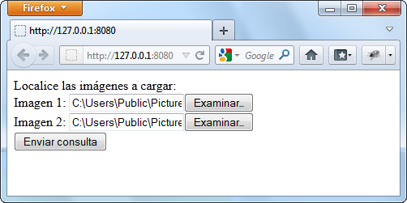

<!--REF #_command_.WEB GET BODY PART.Syntax-->**WEB GET BODY PART** ( *parte* ; *contenido* ; *nombre* ; *tipoMime* ; *nomArchivo* )<!-- END REF-->
<!--REF #_command_.WEB GET BODY PART.Params-->
| Parámetro | Tipo |  | Descripción |
| --- | --- | --- | --- |
| parte | Integer | &#8594;  | Número de parte |
| contenido | Blob, Text | &#8592; | Contenido de la parte |
| nombre | Text | &#8592; | Nombre de la variable "input" |
| tipoMime | Text | &#8592; | Tipo mime del archivo |
| nomArchivo | Text | &#8592; | Nombre del archivo enviado |

<!-- END REF-->

#### Descripción 

<!--REF #_command_.WEB GET BODY PART.Summary-->El comando **WEB GET BODY PART** llamado en el contexto de un proceso web, permite analizar la parte "body" de una petición multi-part.<!-- END REF-->  
  
En el parámetro *parte*, pase el número de la parte a analizar. Puede obtener el número total de partes con el comando [WEB Get body part count](web-get-body-part-count.md).  
  
El parámetro *contenido* recibe el contenido de la parte. Cuando las partes a recuperar son archivos, debe pasar un parámetro de tipo BLOB. En el caso de variables TEXTO enviadas en un formulario web, puede pasar un parámetro de tipo texto.   
  
El parámetro *nombre* recupera el nombre de la variable del campo input HTTP.  
  
Los parámetros *tipoMime* y *nomArchivo* reciben el tipo Mime y el nombre del archivo original, si lo hay. nomArchivo solo se recibe cuando el archivo se envio como **<input type="file">**.  
*tipoMime* y *nomArchivo* son opcionales pero deben pasarse juntos.  
  
**Nota**: en el contexto de una petición multi-part, el primer de array del comando [WEB GET VARIABLES](web-get-variables.md) devuelve todas las partes del formulario, en el mismo orden que el comando **WEB GET BODY PART**. Puede utilizarlo para obtener directamente la posición de una parte de un formulario. 

#### Ejemplo 

En este ejemplo, un formulario web permite descargar en el servidor HTTP varias imágenes desde un navegador y mostrarlas en la página. Este es el formulario web:



Este es el código para la parte <body> de la página:

```HTML
<body>
        <form enctype="multipart/form-data" action="/4DACTION/GetFile/" method="post">
            Localice las imágenes a cargar: <br>
            Imagen 1: <input name="file1" type="file"><br>
            Imagen 2: <input name="file2" type="file"><br>
            <input type="submit">                   
        </form>    
        <hr/>
    <!--4DSCRIPT/galleryInit-->
    <!--4Dloop aFileNames-->
        "/>
    <!--4Dendloop-->
</body>
```

Dos métodos 4D son llamados por la página:

* galleryInit al cargar (etiqueta 4DSCRIPT), muestra las imágenes presentes en la carpeta de destino.
* GetFile al enviar los datos (4DACTION URL del formulario multi-part), procesa el envío.

Este es el código del método galleryInit:

```4d
 var $vDestinationFolder : Text
 ARRAY TEXT(aFileNames;0)
 var $i : Integer
 $vDestinationFolder:=Get 4D folder(HTML Root folder)+"photos"+Folder separator //Carpeta "WebFolder/photos"
 DOCUMENT LIST($vDestinationFolder;aFileNames)
```

Este es el código del método GetFile:

```4d
 var $vPartName;$vPartMimeType;$vPartFileName;$vDestinationFolder : Text
 var $vPartContentBlob : Blob
 var $i : Integer
 $vDestinationFolder:=Get 4D folder(HTML Root folder)+"photos"+Folder separator
 For($i;1;WEB Get body part count) //para cada parte
    WEB GET BODY PART($i;$vPartContentBlob;$vPartName;$vPartMimeType;$vPartFileName)
    If($vPartFileName#"")
       BLOB TO DOCUMENT($vDestinationFolder+$vPartFileName;$vPartContentBlob)
    End if
 End for
 WEB SEND HTTP REDIRECT("/") // volver a la página
```

#### Ver también 

[WEB Get body part count](web-get-body-part-count.md)  
[WEB GET HTTP BODY](web-get-http-body.md)  
[WEB GET VARIABLES](web-get-variables.md)  

#### Propiedades

|  |  |
| --- | --- |
| Número de comando | 1212 |
| Hilo seguro | &check; |


