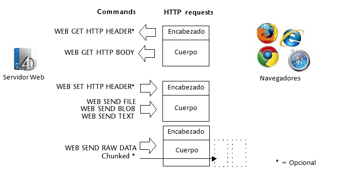

<!--REF #_command_.WEB SEND RAW DATA.Syntax-->**WEB SEND RAW DATA** ( *datos* {; *} )<!-- END REF-->
<!--REF #_command_.WEB SEND RAW DATA.Params-->
| Parámetro | Tipo |  | Descripción |
| --- | --- | --- | --- |
| datos | Blob | &#8594;  | Datos HTTP a enviar |
| * | Operador | &#8594;  | Envío en trozos (chunked) |

<!-- END REF-->

#### Descripción 

<!--REF #_command_.WEB SEND RAW DATA.Summary-->El comando **WEB SEND RAW DATA** permite al servidor web 4D enviar datos HTTP "brutos", los cuales pueden estar en trozos.<!-- END REF--> 

El parámetro *datos* contiene las dos partes estándar de una respuesta HTTP, es decir el encabezado y el cuerpo. Los datos son enviados sin formato previo por el servidor. Sin embargo, 4D efectúa un control básico sobre el encabezado y el cuerpo de la respuesta con el fin de asegurarse de que sean válidos:   
  
• Si el encabezado está incompleto o no cumple con las especificaciones del protocolo HTTP, 4D lo modifica como corresponde.  
• Si la petición HTTP está incompleta, 4D añade la información faltante. Si por ejemplo quiere efectuar una redirección, debe escribir:

```HTML
   HTTP/1.1 302
   Location: http://...
```

Si sólo pasa:

```HTML
   Location: http://...
```

4D completará la petición añadiendo *HTTP/1.1 302*. 

El parámetro opcional *\** permite especificar que la respuesta se enviará “troceada”. El corte de las respuestas puede ser útil cuando el servidor envía una respuesta sin conocer su longitud total (si, por ejemplo, la respuesta todavía no ha sido generada). Todos los navegadores compatibles HTTP/1.1-aceptan las respuestas troceadas.

Si pasa el parámetro *\**, el servidor web incluirá automáticamente el campo *transfer-encoding: chunked* en el encabezado de la respuesta, si es necesario (puede manejar manualmente el encabezado de la respuesta, si así lo prefiere). El resto de la respuesta también será formateada para respetar la sintaxis de la opción chunked. Las respuestas troceadas contienen un solo encabezado y un número indefinido de cuerpos.  
  
Todas las instrucciones **WEB SEND RAW DATA** que sigan la ejecución de **WEB SEND RAW DATA**(data;\*) dentro del mismo método serán consideradas como parte de la respuesta (sin importar si contienen el parámetro *\**). El servidor coloca fin al envío troceado cuando termina la ejecución del método.

**Nota:** si el cliente web no soporta el protocolo HTTP/1.1, 4D convertirá automáticamente la respuesta al formato compatible HTTP/1.0 (el envío no troceará). Sin embargo, en este caso, el resultado puede no corresponder a sus deseos. Por lo tanto se recomienda probar si el navegador web soporta HTTP/1.1 y enviar una respuesta apropiada. Para hacer esto, puede utilizar un método de este tipo: 

```4d
 var $0 : Boolean
 ARRAY TEXT(arCampos;0)
 ARRAY TEXT(arValores;0)
 WEB GET HTTP HEADER(arCampos;arValores)
 $0:=False
 If(Size of array(arValores)>=3)
    If(Position("HTTP/1.1";arValores{3})>0)
       $0:=True // El navegador soporta HTTP/1.1; devuelve True en $0
    End if
 End if
```

Combinado con el comando [WEB GET HTTP BODY](web-get-http-body.md) y con los otros comandos del tema “Servidor web”, este comando completa el rango de herramientas disponibles para los desarrolladores 4D para tratar de manera completamente personalizada las conexiones HTTP entrantes y salientes. Estas herramientas se presentan en el siguiente diagrama: 



#### Ejemplo 

Este ejemplo ilustra el uso de la opción chunked con el comando **WEB SEND RAW DATA**. Los datos (una secuencia de números) se envían en 100 trozos generados rápidamente un bucle. Recuerde que el encabezado de la respuesta no está definido explícitamente: el comando lo enviará automáticamente e insertará el campo *transfer-encoding: chunked* en él si el parámetro *\** se utiliza.

```4d
 var $cpt : Integer
 var $mi_blob : Blob
 var $salida : Text
 
 For($cpt;1;100)
    $salida:="["+String($cpt)+"]"
    TEXT TO BLOB($salida;$mi_blob;UTF8 text without length)
    WEB SEND RAW DATA($mi_blob;*)
 End for
```

#### Ver también 

[WEB GET HTTP BODY](web-get-http-body.md)  
[WEB GET HTTP HEADER](web-get-http-header.md)  

#### Propiedades

|  |  |
| --- | --- |
| Número de comando | 815 |
| Hilo seguro | &check; |


