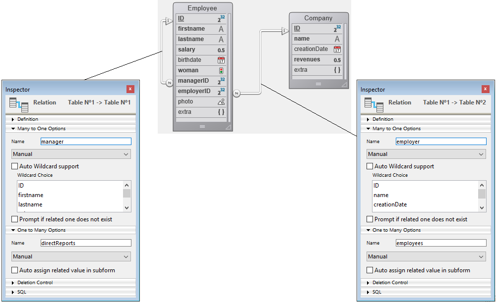

Una [entidad](ORDA/dsMapping.md#entity) es una instancia de una [Dataclass](ORDA/dsMapping.md#dataclass), como un registro de la tabla que coincide con la dataclass en su datastore asociado. Contiene los mismos atributos que la clase de datos, así como los valores de los datos y las propiedades y funciones específicas.

### Resumen

|                                                                                                                                                                         |
| ----------------------------------------------------------------------------------------------------------------------------------------------------------------------- |
| [<!-- INCLUDE EntityClass.attributeName.Syntax -->](#attributename)<br/><!-- INCLUDE EntityClass.attributeName.Summary -->                                              |
| [<!-- INCLUDE #EntityClass.clone().Syntax -->](#clone)<br/><!-- INCLUDE #EntityClass.clone().Summary -->                                                                |
| [<!-- INCLUDE #EntityClass.diff().Syntax -->](#diff)<br/><!-- INCLUDE #EntityClass.diff().Summary -->                                                                   |
| [<!-- INCLUDE #EntityClass.drop().Syntax -->](#drop)<br/><!-- INCLUDE #EntityClass.drop().Summary -->                                                                   |
| [<!-- INCLUDE #EntityClass.first().Syntax -->](#first)<br/><!-- INCLUDE #EntityClass.first().Summary -->                                                                |
| [<!-- INCLUDE #EntityClass.fromObject().Syntax -->](#fromobject)<br/><!-- INCLUDE #EntityClass.fromObject().Summary -->                                                 |
| [<!-- INCLUDE #EntityClass.getDataClass().Syntax -->](#getdataclass)<br/><!-- INCLUDE #EntityClass.getDataClass().Summary -->                                           |
| [<!-- INCLUDE #EntityClass.getKey().Syntax -->](#getkey)<br/><!-- INCLUDE #EntityClass.getKey().Summary -->                                                             |
| [<!-- INCLUDE #EntityClass.getRemoteContextAttributes().Syntax -->](#getremotecontextattributes)<br/><!-- INCLUDE #EntityClass.getRemoteContextAttributes().Summary --> |
| [<!-- INCLUDE #EntityClass.getSelection().Syntax -->](#getselection)<br/><!-- INCLUDE #EntityClass.getSelection().Summary -->                                           |
| [<!-- INCLUDE #EntityClass.getStamp().Syntax -->](#getstamp)<br/><!-- INCLUDE #EntityClass.getStamp().Summary -->                                                       |
| [<!-- INCLUDE #EntityClass.indexOf().Syntax -->](#indexof)<br/><!-- INCLUDE #EntityClass.indexOf().Summary -->                                                          |
| [<!-- INCLUDE #EntityClass.isNew().Syntax -->](#isnew)<br/><!-- INCLUDE #EntityClass.isNew().Summary -->                                                                |
| [<!-- INCLUDE #EntityClass.last().Syntax -->](#last)<br/><!-- INCLUDE #EntityClass.last().Summary -->                                                                   |
| [<!-- INCLUDE #EntityClass.lock().Syntax -->](#lock)<br/><!-- INCLUDE #EntityClass.lock().Summary -->                                                                   |
| [<!-- INCLUDE #EntityClass.next().Syntax -->](#next)<br/><!-- INCLUDE #EntityClass.next().Summary -->                                                                   |
| [<!-- INCLUDE #EntityClass.previous().Syntax -->](#previous)<br/><!-- INCLUDE #EntityClass.previous().Summary -->                                                       |
| [<!-- INCLUDE #EntityClass.reload().Syntax -->](#reload)<br/><!-- INCLUDE #EntityClass.reload().Summary -->                                                             |
| [<!-- INCLUDE #EntityClass.save().Syntax -->](#save)<br/><!-- INCLUDE #EntityClass.save().Summary -->                                                                   |
| [<!-- INCLUDE #EntityClass.toObject().Syntax -->](#toobject)<br/><!-- INCLUDE #EntityClass.toObject().Summary -->                                                       |
| [<!-- INCLUDE #EntityClass.touched().Syntax -->](#touched)<br/><!-- INCLUDE #EntityClass.touched().Summary -->                                                          |
| [<!-- INCLUDE #EntityClass.touchedAttributes().Syntax -->](#touchedattributes)<br/><!-- INCLUDE #EntityClass.touchedAttributes().Summary -->                            |
| [<!-- INCLUDE #EntityClass.unlock().Syntax -->](#unlock)<br/><!-- INCLUDE #EntityClass.unlock().Summary -->                                                             |

<!-- REF EntityClass.attributeName.Desc -->

## .*attributeName*

<details><summary>Historia</summary>

| Lanzamiento | Modificaciones |
| ----------- | -------------- |
| 17          | Añadidos       |

</details>

<!-- REF EntityClass.attributeName.Syntax -->***.attributeName*** : any<!-- END REF -->

#### Descripción

Todo atributo de la dataclass está disponible como una propiedad de una entidad, que <!-- REF EntityClass.attributeName.Summary --> almacena el valor del atributo para la entidad<!-- END REF -->.

> Los atributos dataclass también se pueden alcanzar utilizando la sintaxis alternativa con \[ ].

El tipo de valor del atributo depende del tipo [kind](DataClassClass.md#attributename) (relation o storage):

- Si el tipo de *attributeName* es **storage**:
 `.attributeName` devuelve un valor del mismo tipo que *attributeName*.
- Si el tipo de *attributeName* es **relatedEntity**:
 `.attributeName` devuelve la entidad relacionada. Los valores de la entidad relacionada están disponibles directamente a través de las propiedades en cascada, por ejemplo "myEntity.employer.employees\[0].lastname".
- Si el tipo *attributeName* es **relatedEnties**:
 `.attributeName` devuelve una nueva selección de entidades relacionadas. Se eliminan los duplicados (se devuelve una entity selection desordenada).

#### Ejemplo

```4d
 var $myEntity : cs.EmployeeEntity
 $myEntity:=ds.Employee.new() //Crear una nueva entidad
 $myEntity.name:="Dupont" // asignar 'Dupont' al atributo 'name'
 $myEntity.firstname:="John" //asignar 'John' al atributo 'firstname'
 $myEntity.save() //guardar la entidad
```

<!-- END REF -->

<!-- REF EntityClass.clone().Desc -->

## .clone()

<details><summary>Historia</summary>

| Lanzamiento | Modificaciones |
| ----------- | -------------- |
| 17          | Añadidos       |

</details>

<!-- REF #EntityClass.clone().Syntax -->**.clone()** : 4D.Entity<!-- END REF -->

<!-- REF #EntityClass.clone().Params -->

| Parámetros | Tipo                      |                             | Descripción                                   |
| ---------- | ------------------------- | :-------------------------: | --------------------------------------------- |
| Resultado  | 4D.Entity | <- | Nueva entidad que hace referencia al registro |

<!-- END REF -->

#### Descripción

La función `.clone()` <!-- REF #EntityClass.clone().Summary -->crea en la memoria una nueva entidad que hace referencia al mismo registro que la entidad original<!-- END REF -->.

Esta función permite actualizar las entidades por separado. Note however that, for performance reasons, the new entity shares the same reference of object attributes as the cloned entity.

> Tenga en cuenta que toda modificación realizada a las entidades se guardará en el registro referenciado sólo cuando se ejecute la función [`.save()`](#save).

Esta función sólo puede utilizarse con entidades ya guardadas en la base de datos. No se puede llamar a una entidad recién creada (para la que [`isNew()`](#isnew) devuelve **True**).

#### Ejemplo

```4d
 var $emp; $empCloned : cs.EmployeeEntity
 $emp:=ds.Employee.get(672)
 $empCloned:=$emp.clone()

 $emp.lastName:="Smith" //Las actualizaciones realizadas en $emp no se realizan en $empCloned

```

<!-- END REF -->

<!-- REF EntityClass.diff().Desc -->

## .diff()

<details><summary>Historia</summary>

| Lanzamiento | Modificaciones |
| ----------- | -------------- |
| 17          | Añadidos       |

</details>

<!-- REF #EntityClass.diff().Syntax -->**.diff**( *entityToCompare* : 4D.Entity { ; *attributesToCompare* : Collection } ) : Collection<!-- END REF -->

<!-- REF #EntityClass.diff().Params -->

| Parámetros          | Tipo                      |                             | Descripción                                |
| ------------------- | ------------------------- | :-------------------------: | ------------------------------------------ |
| entityToCompare     | 4D.Entity |              ->             | Entidad a comparar con la entidad original |
| attributesToCompare | Collection                |              ->             | Nombre de los atributos a comparar         |
| Resultado           | Collection                | <- | Diferencias entre las entidades            |

<!-- END REF -->

#### Descripción

La función `.diff()` <!-- REF #EntityClass.diff().Summary -->compara el contenido de dos entidades y devuelve sus diferencias<!-- END REF -->.

En *entityToCompare*, pase la entidad que se va a comparar con la entidad original.

En *attributesToCompare*, puede designar atributos específicos a comparar. Si se suministra, la comparación se realiza sólo en los atributos especificados. Si no se suministra, se devuelven todas las diferencias entre las entidades.

Las diferencias se devuelven como una colección de objetos cuyas propiedades son:

| Nombre de propiedad | Tipo                                      | Descripción                             |
| ------------------- | ----------------------------------------- | --------------------------------------- |
| attributeName       | Text                                      | Nombre del atributo                     |
| value               | cualquiera - Depende del tipo de atributo | Valor del atributo en la entidad        |
| otherValue          | cualquiera - Depende del tipo de atributo | Valor del atributo en *entityToCompare* |

Sólo se incluyen en la colección los atributos con valores diferentes. Si no se encuentran diferencias, `.diff()` devuelve una colección vacía.

La función se aplica a las propiedades cuyo [kind](DataClassClass.md#attributename) es **storage** o **relatedEntity**. En caso de que se haya actualizado una entidad relacionada (es decir, la llave foránea), el nombre de la entidad relacionada y su nombre de llave primaria se devuelven como propiedades *attributeName* (*value* y *otherValue* están vacíos para el nombre de la entidad relacionada).

Si una de las entidades comparadas es **Null**, se produce un error.

#### Ejemplo 1

```4d
 var $diff1; $diff2 : Collection
 employee:=ds.Employee.query("ID=1001").first()
 $clone:=employee.clone()
 employee.firstName:="MARIE"
 employee.lastName:="SOPHIE"
 employee.salary:=500
 $diff1:=$clone.diff(employee) // Se devuelven todas las diferencias
 $diff2:=$clone.diff(employee;New collection("firstName"; "lastName"))
  // Sólo se devuelven las diferencias en firstName y lastName
```

$diff1:

```4d
[
    {
        "attributeName": "firstName",
        "value": "Natasha",
        "otherValue": "MARIE"
    },
    {
        "attributeName": "lastName",
        "value": "Locke",
        "otherValue": "SOPHIE"
    },
    {
        "attributeName": "salary",
        "value": 66600,
        "otherValue": 500
    }
]
$diff2:

[
    {
        "attributeName": "firstName",
        "value": "Natasha",
        "otherValue": "MARIE"
    },
    {
        "attributeName": "lastName",
        "value": "Locke",
        "otherValue": "SOPHIE"
    }
]
```

#### Ejemplo 2

```4d
 var vCompareResult1; vCompareResult2; vCompareResult3; $attributesToInspect : Collection
 vCompareResult1:=New collection
 vCompareResult2:=New collection
 vCompareResult3:=New collection
 $attributesToInspect:=New collection

 $e1:=ds.Employee.get(636)
 $e2:=ds.Employee.get(636)

 $e1.firstName:=$e1.firstName+" update"
 $e1.lastName:=$e1.lastName+" update"

 $c:=ds.Company.get(117)
 $e1.employer:=$c
 $e2.salary:=100

 $attributesToInspect.push("firstName")
 $attributesToInspect.push("lastName")

 vCompareResult1:=$e1.diff($e2)
 vCompareResult2:=$e1.diff($e2;$attributesToInspect)
 vCompareResult3:=$e1.diff($e2;$e1.touchedAttributes())
```

vCompareResult3 (sólo se devuelven las diferencias en atributos tocados $e1)

```4d
[
    {
        "attributeName": "firstName",
        "value": "Karla update",
        "otherValue": "Karla"
    },
    {
        "attributeName": "lastName",
        "value": "Marrero update",
        "otherValue": "Marrero"
    },
    {
        "attributeName": "salary",
        "value": 33500,
        "otherValue": 100
    },
    {
        "attributeName": "employerID",
        "value": 117,
        "otherValue": 118
    },
  {
        "attributeName": "employer",
        "value": "[object Entity]",// Entity 117 from Company
        "otherValue": "[object Entity]"// Entity 118 from Company
    }
]
```

vCompareResult2 (sólo se devuelven las diferencias en $attributesToInspect)

```4d
[
    {
        "attributeName": "firstName",
        "value": "Karla update",
        "otherValue": "Karla"
    },
    {
        "attributeName": "lastName",
        "value": "Marrero update",
        "otherValue": "Marrero"
    }
]
```

vCompareResult1 (se devuelven todas las diferencias):

```4d
[
    {
        "attributeName": "firstName",
        "value": "Karla update",
        "otherValue": "Karla"
    },
    {
        "attributeName": "lastName",
        "value": "Marrero update",
        "otherValue": "Marrero"
    },
    {
        "attributeName": "employerID",
        "value": 117,
        "otherValue": 118
    },
     {
        "attributeName": "employer",
        "value": "[object Entity]",// Entity 117 from Company
        "otherValue": "[object Entity]"// Entity 118 from Company

    }
]
```

<!-- END REF -->

<!-- REF EntityClass.drop().Desc -->

## .drop()

<details><summary>Historia</summary>

| Lanzamiento | Modificaciones |
| ----------- | -------------- |
| 17          | Añadidos       |

</details>

<!-- REF #EntityClass.drop().Syntax -->**.drop**( {*mode* : Integer} ) : Object<!-- END REF -->

<!-- REF #EntityClass.drop().Params -->

| Parámetros | Tipo    |                             | Descripción                                                                                        |
| ---------- | ------- | :-------------------------: | -------------------------------------------------------------------------------------------------- |
| mode       | Integer |              ->             | `dk force drop if stamp changed`: activa el soltar incluso si el sello ha cambiado |
| Resultado  | Object  | <- | Resultado de la operación soltar                                                                   |

<!-- END REF -->

#### Descripción

La función `.drop()` <!-- REF #EntityClass.drop().Summary -->elimina los datos contenidos en la entidad desde el almacén de datos<!-- END REF -->, desde la tabla relacionada con su Dataclass. Tenga en cuenta que la entidad permanece en la memoria.

En una aplicación multiusuario o multiproceso, la función `.drop()` se ejecuta bajo un mecanismo ["bloqueo optimista"](ORDA/entities.md#entity-locking), en el que un sello de bloqueo interno se incrementa automáticamente cada vez que se guarda el registro.

Por defecto, si se omite el parámetro *mode*, la función devolverá un error (ver más abajo) si la misma entidad fue modificada (es decir, el sello ha cambiado) por otro proceso o usuario en el ínterin.

De lo contrario, puede pasar la opción `dk force drop if stamp changed` en el parámetro *mode*: en este caso, la entidad se elimina incluso si el marcador ha cambiado (y la llave primaria sigue siendo la misma).

**Result**

El objeto devuelto por `.drop()` contiene las siguientes propiedades:

| Propiedad                         |                                     | Tipo                  | Descripción                                                                                                                                                                                                      |
| --------------------------------- | ----------------------------------- | --------------------- | ---------------------------------------------------------------------------------------------------------------------------------------------------------------------------------------------------------------- |
| success                           |                                     | boolean               | true si la acción de soltar tiene éxito, false en caso contrario.                                                                                                                                |
|                                   |                                     |                       | ***Disponible sólo en caso de error:***                                                                                                                                                          |
| status(\*)     |                                     | number                | Código de error, ver abajo                                                                                                                                                                                       |
| statusText(\*) |                                     | text                  | Descripción del error, ver abajo                                                                                                                                                                                 |
|                                   |                                     |                       | ***Disponible sólo en caso de error de bloqueo pesimista:***                                                                                                                                     |
| LockKindText                      |                                     | text                  | "Locked by record"                                                                                                                                                                                               |
| lockInfo                          |                                     | object                | Información sobre el origen del bloqueo                                                                                                                                                                          |
|                                   | task_id        | number                | Id del proceso                                                                                                                                                                                                   |
|                                   | user_name      | text                  | Nombre de usuario de la sesión en la máquina                                                                                                                                                                     |
|                                   | user4d_alias   | text                  | Alias usuario si está definido por `SET USER ALIAS`, si no, nombre de usuario en el directorio 4D                                                                                                                |
|                                   | host_name      | text                  | Nombre de la máquina                                                                                                                                                                                             |
|                                   | task_name      | text                  | Nombre del proceso                                                                                                                                                                                               |
|                                   | client_version | text                  |                                                                                                                                                                                                                  |
|                                   |                                     |                       | ***Disponible sólo en caso de error grave (un error grave puede ser intentar duplicar una llave primaria, disco lleno...):*** |
| errors                            |                                     | collection of objects |                                                                                                                                                                                                                  |
|                                   | message                             | text                  | Mensaje de error                                                                                                                                                                                                 |
|                                   | component signature                 | text                  | firma del componente interno (por ejemplo, "dmbg" significa el componente de la base)                                                                                                         |
|                                   | errCode                             | number                | Código de error                                                                                                                                                                                                  |

(\*) Los siguientes valores pueden ser devueltos en las propiedades *status* y *statusText* del objeto *Result* en caso de error:

| Constante                                 | Valor | Comentario                                                                                                                                                                                                                                                                                                                                                                                                                                                                                                                                                                                                                                                                                                                                                                                                                                                                       |
| ----------------------------------------- | ----- | -------------------------------------------------------------------------------------------------------------------------------------------------------------------------------------------------------------------------------------------------------------------------------------------------------------------------------------------------------------------------------------------------------------------------------------------------------------------------------------------------------------------------------------------------------------------------------------------------------------------------------------------------------------------------------------------------------------------------------------------------------------------------------------------------------------------------------------------------------------------------------- |
| `dk status entity does not exist anymore` | 5     | La entidad ya no existe en los datos. Este error puede ocurrir en los siguientes casos:<br/><li>la entidad ha sido eliminada (el marcador ha cambiado y ahora el espacio de memoria está libre)</li><li>la entidad ha sido eliminada y reemplazada por otra con otra clave primaria (el marcador ha cambiado y una nueva entidad ahora utiliza el espacio memoria). Cuando se utiliza entity.drop( ), este error puede ser devuelto cuando se utiliza la opción dk force drop if stamp changed. Cuando se utiliza entity.lock(), se puede devolver este error cuando la opción dk reload if stamp changed es utilizada</li> **statusText asociado**: "Entity does not exist anymore" |
| `dk status locked`                        | 3     | La entidad está bloqueada por un bloqueo pesimista.<br/> **statusText asociado**: "Already locked"                                                                                                                                                                                                                                                                                                                                                                                                                                                                                                                                                                                                                                                                                                                                               |
| `dk status serious error`                 | 4     | Un error grave es un error de base de datos de bajo nivel (por ejemplo, una llave duplicada), un error de hardware, etc.<br/>**statusText asociado**: "Other error"                                                                                                                                                                                                                                                                                                                                                                                                                                                                                                                                                                                                                                                           |
| `dk status stamp has changed`             | 2     | El valor del marcador interno de la entidad no coincide con el de la entidad almacenada en los datos (bloqueo optimista).<br/><li>con `.save()`: error solo si no se utiliza la opción `dk auto merge`</li><li>con `.drop()`: error solo si no se utiliza la opción `dk force drop if stamp changed`</li><li>con `.lock()`: error solo si no se utiliza la opción `dk reload if stamp changed`</li><li>**Estado asociado**: "Stamp has changed"</li>                                                                                                                                                                                                                                                                                                                          |
| `dk status wrong permission`              | 1     | Los privilegios actuales no permiten suprimir la entidad. **Associated statusText**: "Permission Error"                                                                                                                                                                                                                                                                                                                                                                                                                                                                                                                                                                                                                                                                                                                                          |

#### Ejemplo 1

Ejemplo sin la opción `dk force drop if stamp changed`:

```4d
 var $employees : cs.EmployeeSelection
 var $employee : cs.EmployeeEntity
 var $status : Object
 $employees:=ds.Employee.query("lastName=:1";"Smith")
 $employee:=$employees.first()
 $status:=$employee.drop()
 Case of
    :($status.success)
       ALERT("You have dropped "+$employee.firstName+" "+$employee.lastName) //La entidad soltada permanece en la memoria
    :($status.status=dk status stamp has changed)
       ALERT($status.statusText)
 End case
```

#### Ejemplo 2

Ejemplo con la opción `dk force drop if stamp changed`:

```4d
 var $employees : cs.EmployeeSelection
 var $employee : cs.EmployeeEntity
 var $status : Object
 $employees:=ds.Employee.query("lastName=:1";"Smith")
 $employee:=$employees.first()
 $status:=$employee.drop(dk force drop if stamp changed)
 Case of
    :($status.success)
       ALERT("You have dropped "+$employee.firstName+" "+$employee.lastName) //La entidad soltada permanece en la memoria
    :($status.status=dk status entity does not exist anymore)
       ALERT($status.statusText)
 End case
```

<!-- END REF -->

<!-- REF EntityClass.first().Desc -->

## .first()

<details><summary>Historia</summary>

| Lanzamiento | Modificaciones |
| ----------- | -------------- |
| 17          | Añadidos       |

</details>

<!-- REF #EntityClass.first().Syntax -->**.first()**: 4D.Entity<!-- END REF -->

<!-- REF #EntityClass.first().Params -->

| Parámetros | Tipo                      |                             | Descripción                                                                                                |
| ---------- | ------------------------- | :-------------------------: | ---------------------------------------------------------------------------------------------------------- |
| Resultado  | 4D.Entity | <- | Referencia a la primera entidad de una selección de entidades (Null si no se encuentra) |

<!-- END REF -->

#### Descripción

La función `.first()` <!-- REF #EntityClass.first().Summary --> devuelve una referencia a la entidad en primera posición de la selección de entidades a la que pertenece la entidad<!-- END REF -->.

Si la entidad no pertenece a ninguna entity selection (es decir, [.getSelection( )](#getselection) devuelve Null), la función devuelve un valor Null.

#### Ejemplo

```4d
 var $employees : cs.EmployeeSelection
 var $employee; $firstEmployee : cs.EmployeeEntity
 $employees:=ds.Employee.query("lastName = :1";"H@") //Esta selección de entidades contiene 3 entidades
 $employee:=$employees[2]
 $firstEmployee:=$employee.first() //$firstEmployee es la primera entidad de la selección de entidades $employees
```

<!-- END REF -->

<!-- REF EntityClass.fromObject().Desc -->

## .fromObject()

<details><summary>Historia</summary>

| Lanzamiento | Modificaciones |
| ----------- | -------------- |
| 17          | Añadidos       |

</details>

<!-- REF #EntityClass.fromObject().Syntax -->**.fromObject**( *filler* : Object )<!-- END REF -->

<!-- REF #EntityClass.fromObject().Params -->

| Parámetros | Tipo   |     | Descripción                                  |
| ---------- | ------ | :-: | -------------------------------------------- |
| filler     | Object |  -> | Objeto a partir del cual se llena la entidad |

<!-- END REF -->

#### Descripción

La función `.fromObject()` <!-- REF #EntityClass.fromObject().Summary -->llena una entidad con el contenido de *filler*<!-- END REF -->.

> Esta función modifica la entidad original.

El mapeo entre el objeto y la entidad se realiza sobre los nombres de los atributos:

- Si una propiedad del objeto no existe en la dataclass, se ignora.
- Los tipos de datos deben ser equivalentes. Si hay una diferencia de tipo entre el objeto y la dataclass, 4D intenta convertir los datos siempre que sea posible (ver [`Convertir tipos de datos`](Concepts/data-types.md#converting-data-types)), de lo contrario el atributo se deja sin tocar.
- La llave primaria puede darse tal cual o con una propiedad "__KEY" (llenada con el valor de la llave primaria). La llave primaria puede darse tal cual o con una propiedad "__KEY" (llenada con el valor de la llave primaria). Si no se da la llave primaria, se crea la entidad y se asigna el valor de la llave primaria con respecto a las reglas de la base de datos. El autoincremento sólo se calcula si la llave primaria es nula.

*filler* puede manejar una entidad relacionada bajo las siguientes condiciones:

- *filler* contiene la propia llave foránea, o
- *filler* contiene un objeto de propiedad con el mismo nombre que la entidad relacionada, que contiene una única propiedad denominada "\_\_KEY".
- si la entidad relacionada no existe, se ignora.

#### Ejemplo

Con el siguiente objeto $o:

```4d
{
    "firstName": "Mary",
    "lastName": "Smith",
    "salary": 36500,
    "birthDate": "1958-10-27T00:00:00.000Z",
    "woman": true,
    "managerID": 411,// relatedEntity dada con PK
    "employerID": 20 // relatedEntity dada con PK
}
```

El siguiente código creará una entidad con entidades relacionadas con el gerente y el empleador.

```4d
 var $o : Object
 var $entity : cs.EmpEntity
 $entity:=ds.Emp.new()
 $entity.fromObject($o)
 $entity.save()
```

También puede utilizar una entidad relacionada dada como objeto:

```4d

{
    "firstName": "Marie",
    "lastName": "Lechat",
    "salary": 68400,
    "birthDate": "1971-09-03T00:00:00.000Z",
    "woman": false,
    "employer": {// relatedEntity dada como un objeto
        "__KEY": "21"
    },
    "manager": {// relatedEntity dada como un objeto
        "__KEY": "411"
    }
}
```

<!-- END REF -->

<!-- REF EntityClass.getDataClass().Desc -->

## .getDataClass()

<details><summary>Historia</summary>

| Lanzamiento | Modificaciones |
| ----------- | -------------- |
| 17 R5       | Añadidos       |

</details>

<!-- REF #EntityClass.getDataClass().Syntax -->**.getDataClass()** : 4D.DataClass<!-- END REF -->

<!-- REF #EntityClass.getDataClass().Params -->

| Parámetros | Tipo                         |                             | Descripción                                  |
| ---------- | ---------------------------- | :-------------------------: | -------------------------------------------- |
| Resultado  | 4D.DataClass | <- | Objeto DataClass al que pertenece la entidad |

<!-- END REF -->

#### Descripción

La función `.getDataClass()` <!-- REF #EntityClass.getDataClass().Summary -->devuelve la dataclass de la entidad<!-- END REF -->. .

#### Ejemplo

El siguiente código genérico duplica cualquier entidad:

```4d
  //método duplicate_entity 
  //duplicate_entity($entity)

 #DECLARE($entity : 4D.Entity)  
 var $entityNew : 4D.Entity
 var $status : Object

 $entityNew:=$entity.getDataClass().new() //crea una nueva entidad en la dataclass padre 
 $entityNew.fromObject($entity.toObject()) //obtiene todos los atributos
 $entityNew[$entity.getDataClass().getInfo().primaryKey]:=Null //restablece la llave primaria
 $status:=$entityNew.save() //guarda la entidad duplicada
```

<!-- END REF -->

<!-- REF EntityClass.getKey().Desc -->

## .getKey()

<details><summary>Historia</summary>

| Lanzamiento | Modificaciones |
| ----------- | -------------- |
| 17          | Añadidos       |

</details>

<!-- REF #EntityClass.getKey().Syntax -->**.getKey**( { *mode* : Integer } ) : Text<br/>**.getKey**( { *mode* : Integer } ) : Integer<!-- END REF -->

<!-- REF #EntityClass.getKey().Params -->

| Parámetros | Tipo    |                             | Descripción                                                                                                               |
| ---------- | ------- | :-------------------------: | ------------------------------------------------------------------------------------------------------------------------- |
| mode       | Integer |              ->             | `dk key as string`: la llave primaria se devuelve como una cadena, sin importar el tipo de llave primaria |
| Resultado  | Text    | <- | Valor de la llave primaria de texto de la entidad                                                                         |
| Resultado  | Integer | <- | Valor de la llave primaria numérica de la entidad                                                                         |

<!-- END REF -->

#### Descripción

La función `.getKey()` <!-- REF #EntityClass.getKey().Summary --> devuelve el valor de la llave primaria<!-- END REF -->.

Las llaves primarias pueden ser números (enteros) o cadenas. Puede "forzar" que el valor de la llave primaria devuelto sea una cadena, sin importar el tipo de llave primaria real, pasando la opción `dk key as string` en el parámetro *mode*.

#### Ejemplo

```4d
 var $employees : cs.EmployeeSelection
 var $employee : cs.EmployeeEntity
 $employees:=ds.Employee.query("lastName=:1";"Smith")
 $employee:=$employees[0]
 ALERT("The primary key is "+$employee.getKey(dk key as string))
```

<!-- END REF -->

## .getRemoteContextAttributes()

<details><summary>Historia</summary>

| Lanzamiento | Modificaciones |
| ----------- | -------------- |
| 19R5        | Añadidos       |

</details>

<!-- REF #EntityClass.getRemoteContextAttributes().Syntax -->**.getRemoteContextAttributes()** : Text<!-- END REF -->

<!-- REF #EntityClass.getRemoteContextAttributes().Params -->

| Parámetros | Tipo |                             | Descripción                                                   |
| ---------- | ---- | --------------------------- | ------------------------------------------------------------- |
| resultado  | Text | <- | Context attributes linked to the entity, separated by a comma |

<!-- END REF -->

> **Advanced mode:** This function is intended for developers who need to customize ORDA default features for specific configurations. En la mayoría de los casos, no será necesario utilizarla.

#### Descripción

The `.getRemoteContextAttributes()` function <!-- REF #EntityClass.getRemoteContextAttributes().Summary -->returns information about the optimization context used by the entity <!-- END REF -->.

If there is no [optimization context](../ORDA/client-server-optimization.md) for the entity, the function returns an empty Text.

#### Ejemplo

```4d
var $ds : 4D.DataStoreImplementation
var $address : cs.AddressEntity
var $p : cs.PersonsEntity
var $contextA : Object
var $info : Text
var $text : Text

$ds:=Open datastore(New object("hostname"; "www.myserver.com"); "myDS")

$contextA:=New object("context"; "contextA")

$address:=$ds.Address.get(1; $contextA)
$text:=""
For each ($p; $address.persons)
    $text:=$p.firstname+" "+$p.lastname
End for each

$info:=$address.getRemoteContextAttributes()

//$info = "persons,persons.lastname,persons.firstname"
```

#### Ver también

[EntitySelection.getRemoteContextAttributes()](./EntitySelectionClass.md#getremotecontextattributes)<br/>[.clearAllRemoteContexts()](./DataStoreClass.md#clearallremotecontexts)<br/>[.getRemoteContextInfo()](./DataStoreClass.md#getremotecontextinfo)<br/>[.getAllRemoteContexts()](./DataStoreClass.md#getallremotecontexts)<br/>[.setRemoteContextInfo()](./DataStoreClass.md#setremotecontextinfo)

<!-- REF EntityClass.getSelection().Desc -->

## .getSelection()

<details><summary>Historia</summary>

| Lanzamiento | Modificaciones |
| ----------- | -------------- |
| 17          | Añadidos       |

</details>

<!-- REF #EntityClass.getSelection().Syntax -->**.getSelection()**: 4D.EntitySelection<!-- END REF -->

<!-- REF #EntityClass.getSelection().Params -->

| Parámetros | Tipo                               |                             | Descripción                                                                         |
| ---------- | ---------------------------------- | :-------------------------: | ----------------------------------------------------------------------------------- |
| Resultado  | 4D.EntitySelection | <- | Entity selection to which the entity belongs (Null if not found) |

<!-- END REF -->

#### Descripción

The `.getSelection()` function <!-- REF #EntityClass.getSelection().Summary -->returns the entity selection which the entity belongs to<!-- END REF -->.

Si la entidad no pertenece a una selección de entidades, la función devuelve Null.

#### Ejemplo

```4d
 var $emp : cs.EmployeeEntity
 var $employees; $employees2 : cs.EmployeeSelection
 $emp:=ds.Employee.get(672) // This entity does not belong to any entity selection
 $employees:=$emp.getSelection() // $employees is Null

 $employees2:=ds.Employee.query("lastName=:1";"Smith") //This entity selection contains 6 entities
 $emp:=$employees2[0]  // This entity belongs to an entity selection

 ALERT("The entity selection contains "+String($emp.getSelection().length)+" entities")
```

<!-- END REF -->

<!-- REF EntityClass.getStamp().Desc -->

## .getStamp()

<details><summary>Historia</summary>

| Lanzamiento | Modificaciones |
| ----------- | -------------- |
| 17          | Añadidos       |

</details>

<!-- REF #EntityClass.getStamp().Syntax -->**.getStamp()** : Integer<!-- END REF -->

<!-- REF #EntityClass.getStamp().Params -->

| Parámetros | Tipo    |                             | Descripción                                                                |
| ---------- | ------- | :-------------------------: | -------------------------------------------------------------------------- |
| Resultado  | Integer | <- | Stamp of the entity (0 if entity has just been created) |

<!-- END REF -->

#### Descripción

The `.getStamp()` function <!-- REF #EntityClass.getStamp().Summary --> returns the current value of the stamp of the entity<!-- END REF -->.

El sello interno se incrementa automáticamente en 4D cada vez que se guarda la entidad. It manages concurrent user access and modifications to the same entities (see [**Entity locking**](ORDA/entities.md#entity-locking)).

> Para una entidad nueva (nunca guardada), la función devuelve 0. To know if an entity has just been created, it is recommended to use [.isNew()](#isnew).

#### Ejemplo

```4d
 var $entity : cs.EmployeeEntity
 var $stamp : Integer

 $entity:=ds.Employee.new()
 $entity.lastname:="Smith"
 $entity.save()
 $stamp:=$entity.getStamp() //$stamp=1

 $entity.lastname:="Wesson"
 $entity.save()
 $stamp:=$entity.getStamp() //$stamp=2
```

<!-- END REF -->

<!-- REF EntityClass.indexOf().Desc -->

## .indexOf()

<details><summary>Historia</summary>

| Lanzamiento | Modificaciones |
| ----------- | -------------- |
| 17          | Añadidos       |

</details>

<!-- REF #EntityClass.indexOf().Syntax -->**.indexOf**( { *entitySelection* : 4D.EntitySelection } ) : Integer<!-- END REF -->

<!-- REF #EntityClass.indexOf().Params -->

| Parámetros      | Tipo                               |                             | Descripción                                                               |
| --------------- | ---------------------------------- | :-------------------------: | ------------------------------------------------------------------------- |
| entitySelection | 4D.EntitySelection |              ->             | La posición de la entidad se da en función de esta selección de entidades |
| Resultado       | Integer                            | <- | Position of the entity in an entity selection                             |

<!-- END REF -->

#### Descripción

The `.indexOf()` function <!-- REF #EntityClass.indexOf().Summary -->returns the position of the entity in an entity selection<!-- END REF -->.

By default if the *entitySelection* parameter is omitted, the function returns the entity's position within its own entity selection. Otherwise, it returns the position of the entity within the specified *entitySelection*.

El valor resultante se incluye entre 0 y la longitud de la selección de entidades -1.

- If the entity does not have an entity selection or does not belong to *entitySelection*, the function returns -1.
- If *entitySelection* is Null or does not belong to the same dataclass as the entity, an error is raised.

#### Ejemplo

```4d
 var $employees : cs.EmployeeSelection
 var $employee : cs.EmployeeEntity
 $employees:=ds.Employee.query("lastName = :1";"H@") //This entity selection contains 3 entities
 $employee:=$employees[1] //This entity belongs to an entity selection
 ALERT("The index of the entity in its own entity selection is "+String($employee.indexOf())) //1

 $employee:=ds.Employee.get(725) //This entity does not belong to an entity selection
 ALERT("The index of the entity is "+String($employee.indexOf())) // -1
```

<!-- END REF -->

<!-- REF EntityClass.isNew().Desc -->

## .isNew()

<details><summary>Historia</summary>

| Lanzamiento | Modificaciones |
| ----------- | -------------- |
| 17          | Añadidos       |

</details>

<!-- REF #EntityClass.isNew().Syntax -->**.isNew()** : Boolean<!-- END REF -->

<!-- REF #EntityClass.isNew().Params -->

| Parámetros | Tipo    |                             | Descripción                                                                                                       |
| ---------- | ------- | :-------------------------: | ----------------------------------------------------------------------------------------------------------------- |
| Resultado  | Boolean | <- | True si la entidad acaba de ser creada y aún no se ha guardado. Otherwise, False. |

<!-- END REF -->

#### Descripción

The `.isNew()` function <!-- REF #EntityClass.isNew().Summary --> returns True if the entity to which it is applied has just been created and has not yet been saved in the datastore<!-- END REF -->. .

#### Ejemplo

```4d
 var $emp : cs.EmployeeEntity

 $emp:=ds.Employee.new()

 If($emp.isNew())
    ALERT("This is a new entity")
 End if
```

<!-- END REF -->

<!-- REF EntityClass.last().Desc -->

## .last()

<details><summary>Historia</summary>

| Lanzamiento | Modificaciones |
| ----------- | -------------- |
| 17          | Añadidos       |

</details>

<!-- REF #EntityClass.last().Syntax -->**.last()** : 4D.Entity<!-- END REF -->

<!-- REF #EntityClass.last().Params -->

| Parámetros | Tipo                      |                             | Descripción                                                                            |
| ---------- | ------------------------- | :-------------------------: | -------------------------------------------------------------------------------------- |
| Resultado  | 4D.Entity | <- | Reference to last entity of an entity selection (Null if not found) |

<!-- END REF -->

#### Descripción

The `.last()` function <!-- REF #EntityClass.last().Summary -->returns a reference to the entity in last position of the entity selection which the entity belongs to<!-- END REF -->.

Si la entidad no pertenece a ninguna entity selection (es decir, [.getSelection( )](#getselection) devuelve Null), la función devuelve un valor Null.

#### Ejemplo

```4d
 var $employees : cs.EmployeeSelection
 var $employee; $lastEmployee : cs.EmployeeEntity
 $employees:=ds.Employee.query("lastName = :1";"H@") //This entity selection contains 3 entities
 $employee:=$employees[0]
 $lastEmployee:=$employee.last() //$lastEmployee is the last entity of the $employees entity selection
```

<!-- END REF -->

<!-- REF EntityClass.lock().Desc -->

## .lock()

<details><summary>Historia</summary>

| Lanzamiento | Modificaciones |
| ----------- | -------------- |
| 17          | Añadidos       |

</details>

<!-- REF #EntityClass.lock().Syntax -->**.lock**( { *mode* : Integer } ) : Object<!-- END REF -->

<!-- REF #EntityClass.lock().Params -->

| Parámetros | Tipo    |                             | Descripción                                                                          |
| ---------- | ------- | :-------------------------: | ------------------------------------------------------------------------------------ |
| mode       | Integer |              ->             | `dk reload if stamp changed`: Reload before locking if stamp changed |
| Resultado  | Object  | <- | Result of lock operation                                                             |

<!-- END REF -->

#### Descripción

The `.lock()` function <!-- REF #EntityClass.lock().Summary -->puts a pessimistic lock on the record referenced by the entity<!-- END REF -->. The [lock is set](ORDA/entities.md#entity-locking) for a record and all the references of the entity in the current process.

Other processes will see this record as locked (the `result.success` property will contain False if they try to lock the same entity using this function). Sólo las funciones ejecutadas en la sesión de "bloqueo" pueden editar y guardar los atributos de la entidad. La entidad puede ser cargada como de sólo lectura por otras sesiones, pero no podrán introducir y guardar valores.

A record locked by `.lock()` is unlocked:

- when the [`unlock()`](#unlock) function is called on a matching entity in the same process
- automáticamente, cuando ya no es referenciado por ninguna entidad en la memoria. Por ejemplo, si el bloqueo se pone sólo en una referencia local de una entidad, la entidad se desbloquea cuando la función termina. Mientras haya referencias a la entidad en la memoria, el registro permanece bloqueado.

> An entity can also be [locked by a REST session](../REST/$lock.md), in which case it can only be unlocked by the session.

Por defecto, si se omite el parámetro *mode*, la función devolverá un error (ver más abajo) si la misma entidad fue modificada (es decir, el sello ha cambiado) por otro proceso o usuario en el ínterin.

Otherwise, you can pass the `dk reload if stamp changed` option in the *mode* parameter: in this case, no error is returned and the entity is reloaded when the stamp has changed (if the entity still exists and the primary key is still the same).

**Result**

The object returned by `.lock()` contains the following properties:

| Propiedad                         |                                     | Tipo                  | Descripción                                                                                                                                                                                                                                                                                                                                                                           |
| --------------------------------- | ----------------------------------- | --------------------- | ------------------------------------------------------------------------------------------------------------------------------------------------------------------------------------------------------------------------------------------------------------------------------------------------------------------------------------------------------------------------------------- |
| success                           |                                     | boolean               | true si la acción de bloqueo tiene éxito (o si la entidad ya está bloqueada en el proceso actual), false en caso contrario.                                                                                                                                                                                                                        |
|                                   |                                     |                       | ***Available only if `dk reload if stamp changed` option is used:***                                                                                                                                                                                                                                                                                                  |
| **wasReloaded**                   |                                     | boolean               | true si la entidad fue recargada con éxito, false en caso contrario.                                                                                                                                                                                                                                                                                                  |
|                                   |                                     |                       | ***Disponible sólo en caso de error:***                                                                                                                                                                                                                                                                                                                               |
| status(\*)     |                                     | number                | Código de error, ver abajo                                                                                                                                                                                                                                                                                                                                                            |
| statusText(\*) |                                     | text                  | Descripción del error, ver abajo                                                                                                                                                                                                                                                                                                                                                      |
|                                   |                                     |                       | ***Disponible sólo en caso de error de bloqueo pesimista:***                                                                                                                                                                                                                                                                                                          |
| lockKindText                      |                                     | text                  | "Locked by record" si está bloqueado por un proceso 4D, "Locked by session" si está bloqueado por una sesión REST                                                                                                                                                                                                                                                                     |
| lockInfo                          |                                     | object                | Información sobre el origen del bloqueo. Las propiedades devueltas dependen del origen del bloqueo (proceso 4D o sesión REST).                                                                                                                                                                                                     |
|                                   |                                     |                       | ***Available only for a 4D process lock:***                                                                                                                                                                                                                                                                                                                           |
|                                   | task_id        | number                | ID del Proceso                                                                                                                                                                                                                                                                                                                                                                        |
|                                   | user_name      | text                  | Nombre de usuario de la sesión en la máquina                                                                                                                                                                                                                                                                                                                                          |
|                                   | user4d_alias   | text                  | Nombre o alias del usuario 4D                                                                                                                                                                                                                                                                                                                                                         |
|                                   | user4d_id      | number                | ID del usuario en el directorio de la base de datos 4D                                                                                                                                                                                                                                                                                                                                |
|                                   | host_name      | text                  | Nombre de la máquina                                                                                                                                                                                                                                                                                                                                                                  |
|                                   | task_name      | text                  | Nombre del proceso                                                                                                                                                                                                                                                                                                                                                                    |
|                                   | client_version | text                  | Version of the client                                                                                                                                                                                                                                                                                                                                                                 |
|                                   |                                     |                       | ***Available only for a REST session lock:***                                                                                                                                                                                                                                                                                                                         |
|                                   | host                                | text                  | \|URL that locked the entity (e.g. "www.myserver.com")\|                                                                                                                                                                                                                                           |
|                                   | IPAddr                              | text                  | Dirección IP del bloqueo (por ejemplo: "127.0.0.1")                                                                                                                                                                                                                                                |
|                                   | userAgent                           | text                  | userAgent del origin del bloqueo (ej: "Mozilla/5.0 (Macintosh; Intel Mac OS X 10_15_3) AppleWebKit/537.36 (KHTML, like Gecko) Chrome/96.0.4664.110 Safari/537.36") |
|                                   |                                     |                       | ***Available only in case of serious error*** (primary key already exists, disk full...):                                                                                                                                                                                                          |
| errors                            |                                     | collection of objects |                                                                                                                                                                                                                                                                                                                                                                                       |
|                                   | message                             | text                  | Mensaje de error                                                                                                                                                                                                                                                                                                                                                                      |
|                                   | component signature                 | text                  | firma del componente interno (por ejemplo, "dmbg" significa el componente de la base)                                                                                                                                                                                                                                                                              |
|                                   | errCode                             | number                | Código de error                                                                                                                                                                                                                                                                                                                                                                       |

(\*) The following values can be returned in the *status* and *statusText* properties of the *Result* object in case of error:

| Constante                                 | Valor | Comentario                                                                                                                                                                                                                                                                                                                                                                                                                                                                                                                                                                                                                                                                                                                                                  |
| ----------------------------------------- | ----- | ----------------------------------------------------------------------------------------------------------------------------------------------------------------------------------------------------------------------------------------------------------------------------------------------------------------------------------------------------------------------------------------------------------------------------------------------------------------------------------------------------------------------------------------------------------------------------------------------------------------------------------------------------------------------------------------------------------------------------------------------------------- |
| `dk status entity does not exist anymore` | 5     | La entidad ya no existe en los datos. This error can occur in the following cases:<li>the entity has been dropped (the stamp has changed and the memory space is now free)</li><li>the entity has been dropped and replaced by another one with another primary key (the stamp has changed and a new entity now uses the memory space). Cuando se utiliza `.drop( )`, este error puede devolverse cuando se utiliza la opción `dk force drop if stamp changed`. When using `.lock()`, this error can be returned when `dk reload if stamp changed` option is used</li><br/>**Associated statusText**: "Entity does not exist anymore" |
| `dk status locked`                        | 3     | The entity is locked by a pessimistic lock.**Associated statusText**: "Already locked"                                                                                                                                                                                                                                                                                                                                                                                                                                                                                                                                                                                                                                      |
| `dk status serious error`                 | 4     | A serious error is a low-level database error (e.g. duplicated key), a hardware error, etc.**Associated statusText**: "Other error"                                                                                                                                                                                                                                                                                                                                                                                                                                                                                                                                      |
| `dk status stamp has changed`             | 2     | The internal stamp value of the entity does not match the one of the entity stored in the data (optimistic lock).<li>with `.save( )`: error only if the `dk auto merge` option is not used</li><li>with `.drop( )`: error only if the `dk force drop if stamp changed` option is not used</li><li>with `.lock()`: error only if the `dk reload if stamp changed` option is not used</li><br/>**Associated statusText**: "Stamp has changed"                                                                                                                                                                                                              |

#### Ejemplo 1

Ejemplo con error:

```4d
 var $employee : cs.EmployeeEntity
 var $status : Object
 $employee:=ds.Employee.get(716)
 $status:=$employee.lock()
 Case of
    :($status.success)
       ALERT("You have locked "+$employee.firstName+" "+$employee.lastName)
    :($status.status=dk status stamp has changed)
       ALERT($status.statusText)
 End case
```

#### Ejemplo 2

Example with `dk reload if stamp changed` option:

```4d
 var $employee : cs.EmployeeEntity
 var $status : Object
 $employee:=ds.Employee.get(717)
 $status:=$employee.lock(dk reload if stamp changed)
 Case of
    :($status.success)
       ALERT("You have locked "+$employee.firstName+" "+$employee.lastName)
    :($status.status=dk status entity does not exist anymore)
       ALERT($status.statusText)
 End case
```

<!-- END REF -->

<!-- REF EntityClass.next().Desc -->

## .next()

<details><summary>Historia</summary>

| Lanzamiento | Modificaciones |
| ----------- | -------------- |
| 17          | Añadidos       |

</details>

<!-- REF #EntityClass.next().Syntax -->**.next()** : 4D.Entity<!-- END REF -->

<!-- REF #EntityClass.next().Params -->

| Parámetros | Tipo                      |                             | Descripción                                                                             |
| ---------- | ------------------------- | :-------------------------: | --------------------------------------------------------------------------------------- |
| Resultado  | 4D.Entity | <- | Reference to next entity in the entity selection (Null if not found) |

<!-- END REF -->

#### Descripción

The `.next()` function <!-- REF #EntityClass.next().Summary -->returns a reference to the next entity in the entity selection which the entity belongs to<!-- END REF -->.

If the entity does not belong to any existing entity selection (i.e. [.getSelection()](#getselection) returns Null), the function returns a Null value.

Si no hay una entidad siguiente válida en la selección de entidades (es decir, se encuentra en la última entidad de la selección), la función devuelve Null. Si la siguiente entidad ha sido descartada, la función devuelve la siguiente entidad válida (y eventualmente Null).

#### Ejemplo

```4d
 var $employees : cs.EmployeeSelection
 var $employee; $nextEmployee : cs.EmployeeEntity
 $employees:=ds.Employee.query("lastName = :1";"H@") //This entity selection contains 3 entities
 $employee:=$employees[0]
 $nextEmployee:=$employee.next() //$nextEmployee is the second entity of the $employees entity selection

```

<!-- END REF -->

<!-- REF EntityClass.previous().Desc -->

## .previous()

<details><summary>Historia</summary>

| Lanzamiento | Modificaciones |
| ----------- | -------------- |
| 17          | Añadidos       |

</details>

<!-- REF #EntityClass.previous().Syntax -->**.previous()**  : 4D.Entity<!-- END REF -->

<!-- REF #EntityClass.previous().Params -->

| Parámetros | Tipo                      |                             | Descripción                                                                                 |
| ---------- | ------------------------- | :-------------------------: | ------------------------------------------------------------------------------------------- |
| Resultado  | 4D.Entity | <- | Reference to previous entity in the entity selection (Null if not found) |

<!-- END REF -->

#### Descripción

The `.previous()` function <!-- REF #EntityClass.previous().Summary --> returns a reference to the previous entity in the entity selection which the entity belongs to<!-- END REF -->.

If the entity does not belong to any existing entity selection (i.e. [.getSelection()](#getselection) returns Null), the function returns a Null value.

Si no hay una entidad anterior válida en la selección de entidades (es decir, se encuentra en la primera entidad de la selección), la función devuelve Null. Si la entidad anterior ha sido soltada, la función devuelve la entidad válida anterior (y eventualmente Null).

#### Ejemplo

```4d
 var $employees : cs.EmployeeSelection
 var $employee; $previousEmployee : cs.EmployeeEntity
 $employees:=ds.Employee.query("lastName = :1";"H@") //This entity selection contains 3 entities
 $employee:=$employees[1]
 $previousEmployee:=$employee.previous() //$previousEmployee is the first entity of the $employees entity selection
```

<!-- END REF -->

<!-- REF EntityClass.reload().Desc -->

## .reload()

<details><summary>Historia</summary>

| Lanzamiento | Modificaciones |
| ----------- | -------------- |
| 17          | Añadidos       |

</details>

<!-- REF #EntityClass.reload().Syntax -->**.reload()** : Object<!-- END REF -->

<!-- REF #EntityClass.reload().Params -->

| Parámetros | Tipo   |                             | Descripción   |
| ---------- | ------ | :-------------------------: | ------------- |
| Resultado  | Object | <- | Objeto estado |

<!-- END REF -->

#### Descripción

The `.reload()` function <!-- REF #EntityClass.reload().Summary -->reloads the content of the entity in memory<!-- END REF -->, according to information stored in the table related to the dataclass in the datastore. La recarga se realiza sólo si la entidad sigue existiendo con la misma llave primaria.

**Result**

The object returned by `.reload( )` contains the following properties:

| Propiedad                         | Tipo    | Descripción                                                                                                                     |
| --------------------------------- | ------- | ------------------------------------------------------------------------------------------------------------------------------- |
| success                           | boolean | True if the reload action is successful, False otherwise.***Available only in case of error***: |
| status(\*)     | number  | Código de error, ver abajo                                                                                                      |
| statusText(\*) | text    | Descripción del error, ver abajo                                                                                                |

(\*) Los siguientes valores pueden ser devueltos en las propiedades *status* y *statusText* del objeto *Result* en caso de error:

| Constante                                 | Valor | Comentario                                                                                                                                                                                                                                                                                                                                                                                                                                                                                                                                                                                                                                                                                                                                                                                                                                |
| ----------------------------------------- | ----- | ----------------------------------------------------------------------------------------------------------------------------------------------------------------------------------------------------------------------------------------------------------------------------------------------------------------------------------------------------------------------------------------------------------------------------------------------------------------------------------------------------------------------------------------------------------------------------------------------------------------------------------------------------------------------------------------------------------------------------------------------------------------------------------------------------------------------------------------- |
| `dk status entity does not exist anymore` | 5     | La entidad ya no existe en los datos. Este error puede ocurrir en los siguientes casos:<br/><li>la entidad ha sido eliminada (el marcador ha cambiado y ahora el espacio de memoria está libre)</li><li>la entidad ha sido eliminada y reemplazada por otra con otra clave primaria (el marcador ha cambiado y una nueva entidad ahora utiliza el espacio memoria). the entity has been dropped and replaced by another one with another primary key (the stamp has changed and a new entity now uses the memory space). When using `.lock()`, this error can be returned when `dk reload if stamp changed` option is used</li><br/>***Associated statusText***: "Entity does not exist anymore" |
| `dk status serious error`                 | 4     | A serious error is a low-level database error (e.g. duplicated key), a hardware error, etc.<br/>***Associated statusText***: "Other error"                                                                                                                                                                                                                                                                                                                                                                                                                                                                                                                                                                                                             |

#### Ejemplo

```4d
 var $employee : cs.EmployeeEntity
 var $employees : cs.EmployeeSelection
 var $result : Object

 $employees:=ds.Employee.query("lastName=:1";"Hollis")
 $employee:=$employees[0]
 $employee.firstName:="Mary"
 $result:=$employee.reload()
 Case of
    :($result.success)
       ALERT("Reload has been done")
    :($result.status=dk status entity does not exist anymore)
       ALERT("The entity has been dropped")
 End case
```

<!-- END REF -->

<!-- REF EntityClass.save().Desc -->

## .save()

<details><summary>Historia</summary>

| Lanzamiento | Modificaciones |
| ----------- | -------------- |
| 17          | Añadidos       |

</details>

<!-- REF #EntityClass.save().Syntax -->**.save**( { *mode* : Integer } ) : Object<!-- END REF -->

<!-- REF #EntityClass.save().Params -->

| Parámetros | Tipo    |                             | Descripción                                                       |
| ---------- | ------- | :-------------------------: | ----------------------------------------------------------------- |
| mode       | Integer |              ->             | `dk auto merge`: Enables the automatic merge mode |
| Resultado  | Object  | <- | Result of save operation                                          |

<!-- END REF -->

#### Descripción

The `.save()` function <!-- REF #EntityClass.save().Summary -->saves the changes made to the entity<!-- END REF --> in the table related to its dataClass. Debe llamar a este método después de crear o modificar una entidad si quiere guardar los cambios realizados en ella.

The save operation is executed only if at least one entity attribute has been "touched" (see the [`.touched()`](#touched) and [`.touchedAttributes()`](#touchedattributes) functions). En caso contrario, la función no hace nada (no se llama al activador).

In a multi-user or multi-process application, the `.save()` function is executed under an ["optimistic lock"](ORDA/entities.md#entity-locking) mechanism, wherein an internal locking stamp is automatically incremented each time the record is saved.

By default, if the *mode* parameter is omitted, the method will return an error (see below) whenever the same entity has been modified by another process or user in the meantime, no matter the modified attribute(s).

Otherwise, you can pass the `dk auto merge` option in the *mode* parameter: when the automatic merge mode is enabled, a modification done concurrently by another process/user on the same entity but on a different attribute will not result in an error. Los datos resultantes guardados en la entidad serán la combinación (la "fusión") de todas las modificaciones no concurrentes (si se aplicaron modificaciones al mismo atributo, el guardado falla y se devuelve un error, incluso con el modo de fusión automática).

> El modo de fusión automática no está disponible para los atributos de tipo Imagen, Objeto y Texto cuando se almacenan fuera del registro. Concurrent changes in these attributes will result in a `dk status stamp has changed` error.

**Result**

The object returned by `.save()` contains the following properties:

| Propiedad    |                                     | Tipo                  | Descripción                                                                                                                                                                                                |
| ------------ | ----------------------------------- | --------------------- | ---------------------------------------------------------------------------------------------------------------------------------------------------------------------------------------------------------- |
| success      |                                     | boolean               | True si la acción guardar tiene éxito, false en caso contrario.                                                                                                                            |
|              |                                     |                       | ***Available only if `dk auto merge` option is used***:                                                                                                                                    |
| autoMerged   |                                     | boolean               | True si se ha realizado una fusión automática, False en caso contrario.                                                                                                                    |
|              |                                     |                       | ***Available only in case of error***:                                                                                                                                                     |
| status       |                                     | number                | Error code, [see below](#status-and-statustext)                                                                                                                                                            |
| statusText   |                                     | text                  | Description of the error, [see below](#status-and-statustext)                                                                                                                                              |
|              |                                     |                       | ***Available only in case of pessimistic lock error***:                                                                                                                                    |
| lockKindText |                                     | text                  | "Locked by record"                                                                                                                                                                                         |
| lockInfo     |                                     | object                | Información sobre el origen del bloqueo                                                                                                                                                                    |
|              | task_id        | number                | Id del proceso                                                                                                                                                                                             |
|              | user_name      | text                  | Nombre de usuario de la sesión en la máquina                                                                                                                                                               |
|              | user4d_alias   | text                  | Alias usuario si está definido por `SET USER ALIAS`, si no, nombre de usuario en el directorio 4D                                                                                                          |
|              | host_name      | text                  | Nombre de la máquina                                                                                                                                                                                       |
|              | task_name      | text                  | Nombre del proceso                                                                                                                                                                                         |
|              | client_version | text                  |                                                                                                                                                                                                            |
|              |                                     |                       | ***Available only in case of serious error*** (serious error - can be trying to duplicate a primary key, disk full...): |
| errors       |                                     | collection of objects |                                                                                                                                                                                                            |
|              | message                             | text                  | Mensaje de error                                                                                                                                                                                           |
|              | componentSignature                  | text                  | Firma del componente interno (por ejemplo, "dmbg" significa el componente de la base)                                                                                                   |
|              | errCode                             | number                | Código de error                                                                                                                                                                                            |

##### status y statusText

The following values can be returned in the `status` and `statusText` properties of Result object in case of error:

| Constante                                 | Valor | Comentario                                                                                                                                                                                                                                                                                                                                                                                                                                                                                                                                                                                                                                                                                                                                                                                                                              |
| ----------------------------------------- | ----- | --------------------------------------------------------------------------------------------------------------------------------------------------------------------------------------------------------------------------------------------------------------------------------------------------------------------------------------------------------------------------------------------------------------------------------------------------------------------------------------------------------------------------------------------------------------------------------------------------------------------------------------------------------------------------------------------------------------------------------------------------------------------------------------------------------------------------------------- |
| `dk status automerge failed`              | 6     | (Only if the `dk auto merge` option is used) The automatic merge option failed when saving the entity.**Associated statusText**: "Auto merge failed"                                                                                                                                                                                                                                                                                                                                                                                                                                                                                                                                                                                                                                 |
| `dk status entity does not exist anymore` | 5     | La entidad ya no existe en los datos. Este error puede ocurrir en los siguientes casos:<br/><li>la entidad ha sido eliminada (el marcador ha cambiado y ahora el espacio de memoria está libre)</li><li>la entidad ha sido eliminada y reemplazada por otra con otra clave primaria (el marcador ha cambiado y una nueva entidad ahora utiliza el espacio memoria). the entity has been dropped and replaced by another one with another primary key (the stamp has changed and a new entity now uses the memory space). When using `.lock()`, this error can be returned when `dk reload if stamp changed` option is used</li><br/>**Associated statusText**: "Entity does not exist anymore" |
| `dk status locked`                        | 3     | The entity is locked by a pessimistic lock.**Associated statusText**: "Already locked"                                                                                                                                                                                                                                                                                                                                                                                                                                                                                                                                                                                                                                                                                                                  |
| `dk status serious error`                 | 4     | A serious error is a low-level database error (e.g. duplicated key), a hardware error, etc.**Associated statusText**: "Other error"                                                                                                                                                                                                                                                                                                                                                                                                                                                                                                                                                                                                                  |
| `dk status stamp has changed`             | 2     | The internal stamp value of the entity does not match the one of the entity stored in the data (optimistic lock).<br/><li>with `.save( )`: error only if the `dk auto merge` option is not used</li><li>with `.drop( )`: error only if the `dk force drop if stamp changed` option is not used</li><li>with `.lock()`: error only if the `dk reload if stamp changed` option is not used</li><br/>**Associated statusText**: "Stamp has changed"                                                                                                                                                                                                                                                                                     |
| `dk status wrong permission`              | 1     | Los privilegios actuales no permiten guardar la entidad. **Associated statusText**: "Permission Error"                                                                                                                                                                                                                                                                                                                                                                                                                                                                                                                                                                                                                                                                                                  |

#### Ejemplo 1

Crear una nueva entidad:

```4d
 var $status : Object
 var $employee : cs.EmployeeEntity
 $employee:=ds.Employee.new()
 $employee.firstName:="Mary"
 $employee.lastName:="Smith"
 $status:=$employee.save()
 If($status.success)
    ALERT("Employee created")
 End if
```

#### Ejemplo 2

Updating an entity without `dk auto merge` option:

```4d
 var $status : Object
 var $employee : cs.EmployeeEntity
 var $employees : cs.EmployeeSelection
 $employees:=ds.Employee.query("lastName=:1";"Smith")
 $employee:=$employees.first()
 $employee.lastName:="Mac Arthur"
 $status:=$employee.save()
 Case of
    :($status.success)
       ALERT("Employee updated")
    :($status.status=dk status stamp has changed)
       ALERT($status.statusText)
 End case
```

#### Ejemplo 3

Updating an entity with `dk auto merge` option:

```4d
 var $status : Object

 var $employee : cs.EmployeeEntity
 var $employees : cs.EmployeeSelection

 $employees:=ds.Employee.query("lastName=:1";"Smith")
 $employee:=$employees.first()
 $employee.lastName:="Mac Arthur"
 $status:=$employee.save(dk auto merge)
 Case of
    :($status.success)
       ALERT("Employee updated")
    :($status.status=dk status automerge failed)
       ALERT($status.statusText)
 End case
```

<!-- END REF -->

<!-- REF EntityClass.toObject().Desc -->

## .toObject()

<details><summary>Historia</summary>

| Lanzamiento | Modificaciones |
| ----------- | -------------- |
| 17          | Añadidos       |

</details>

<!-- REF #EntityClass.toObject().Syntax -->**.toObject**() : Object<br/>**.toObject**( *filterString* : Text { ; *options* : Integer}  ) : Object<br/>**.toObject**( *filterCol* : Collection { ; *options* : Integer } ) : Object<!-- END REF -->

<!-- REF #EntityClass.toObject().Params -->

| Parámetros   | Tipo       |                             | Descripción                                                                                                                                                                                        |
| ------------ | ---------- | :-------------------------: | -------------------------------------------------------------------------------------------------------------------------------------------------------------------------------------------------- |
| filterString | Text       |              ->             | Atributo(s) a extraer (cadena separada por comas)                                                                                                            |
| filterCol    | Collection |              ->             | Colección de atributos a extraer                                                                                                                                                                   |
| options      | Integer    |              ->             | `dk with primary key`: adds the \_\_KEY property;<br/>`dk with stamp`: adds the \_STAMP property |
| Resultado    | Object     | <- | Object built from the entity                                                                                                                                                                       |

<!-- END REF -->

#### Descripción

The `.toObject()` function <!-- REF #EntityClass.toObject().Summary -->returns an object which has been built from the entity<!-- END REF -->. Los nombres de las propiedades en el objeto coinciden con los nombres de los atributos de la entidad.

If no filter is specified, or if the *filterString* parameter contains an empty string or "\*", the returned object will contain:

- todos los atributos de la entidad de almacenamiento
- attributes of the `relatedEntity` [kind](DataClassClass.md#attributename): you get a property with the same name as the related entity (name of the many-to-one link). El atributo se extrae con la forma simple.
- attributes of the `relatedEntities` [kind](DataClassClass.md#attributename): attribute is not returned.

En el primer parámetro, se pasa el atributo o atributos de la entidad a extraer. Puede pasar:

- *filterString*: a string with property paths separated with commas: "propertyPath1, propertyPath2, ...", or
- *filterCol*: a collection of strings: \["propertyPath1","propertyPath2";...]

If a filter is specified for attributes of the relatedEntity [kind](DataClassClass.md#attributename):

- propertyPath = "relatedEntity" -> it is extracted with simple form: an object with property \_\_KEY (primary key).
- propertyPath = "relatedEntity.\*" -> all the properties are extracted
- propertyPath = "relatedEntity.propertyName1; relatedEntity.propertyName2; ..." -> only those properties are extracted

If a filter is specified for attributes of the relatedEntities [kind](DataClassClass.md#attributename):

- propertyPath = "relatedEntities.\*" -> all the properties are extracted
- propertyPath = "relatedEntities.propertyName1; relatedEntities.propertyName2; ..." -> only those properties are extracted

In the *options* parameter, you can pass the `dk with primary key` and/or`dk with stamp` selector(s) to add the entity's primary keys and/or stamps in extracted objects.

:::caution Warning

Si utiliza otro atributo distinto de la llave primaria como atributo Uno en una relación, el valor de este atributo se escribirá en la propiedad "__KEY". Keep in mind that it is recommended to use the primary key as One attribute in your relations, especially when you use `.toObject()` and `.fromObject()` functions.

:::

#### Ejemplo 1

En todos los ejemplos de esta sección se utilizará la siguiente estructura:



Sin parámetro de filtro:

```4d
employeeObject:=employeeSelected.toObject()
```

Ejemplo con el tipo <code>relatedEntity</code> con una forma simple:

```4d
{
    "ID": 413,
    "firstName": "Greg",
    "lastName": "Wahl",
    "salary": 0,
    "birthDate": "1963-02-01T00:00:00.000Z",
    "woman": false,
    "managerID": 412,
    "employerID": 20,
    "photo": "[object Picture]",
    "extra": null,
    "employer": { // relatedEntity extracted with simple form
        "__KEY": 20
    },
    "manager": {
        "__KEY": 412
    }
}
```

#### Ejemplo 2

Extraer la llave primaria y el sello:

```4d
employeeObject:=employeeSelected.toObject("";dk with primary key+dk with stamp)
```

Ejemplo con el tipo <code>relatedEntity</code> con una forma simple:

```4d
{
    "__KEY": 413,
   "__STAMP": 1,
    "ID": 413,
    "firstName": "Greg",
    "lastName": "Wahl",
    "salary": 0,
    "birthDate": "1963-02-01T00:00:00.000Z",
    "woman": false,
    "managerID": 412,
    "employerID": 20,
    "photo": "[object Picture]",
    "extra": null,
    "employer": {
        "__KEY": 20
    },
    "manager": {
        "__KEY": 412
    }
}
```

#### Ejemplo 3

Expanding all the properties of `relatedEntities`:

```4d
employeeObject:=employeeSelected.toObject("directReports.*")
```

```4d
{
    "directReports": [
        {
            "ID": 418,
            "firstName": "Lorena",
            "lastName": "Boothe",
            "salary": 44800,
            "birthDate": "1970-10-02T00:00:00.000Z",
            "woman": true,
            "managerID": 413,
            "employerID": 20,
            "photo": "[object Picture]",
            "extra": null,
            "employer": {
                "__KEY": 20
            },
            "manager": {
                "__KEY": 413
            }
        },
        {
            "ID": 419,
            "firstName": "Drew",
            "lastName": "Caudill",
            "salary": 41000,
            "birthDate": "2030-01-12T00:00:00.000Z",
            "woman": false,
            "managerID": 413,
            "employerID": 20,
            "photo": "[object Picture]",
            "extra": null,
            "employer": {
                "__KEY": 20
            },
            "manager": {
                "__KEY": 413
            }
        },
        {
            "ID": 420,
            "firstName": "Nathan",
            "lastName": "Gomes",
            "salary": 46300,
            "birthDate": "2010-05-29T00:00:00.000Z",
            "woman": false,
            "managerID": 413,
            "employerID": 20,
            "photo": "[object Picture]",
            "extra": null,
            "employer": {
                "__KEY": 20
            },
            "manager": {
                "__KEY": 413
            }
        }
    ]
}
```

#### Ejemplo 4

Extracting some properties of `relatedEntities`:

```4d
 employeeObject:=employeeSelected.toObject("firstName, directReports.lastName")
```

Ejemplo con el tipo <code>relatedEntity</code> con una forma simple:

```4d
{
    "firstName": "Greg",
    "directReports": [
        {
            "lastName": "Boothe"
        },
        {
            "lastName": "Caudill"
        },
        {
            "lastName": "Gomes"
        }
    ]
}
```

#### Ejemplo 5

Extracting a `relatedEntity` with simple form:

```4d
 $coll:=New collection("firstName";"employer")
 employeeObject:=employeeSelected.toObject($coll)
```

Ejemplo con el tipo <code>relatedEntity</code> con una forma simple:

```4d
{
    "firstName": "Greg",
    "employer": {
        "__KEY": 20
    }
}
```

#### Ejemplo 6

Extracting all the properties of a `relatedEntity`:

```4d
 employeeObject:=employeeSelected.toObject("employer.*")
```

Ejemplo con el tipo <code>relatedEntity</code> con una forma simple:

```4d
{
    "employer": {
        "ID": 20,
        "name": "India Astral Secretary",
        "creationDate": "1984-08-25T00:00:00.000Z",
        "revenues": 12000000,
        "extra": null
    }
}
```

#### Ejemplo 7

Extracting some properties of a `relatedEntity`:

```4d
 $col:=New collection
 $col.push("employer.name")
 $col.push("employer.revenues")
 employeeObject:=employeeSelected.toObject($col)
```

Ejemplo con el tipo <code>relatedEntity</code> con una forma simple:

```4d
{
    "employer": {
        "name": "India Astral Secretary",
        "revenues": 12000000
    }
}
```

<!-- END REF -->

<!-- REF EntityClass.touched().Desc -->

## .touched()

<details><summary>Historia</summary>

| Lanzamiento | Modificaciones |
| ----------- | -------------- |
| 17          | Añadidos       |

</details>

<!-- REF #EntityClass.touched().Syntax -->**.touched()** : Boolean<!-- END REF -->

<!-- REF #EntityClass.touched().Params -->

| Parámetros | Tipo    |                             | Descripción                                                                           |
| ---------- | ------- | :-------------------------: | ------------------------------------------------------------------------------------- |
| Resultado  | Boolean | <- | True if at least one entity attribute has been modified and not yet saved, else False |

<!-- END REF -->

#### Descripción

The `.touched()` function <!-- REF #EntityClass.touched().Summary -->tests whether or not an entity attribute has been modified since the entity was loaded into memory or saved<!-- END REF -->.

Si un atributo ha sido modificado o calculado, la función devuelve True, en caso contrario devuelve False. Puede utilizar esta función para determinar si necesita guardar la entidad.

This function returns False for a new entity that has just been created (with [`.new( )`](DataClassClass.md#new)). Note however that if you use a function which calculates an attribute of the entity, the `.touched()` function will then return True. For example, if you call [`.getKey()`](#getkey) to calculate the primary key, `.touched()` returns True.

#### Ejemplo

En este ejemplo, comprobamos si es necesario guardar la entidad:

```4d
 var $emp : cs.EmployeeEntity
 $emp:=ds.Employee.get(672)
 $emp.firstName:=$emp.firstName //Even if updated with the same value, the attribute is marked as touched

 If($emp.touched()) //if at least one of the attributes has been changed
    $emp.save()
 End if // otherwise, no need to save the entity
```

<!-- END REF -->

<!-- REF EntityClass.touchedAttributes().Desc -->

## .touchedAttributes()

<details><summary>Historia</summary>

| Lanzamiento | Modificaciones |
| ----------- | -------------- |
| 17          | Añadidos       |

</details>

<!-- REF #EntityClass.touchedAttributes().Syntax -->**.touchedAttributes()** : Collection<!-- END REF -->

<!-- REF #EntityClass.touchedAttributes().Params -->

| Parámetros | Tipo       |                             | Descripción                                      |
| ---------- | ---------- | :-------------------------: | ------------------------------------------------ |
| Resultado  | Collection | <- | Names of touched attributes, or empty collection |

<!-- END REF -->

#### Descripción

The `.touchedAttributes()` function <!-- REF #EntityClass.touchedAttributes().Summary -->returns the names of the attributes that have been modified since the entity was loaded into memory<!-- END REF -->.

This applies for attributes of the [kind](DataClassClass.md#attributename) `storage` or `relatedEntity`.

En el caso de que se haya tocado una entidad relacionada (es decir, la llave externa), se devuelve el nombre de la entidad relacionada y el nombre de su llave primaria.

Si no se ha tocado ningún atributo de entidad, el método devuelve una colección vacía.

#### Ejemplo 1

```4d
 var $touchedAttributes : Collection
 var $emp : cs.EmployeeEntity

 $touchedAttributes:=New collection
 $emp:=ds.Employee.get(725)
 $emp.firstName:=$emp.firstName //Even if updated with the same value, the attribute is marked as touched
 $emp.lastName:="Martin"
 $touchedAttributes:=$emp.touchedAttributes()
  //$touchedAttributes: ["firstName","lastName"]
```

#### Ejemplo 2

```4d
 var $touchedAttributes : Collection
 var $emp : cs.EmployeeEntity
 var $company : cs.CompanyEntity

 $touchedAttributes:=New collection

 $emp:=ds.Employee.get(672)
 $emp.firstName:=$emp.firstName
 $emp.lastName:="Martin"

 $company:=ds.Company.get(121)
 $emp.employer:=$company

 $touchedAttributes:=$emp.touchedAttributes()

  //collection $touchedAttributes: ["firstName","lastName","employer","employerID"]
```

En este caso:

- firstName and lastName have a `storage` kind
- employer has a `relatedEntity` kind
- employerID es la llave extranjera de la entidad relacionada con el empleador

<!-- END REF -->

<!-- REF EntityClass.unlock().Desc -->

## .unlock()

<details><summary>Historia</summary>

| Lanzamiento | Modificaciones |
| ----------- | -------------- |
| 17          | Añadidos       |

</details>

<!-- REF #EntityClass.unlock().Syntax -->**.unlock()** : Object<!-- END REF -->

<!-- REF #EntityClass.unlock().Params -->

| Parámetros | Tipo   |                             | Descripción   |
| ---------- | ------ | :-------------------------: | ------------- |
| Resultado  | Object | <- | Objeto estado |

<!-- END REF -->

#### Descripción

The `.unlock()` function <!-- REF #EntityClass.unlock().Summary -->removes the pessimistic lock on the record matching the entity<!-- END REF --> in the datastore and table related to its dataclass.

> For more information, please refer to [Entity locking](ORDA/entities.md#entity-locking) section.

Un registro se desbloquea automáticamente cuando ya no es referenciado por ninguna entidad en el proceso de bloqueo (por ejemplo: si el bloqueo se pone sólo en una referencia local de una entidad, la entidad y, por tanto, el registro se desbloquea cuando el proceso termina).

> Cuando un registro se bloquea, debe desbloquearse desde el proceso de bloqueo y en la referencia de la entidad que puso el bloqueo. Por ejemplo:

```4d
 $e1:=ds.Emp.all()[0]
 $e2:=ds.Emp.all()[0]
 $res:=$e1.lock() //$res.success=true
 $res:=$e2.unlock() //$res.success=false
 $res:=$e1.unlock() //$res.success=true
```

**Result**

The object returned by `.unlock()` contains the following property:

| Propiedad | Tipo    | Descripción                                                                                                                                                                                                                                                         |
| --------- | ------- | ------------------------------------------------------------------------------------------------------------------------------------------------------------------------------------------------------------------------------------------------------------------- |
| success   | Boolean | True si la acción de desbloquear tiene éxito, False en caso contrario. Si el desbloqueo se realiza en una entidad abandonada, en un registro no bloqueado o en un registro bloqueado por otro proceso o entidad, el éxito es False. |

#### Ejemplo

```4d
 var $employee : cs.EmployeeEntity
 var $status : Object

 $employee:=ds.Employee.get(725)
 $status:=$employee.lock()
 ... //processing
 $status:=$employee.unlock()
 If($status.success)
    ALERT("The entity is now unlocked")
 End if
```

<!-- END REF -->
