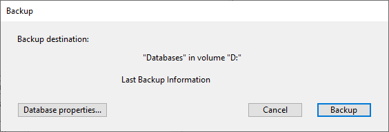

Una copia de seguridad puede iniciarse de tres maneras:

- Manualmente, utilizando el comando **Copia de seguridad...** del menú 4D **Archivo** o el botón **Copia de seguridad** del [Centro de mantenimiento y seguridad](MSC/backup.md).
- Automáticamente, utilizando el programador que se puede definir en las Propiedades,
- Por programación, utilizando el comando `BACKUP`.

> 4D Server: es posible iniciar una copia de seguridad manualmente desde una máquina remota mediante un método que llama al comando `BACKUP`. El comando se ejecutará, en todos los casos, en el servidor.

## Copia de seguridad manual

1. Seleccione el elemento **Copia de seguridad...** en el menú **Archivo** de 4D.
   La ventana de copia de seguridad aparece:
   
   Puede ver la ubicación de la carpeta de copia de seguridad usando el menú emergente junto al área de "destino de copia de seguridad". Esta ubicación se define en la página **Copia de seguridad/configuración** de las Propiedades de la base.

- También puede abrir el [Centro de mantenimiento y seguridad](MSC/overview.md) de 4D y mostrar la [página de copias de seguridad](MSC/backup.md).

El botón \*\*Propiedades de la base...\*\*hace que se muestre la página Copia de seguridad/Configuración de las Propiedades de la estructura.

2. Haga clic en **Copia de seguridad** para iniciar la copia de seguridad utilizando los parámetros actuales.

## Backup automático periódico

Las copias de seguridad programadas se inician automáticamente. Se configuran en la página **Backup/Planificador** de las \*\* Propiedades\*\*.

Las copias de seguridad se realizan automáticamente a las horas definidas en esta página sin ningún tipo de intervención del usuario. Para más información sobre el uso de esta caja de diálogo, consulte [Definir las copias de seguridad periódicas](settings.md#scheduler).

## Comando BACKUP

Puede utilizar los métodos base `On Backup Startup` and `On Backup Shutdown` para controlar el proceso de copia de seguridad (consulte el manual _Lenguaje de 4D_). Puede utilizar el método base `On Backup Startup` y `On Backup Shutdown`, para controlar el proceso de backup (ver el manual _Lenguaje de 4D_).

## Cómo funciona la copia de seguridad

Una vez iniciada la copia de seguridad, 4D muestra una caja de diálogo con un termómetro que indica el progreso de la copia de seguridad:


Este termómetro también se muestra en la página [Backup del CSM](MSC/backup.md) si ha utilizado esta caja de diálogo.

El botón **Parar** permite al usuario interrumpir la copia de seguridad en cualquier momento (consulte [Manejar los problemas de la copia de seguridad](backup.md#handling-backup-issues) más adelante).

El estado de la última copia de seguridad (correcta o fallida) se almacena en el área de información de la [página de copias de seguridad en el CSM](MSC/backup.md) o en la **página de mantenimiento** de 4D Server. También se registra en la base **Backup journal.txt**.

### Acceso a la aplicación durante la copia de seguridad

4D bloquea los procesos relacionados con los tipos de archivos incluidos en la copia de seguridad: si sólo se hace una copia de seguridad de los archivos del proyecto, no se podrá acceder a la estructura pero sí a los datos. 4D bloquea todos los procesos relacionados con los tipos de archivos incluidos en la copia de seguridad: si sólo se están copiando los archivos del proyecto, no se podrá acceder a la estructura pero sí a los datos.

Por el contrario, si sólo se hace una copia de seguridad del archivo de datos, se sigue permitiendo el acceso a la estructura. En este caso, las posibilidades de acceso a la aplicación son las siguientes:

- Con 4D versión monopuesto, la aplicación está bloqueada tanto para lectura como para escritura; todos los procesos están congelados. No se puede realizar ninguna acción.
- Con 4D Server, la aplicaci´n sólo está bloqueada en escritura; las máquinas cliente pueden ver los datos. Si una máquina cliente envía una petición de adición, eliminación o cambio al servidor, aparece una ventana que pide al usuario que espere hasta el final de la copia de seguridad. Una vez guardada la aplicación, la ventana desaparece y se realiza la acción. Para cancelar la petición en proceso y no esperar a que finalice la copia de seguridad, basta con hacer clic en el botón **Cancelar la operación**. Sin embargo, si la acción que espera ser ejecutada proviene de un método lanzado antes de la copia de seguridad, no debe cancelarla porque sólo se cancelan las operaciones que quedan por realizar. Además, un método parcialmente ejecutado puede causar inconsistencias lógicas en los datos.

> Cuando la acción que espera ser ejecutada proviene de un método y el usuario hace clic en el botón **Cancelar operación**, 4D Server devuelve el error -9976 (Este comando no puede ejecutarse porque la copia de seguridad de la base está en progreso).

### Gestión de los problemas de las copias de seguridad

Puede ocurrir que una copia de seguridad no se ejecute correctamente. Puede haber varias causas de fallo en la copia de seguridad: interrupción del usuario, archivo adjunto no encontrado, problemas en el disco de destino, transacción incompleta, etc. 4D procesa la incidencia según la causa.

En todos los casos, tenga en cuenta que el estado de la última copia de seguridad (correcta o fallida) se almacena en el área de información de la [página de copias de seguridad en el CSM](MSC/backup.md) o en la **página de mantenimiento** de 4D Server, así como en **Backup journal.txt**.

- **Interrupción del usuario**: el botón **Parar** de la caja de diálogo de progreso permite a los usuarios interrumpir la copia de seguridad en cualquier momento. En este caso, la copia de elementos se detiene y se genera el error 1406. Puedes interceptar este error en el método base `On Backup Shutdown`.
- **Archivo adjunto no encontrado**: cuando no se encuentra un archivo adjunto, 4D realiza una copia de seguridad parcial (copia de seguridad de los archivos de la aplicación y de los archivos adjuntos accesibles) y devuelve un error.
- **Copia de seguridad imposible** (disk is full or write-protected, missing disk, disk failure, incomplete transaction, application not launched at time of scheduled automatic backup, etc.): If this is a first-time error, 4D will then make a second attempt to perform the backup. La espera entre los dos intentos se define en la página **Backup/Backup y Restauración** de las Propiedades.
  Si el segundo intento falla, se muestra una caja de diálogo de alerta del sistema y se genera un error. Puedes interceptar este error en el método base `On Backup Shutdown`.

## Historial de copias de seguridad (Backup Journal)

Para facilitar el seguimiento y la verificación de las copias de seguridad, el módulo de copia de seguridad escribe un resumen de cada operación realizada en un archivo especial, que es similar a un diario de actividades. Al igual que un manual de a bordo, todas las operaciones de la base de datos (copias de seguridad, restauraciones, integraciones de archivos de registro) se registran en este archivo, tanto si se han programado como si se han realizado manualmente. La fecha y la hora en que se produjeron estas operaciones también se anotan en el diario.

El historial de copia de seguridad se llama "Backup Journal[001].txt" y se coloca en la carpeta "Logs" del proyecto. El historial de copias de seguridad puede abrirse con cualquier editor de texto.

#### Gestión del tamaño del historial de copias de seguridad

En determinadas estrategias de copia de seguridad (por ejemplo, en el caso de que se realicen copias de seguridad de numerosos archivos adjuntos), el historial de copias de seguridad puede alcanzar rápidamente un gran tamaño. Se pueden utilizar dos mecanismos para controlar este tamaño:

- **Copia de seguridad automática**: antes de cada copia de seguridad, la aplicación examina el tamaño del archivo historial de copia de seguridad actual. Si es superior a 10 MB, se archiva el archivo actual y se crea un nuevo archivo con el número [xxx] incrementado, por ejemplo "Backup Journal[002].txt”. Una vez alcanzado el número de archivo 999, la numeración vuelve a empezar por el 1 y los archivos existentes serán sustituidos.
- **Posibilidad de reducir la cantidad de información registrada**: para ello, basta con modificar el valor de la llave `VerboseMode` en el archivo _Backup.4DSettings_ del proyecto. Por defecto, esta llave está definida como True. Si cambia el valor de esta llave a False, sólo se almacenará en el diario de copias de seguridad la información principal: fecha y hora de inicio de la operación y los errores encontrados. Las llaves XML relativas a la configuración de la copia de seguridad se describen en el manual _Backup de las llaves XML 4D_.

## backupHistory.json

Toda la información relativa a las últimas operaciones de copia de seguridad y restauración se almacena en el archivo **backupHistory.json** de la aplicación. Registra la ruta de cada archivo guardado (incluidos los adjuntos), así como el número, la fecha, la hora, la duración y el estado de cada operación. Para limitar el tamaño del archivo, el número de operaciones registradas es el mismo que el número de copias de seguridad disponibles ("Conservar sólo los últimos X archivos de copia de seguridad") definido en las propiedades de la copia de seguridad.

El archivo **backupHistory.json** se crea en la carpeta de destino de la copia de seguridad actual. Puede obtener la ruta real de este archivo utilizando la siguiente declaración:

```4d
$backupHistory:=Get 4D file(Backup history file)
```

> **ATENCIÓN**\
> La eliminación o el desplazamiento del archivo **backupHistory.json** hará que se reinicie el siguiente número de copia de seguridad.

> El archivo **backupHistory.json** está formateado para ser utilizado por la aplicación 4D. Si lo que busca es un informe legible en las operaciones de copia de seguridad, quizá le resulte más preciso el diario de copias de seguridad.
