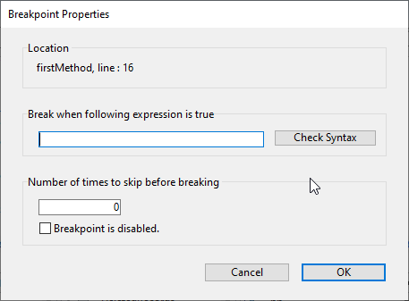

## Generalidades

Los puntos de interrupción y los comandos de captura son técnicas de depuración muy eficaces. Ambas tienen el mismo efecto: detienen la ejecución del código (y muestran la ventana del depurador si no está ya visible) en una etapa deseada.

Se definenen los puntos de interrupción en cualquier línea de código en la que se desee detener la ejecución. Puede asociar una condición al punto de ruptura.

Los puntos de interrupción de comandos le permiten comenzar a rastrear la ejecución de un proceso tan pronto como un comando es llamado por ese proceso.

## Puntos de interrupción

Para crear un punto de interrupción, haga clic en el margen izquierdo de la ventana de evaluación del código fuente en el depurador o en el editor de código.

In the following example, a break point (the red bullet) has been set, in the debugger, on the line `If (Value type(request.reponse.headers...`:

En el ejemplo anterior, al hacer clic en el botón [**No Trace**](./debugger.md/#no-trace), se reanuda la ejecución normal hasta la línea marcada con el punto de interrupción. Esa línea no se ejecuta por sí misma, sino que se vuelve al modo de rastreo. Definir un punto de interrupción más allá del contador del programa y hacer clic en el botón **No Trace** le permite saltar las partes del método que se está rastreando.

Para eliminar un punto de ruptura, haga clic en la viñeta correspondiente.

### Propiedades de los puntos de interrupción

Puede modificar el comportamiento de un punto de interrupción utilizando la ventana Propiedades de puntos de interrupción:

Esta ventana está disponible en el Editor de Código o en la [ventana de código fuente](debugger.md#source-code-pane). Puede:

- haga clic derecho en una línea y seleccione **Modificar el punto de interrupción** en el menú contextual, o
- `Alt+clic` (Windows) o `Opción+clic` (macOS) en el margen izquierdo.

Si ya existe un punto de interrupción, la ventana se muestra para ese punto de interrupción. En caso contrario, se crea un punto de ruptura y se muestra la ventana para el punto de ruptura recién creado.

A continuación se describen las propiedades:

- **Ubicación**: indica el nombre del método y el número de línea que se adjunta al punto de interrupción.
- **Interrumpir cuando la siguiente expresión es true**: puede crear los **puntos de interrupción condicionales** introduciendo una fórmula 4D que devuelva `True` o `False`. Por ejemplo, inserte `Records in selection(\[aTable])=0` para asegurarse de que la ruptura se produce sólo si no hay ningún registro seleccionado para la tabla \[aTable]. Las condiciones de los puntos de interrupción están disponibles en la columna **Condición** de la [lista de interrupciones](#break-list).
- **Número de veces que hay que saltar antes de romper**: puede asociar un punto de ruptura a una línea situada en una estructura de bucle (While, Repeat o For) o situada en una subrutina o función llamada desde dentro de un bucle.
- **Punto de ruptura desactivado**: si actualmente no necesita un punto de ruptura, pero podría necesitarlo más adelante, puede desactivarlo temporalmente. Un punto de interrupción desactivado aparece como un guión (-) en lugar de una viñeta (-)|

### Puntos de interrupción en la depuración remota

La lista de puntos de interrupción se almacena localmente. En el modo de depuración remota, si el depurador conectado es un 4D remoto, la lista de puntos de interrupción remota sustituye temporalmente a la lista de puntos de interrupción del servidor durante la sesión de depuración.

La lista de puntos de interrupción del servidor se restablece automáticamente si vuelve a ser el depurador asociado.

### Lista de rupturas

La lista de puntos de ruptura es una página del Explorador de ejecución que le permite gestionar los puntos de ruptura creados en la ventana del depurador o en el editor de código. Para más información sobre el Explorador de ejecución, consulte su página dedicada en [el manual de Diseño](https://doc.4d.com/4Dv19/4D/19/Runtime-Explorer.200-5416614.en.html).

Para abrir la página de la lista de puntos de ruptura:

1. En el **menú Ejecutar**, haga clic en el **Explorador de ejecución...**

2. Haga clic en la pestaña **Break** para mostrar la lista de pausas:

Utilizando esta ventana, puede:

- Definir las condiciones para los puntos de interrupción en la columna **Condiciones**
- Activar o desactivar los puntos de interrupción haciendo clic en las viñetas del margen. Los puntos de interrupción desactivados muestran balas transparentes
- Elimine los puntos de interrupción presionando la tecla `Delete` o `Backspace`, o haciendo clic en el botón **Delete** bajo la lista.
- Abra los métodos donde se encuentran los puntos de interrupción haciendo doble clic en cualquier línea de la lista

No puede añadir nuevos puntos de interrupción desde esta ventana. Los puntos de interrupción sólo pueden crearse desde la ventana del depurador o del editor de código.

## Puntos de interrupción en comandos

La pestaña **Catch** del Explorador de ejecución le permite añadir pausas adicionales a su código mediante la captura de llamadas a comandos 4D. A diferencia de un punto de interrupción, que se encuentra en un método particular del proyecto (y por lo tanto desencadena una excepción de rastreo sólo cuando se alcanza), el alcance de la captura de un comando incluye todos los procesos que ejecutan código 4D y llaman a ese comando.

Los puntos de interrupción en un comando son una forma conveniente de rastrear grandes porciones de código sin tener que definir puntos de interrupción en lugares arbitrarios. Por ejemplo, si un registro que no debería ser eliminado se borra después de haber ejecutado uno o varios procesos, puede intentar reducir el campo de su investigación vía puntos de interrupción en los comandos como `DELETE RECORD` and `DELETE SELECTION`. Cada vez que se llama a estos comandos, se puede verificar si el registro en cuestión ha sido eliminado, y así aislar la parte defectuosa del código.

Los puntos de interrupción y los comandos de captura se pueden utilizar combinados.

Para abrir la página de los puntos de interrupción en comandos:

1. Elija **Ejecutar** > **Explorador de ejecución...** para abrir el Explorador de ejecución.

2. Haga clic en **Catch** para mostrar la lista de puntos de interrupción en los comandos:

Esta página lista los puntos de interrupción en el comando durante la ejecución. Se compone de dos columnas:

- La columna de la izquierda muestra el estado de activación/desactivación del punto de interrupción en el comando, seguido del nombre del comando
- La columna de la derecha muestra la condición asociada a punto de interrupción en el comando, si lo hay

Para añadir un punto de interrupción en el comando:

1. Haga clic en el botón **Add New Catch** (en forma de +) situado debajo de la lista. Se añade una nueva entrada a la lista con el comando `ALERT` por defecto
2. Haga clic en la etiqueta **ALERT**, escriba el nombre del comando en el cual desea poner un punto de interrupción y pulse **Enter**.

Para activar o desactivar un punto de interrupción en un comando, haga clic en la viñeta (-) delante de la etiqueta del comando.
La bala es transparente cuando el comando está desactivado.

> La desactivación de un punto de interrupción de un comando tiene casi el mismo efecto que suprimirlo. Durante la ejecución, el depurador no pasa casi nada de tiempo en la entrada. La ventaja de desactivar una entrada es que no tiene que volver a crearla cuando la necesite de nuevo.

Para eliminar un punto de interrupción en el comando:

1. Seleccione un comando en la lista.
2. Presione la tecla **Backspace** o **Delete** en su teclado o haga clic en el botón **Delete** bajo la lista (**Delete All** elimina todos los comandos en la lista).

### Definir una condición para un punto de interrupción en un comando

1. Haga clic en la entrada en la columna derecha
2. Introduzca una fórmula 4D (expresión, llamada de comando o método de proyecto) que devuelva un valor booleano.

> Para eliminar una condición, borre su fórmula.

La adición de condiciones le permite detener la ejecución cuando el comando es invocado sólo si la condición se cumple. Por ejemplo, si asocia la condición `Records in selection(\[Emp]>10)` con el punto de interrupción del comando `DELETE SELECTION`, el código no se detendrá durante la ejecución del comando `DELETE SELECTION` si la selección actual de la tabla \[Emp] sólo contiene 9 registros (o menos).

La adición de condiciones a los puntos de interrupción de los comandos ralentiza la ejecución, porque la condición tiene que ser evaluada cada vez que se produce una excepción. Por otra parte, añadir condiciones acelera el proceso de depuración, ya que 4D omite automáticamente las ocurrencias que no coinciden con las condiciones.
