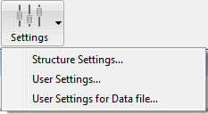

4D ofrece dos modos de funcionamiento para las Propiedades de los proyectos:

- Modo **Estándar**: todos los [parámetros](../settings/overview.md) se almacenan en el archivo [*settings.4DSettings* al nivel del proyecto](../Project/architecture.md#sources) y se aplican en todos los casos. Este es el modo por defecto, adecuado para la fase de desarrollo (todas las aplicaciones).

- **Modo propiedades usuario**: una parte de los parámetros personalizados se almacena en un archivo *settings.4DSettings* [en la carpeta Settings](../Project/architecture.md#settings-user) (para todos los archivos de datos) o [en la carpeta Data](../Project/architecture.md#settings-user-data) (para este archivo de datos) y se utilizan en lugar de los parámetros de estructura. Este modo es adecuado para la fase de despliegue de las aplicaciones de escritorio. Este modo se activa mediante una opción situada en la [página Seguridad](../settings/security.md) de las Propiedades.

Al definir las propiedades usuario, puede conservar los parámetros personalizados entre las actualizaciones de sus aplicaciones 4D, o gestionar parámetros diferentes para una misma aplicación 4D desplegada en varios sitios diferentes. También permite utilizar la programación para gestionar los archivos de configuración utilizando XML.

4D puede generar y utilizar dos tipos de propiedades usuario:

- Los **parámetros usuario**: se utilizan en lugar de los parámetros de estructura para todo archivo de datos abierto con la aplicación.
- **Propiedades usuario para el archivo de datos**: se pueden definir específicamente para cada archivo de datos utilizado con su aplicación, configurando por ejemplo el ID del puerto o la caché del servidor.

Con esta opción, puede desplegar y actualizar fácilmente varias copias de la misma aplicación de escritorio con varios archivos de datos, cada uno de los cuales contiene propiedades diferentes.

Considere, por ejemplo, la siguiente configuración, en la que se duplica una aplicación y cada copia utiliza un parámetro de ID de puerto diferente. Si este parámetro usuario está vinculado al archivo de datos, podrá actualizar la aplicación sin tener que cambiar manualmente el ID del puerto:

## Activar las propiedades usuario

Para activar los parámetros usuario, debe seleccionar la opción **Parámetros** > **Seguridad** > **Autorizar las propiedades usuario**:

Cuando se marca esta opción, los parámetros se separan en tres cajas de diálogo:

- **Propiedades estructura**
- **Propiedades usuario**
- **Propiedades usuario para el archivo de datos**

Puede acceder a estas cajas de diálogo utilizando el menú **Diseño > Propiedades...** o el botón **Propiedades** de la barra de herramientas:

También puede acceder a estas cajas de diálogo utilizando el comando [OPEN SETTINGS WINDOW](https://doc.4d.com/4dv19R/help/command/en/page903.html) con el selector *settingsType* apropiado.

La caja de diálogo Propiedades de estructura es idéntica a la caja de diálogo Propiedades estándar, y permite acceder a todas sus propiedades (que pueden ser anuladas por las propiedades usuario).

## Propiedades usuario y propiedades de usuario para el archivo de datos

Las cajas de diálogo **Propiedades usuario** y **Propiedades usuario para el archivo de datos**contienen una selección de propiedades relevantes que pueden definirse para todos los archivos de datos o para un solo archivo de datos:

La siguiente tabla lista las páginas de parámetros que se encuentran en las cajas de diálogo **Parámetros usuario** y **Parámetros usuario para el archivo de datos** y describe sus principales diferencias con respecto a los parámetros estándar:

| **Página de Propiedades estructura**                                                 | **Página de las Propiedades usuario**              | **Página de Propiedades usuario para archivo de datos** |
| ------------------------------------------------------------------------------------ | -------------------------------------------------- | ------------------------------------------------------- |
| [Página general](../settings/general.md)                                             | N/a                                                | N/a                                                     |
| [Página Interfaz](../settings/interface.md)                                          | Idéntica a las Propiedades estándar                | Idéntica a las Propiedades estándar                     |
| [Página Compilador](../settings/compiler.md)                                         | N/a                                                | N/a                                                     |
| [Página Base de datos/Almacenamiento de datos](../settings/database.md#data-storage) | N/a                                                | N/a                                                     |
| [Página Base de datos/Memoria](../settings/database.md#memory)                       | Idéntica a las Propiedades estándar                | Idéntica a las Propiedades estándar                     |
| [Página Backup/Periocidad](../settings/backup.md#scheduler)                          | N/a                                                | Idéntica a las Propiedades estándar                     |
| [Página Backup/Configuración](../settings/backup.md#configuration)                   | N/a                                                | Idéntica a las Propiedades estándar                     |
| [Página Backup/Backup y Restauración](../settings/backup.md#backup-restore)          | N/a                                                | Idéntica a las Propiedades estándar                     |
| [Página Cliente-servidor/red](../settings/client-server.md#network-options)          | Idéntica a las Propiedades estándar                | Idéntica a las Propiedades estándar                     |
| [Página Cliente-servidor/IP](../settings/client-server.md#ip-configuration)          | Idéntica a las Propiedades estándar                | Idéntica a las Propiedades estándar                     |
| [Página Web/Configuración](../settings/web.md#configuration)                         | Idéntica a las Propiedades estándar                | Idéntica a las Propiedades estándar                     |
| [Página Web/Opciones (I)](../settings/web.md#opciones)            | Idéntica a las Propiedades estándar                | Idéntica a las Propiedades estándar                     |
| [Página Web/Opciones (III)](../settings/web.md#options-ii)        | Idéntica a las Propiedades estándar                | Idéntica a las Propiedades estándar                     |
| [Página Web/Historial(formato)](../settings/web.md#log)           | Idéntica a las Propiedades estándar                | Idéntica a las Propiedades estándar                     |
| [Página Web/Historial(backup)](../settings/web.md#log)            | Idéntica a las Propiedades estándar                | Idéntica a las Propiedades estándar                     |
| [Página Web/Servicios Web](../settings/web.md#web-services)                          | Opción de prefijación de los métodos no disponible | Opción de prefijación de los métodos no disponible      |
| [SQL page](../settings/sql.md)                                                       | Idéntica a las Propiedades estándar                | Idéntica a las Propiedades estándar                     |
| [PHP page](../settings/php.md)                                                       | Idéntica a las Propiedades estándar                | Idéntica a las Propiedades estándar                     |
| [Página Seguridad](../settings/security.md)                                          | N/a                                                | N/a                                                     |
| [Página Compatibilidad](../settings/compatibility.md)                                | N/a                                                | N/a                                                     |

Al editar los parámetros en esta caja de diálogo, se almacenan automáticamente en el archivo *settings.4DSettings* correspondiente (ver más abajo) o en el archivo *Backup.4DSettings* (consulte la página [Parámetros de backup](../Backup/settings.md) para o

## `SET DATABASE PARAMETER` y propiedades usuario

Algunas propiedades de los usuarios también están disponibles a través del comando [SET DATABASE PARAMETER](https://doc.4d.com/4dv19R/help/command/en/page642.html). Las propiedades usuario son parámetros con la propiedad **Conservado entre dos sesiones** establecida en **Sí**.

Cuando la funcionalidad **Propiedades usuario** está activada, las propiedades usuario editadas por el comando [SET DATABASE PARAMETER](https://doc.4d.com/4dv19R/help/command/en/page642.html) se guardan automáticamente en las Propiedades usuario para el a

> `Table sequence number` es una excepción; este valor de ajuste siempre se guarda en el propio archivo de datos.

## Archivos settings.4DSettings

Cuando [marca la opción **Autorizar las propiedades usuario**](#enabling-user-settings), los archivos de propiedades usuario se crean automáticamente. Su ubicación depende del tipo de propiedad usuario definida.

### Propiedades usuario

El archivo de propiedad usuario estándar se crea automáticamente y se coloca en una carpeta de propiedades en la siguiente ubicación:

[`ProjectFolder/Settings/settings.4DSettings`](../Project/architecture.md#settings-user)

... donde *ProjectFolder* es el nombre de la carpeta que contiene el archivo de estructura del proyecto.

En las aplicaciones fusionadas, el archivo de propiedades usuario se coloca en la siguiente ubicación:

- En las versiones mono-usuario: ProjectFolder/Database/Settings/settings.4DSettings
- En las versiones cliente/servidor: ProjectFolder/Server Database/Settings/settings.4DSettings

### Propiedades usuario para archivo de datos

El archivo de propiedades usuario vinculado al archivo de datos automáticamente se crea y se coloca en una carpeta de propiedades en la siguiente ubicación:

[`Data/Settings/settings.4DSettings`](../Project/architecture.md#settings-user-data)

... donde *Data* es el nombre de la carpeta que contiene el archivo de datos actual de la aplicación.

> Cuando el archivo de datos se encuentra en el mismo nivel que el archivo de estructura del proyecto, los archivos de propiedades usuario basados en la estructura y en los datos comparten la misma ubicación y el mismo archivo. El comando de menú **Propiedades usuario para el archivo de datos...** no se propone.

:::note

Los archivos de propiedades son archivos XML; pueden ser leídos y modificados utilizando los comandos XML integrados de 4D o un editor XML. Esto significa que puede gestionar los parámetros por programación, especialmente en el contexto de las aplicaciones compiladas y fusionadas con 4D Volume Desktop. Cuando se modifica este archivo por programación, los cambios sólo se tienen en cuenta la siguiente vez que se abre la base de datos.

:::

## Prioridad de los parámetros

Las propiedades pueden almacenarse en tres niveles. Cada parámetro definido en un nivel anula el mismo ajuste definido en un nivel anterior, si lo hay:

| **Nivel de prioridad**             | **Name**                                                                                                             | **Ubicación**                                                                                                                                                                                                | **Comments**                                                                                                                                                                              |
| ---------------------------------- | -------------------------------------------------------------------------------------------------------------------- | ------------------------------------------------------------------------------------------------------------------------------------------------------------------------------------------------------------ | ----------------------------------------------------------------------------------------------------------------------------------------------------------------------------------------- |
| 3 (el más bajo) | Parámetros de estructura (o Parámetros cuando la función "Parámetros usuario" no está habilitada) | ***settings.4DSettings*** en la carpeta Sources (bases proyecto) o en la carpeta Settings al mismo nivel que el archivo de estructura (bases binarias) | Ubicación única cuando los parámetros usuario no están activos. Se aplica a todas las copias de la aplicación.                                            |
| 2                                  | Propiedades usuario (todos los archivos de datos)                                                 | Archivo ***settings.4DSettings*** en la carpeta Settings en el mismo nivel que la carpeta Project                                                                                            | Reemplaza las propiedades de estructura. Se almacena en el paquete de la aplicación.                                                                      |
| 1 (el mayor)    | Propiedades usuario (archivo de datos actual)                                                     | Archivo ***settings.4DSettings*** en la carpeta Settings al mismo nivel que el archivo de datos                                                                                              | Reemplaza las propiedades de estructura y las propiedades usuario. Se aplica únicamente cuando el archivo de datos asociado se utiliza con la aplicación. |

Tenga en cuenta que los archivos de propiedades usuario sólo contienen un subconjunto de parámetros relevantes, mientras que el archivo de estructura contiene todos los parámetros personalizados, incluidos los parámetros de bajo nivel.
