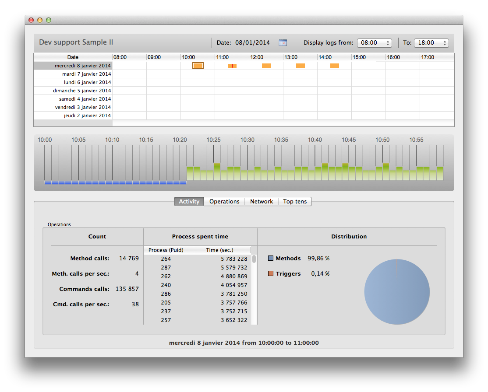

Los formularios ofrecen la interfaz a través de la cual se introduce, modifica e imprime la información en una aplicación de escritorio. Los usuarios interactúan con los datos de una base de datos mediante formularios e imprimen informes utilizando formularios. Los formularios pueden utilizarse para crear cajas de diálogo personalizadas, paletas o toda ventana personalizada.



Los formularios también pueden contener otros formularios a través de las siguientes funcionalidades:

- [objetos de subformulario](FormObjects/subform_overview.md)
- [formularios heredados](properties_FormProperties.md#inherited-forms)

## Creación de formularios

Puede añadir o modificar formularios 4D utilizando los siguientes elementos:

- **La interfaz 4D Developer:** cree nuevos formularios desde el menú **Archivo** o la ventana del **Explorador**.
- **El editor de formularios**: modifique sus formularios utilizando el **[editor de formularios](FormEditor/formEditor.md)**.
- **El código JSON:** cree y diseñe sus formularios utilizando JSON y guarde los archivos de los formularios en la [ubicación adecuada](Project/architecture.md#sources-folder). Ejemplo:

```
{
    "windowTitle": "Hello World",
    "windowMinWidth": 220,
    "windowMinHeight": 80,
    "method": "HWexample",
    "pages": [
        null,
        {
            "objects": {
                "text": {
                "type": "text",
                "text": "Hello World!",
                "textAlign": "center",
                "left": 50,
                "top": 120,
                "width": 120,
                "height": 80
                },
                "image": {
                "type": "picture",
                "pictureFormat": "scaled",
                "picture": "/RESOURCES/Images/HW.png",
                "alignment":"center", 
                "left": 70,
                "top": 20, 
                "width":75, 
                "height":75        
                },
                "button": {
                "type": "button",
                "text": "OK",
                "action": "Cancel",
                "left": 60,
                "top": 160,


                "width": 100,
                "height": 20
                }
            }
        }
    ]
}
```

## Formulario proyecto y formulario tabla

Hay dos categorías de formularios:

- **Los formularios de proyecto** - Formularios independientes que no están unidos a ninguna tabla. Están pensados, sobre todo, para crear cajas de diálogo de interfaz, al igual que componentes. Los formularios proyecto pueden utilizarse para crear interfaces que cumplan fácilmente con los estándares del sistema operativo.

- **Los formularios tablas** - Se adjuntan a tablas específicas y, por tanto, se benefician de funciones automáticas útiles para el desarrollo de aplicaciones basadas en bases de datos. Normalmente, una tabla tiene formularios de entrada y salida separados.

Normalmente, se selecciona la categoría del formulario al crearlo, pero se puede cambiar después.

## Páginas formulario

Cada formulario consta de al menos dos páginas:

- una página 1: una página principal, mostrada por defecto
- una página 0: una página de fondo, cuyo contenido se muestra en todas las demás páginas.

Puede crear varias páginas para un formulario de entrada. Si tiene más campos o variables de los que caben en una pantalla, puede crear páginas adicionales para mostrarlos. Las páginas múltiples le permiten hacer lo siguiente:

- Coloque la información más importante en la primera página y la menos importante en otras.
- Organice cada tema en su propia página.
- Reduce or eliminate scrolling during data entry by setting the [entry order](formEditor.md#data-entry-order).
- Deje espacio alrededor de los elementos del formulario para lograr un diseño de pantalla atractivo.

Las páginas múltiples son útiles sólo para los formularios de entrada. No son para imprimir. Cuando se imprime un formulario de varias páginas, sólo se imprime la primera.

No hay restricciones en el número de páginas que puede tener un formulario. El mismo campo puede aparecer un número ilimitado de veces en un formulario y en todas las páginas que desee. Sin embargo, cuantas más páginas tenga un formulario, más tiempo tardará en mostrarse.

Un formulario multipáginas tiene una página de fondo y varias páginas de visualización. Los objetos que se colocan en la página de fondo pueden ser visibles en todas las páginas de visualización, pero sólo se pueden seleccionar y editar en la página de fondo. En los formularios multipágina, debe colocar su paleta de botones en la página de fondo. También es necesario incluir uno o más objetos en la página de fondo que ofrezcan las herramientas de navegación para el usuario.

## Formularios heredados

Los formularios 4D pueden utilizar y ser utilizados como "formularios heredados", lo que significa que todos los objetos de *Formulario A* pueden ser utilizados en *Formulario B*. En este caso, *Formulario B* "hereda" los objetos de *Formulario A*.

Las referencias a un formulario heredado están siempre activas: si se modifica un elemento de un formulario heredado (estilos de botón, por ejemplo), se modificarán automáticamente todos los formularios que utilicen este elemento.

Todos los formularios (formularios tabla y formularios proyecto) pueden ser designados como un formulario heredado. Sin embargo, los elementos que contienen deben ser compatibles con el uso en diferentes tablas de la base de datos.

Cuando se ejecuta un formulario, los objetos se cargan y combinan en el siguiente orden:

1. Página cero del formulario heredado
2. Página 1 del formulario heredado
3. Página cero del formulario abierto
4. Página actual del formulario abierto.

This order determines the default [entry order](formEditor.md#data-entry-order) of objects in the form.

> Sólo las páginas 0 y 1 del formulario heredado pueden aparecer en otros formularios.

Las propiedades y el método de un formulario no se tienen en cuenta cuando ese formulario se utiliza como formulario heredado. Por otro lado, se llaman los métodos de los objetos que contiene.

Para definir un formulario heredado, el [nombre del formulario heredado](properties_FormProperties.md#inherited-form-name) y la [Tabla de formularios heredada](properties_FormProperties.md#inherited-form-table) (para el formulario tabla) las propiedades deben definirse en la forma que heredará algo de otro formulario.

Un formulario puede heredar de un formulario proyecto, definiendo la propiedad [Inherited Form Table](properties_FormProperties.md#inherited-form-table) en `\<None>` en la Lista de propiedades (o " " en JSON).

Para dejar de heredar un formulario, seleccione `\<None>` en la lista de propiedades (o " " en JSON) para la propiedad [Inherited Form Name](properties_FormProperties.md#inherited-form-name).

> Es posible definir un formulario heredado en un formulario que eventualmente se utilizará como formulario heredado para un tercer formulario. La combinación de objetos se realiza de forma recursiva. 4D detecta los bucles recursivos (por ejemplo, si el formulario [table1]form1 se define como el formulario heredado de [table1]form1, es decir, él mismo) e interrumpe la cadena de formularios.

## Propiedades soportadas

[Barra de menú asociada](properties_Menu.md#associated-menu-bar) - [Altura fija](properties_WindowSize.md#fixed-height) - [Ancho fijo](properties_WindowSize.md#fixed-width) - [Divisor de formulario](properties_Markers.md#form-break) - [Detalle de formulario](properties_Markers.md#form-detail) - [Pie de formulario](properties_Markers.md#form-footer) - [Encabezado de formulario](properties_Markers.md#form-header) - [Nombre de formulario](properties_FormProperties.md#form-name) - [Tipo de formulario](properties_FormProperties.md#form-type) - [Nombre de formulario heredado](properties_FormProperties.md#inherited-form-name) - [Tabla de formulario heredado](properties_FormProperties.md#inherited-form-table) - [Altura máxima](properties_WindowSize.md#maximum-height-minimum-height) - [Ancho máximo](properties_WindowSize.md#maximum-width-minimum-width) - [Método](properties_Action.md#method) - [Altura mínima](properties_WindowSize.md#maximum-height-minimum-height) - [Ancho mínimo](properties_WindowSize.md#maximum-width-minimum-width) - [Páginas](properties_FormProperties.md#pages) - [Configuración de impresión](properties_Print.md#settings) - [Publicado como subformulario](properties_FormProperties.md#published-as-subform) - [Guardar geometría](properties_FormProperties.md#save-geometry) - [Título de ventana](properties_FormProperties.md#window-title)
