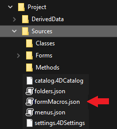

El editor de formularios 4D soporta macros. Una macro es un conjunto de instrucciones que permiten realizar una acción o una secuencia de acciones. Cuando se llama, la macro ejecutará sus instrucciones y realiza automáticamente la(s) acción(es).

Por ejemplo, si tiene un informe recurrente con un formato específico (por ejemplo, cierto texto debe aparecer en rojo y cierto texto debe aparecer en verde), puede crear una macro para definir automáticamente el color. Puede crear macros para el editor de formularios 4D que pueden:

- Crear y ejecutar código 4D
- Mostrar las cajas de diálogo
- Seleccione los objetos de formulario
- Añadir / eliminar / modificar los formularios, los objetos de formulario así como sus propiedades
- Modificar los archivos del proyecto (actualizar, eliminar)

El código de las macros soporta [funciones de clase](Concepts/classes.md) y las [propiedades de objeto de formulario en JSON](FormObjects/properties_Reference.md) para permitir definir toda funcionalidad personalizada en el editor de formularios.

Las macros pueden definirse para el proyecto local o para componentes dentro del proyecto. Por lo general, se crea una macro y se instala dentro de los componentes que se utilizan para el desarrollo.

Cuando se llama, una macro anula todo comportamiento especificado previamente.

## Ejemplo práctico

En este breve ejemplo, verá cómo crear y llamar a una macro que añade un botón de alerta "Hello World" en la esquina superior izquierda de su formulario.

1. En un archivo `formMacros.json` dentro de la carpeta `Sources` de su proyecto, escriba:

```js
{
   "macros": {
      "Add Hello World button": {
       "class": "AddButton"
     }
   }
}
```

2. Cree una clase 4D llamada `AddButton`.

3. En la clase `AddButton`, escriba la siguiente función:

```4d
Function onInvoke($editor : Object)->$result : Object
	
	var $btnHello : Object
	
	// Crear un botón "Hello"
	$btnHello:=New object("type"; "button"; \
	"text"; "Hello World!"; \
	"method"; New object("source"; "ALERT(\"Hello World!\")"); \
	"events"; New collection("onClick"); \
	"width"; 120; \
	"height"; 20; \
	"top"; 0; \
	"left"; 0)	
	
	// Añadir botón en la página actual
	$editor.editor.currentPage.objects.btnHello:=$btnHello	
	
	// Seleccionar el nuevo botón en el editor de formularios
	$editor.editor.currentSelection.clear() //unselect elements
	$editor.editor.currentSelection.push("btnHello")	
	
	// Notificar la modificación al editor de formularios 4D
	$result:=New object("currentSelection"; $editor.editor.currentSelection;\  
		"currentPage"; $editor.editor.currentPage)
```

Luego puede llamar a la macro:


## Llamar a las macros en el editor de formularios

Cuando las macros están definidas en su proyecto 4D, puede llamar una macro utilizando el menú contextual del editor de formularios:


Este menú se crea con base en `formMacros.json` [archivo(s) de definición de macros](#location-of-macros). Los elementos de la macro se clasifican en orden alfabético.

Este menú puede ser llamado en un área vacía o en una selección en el formulario. El objeto seleccionado se pasa a `$editor.currentSelection` o `$editor.target` en la función [`onInvoke`](#oninvoke) de la macro.

Una sola macro puede ejecutar varias operaciones. Si se selecciona, la función **Deshacer** del editor de formularios puede utilizarse para revertir las operaciones de las macros de forma global.

## Ubicación del archivo de macro

Todas las macros del editor de formularios 4D se definen en un único archivo JSON por proyecto o componente: `FormMacros.json`.

Este archivo debe estar ubicado en la carpeta **Project** > **Sources** local o del componente:



## Declaración de macros

La estructura del archivo `formMacros.json` es la siguiente:

```js
{
    "macros": {
            <macroName>: {
                "class": <className>,
                <customProperty> : <value>
        }
    }
}
```

Esta es la descripción del contenido del archivo JSON:

| Atributo |               |                    | Tipo   | Descripción                                                                     |
| -------- | ------------- | ------------------ | ------ | ------------------------------------------------------------------------------- |
| macros   |               |                    | object | lista de macros definidas                                                       |
|          | `<macroName>` |                    | object | definición de la macro                                                          |
|          |               | class              | string | nombre de clase de la macro                                                     |
|          |               | `<customProperty>` | any    | (opcional) valor personalizado a recuperar en el constructor |

Las propiedades personalizadas, cuando se utilizan, se pasan a la función [constructor](#class-constructor) de la macro.

### Ejemplo

```js
{
   "macros": {
     "Open Macros file": {
       "class": "OpenMacro"
     },
     "Align to Right on Target Object": {
       "class": "AlignOnTarget",
       "myParam": "right"
     },
     "Align to Left on Target Object": {
       "class": "AlignOnTarget",
       "myParam": "left"
     }
   }
}
```

## Instanciar las macros en 4D

Cada macro que quiera instanciar en su proyecto o componente debe ser declarada como una [clase 4D](Concepts/classes.md).

El nombre de la clase debe coincidir con el nombre definido mediante el atributo [class](#creating-macros) del archivo `formMacros.json`.

Las macros se instancian al iniciar la aplicación. En consecuencia, si se modifica la estructura de la clase macro (añadir una función, modificar un parámetro...) o el [constructor](#class-constructor), tendrá que reiniciar la aplicación para aplicar los cambios.

## Funciones macro

Cada clase de macro puede contener un `Class constructor` y dos funciones: `onInvoke()` y `onError()`.

### Class constructor

#### Class constructor($macro : Object)

| Parámetros | Tipo   | Descripción                                                                          |
| ---------- | ------ | ------------------------------------------------------------------------------------ |
| $macro     | Object | Objeto de declaración de macros (en el archivo `formMacros.json`) |

Las macros se instancian utilizando una función [class constructor](Concepts/classes.md#class-constructor), si existe.

El class constructor se llama una vez durante la instanciación de clase, que se produce al inicio de la aplicación.

Las propiedades personalizadas añadidas a la [declaración macro](#declaring-macros) se devuelven en el parámetro de la función class contructor.

#### Ejemplo

En el archivo `formMacros.json`:

```js
{
   "macros": {
     "Align to Left on Target Object": {
       "class": "AlignOnTarget",
       "myParam": "left"
     }
   }
}
```

Puede escribir:

```4d
// Class "AlignOnTarget"
Class constructor($macro : Object)
    This.myParameter:=$macro.myParam //left
    ...
```

### onInvoke()

#### onInvoke($editor : Object) -> $result : Object

| Parámetros | Tipo   | Descripción                                                                                                        |
| ---------- | ------ | ------------------------------------------------------------------------------------------------------------------ |
| $editor    | Object | Objeto Form Editor Macro Proxy que contiene las propiedades del formulario                                         |
| $result    | Object | Objeto Form Editor Macro Proxy que devuelve las propiedades modificadas por la macro (opcional) |

La función `onInvoke` se ejecuta automáticamente cada vez que se llama a la macro.

Cuando la función es llamada, recibe en la propiedad `$editor.editor` una copia de todos los elementos del formulario con sus valores actuales. Luego puede ejecutar cualquier operación en estas propiedades.

Una vez completadas las operaciones, si la macro resulta en la modificación, adición o eliminación de objetos, puede pasar las propiedades editadas resultantes en `$result`. El procesador de macros analizará las propiedades devueltas y aplicará las operaciones necesarias en el formulario. Obviamente, cuanto menos propiedades devuelva, menos tiempo requerirá el procesamiento.

Estas son las propiedades devueltas en el parámetro _$editor_:

| Propiedad                                                        | Tipo       | Descripción                                                                                       |
| ---------------------------------------------------------------- | ---------- | ------------------------------------------------------------------------------------------------- |
| $editor.editor.form              | Object     | Formulario completo                                                                               |
| $editor.editor.file              | File       | Objeto File del archivo de formularios                                                            |
| $editor.editor.name              | Text       | Nombre del formulario                                                                             |
| $editor.editor.table             | number     | Número de tabla del formulario, 0 para el formulario proyecto                                     |
| $editor.editor.currentPageNumber | number     | El número de la página actual                                                                     |
| $editor.editor.currentPage       | Object     | La página actual, que contiene todos los objetos de formulario y el orden de entrada de la página |
| $editor.editor.currentSelection  | Collection | Colección de nombres de objetos seleccionados                                                     |
| $editor.editor.formProperties    | Object     | Propiedades del formulario actual                                                                 |
| $editor.editor.target            | string     | Nombre del objeto bajo el ratón cuando se hace clic en una macro                                  |

Estas son las propiedades que puede pasar en el objeto `$result` si quiere que el macro procesador ejecute una modificación. Todas las propiedades son opcionales:

| Propiedad                         | Tipo       | Descripción                                                             |
| --------------------------------- | ---------- | ----------------------------------------------------------------------- |
| currentPage                       | Object     | currentPage incluyendo los objetos modificados por la macro, si los hay |
| currentSelection                  | Collection | currentSelection si es modificada por la macro                          |
| formProperties                    | Object     | formProperties si es modificado por la macro                            |
| editor.groups     | Object     | información de grupo, si los grupos son modificados por la macro        |
| editor.views      | Object     | ver información, si las vistas son modificadas por la macro             |
| editor.activeView | Text       | Nombres de vistas activos                                               |

Por ejemplo, si los objetos de la página actual y de los grupos han sido modificados, puede escribir:

```4d
	$result:=New object("currentPage"; $editor.editor.currentPage ; \ 
			"editor"; New object("groups"; $editor.editor.form.editor.groups))

```

#### atributo `method`

Cuando se maneja el atributo `method` de los objetos de formulario, se puede definir el valor del atributo de dos maneras en las macros:

- Utilizando una [cadena que contiene el nombre/ruta del archivo del método](FormObjects/properties_Action.md#method).

- Utilizando un objeto con la siguiente estructura:

| Propiedad | Tipo | Descripción       |
| --------- | ---- | ----------------- |
| source    | Text | código del método |

4D creará un archivo con el nombre del objeto en la carpeta "objectMethods" con el contenido del atributo `source`. Esta función solo está disponible para el código macro.

#### Propiedad `$4dId` en `currentPage.objects`

La propiedad `$4dId` define un ID único para cada objeto de la página actual. Esta clave es utilizada por el procesador de macros para controlar los cambios en `$result.currentPage`:

- si la llave `$4dId` falta tanto en el formulario y en un objeto en `$result`, el objeto se crea.
- si la llave `$4dId` existe en el formulario pero falta en `$result`, el objeto se elimina.
- si la llave `$4dId` existe tanto en el formulario y en un objeto en `$result`, el objeto se modifica.

#### Ejemplo

Quiere definir una función macro que aplique el color rojo y el estilo de letra itálica a cualquier objeto seleccionado.

```4d
Function onInvoke($editor : Object)->$result : Object
	var $name : Text
	
	If ($editor.editor.currentSelection.length>0)		
		// Define el trazo en rojo y el estilo en cursiva para cada objeto seleccionado
		For each ($name; $editor.editor.currentSelection)
			$editor.editor.currentPage.objects[$name].stroke:="red"
			$editor.editor.currentPage.objects[$name].fontStyle:="italic"

		End for each 
		
	Else 
		ALERT("Please select a form object.")
	End if 
	
	// Notificar la modificación a 4D
	$result:=New object("currentPage"; $editor.editor.currentPage)
```

### onError()

#### onError($editor : Object; $resultMacro : Object ; $error : Collection)

| Parámetros   |                                                                                           | Tipo       | Descripción                               |
| ------------ | ----------------------------------------------------------------------------------------- | ---------- | ----------------------------------------- |
| $editor      |                                                                                           | Object     | Objeto enviado a [onInvoke](#oninvoke)    |
| $resultMacro |                                                                                           | Object     | Objeto devuelto por [onInvoke](#oninvoke) |
| $error       |                                                                                           | Collection | Pila de errores                           |
|              | [].errCode            | Number     | Código de error                           |
|              | [].message            | Text       | Descripción del error                     |
|              | [].componentSignature | Text       | Firma del componente interno              |

La función `onError` se ejecuta cuando el procesador de macros encuentra un error.

Cuando se ejecuta una macro, si 4D encuentra un error que impide la cancelación de la macro, no la ejecuta. Es el caso, por ejemplo, de que la ejecución de una macro resulte en:

- borrar o modificar un script cuyo archivo es de sólo lectura.
- crear dos objetos con el mismo ID interno.

#### Ejemplo

En la definición de una clase macro, se puede escribir el siguiente código de error genérico:

```4d
Function onError($editor : Object; $resultMacro : Object; $error : Collection)
	var $obj : Object
	var $txt : Text
	$txt:=""
	
	For each ($obj; $error)
		$txt:=$txt+$obj.message+" \n"
	End for each 
	
	ALERT($txt)
```
