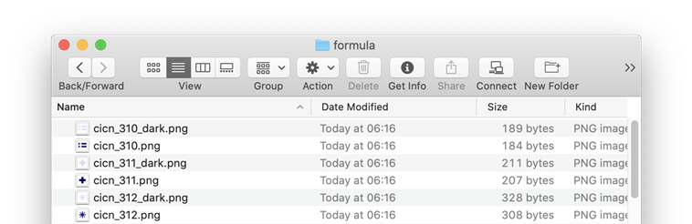

4D soporta específicamente las imágenes utilizadas en sus formularios.

## Formatos nativos soportados

4D integra la gestión nativa de los formatos de imagen. Esto significa que las imágenes se mostrarán y almacenarán en su formato original, sin ninguna interpretación en 4D. Las características específicas de los diferentes formatos (sombreado, áreas transparentes, etc.) se mantendrán al ser copiados y pegados, y se mostrarán sin alteración. Este soporte nativo es válido para todas las imágenes almacenadas en los formularios de 4D: [imágenes estáticas](FormObjects/staticPicture.md) pegadas en el modo Diseño, imágenes pegadas en [objetos de entrada](FormObjects/input_overview.md) en ejecución,

Los formatos de imagen más comunes son soportados en ambas plataformas: .jpeg, .gif, .png, .tiff, .bmp, etc. En macOS, el formato .pdf también está disponible para su codificación y descodificación.

> La lista completa de formatos soportados varía según el sistema operativo y los códecs personalizados que estén instalados en las máquinas. Para saber qué códecs están disponibles, debe utilizar el comando `PICTURE CODEC LIST` (ver también la descripción de [tipo de datos imagen](Concepts/dt_picture.md)).

### Formato de imagen no disponible

Se muestra un icono específico para las imágenes guardadas en un formato que no está disponible en la máquina. La extensión del formato que falta se muestra en la parte inferior del icono:

El icono se utiliza automáticamente en todos los lugares en los que se pretende visualizar la imagen:

Este icono indica que la imagen no puede ser visualizada o manipulada localmente, pero puede ser guardada sin alteraciones para que pueda ser visualizada en otras máquinas. Este es el caso, por ejemplo, para las imágenes PDF en Windows, o las imágenes en formato PICT.

## Imágenes de alta resolución

4D soporta imágenes de alta resolución tanto en plataformas macOS como Windows. Las imágenes de alta resolución pueden definirse por el factor de escala o dpi.

### Factor de escala

Las pantallas de alta resolución tienen una mayor densidad de píxeles que las pantallas estándar tradicionales. Para que las imágenes se muestren correctamente en pantallas de alta resolución, el número de píxeles de la imagen debe multiplicarse por el _factor de escala_ (_es decir_, dos veces más grande, tres veces más grande, etc.).

Cuando se utilizan imágenes de alta resolución, se puede especificar el factor de escala añadiendo "@nx" en el nombre de la imagen (donde _n_ designa el factor de escala). En la tabla siguiente, puede ver que el factor de escala se indica en los nombres de las imágenes de alta resolución, _circle@2x.png_ y _circle@3x.png_.

| Tipo de visualización | Factor de escala                                                     | Ejemplo                                                                                                                                                                                         |
| --------------------- | -------------------------------------------------------------------- | ----------------------------------------------------------------------------------------------------------------------------------------------------------------------------------------------- |
| Resolución estándar   | densidad de pixel 1:1.               | **1x**  _circle.png_                                                                                                          |
| Alta resolución       | La densidad de píxeles se ha multiplicado por 2 o 3. | <table><th>2x</th><th>3x</th><tr><td>*circle@2x.png*</td><td> *circle@3x.png*</td></tr></table> |

Las imágenes de alta resolución con la convención @nx pueden utilizarse en los siguientes objetos:

- [Imágenes estáticas](FormObjects/staticPicture.md)
- [Botones](FormObjects/button_overview.md)/[radio](FormObjects/radio_overview.md)/[casillas de selección](FormObjects/checkbox_overview.md)
- [Botones imagen](FormObjects/pictureButton_overview.md)/[imagen Pop-up](FormObjects/picturePopupMenu_overview.md)
- [Controles de pestaña](FormObjects/tabControl.md)
- [Encabezados de list box](FormObjects/listbox_overview.md#list-box-headers)
- [Iconos de menú](Menus/properties.md#item-icon)

4D prioriza automáticamente las imágenes con mayor resolución. 4D prioriza automáticamente las imágenes con mayor resolución. Incluso si un comando o propiedad especifica _circle.png_, se utilizará _circle@3x.png_ (si existe).

> Tenga en cuenta que la priorización de la resolución sólo se produce para la visualización de imágenes en pantalla, no se realiza una priorización automática al imprimir.

### DPI

Aunque 4D prioriza automáticamente la resolución más alta, existen, sin embargo, algunas diferencias de comportamiento en función de los ppp de la pantalla y de la imagen\*(\*)\*, y del formato de la imagen:

| Operación                                                                                                                                                                       | Comportamiento                                                                                                                                                                                                                                                                                                                                                                                                                                                                                                                                                                                                                                                               |
| ------------------------------------------------------------------------------------------------------------------------------------------------------------------------------- | ---------------------------------------------------------------------------------------------------------------------------------------------------------------------------------------------------------------------------------------------------------------------------------------------------------------------------------------------------------------------------------------------------------------------------------------------------------------------------------------------------------------------------------------------------------------------------------------------------------------------------------------------------------------------------- |
| Soltar o pegar                                                                                                                                                                  | Si la imagen tiene:<ul><li>**72dpi o 96dpi** - La imagen es "[Center](FormObjects/properties_Picture.md#center--truncated-non-centered)" formateado y el objeto que contiene la imagen tiene el mismo número de píxeles.</li><li>**Otro dpi** - La imagen es "[Escalada para encajar](FormObjects/properties_Picture.md#scaled-to-fit)" formateado y el objeto que contiene la imagen es igual a (número de píxeles \* screen dpi) / (imagen dpi)</li> <li>**Sin dpi** - La imagen es "[Escalada para ajustar](FormObjects/properties_Picture.md#scaled-to-fit)" formateado.</li></ul> |
| [Tamaño automático](https://doc.4d.com/4Dv19/4D/19/Setting-object-display-properties.300-5416671.en.html#148057) (menú contextual del editor de formularios) | Si el formato de visualización de la imagen es:<ul><li>**[Escalado](FormObjects/properties_Picture.md#scaled-to-fit)** - El objeto que contiene la imagen se redimensiona según (número de píxeles de la imagen \* dpi de la pantalla) / (dpi de la imagen)</li><li>**No escalado** - El objeto que contiene la imagen tiene la misma cantidad de píxeles que la imagen.</li></ul>                                                                                                                                                                                                                     |

_(\*) Generalmente, macOS = 72 dpi, Windows = 96 dpi_

## Imágenes en modo oscuro (sólo en macOS)

Puede definir imágenes e iconos específicos que se utilizarán en lugar de las imágenes estándar cuando [los formularios utilicen el esquema oscuro](properties_FormProperties.md#color-scheme).

Una imagen en modo oscuro se define de la siguiente manera:

- la imagen en modo oscuro tiene el mismo nombre que la versión estándar (modo claro) con el sufijo "`_dark`"
- la imagen en modo oscuro se almacena junto a la versión estándar.

En tiempo de ejecución, 4D cargará automáticamente la imagen clara u oscura según el [modo de colores de formulario actual](https://doc.4d.com/4dv19/help/command/en/1761.html).

## Coordenadas del ratón en una imagen

4D le permite recuperar las coordenadas locales del ratón en un [objeto de entrada](FormObjects/input_overview.md) asociado con una [expresión de imagen](FormObjects/properties_Object.md#expression-type), en caso de un clic o un desplazamiento, incluso si se ha aplicado un desplazamiento o zoom a la imagen. Este mecanismo, similar al de un mapa de imágenes, puede utilizarse, por ejemplo, para manejar barras de botones desplazables o la interfaz de un software de cartografía.

Las coordenadas se devuelven en las _MouseX_ and _MouseY_ [Variables Sistema](../Concepts/variables.md#system-variables). Las coordenadas se expresan en píxeles con respecto a la esquina superior izquierda de la imagen (0,0). Si el ratón está fuera del sistema de coordenadas de la imagen, se devuelve -1 en _MouseX_ y _MouseY_.

Puede obtener el valor de estas variables como parte de los eventos de formulario [`On Clicked`](Events/onClicked.md), [`On Double Clicked`](Events/onDoubleClicked.md), [`On Mouse up`](Events/onMouseUp.md), [`On Mouse Enter`](Events/onMouseEnter.md) o [`On Mouse Move`](Events/onMouseMove.md).
