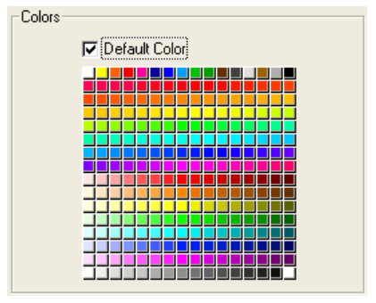

Una rejilla de botones es un objeto transparente que se coloca sobre una imagen. La imagen debe corresponder a la forma d eun array. Cuando se hace clic en uno de los gráficos, éste tendrá un aspecto presionado:

Puede utilizar un objeto rejilla de botones para determinar dónde hace clic el usuario en la imagen. El método objeto utilizaría el evento `On Clicked` y tomaría la acción apropiada dependiendo de la ubicación del clic.

## Crear rejillas de botones

Para crear la rejilla de botones, añada una imagen de fondo al formulario y coloque una rejilla de botones sobre ella. Especifique el número de [líneas](properties_Crop.md#rows) y de [columnas](properties_Crop.md#columns).

En 4D, se utiliza una rejilla de botones para las paletas de colores:

## Utilizar rejillas de botones

Los botones de la rejilla están numerados de izquierda a derecha y de arriba a abajo. En el ejemplo anterior, la rejilla tiene 16 columnas a lo ancho por 16 líneas a hacia abajo. El botón en la posición superior izquierda devuelve 1 cuando se hace clic. Si se selecciona el botón rojo del extremo derecho de la segunda fila, la rejilla de botones devuelve 32.
Si no se selecciona ningún elemento, el valor es 0

### Ir a la página

Puede asignar la [acción estándar](https://doc.4d.com/4Dv17R5/4D/17-R5/Standard-actions.300-4163633.en.html) `gotoPage` a una rejilla de botones. Cuando se selecciona esta acción, 4D mostrará automáticamente la página del formulario que corresponde al número del botón que está seleccionado en la rejilla de botones. Por ejemplo, si el usuario selecciona el décimo botón de la rejilla, 4D mostrará la décima página del formulario actual (si existe).

## Propiedades soportadas

[Estilo de línea de borde](properties_BackgroundAndBorder.md#border-line-style) - [Fondo](properties_CoordinatesAndSizing.md#bottom) - [Clase](properties_Object.md#css-class) - [Columnas](properties_Crop.md#columns) - [Altura](properties_CoordinatesAndSizing.md#height) - [Mensaje de ayuda](properties_Help.md#help-tip) - [Dimensionamiento horizontal](properties_ResizingOptions.md#horizontal-sizing) - [Izquierda](properties_CoordinatesAndSizing.md#left) - [Nombre del objeto](properties_Object.md#object-name) - [Derecha](properties_CoordinatesAndSizing.md#right) - [Filas](properties_Crop.md#rows) - [Acción estándar](properties_Action.md#standard-action) - [Superior](properties_CoordinatesAndSizing.md#top) - [Tipo](properties_Object.md#type) - [Variable o expresión](properties_Object.md#variable-or-expression) - [Tamaño vertical](properties_ResizingOptions.md#vertical-sizing) - [Ancho](properties_CoordinatesAndSizing.md#width) - [Visibilidad](properties_Display.md#visibilidad)
