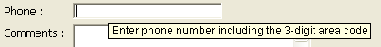

## Mensaje de ayuda

Esta propiedad permite asociar los mensajes de ayuda a los objetos activos de sus formularios. Se pueden mostrar en ejecución:

> - El retardo de la visualización y la duración máxima de los mensajes de ayuda pueden controlarse utilizando los selectores `Tips delay` y `Tips duration` del comando **[SET DATABASE PARAMETER](https://doc.4d.com/4Dv17R5/4D/17-R5/SET-DATABASE-PARAMETER.301-4128139.en.html)**.
> - Los mensajes de ayuda se pueden deshabilitar o habilitar globalmente para la aplicación utilizando el selector del comando [**SET DATABASE PARAMETER**](https://doc.4d.com/4Dv17R5/4D/17-R5/SET-DATABASE-PARAMETER.301-4128139.en.html).

Puede:

- designar un mensajes de ayuda existente, previamente especificado en el editor de [mensajes de ayuda](https://doc.4d.com/4Dv17R5/4D/17-R5/Help-tips.200-4163423.en.html) de 4D.
- o introducir el mensaje de ayuda directamente como una cadena. Esto le permite aprovechar la arquitectura XLIFF. Aquí puede introducir una referencia XLIFF para mostrar un mensaje en el lenguaje de la aplicación (para más información sobre XLIFF, consulte el [Apéndice B: Arquitectura XLIFF](https://doc.4d.com/4Dv17R5/4D/17-R5/Appendix-B-XLIFF-architecture.300-4163748.en.html). También puede utilizar referencias 4D ([ver Uso de referencias en texto estático](https://doc.4d.com/4Dv17R5/4D/17-R5/Using-references-in-static-text.300-4163725.en.html)).

> \> In macOS, displaying help tips is not supported in pop-up type windows.

#### Gramática JSON

|  Nombre | Tipos de datos | Valores posibles                             |
| :-----: | :------------: | -------------------------------------------- |
| tooltip |      text      | información adicional para ayudar al usuario |

#### Objetos soportados

[Botón](button_overview.md) - [Rejilla de botones](buttonGrid_overview.md) - [Casilla de verificación](checkbox_overview.md)  - [Lista desplegable](dropdownList_Overview.md) - [Combo Box](comboBox_overview.md#overview) - [Lista jerárquica](list_overview.md#overview) - [Encabezado de lista de List Box](listbox_overview.md#list-box-headers) - [Pie de lista de List Box](listbox_overview.md#list-box-footers) - [Botón imagen](pictureButton_overview.md) - [Menú emergente con imagen](picturePopupMenu_overview.md) - [Botón de opción](radio_overview.md)

#### Otras funcionalidades de ayuda

También puede asociar los mensajes de ayuda a los objetos formulario de otras dos maneras:

- a nivel de la estructura de la base de datos (sólo campos). En este caso, la ayuda del campo se muestra en todos los formularios en los que aparece. Para más información, consulte "Consejos de ayuda" en [Propiedades de los campos](https://doc.4d.com/4Dv17R5/4D/17-R5/Field-properties.300-4163580.en.html).
- utilizando el comando **[OBJECT SET HELP TIP](https://doc.4d.com/4Dv17R5/4D/17-R5/OBJECT-SET-HELP-TIP.301-4128221.en.html)**, para el proceso actual.

Cuando se asocian consejos diferentes a un mismo objeto en varias ubicaciones, se aplica el siguiente orden de prioridad:

1. nivel de estructura (prioridad más baja)
2. editor de formulario
3. Comando **[OBJECT SET HELP TIP](https://doc.4d.com/4Dv17R5/4D/17-R5/OBJECT-SET-HELP-TIP.301-4128221.en.html)** (alta prioridad)

#### Ver también

[Marcador de posición](properties_Entry.md#placeholder)
