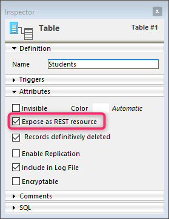

La tecnología ORDA se basa en un mapeo automático de una estructura de base subyacente. También ofrece acceso a los datos a través de los objetos selección de entidades (entity selection) y entidad (entity). Como resultado, ORDA expone toda la base de datos como un conjunto de objetos del modelo de datos.

## Mapeo de la estructura

Cuando llama a un datastore usando los comandos [`ds`](commands/ds.md) u [`Open datastore`](commands/open-datastore.md), 4D hace referencia automáticamente a tablas y campos de la estructura 4D correspondiente como propiedades del objeto devuelto [datastore](#datastore):

- Las tablas correspondientes a las dataclasses.
- Los campos corresponden a los atributos de almacenamiento.
- Las relaciones se mapean a los atributos de relación: los nombres de relación, definidos en el editor de estructura, se utilizan como nombres de atributo de relación.


### Reglas generales

Se aplican las siguientes reglas para todas las conversiones:

- Los nombres de tabla, campo y relación se mapean a los nombres de propiedad de objeto. Asegúrese de que dichos nombres cumplen con las reglas generales de denominación de objetos, como se explica en la sección [Convenciones de denominación de objetos](Concepts/identifiers.md).
- Un datastore sólo hace referencia a las tablas con una sola llave primaria. Las siguientes tablas no están referenciadas:
  - Tablas sin llave primaria
  - Tablas con llaves primarias compuestas.
- Los campos BLOB están disponibles automáticamente como atributos del tipo [objeto Blob](Concepts/dt_blob.md#blob-types).

> El mapeo ORDA no tiene en cuenta:
>
> - la opción "Invisible" para las tablas o los campos,
> - la estructura virtual definida mediante `SET TABLE TITLES` o `SET FIELD TITLES`,
> - la propiedad "Manual" o "Automática" de las relaciones.

### Normas de control de acceso remoto

Cuando se accede a un datastore remoto a través del comando `Abrir datastore` o [peticiones REST](REST/gettingStarted.md), sólo las tablas y los campos con la propiedad **Exponer como recurso REST** están disponibles de forma remota.

Esta opción debe seleccionarse al nivel de la estructura 4D para cada tabla y cada campo que desee exponer como dataclass y atributo en el datastore:



### Actualización del modelo de datos

Toda modificación aplicada a la estructura de la base invalida la capa actual del modelo ORDA. Estas modificaciones incluyen:

- la adición o la eliminación de una tabla, de un campo, o de una relación
- el cambio de nombre de una tabla, de un campo o de una relación
- la modificación de una propiedad principal de un campo (tipo, único, índice, autoincremento, valor null)

Cuando la capa actual del modelo ORDA ha sido invalidada, es automáticamente recargada y actualizada en llamadas posteriores del datastore local `ds` en 4D y 4D Server. Tenga en cuenta que las referencias existentes a objetos ORDA, tales como entidades o selecciones de entidades, seguirán utilizando el modelo a partir del cual se han creado, hasta que se regeneren.

Sin embargo, la capa actualizada del modelo ORDA no está disponible automáticamente en los siguientes contextos:

- una aplicación 4D remota conectada a 4D Server -- la aplicación remota debe reconectarse al servidor.
- un datastore remoto abierto mediante `Open datastore` o a través de [llamadas REST](REST/gettingStarted.md) -- debe abrirse una nueva sesión.

## Definiciones de los objetos

### Datastore

El datastore es el objeto de interfaz de una base de datos. Crea una representación de toda la base como objeto. Un datastore está formado por un **modelo** y **datos**:

- El modelo contiene y describe todas las dataclasses que componen el datastore. Es independiente de la propia base de datos subyacente.
- Los datos se refieren a la información que se va a utilizar y almacenar en este modelo. Por ejemplo, los nombres, direcciones y fechas de nacimiento de los empleados son datos con los que se puede trabajar en un datastore.

Cuando se maneja a través del código, el datastore es un objeto cuyas propiedades son todas las [dataclasses](#dataclass) que se han expuesto específicamente.

4D le permite gestionar los siguientes datastores:

- el datastore local, basado en la base 4D actual, devuelta por el comando `ds` (el datastore principal).
- uno o más datastores remotos expuestos como recursos REST en las bases 4D remotas, devueltos por el comando `Open datastore`.

Un datastore hace referencia sólo a una base de datos local o remota.

El objeto datastore en sí no puede ser copiado como un objeto:

```4d
$mydatastore:=OB Copy(ds) //devuelve null
```

Las propiedades del datastore son sin embargo enumerables:

```4d
 ARRAY TEXT($prop;0)
 OB GET PROPERTY NAMES(ds;$prop)
  //$prop contiene los nombres de todas las dataclasses
```

El datastore principal (por defecto) siempre está disponible a través del comando `ds`, pero el comando `Open datastore` permite hacer referencia a todo datastore remoto.

### Dataclass

Una dataclass es el equivalente de una tabla. Se utiliza como modelo de objetos y hace referencia a todos los campos como atributos, incluidos los atributos relacionales (atributos construidos a partir de relaciones entre las dataclasses). Los atributos relacionales pueden utilizarse en las peticiones como cualquier otro atributo.

Todas las dataclasses de un proyecto 4D están disponibles como propiedad del datastore `ds`. Para los datastores remotos a los que se accede a través de `Open datastore` o [peticiones REST](REST/gettingStarted.md), se debe seleccionar la opción **Exponer como recurso REST** al nivel de la estructura 4D para cada tabla expuesta que se desee exponer como dataclass en el datastore.

Por ejemplo, considere la siguiente tabla en la estructura 4D:


La tabla `Company` está disponible automáticamente como dataclass en el datastore `ds`. Puede escribir:

```4d
var $compClass : cs.Empresa //declara una variable objeto $compClass de la clase Company 
$compClass:=ds.Company //asigna la referencia de la dataclass Company a $compClass
```

Un objeto dataclass puede contener:

- attributes
- atributos relacionales

La dataclass ofrece una abstracción de la base de datos física y permite manejar un modelo de datos conceptual. El dataclass es el único medio para consultar al datastore. Una consulta se hace desde una única dataclass. Las consultas se crean en torno a los atributos y a los nombres de atributos relacionales de las dataclasses. Así pues, los atributos relacionales son el medio para implicar varias tablas vinculadas en una consulta.

El objeto dataclass mismo no puede copiarse como un objeto:

```4d
$mydataclass:=OB Copy(ds.Employee) //devuelve null
```

Las propiedades de la dataclass son sin embargo enumerables:

```code4d
ARRAY TEXT($prop;0)
OB GET PROPERTY NAMES(ds.Employee;$prop)
//$prop contiene los nombres de todos los atributos de dataclass
```

### Atributo

Las propiedades de dataclass son objetos atributo que describen los campos o relaciones subyacentes. Por ejemplo:

```4d
 $nameAttribute:=ds.Company.name ///referencia a un atributo de clase
 $revenuesAttribute:=ds.Company["revenues"] //forma alternativa
```

Este código asigna a `$nameAttribute` y `$revenuesAttribute` las referencias a los atributos name y revenues de la clase `Company`. Esta sintaxis NO devuelve los valores mantenidos dentro del atributo, sino que devuelve referencias a los propios atributos. Para manejar los valores, es necesario pasar por [Entidades](#entity).

Todos los campos elegibles de una tabla están disponibles como atributos de su [dataclass](#dataclass) padre. Para los datastores remotos a los que se accede a través de `Open datastore` o [peticiones REST](REST/gettingStarted.md), se debe seleccionar la opción **Exponer como recurso REST** al nivel de la estructura 4D para cada campo que se desee exponer como at

#### Atributos de almacenamiento y relacionales

Los atributos de la Dataclass son de varios tipos: almacenamiento, relatedEntity y relatedEntities. Los atributos escalares (_es decir_, ofrecen un único valor) soportan todos los tipos de datos estándar 4D (entero, texto, objeto, etc.).

- Un **atributo de almacenamiento** equivale a un campo en la base de datos 4D y puede indexarse. Los valores asignados a un atributo de almacenamiento se almacenan como parte de la entidad cuando se guarda. Cuando se accede a un atributo de almacenamiento, su valor procede directamente del datastore. Los atributos de almacenamiento son el bloque de construcción más básico de una entidad y se definen por nombre y tipo de datos.
- Un **atributo relacional** ofrece acceso a otras entidades. Los atributos relacionales pueden dar como resultado una entidad única (o ninguna entidad), o una selección de entidades (de 0 a N entidades). Los atributos relacionales se basan en las relaciones "clásicas" en la estructura relacional para ofrecer acceso directo a una entidad o a entidades relacionadas. Los atributos relacionales están disponibles directamente en ORDA utilizando sus nombres.

Por ejemplo, considere la siguiente estructura de base de datos parcial y las propiedades relacionales:


Todos los atributos de almacenamiento estarán disponibles automáticamente:

- en la dataclass Project: "ID", "name", y "companyID"
- en la dataclasss Company: "ID", "name" y "discount"

Además, los siguientes atributos relacionales también estarán disponibles automáticamente:

- en la dataclass Project: el atributo **theClient**, del tipo "relatedEntity"; hay como máximo una Empresa para cada Proyecto (el cliente)
- en la dataclass Company: el atributo **companyProjects**, del tipo "relatedEntities"; para cada empresa existe un cierto número de proyectos relacionados.

> La propiedad Manual o Automática de una relación de base de datos no tiene efecto en ORDA.

Todos los atributos de la dataclass se exponen como propiedades de la dataclass:


Tenga en cuenta que estos objetos describen los atributos, pero no dan acceso a los datos. La lectura o escritura de los datos se realiza a través de los [objetos entidad](entities.md#using-entity-attributes).

#### Atributos calculados y alias

Los [atributos calculados](ordaClasses.md#computed-attributes) y [alias](ordaClasses.md#alias-attributes) son atributos "virtuales". Su valor no se guarda, sino que se evalúa cada vez que se accede a ellos. No pertenecen a la estructura subyacente de la base, sino que se construyen sobre ella y pueden utilizarse como cualquier atributo del modelo de datos.

### Entity

Una entidad es el equivalente a un registro. En realidad es un objeto que hace referencia a un registro de la base de datos. Puede verse como una instancia de una [dataclass](#dataclass), como un registro de la tabla correspondiente a la dataclass. Sin embargo, una entidad también contiene datos correlacionados a la base de datos relacionados con el datastore.

La finalidad de la entidad es gestionar los datos (crear, actualizar, eliminar). Cuando se obtiene una referencia de entidad mediante una selección de entidad, también conserva información sobre la selección de entidad que permite la iteración a través de la selección.

El objeto entidad en sí no puede ser copiado como un objeto:

```4d
 $myentity:=OB Copy(ds.Employee.get(1)) //devuelve null
```

Sin embargo, las propiedades de la entidad son enumerables:

```4d
 ARRAY TEXT($prop;0)
 OB GET PROPERTY NAMES(ds.Employee.get(1);$prop)
  //$prop contiene los nombres de todos los atributos de la entidad
```

### Entity selection

Una selección de entidades es un objeto que contiene una o varias referencias a entidades pertenecientes a la misma dataclass. Suele crearse como resultado de una consulta o devolverse a partir de un atributo relacional. Una entity selection puede contener 0, 1 o X entidades de la dataclass -- donde X puede representar el número total de entidades contenidas en la dataclass.

Ejemplo:

```4d
var $e : cs.EmployeeSelection //declara una variable objeto $e del tipo de clase EmployeeSelection
$e:=ds.Employee.all() //asigna la referencia de la selección de entidad resultante a la variable $e
```

Las entity selections pueden estar "ordenadas" o "sin ordenar" ([ver abajo](#ordered-or-unordered-entity-selection)).

> Las entity selections también pueden ser "compartibles" o "no compartibles", dependiendo de [cómo se hayan creado](entities.md#shareable-or-alterable-entity-selections).

El objeto selección de entidades en sí no puede ser copiado como un objeto:

```4d
 $myentitysel:=OB Copy(ds.Employee.all()) //devuelve null
```

Las propiedades de las selecciones de entidades son sin embargo enumerables:

```4d
 ARRAY TEXT($prop;0)
 OB GET PROPERTY NAMES(ds.Employee.all();$prop)
  //$prop contiene los nombres de las propiedades de la selección de entidades
  //("length", 00", "01"...)
```

#### Entity selections ordenadas o no ordenadas

Por razones de optimización, por defecto, 4D ORDA normalmente crea selecciones de entidades no ordenadas, excepto cuando utiliza el método `orderBy( )` o utiliza opciones específicas. En esta documentación, a menos que se especifique, "selección de entidades" suele referirse a una "selección de entidades no ordenada".

Las selecciones de entidades ordenadas sólo se crean cuando es necesario o cuando se solicitan específicamente mediante opciones, es decir, en los siguientes casos:

- resultado de un `orderBy()` sobre una selección (de cualquier tipo) o de un `orderBy()` sobre una dataclass
- resultado del método `newSelection()` con la opción `dk keep ordered`

Las selecciones de entidades desordenadas se crean en los siguientes casos:

- resultado de un `query()` estándar sobre una selección (de cualquier tipo) o de un `query()` sobre una dataclass,
- resultado del método `newSelection()` sin opción,
- resultado de uno de los métodos de comparación, sean cuales sean los tipos de selección de entrada: `or()`, `and()`, `minus()`.

> Las siguientes selecciones de entidades son siempre **ordenadas**:
>
> - selecciones de entidades devueltas por 4D Server a un cliente remoto
> - selecciones de entidades basadas en datastores remotos.

Tenga en cuenta que cuando una selección de entidades ordenada se convierte en una selección de entidades no ordenada, se elimina toda referencia de entidad repetida.
