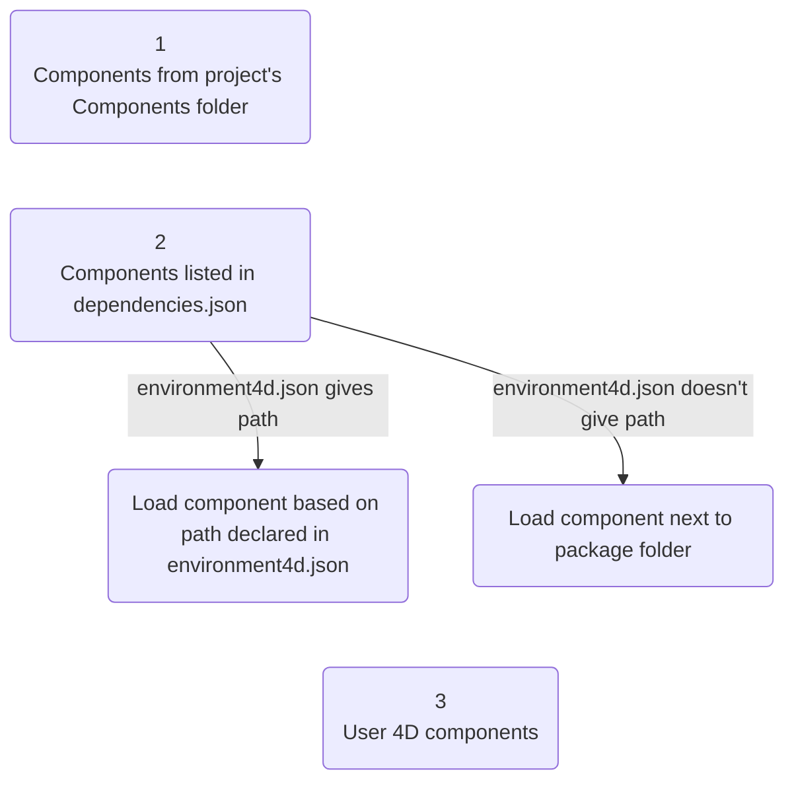
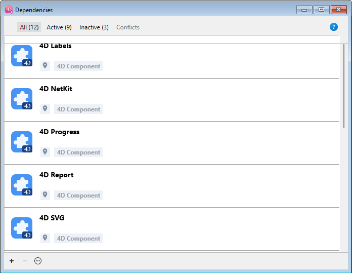
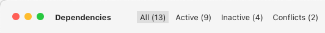
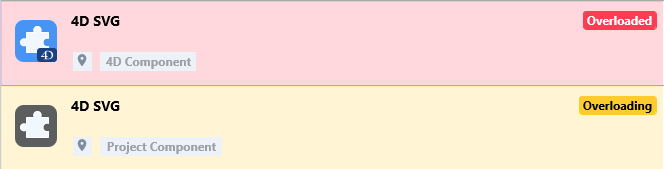
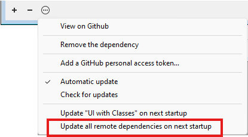
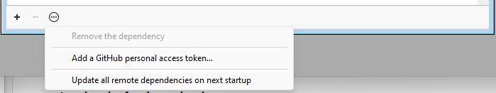

Un componente 4D es un conjunto de código y/o de formularios 4D que representan una o varias funcionalidades que pueden añadirse y utilizarse en sus proyectos. Por ejemplo, el componente [4D SVG](https://github.com/4d/4D-SVG) añade comandos avanzados y un motor de renderizado integrado que puede utilizarse para visualizar archivos SVG.

Puede [desarrollar](../Extensions/develop-components.md) y [crear](../Desktop/building.md) sus propios componentes 4D, o descargar componentes públicos compartidos por la comunidad 4D que [se pueden encontrar en GitHub](https://github.com/search?q=4d-component\\\\\\\\\\\&type=Repositories).

Al desarrollar en 4D, los archivos de los componentes pueden almacenarse de forma transparente en su ordenador o en un repositorio Github.

## Componentes interpretados y compilados

Components can be interpreted or [compiled](../Desktop/building.md).

- Un proyecto 4D que se ejecuta en modo interpretado puede utilizar componentes interpretados o compilados.
- Un proyecto 4D que se ejecuta en modo compilado no puede utilizar componentes interpretados. En este caso, sólo se pueden utilizar componentes compilados.

### Carpeta Package

La carpeta del paquete de un componente puede contener:

- para **componentes interpretados**: una [Carpeta Project](../Project/architecture.md) estándar. El nombre de la carpeta del paquete debe llevar el sufijo **.4dbase** si desea instalarlo en la carpeta [**Componentes** de su proyecto](architecture.md#components).
- para **componentes compilados**:
  - una carpeta "Contents" que contenga un archivo .4DZ, una carpeta *Resources*, un archivo *Info.plist* (arquitectura recomendada)
  - o directamente un archivo .4DZ con otras carpetas como *Resources*.

:::note

La arquitectura de carpetas "Contents" se recomienda para los componentes si desea [notarizar](../Desktop/building.md#about-notarization) sus aplicaciones en macOS.

:::

## Cargando componentes

:::note

Esta página describe cómo trabajar con componentes en los entornos **4D** y **4D Server**. En otros entornos, los componentes se gestionan de manera diferente:

- en [4D en modo remoto](../Desktop/clientServer.md), los componentes son cargados por el servidor y enviados a la aplicación remota.
- en las aplicaciones fusionadas, los componentes se [incluyen en el paso de compilación](../Desktop/building.md#plugins--components-page).

:::

### Generalidades

Para cargar un componente en su proyecto 4D, usted puede:

- copie los archivos de componentes en la carpeta [**Components** de su proyecto](architecture.md#components) (las carpetas de paquetes de componentes interpretados deben llevar el sufijo ".4dbase", ver arriba),
- o bien, declare el componente en el archivo **dependencies.json** de su proyecto; esto se hace automáticamente para los archivos locales cuando [**añade una dependencia utilizando la interfaz del gestor de dependencias**](#adding-a-github-dependency).

Los componentes declarados en el archivo **dependencies.json** pueden almacenarse en diferentes ubicaciones:

- al mismo nivel que la carpeta de paquetes de su proyecto 4D: esta es la ubicación predeterminada,
- en cualquier lugar de su máquina: la ruta del componente debe declararse en el archivo **environment4d.json**
- en un repositorio GitHub: la ruta del componente puede declararse en el archivo **dependencies.json** o en el archivo **environment4d.json**, o en ambos archivos.

Si se instala el mismo componente en distintos lugares, se aplica un [orden de prioridad](#priority).

### dependencies.json y environment4d.json

#### dependencies.json

El archivo **dependencies.json** hace referencia a todos los componentes requeridos en su proyecto 4D. Este archivo debe encontrarse en la carpeta **Sources** de la carpeta del proyecto 4D, por ejemplo.:

```
	/MyProjectRoot/Project/Sources/dependencies.json
```

Puede contener:

- nombres de componentes [almacenados localmente](#declaring-local-components) (ruta por defecto o ruta definida en un archivo **environment4d.json**),
- nombres de componentes [almacenados en repositorios de GitHub](#declaring-components-stored-on-github) (su ruta puede definirse en este archivo o en un archivo **environment4d.json**).

#### environment4d.json

El archivo **environment4d.json** es opcional. Permite definir **rutas personalizadas** para algunos o todos los componentes declarados en el archivo **dependencies.json**. Este archivo puede almacenarse en la carpeta del paquete del proyecto o en una de sus carpetas padre, en cualquier nivel (hasta la raíz).

Los principales beneficios de esta arquitectura son los siguientes:

- puede almacenar el archivo **environment4d.json** en una carpeta padre de sus proyectos y decidir no confirmarlo, permitiéndote tener su organización local de componentes.
- si quiere utilizar el mismo repositorio GitHub para varios de sus proyectos, puede referenciarlo en el archivo **environment4d.json** y declararlo en el archivo **dependencies.json**.

### Prioridad

Dado que los componentes pueden instalarse de distintas formas, se aplica un orden de prioridad cuando se hace referencia al mismo componente en varias ubicaciones:

**Máxima prioridad**

1. Componentes almacenados en la carpeta [**Components** del proyecto](architecture.md#components).
2. Componentes declarados en el archivo **dependencies.json** (la ruta declarada **environment4d.json** anula la ruta **dependencies.json** para configurar un entorno local).
3. Componentes 4D internos del usuario (por ejemplo, 4D NetKit, 4D SVG...)

**Prioridad más baja**



Cuando un componente no puede cargarse debido a otra instancia del mismo componente situada en un nivel de prioridad superior, ambos obtienen un [estado] específico (#dependency-status): el componente no cargado recibe el estado *Overloaded*, mientras que el componente cargado tiene el estado *Overloading*.

### Componentes locales

Declara un componente local en el archivo [**dependencies.json**](#dependencyjson) de la siguiente manera:

```json
{
    "dependencies": {
        "myComponent1" : {},
        "myComponent2" : {}
    }
}
```

... donde "myComponent1" y "myComponent2" son el nombre de los componentes a cargar.

De forma predeterminada, si "myComponent1" y "myComponent2" no están declarados en un archivo [**environment4d.json**](#environment4djson), 4D buscará la carpeta del paquete del componente (*es decir*, la carpeta raíz del proyecto del componente) al mismo nivel que la carpeta del paquete de su proyecto de 4D, por ejemplo:

```
	/MyProjectRoot/
	/MyProjectComponentRoot/
```

Gracias a esta arquitectura, puede simplemente copiar todos sus componentes al mismo nivel que sus proyectos y referenciarlos en sus archivos **dependencies.json**.

:::note

Si no desea utilizar la arquitectura **dependencies.json**, puede instalar componentes locales copiando sus archivos en la carpeta [**Components** de su proyecto](architecture.md#components).

:::

#### Personalizar rutas de componentes

Si la ruta de un componente declarado en el archivo **environment4d.json** no se encuentra cuando se inicia el proyecto, el componente no se carga y obtiene el estado *No encontrado* [status](dependency-status), incluso si existe una versión del componente junto a la carpeta de paquetes del proyecto.

Puede utilizar rutas **relativas** o **absolutas** (ver abajo).

Ejemplos:

```json
{
	"dependencies": {
		"myComponent1" : "MyComponent1",
		"myComponent2" : "../MyComponent2",
    "myComponent3" : "file:///Users/jean/MyComponent3"
    }
}
```

:::note

If a component path declared in the **environment4d.json** file is not found when the project is started, the component is not loaded and gets the *Not found* [status](#dependency-status), even if a version of the component exists next to the project's package folder.

:::

#### Rutas relativas frente a rutas absolutas

Las rutas se expresan en sintaxis POSIX como se describe en [este párrafo](../Concepts/paths#posix-syntax).

Las rutas relativas son relativas al archivo [`environment4d.json`](#environment4djson). Las rutas absolutas están vinculadas a la máquina del usuario.

Utilizar rutas relativas es **recomendable** en la mayoría de los casos, ya que ofrecen flexibilidad y portabilidad de la arquitectura de componentes, especialmente si el proyecto está alojado en una herramienta de control de código fuente.

Las rutas absolutas sólo deben utilizarse para componentes específicos de una máquina y un usuario.

### Configuración del repositorio GitHub

Los componentes 4D disponibles como lanzamientos GitHub pueden ser referenciados y automáticamente cargados y actualizados en sus proyectos 4D.

:::note

En cuanto a los componentes almacenados en GitHub, tanto los archivos [**dependencies.json**](#dependenciesjson) como [**environment4d.json**](#environment4djson) admiten los mismos contenidos.

:::

#### Componentes almacenados en GitHub

Los componentes 4D disponibles en GitHub pueden ser referenciados y cargados automáticamente en sus proyectos 4D.

- Comprima los archivos componentes en formato ZIP.
- Nombre este archivo con el mismo nombre que el repositorio GitHub.
- Integre el archivo en una [versión GitHub](https://docs.github.com/en/repositories/releasing-projects-on-github/managing-releases-in-a-repository) del repositorio.

Estos pasos pueden automatizarse fácilmente, con código 4D o utilizando GitHub Actions, por ejemplo.

#### Declarando rutas

Declare un componente almacenado en GitHub en el archivo [**dependencies.json**](#dependencyjson) de la siguiente manera:

```json
{
	"dependencies": {
		"myGitHubComponent1": {
			"github" : "JohnSmith/myGitHubComponent1"
		},
		"myGitHubComponent2": {}
	}
}
```

... donde "myGitHubComponent1" está referenciado y declarado para el proyecto, aunque "myGitHubComponent2" sólo está referenciado. Necesita declararlo en el archivo [**environment4d.json**](#environment4djson):

```json
{
	"dependencies": {
		"myGitHubComponent2": {
			"github" : "JohnSmith/myGitHubComponent2"
		}
	}
}
```

"myGitHubComponent2" puede ser utilizado por varios proyectos.

#### Etiquetas y versiones

Cuando se crea una versión en GitHub, se le asocia una **etiqueta** y una **versión**. El gestor de dependencias utiliza esta información para gestionar la disponibilidad automática de los componentes.

- **Etiquetas** son textos que hacen referencia única a una versión. En los archivos [**dependencies.json**](#dependencyjson) y [**environment4d.json**](#environment4djson), puede indicar la etiqueta de versión que desea utilizar en su proyecto. Por ejemplo:

```json
{
	"dependencies": {
		"myFirstGitHubComponent": {
			"github": "JohnSmith/myFirstGitHubComponent",
			"tag": "beta2"
		}
	}
}
```

- Una versión también se identifica por una **versión**. The versioning system used is based on the [*Semantic Versioning*](https://regex101.com/r/Ly7O1x/3/) concept, which is the most commonly used. Cada número de versión se identifica de la siguiente manera: `majorNumber.minorNumber.pathNumber`. Del mismo modo que para las etiquetas, puede indicar la versión del componente que desea utilizar en su proyecto, como en este ejemplo:

```json
{
	"dependencies": {
		"myFirstGitHubComponent": {
			"github": "JohnSmith/myFirstGitHubComponent",
			"version": "2.1.3"
		}
	}
}
```

Un rango se define mediante dos versiones semánticas, un mínimo y un máximo, con los operadores '\< | > | >= | <= | ='. El `*` se puede utilizar como un marcador de posición para todas las versiones. Los prefijos ~ y ^ definen versiones a partir de un número, y hasta respectivamente la siguiente versión mayor y menor.

Estos son algunos ejemplos:

- "latest": la versión que tiene el distintivo "latest" en las versiones de GitHub.
- "\*": la última versión lanzada.
- "1.\*": todas las versiones de la versión principal 1.
- "1.2.\*": todos los parches de la versión menor 1.2.
- ">=1.2.3": la última versión, a partir de la versión 1.2.3.
- ">1.2.3": la última versión, empezando por la versión inmediatamente posterior a la 1.2.3.
- "^1.2.3": la última versión 1, a partir de la versión 1.2.3 y estrictamente inferior a la versión 2.
- "~1.2.3": la última versión 1.2, a partir de la versión 1.2.3 y estrictamente inferior a la versión 1.3.
- "<=1.2.3": la última versión hasta la 1.2.3.
- "1.0.0 – 1.2.3" o ">=1.0.0 <=1.2.3": versión entre 1.0.0 y 1.2.3.
- "`<1.2.3 || >=2`": versión que no está entre 1.2.3 y 2.0.0.

Si no especifica una etiqueta o una versión, 4D recupera automáticamente la "última" versión.

El gestor de dependencias comprueba periódicamente si hay actualizaciones de componentes disponibles en Github. Si hay una nueva versión disponible para un componente, se muestra un indicador de actualización para el componente en la lista de dependencias, [dependiendo de su configuración](#defining-a-github-dependency-version-range).

#### Repositorios privados

Si quiere integrar un componente ubicado en un repositorio privado, necesita decirle a 4D que utilice un token de conexión para acceder a él.

Para ello, en su cuenta GitHub, cree un token **classic** con derechos de acceso a **repo**.

:::note

Para más información, consulte la [Interfaz de tokens GitHub](https://github.com/settings/tokens).

:::

A continuación, deberá [suministrar su token de conexión](#providing-your-github-access-token) al gestor de dependencias.

#### Caché local para dependencias

Los componentes GitHub a los que se hace referencia se descargan en una carpeta de caché local y, a continuación, se cargan en su entorno. La carpeta de caché local se guarda en la siguiente ubicación:

- en macOs: `$HOME/Library/Caches/<app name>/Dependencies`
- en Windows: `C:\Users\<username>\AppData\Local\<app name>\Dependencies`

...donde `<app name>` puede ser "4D", "4D Server" o "tool4D".

### dependency-lock.json

Se crea un archivo `dependency-lock.json` en la carpeta [`userPreferences`](architecture.md#userpreferencesusername) de su proyecto.

Este archivo registra información como el estado de las dependencias, rutas, urls, errores de carga, así como otra información. Podría ser útil para la gestión de la carga de componentes o la resolución de problemas.

## Monitoreo de dependencias del proyecto

En un proyecto abierto, puede añadir, eliminar, actualizar y obtener información sobre las dependencias y su estado de carga actual en el panel **Dependencias**.

Para mostrar el panel Dependencias:

- con 4D, seleccione el ítem de menú **Diseño/Dependencias del Proyecto** (entorno de desarrollo),<br/>
  

- con 4D Server, seleccione el ítem de menú **Ventana/Dependencias del Proyecto**.<br/>
  

A continuación, se muestra el panel Dependencias. Las dependencias se ordenan por nombre en orden alfabético:



The Dependencies panel interface allows you to manage dependencies (on 4D single-user and 4D Server).

### Filtrado de dependencias

Por defecto, se listan todas las dependencias identificadas por el gestor de dependencias, sea cual sea su [estado](#dependency-status). Puede filtrar las dependencias mostradas según su estado seleccionando la pestaña correspondiente en la parte superior del panel Dependencias:



- **Activo**: dependencias que están cargadas y pueden ser utilizadas en el proyecto. Incluye dependencias *overloading*, las cuales son realmente cargadas. Las dependencias *Overloaded* se enumeran en el panel **Conflicts** junto con todas las dependencias en conflicto.
- **Inactivo**: dependencias que no están cargadas en el proyecto y no están disponibles. Hay muchas razones posibles para este estado: archivos que faltan, incompatibilidad de versiones...
- **Conflicto**: dependencias que se cargan pero que sobrecargan al menos otra dependencia de menor [nivel de prioridad](#prioridad). También se muestran las dependencias sobrecargadas para que pueda comprobar el origen del conflicto y tomar las medidas oportunas.

### Estado de dependencias

Las dependencias que requieren la atención del desarrollador se indican mediante una **etiqueta de estado** a la derecha de la línea y un color de fondo específico:



Las siguientes etiquetas de estado están disponibles:

- **Overloaded**: la dependencia no se carga porque está sobrecargada por otra dependencia con el mismo nombre en un [nivel de prioridad] superior(#prioridad).
- **Overloading**: la dependencia está cargada y está sobrecargando una o más dependencias con el mismo nombre en un [nivel de prioridad] inferior(#prioridad).
- **Not found**: la dependencia se declara en el archivo dependencies.json pero no se encuentra.
- **Inactive**: la dependencia no se carga porque no es compatible con el proyecto (por ejemplo, el componente no está compilado para la plataforma actual).
- **Duplicated**: la dependencia no se carga porque existe otra dependencia con el mismo nombre en la misma ubicación (y está cargada).
- **Disponible después del reinicio**: la referencia a dependencias acaba de ser añadida o actualizada [usando la interfaz](#monitoring-project-dependencies), se cargará una vez que la aplicación se reinicie.
- **Descargado después de reiniciar**: la referencia de dependencias acaba de ser removida [utilizando la interfaz](#removing-a-dependency), se descargará una vez que la aplicación se reinicie.
- **Actualización disponible<version\>**: se ha detectado una nueva versión de la dependencia GitHub que coincide con su [configuración de la versión del componente](#defining-a-github-dependency-version-range).
- **Reiniciado tras reinicio**: la [configuración de la versión del componente](#defining-a-github-dependency-version-range) de la dependencia de GitHub se ha modificado, se ajustará el próximo inicio.
- **Actualización reciente**: se ha cargado una nueva versión de la dependencia de GitHub al inicio.

Al pasar el ratón por encima de la línea de dependencia, se muestra un mensaje que ofrece información adicional sobre el estado:


### Origen de la dependencia

El panel Dependencias enumera todas las dependencias del proyecto, sea cual sea su origen, es decir, de dónde procedan. El origen de la dependencia lo suministra la etiqueta bajo su nombre:


Las siguientes opciones de origen son posibles:

| Etiqueta de origen                | Descripción                                                                        |
| --------------------------------- | ---------------------------------------------------------------------------------- |
| Componente 4D                     | Componente 4D integrado, almacenado en la carpeta `Components` de la aplicación 4D |
| dependencies.json | Componente declarado en el archivo [`dependencies.json`](#dependenciesjson)        |
| Entorno                           | Componente declarado en el archivo [`environnement4d.json`](#environment4djson)    |
| Componente del proyecto           | Componente ubicado en la carpeta [`Components`](architecture.md#components)        |

**Clic derecho** en una línea de dependencia y selecciona **Mostrar en el disco** para revelar la ubicación de una dependencia:


:::note

Este elemento no se muestra si la relación está inactiva porque no se encuentran sus archivos.

:::

El icono del componente y el logotipo de ubicación ofrecen información adicional:

- El logotipo del componente indica si es suministrado por 4D o por un desarrollador externo.
- Los componentes locales se pueden diferenciar de los componentes GitHub por un pequeño icono.


### Añadir una dependencia local

Para añadir una dependencia local, haga clic en el botón **+** en el área de pie de página del panel. Se muestra la siguiente caja de diálogo:


Asegúrese de que la pestaña **Local** esté seleccionada y haga clic en el botón **...**. Aparece una caja de diálogo estándar Abrir archivo, que le permite seleccionar el componente que desea añadir. Puede seleccionar un [**.4DZ**](../Desktop/building.md#build-component) o un archivo [**.4DProject**](architecture.md##applicationname4dproject-file).

Si el elemento seleccionado es válido, su nombre y ubicación se muestran en la caja de diálogo.


Si el elemento seleccionado no es válido, se mostrará un mensaje de error.

Haga clic en **Añadir** para añadir la dependencia al proyecto.

- Si selecciona un componente situado junto a la carpeta del paquete del proyecto (ubicación predeterminada), se declara en el archivo [**dependencies.json**](#dependenciesjson).
- Si selecciona un componente que no se encuentra junto a la carpeta del paquete del proyecto, se declara en el archivo [**dependencies.json**](#dependenciesjson) y su ruta se declara en el archivo [**environment4d.json**](#environmen4djson) (ver nota). El panel Dependencias le pregunta si desea guardar una [ruta relativa o absoluta](#relative-paths-vs-absolute-paths).

:::note

Si en este paso no se ha definido aún ningún archivo [**environment4d.json**](#environmen4djson) para el proyecto, se creará automáticamente en la carpeta del paquete del proyecto (ubicación por defecto).

:::

La dependencia se añade a la [lista de dependencias inactivas](#dependency-status) con el estado **Disponible después de reiniciar**. Se cargará cuando se reinicie la aplicación.

### Añadir una dependencia GitHub

Para añadir una [dependencia GitHub](#components-stored-on-github), haga clic en el botón **+** en el área de pie de página del panel y seleccione la pestaña **GitHub**.


Introduzca la ruta del repositorio GitHub de la dependencia. Podría ser una **URL del repositorio** o una **cadena de nombres de repositorio github/account/repository**, por ejemplo:


Una vez establecida la conexión, se muestra el icono de GitHub en el lado derecho del área de entrada. Puede hacer clic en este icono para abrir el repositorio en su navegador predeterminado.

:::note

Si el componente se almacena en un [repositorio privado de GitHub](#private-repositories) y falta su token personal, se muestra un mensaje de error y se muestra un botón **Añadir un token de acceso personal...**  (ver [Suministrar su token de acceso GitHub](#providing-your-github-access-token)).

:::

Definir el [rango de versiones de dependencia](#tags-and-versions) a utilizar para este proyecto. Por defecto, se selecciona "Última", lo que significa que se utilizará automáticamente la última versión.

Haga clic en el botón **Añadir** para añadir la dependencia al proyecto.

La dependencia de GitHub declarada en el archivo [**dependencies.json**](#dependenciesjson) y añadida a la [lista de dependencias inactivas](#dependency-status) con el estado **Disponible al reiniciar**. Se cargará cuando se reinicie la aplicación.

#### Definición de un intervalo de versiones de dependencia de GitHub

Puede definir la opción [etiqueta o versión](#tags-and-versions) para una dependencia:


- **Último**: seleccionado por defecto y permite descargar la versión etiquetada como la última versión (estable).
- **Hasta la próxima versión mayor**: define un [rango de versiones semánticas](#tags-and-versions) para restringir las actualizaciones a la próxima versión principal.
- **Hasta la siguiente versión menor**: del mismo modo, restringir las actualizaciones a la siguiente versión menor.
- **Versión exacta (Etiqueta)**: selecciona o introduce manualmente una [etiqueta específica](#tags-and-versions) de la lista disponible.

La versión actual de la dependencia de GitHub se muestra a la derecha del elemento de la dependencia:


#### Modificación del intervalo de versiones de las dependencias GitHub

Puede modificar la [configuración de versión](#defining-a-github-dependency-version-range) para una dependencia de GitHub listada: selecciona la dependencia a modificar y selecciona **Modificar la dependencia...** desde el menú contextual. En el cuadro de diálogo "Modificar la dependencia", edite el menú Regla de dependencia y haga clic en **Aplicar**.

Modificar el rango de versiones es útil, por ejemplo, si utiliza la función de actualización automática y desea bloquear una dependencia a un número de versión específico.

### Actualización de las dependencias GitHub

El gestor de dependencias ofrece una gestión integrada de las actualizaciones en GitHub. Se soportan las siguientes funcionalidades:

- Verificación automática y manual de las versiones disponibles
- Actualización automática y manual de los componentes

Las operaciones manuales pueden realizarse **por dependencia** o **para todas las dependencias**.

#### Comprobación de nuevas versiones

Las actualizaciones de las dependencias se comprueban periódicamente en GitHub. Esta verificación se realiza de forma transparente en segundo plano.

:::note

Si suministra un [token de acceso](#providing-your-github-access-token), las verificiones se realizan con mayor frecuencia, ya que GitHub permite entonces una mayor frecuencia de solicitudes a los repositorios.

:::

Además, puede buscar actualizaciones en cualquier momento, para una sola dependencia o para todas las dependencias:

- Para verificar las actualizaciones de una única dependencia, haga clic con el botón derecho del ratón en la dependencia y seleccione **Verificar actualizaciones** en el menú contextual.


- Para verificar si hay actualizaciones de todas las dependencias, haga clic en el menú **opciones** de la parte inferior de la ventana del gestor de dependencias y seleccione **Verificar actualizaciones**.


Si se detecta en GitHub una nueva versión del componente que coincide con su [configuración de versiones del componente](#defining-a-github-dependency-version-range), se muestra un estado de dependencia específico:


Puede decidir [actualizar el componente](#updating-dependencies) o no.

Si no desea utilizar una actualización de componentes (por ejemplo, desea permanecer con una versión específica), simplemente deje el estado actual (asegúrese de que la función [**Actualización automática**](#automatic-update) no está marcada).

#### Actualización de dependencias

**Actualizar una dependencia** significa descargar una nueva versión de la dependencia desde GitHub y mantenerla lista para ser cargada la próxima vez que se inicie el proyecto.

Puede actualizar las dependencias en cualquier momento, para una sola dependencia o para todas las dependencias:

- Para actualizar una sola dependencia, haga clic con el botón derecho del ratón en la dependencia y seleccione **Actualizar<component name\> en el próximo inicio** en el menú contextual o en el menú **opciones** de la parte inferior de la ventana del gestor de dependencias:


- Para actualizar todas las dependencias a la vez, haga clic en el menú **opciones** de la parte inferior de la ventana del gestor de dependencias y seleccione **Actualizar todas las dependencias remotas en el próximo inicio**:



En cualquier caso, sea cual sea el estado actual de la dependencia, se realiza una verificación automática en GitHub antes de actualizar la dependencia, para asegurarse de que se recupera la versión más reciente, [según la configuración de versionado de su componente](#defining-a-github-dependency-version-range).

Al seleccionar un comando de actualización:

- se muestra un cuadro de diálogo que propone **reiniciar el proyecto**, para que las dependencias actualizadas estén disponibles de inmediato. Normalmente se recomienda reiniciar el proyecto para evaluar las dependencias actualizadas.
- si hace clic en Más tarde, el comando de actualización ya no estará disponible en el menú, lo que significa que la acción se ha planificado para el siguiente inicio.

#### Actualización automática

La opción **Actualización automática** está disponible en el menú **opciones** de la parte inferior de la ventana del gestor de dependencias.

Cuando esta opción está marcada (por defecto), las nuevas versiones de componentes de GitHub que coincidan con su [configuración de versiones de componentes](#defining-a-github-dependency-version-range) se actualizan automáticamente para el siguiente inicio del proyecto. Esta opción facilita la gestión diaria de las actualizaciones de dependencias, al eliminar la necesidad de seleccionar manualmente las actualizaciones.

Cuando esta opción no está marcada, una nueva versión del componente que coincida con su [configuración de versiones del componente](#defining-a-github-dependency-version-range) sólo se indicará como disponible y requerirá una [actualización manual](#updating-dependencies). Desmarque la opción **Actualización automática** si desea controlar con precisión las actualizaciones de las dependencias.

### Suministrando su token de acceso de GitHub

Registrar su token de acceso personal en el gestor de dependencias es:

- obligatorio si el componente se almacena en un [repositorio privado de GitHub](#private-repositories),
- recomendado para una [verificación de actualizaciones de dependencias](#updating-github-dependencies) más frecuente.

Para proporcionar su token de acceso a GitHub, también puede:

- haga clic en el botón \*\*Agregar un token de acceso personal... \* que se muestra en el cuadro de diálogo "Añadir una dependencia" después de introducir una ruta privada del repositorio de GitHub.
- o, seleccione **Agregar un token de acceso personal de GitHub...** en el menú Administrador de Dependencias en cualquier momento.



Luego puede introducir su token de acceso personal:


Solo puede introducir un token de acceso personal. Una vez se ha sido introducido un token, puede editarlo.

El token proporcionado se almacena en un archivo **github.json** en la [carpeta activa de 4D](../commands-legacy/get-4d-folder.md#active-4d-folder).

### Eliminando una dependencia

Para eliminar una dependencia desde el panel de dependencias, seleccione la dependencia que desea eliminar y haga clic en el botón **-** del panel o seleccione **Eliminar la dependencia...** en el menú contextual. Puede seleccionar varias relaciones, en cuyo caso la acción se aplica a todas las relaciones seleccionadas.

:::note

Sólo las dependencias declaradas en el archivo [**dependencies.json**](#dependenciesjson) pueden eliminarse mediante el panel Dependencias. Si no se puede eliminar una dependencia seleccionada, se desactiva el botón **-** y se oculta la opción de menú **Eliminar la dependencia...**.

:::

Aparece una caja de diálogo de confirmación. Si la dependencia se declaró en el archivo **environment4d.json**, una opción permite eliminarla:


Si confirma la caja de diálogo, la dependencia eliminada [estado](#estado-dependencia) se marca automáticamente como "Descargar tras reinicio". Se descargará cuando se reinicie la aplicación.
