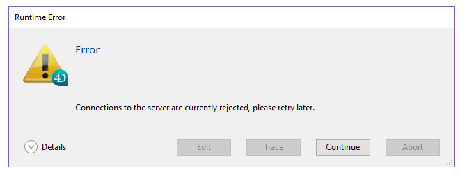

La página Servidor de aplicaciones agrupa información sobre la aplicación de escritorio publicada por 4D Server y puede utilizarse para gestionar esta publicación.

La parte superior de la página ofrece información sobre el estado actual del servidor de aplicaciones de 4D Server.

- **Estado**: Iniciado o Detenido.
- **Hora de inicio**: fecha y hora de inicio del servidor de aplicaciones. Esta fecha corresponde a la apertura del proyecto por parte de 4D Server.
- **Duración de funcionamiento**: tiempo transcurrido desde la última apertura del proyecto por el servidor.

## Aceptar/Rechazar nuevas conexiones

Este botón se activa y se puede utilizar para gestionar el acceso de nuevas máquinas cliente de escritorio al servidor de aplicaciones.

Por defecto, cuando se publica el proyecto:

- La etiqueta del botón es "Rechazar nuevas conexiones."
- Los nuevos clientes de escritorio pueden conectarse libremente (dentro de los límites de las conexiones permitidas por la licencia).
- El nombre del proyecto se publica en la caja de diálogo de conexión remota (si la opción "Publicar el nombre de la base al inicio en el diálogo de conexión" está marcada en las Preferencias).

Si presiona el botón **Rechazar nuevas conexiones**:

- El título del botón cambia a "Aceptar nuevas conexiones."
- Ningún nuevo cliente puede entonces conectarse. Los clientes que intenten conectarse recibirán el siguiente mensaje:

- El nombre del proyecto ya no aparece en el diálogo de conexión remota.
- Los clientes de escritorio que ya están conectados no se desconectan y pueden seguir trabajando con normalidad.

> Puede realizar la misma acción con el comando [`REJECT NEW REMOTE CONNECTIONS`](https://doc.4d.com/4dv19/help/command/en/page1635.html).

- Si presiona el botón **Aceptar nuevas conexiones**, el servidor de aplicaciones vuelve a su estado por defecto.

Esta función permite, por ejemplo, que un administrador realice diversas operaciones de mantenimiento (verificación, compactación, etc.) justo después de haber iniciado el servidor. Si el administrador utiliza una conexión remota, puede estar seguro de ser el único que modifica los datos. También es posible utilizar esta función para preparar una operación de mantenimiento que requiera que no haya ninguna máquina cliente conectada.

## Información

### Configuración

Esta área ofrece información sobre el proyecto 4D publicado por el servidor: nombre y ubicación de los archivos de datos y de estructura y nombre del archivo de historial de la base. Puede hacer clic en el nombre del archivo de estructura o de datos para ver su ruta de acceso completa.

El campo **Mode** indica el modo de ejecución actual de la aplicación: compilada o interpretada.

La parte inferior del área indica los parámetros de configuración del servidor (lanzados como servicio, puerto y dirección IP) y la activación del TLS para las conexiones cliente-servidor (no afecta a las conexiones SQL ni HTTP).

### Memoria

Esta área indica la **memoria caché total** (parámetro definido en las preferencias de la base) y la **memoria caché utilizada** (asignación dinámica por 4D Server en función de sus necesidades).

### Conexiones aplicación servidor

- **Máximo**: número máximo de conexiones cliente simultáneas permitidas para el servidor de aplicaciones. Este valor depende de la licencia instalada en el equipo servidor.
- **Utilizado**: número real de conexiones que se están utilizando actualmente.
