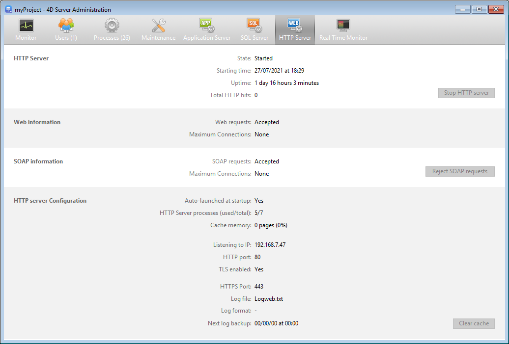

La página **Servidor HTTP** agrupa la información sobre el servidor Web y el servidor SOAP de 4D Server. El servidor web le permite publicar contenido web, como páginas HTML o imágenes para los navegadores web, y gestionar las peticiones REST. El servidor SOAP gestiona la publicación de los servicios web. Estos servidores dependen del servidor HTTP interno de 4D Server.

La parte superior de la página ofrece información sobre el estado actual del servidor HTTP de 4D Server.

- **Estado**: Iniciado o Detenido
- **Hora de inicio**: fecha y hora en que el servidor HTTP fue lanzado por última vez.
- **Duración del funcionamiento**: tiempo transcurrido desde el último arranque del servidor HTTP.
- **Total de hits HTTP**: número de hits HTTP (de bajo nivel) recibidos por el servidor HTTP desde que se inició.

## Iniciar/detener el servidor HTTP

Este botón se alterna y puede utilizarse para controlar la activación del servidor HTTP de 4D Server.

- Cuando el estado del servidor HTTP es "Iniciado", el botón se etiqueta**Detener el servidor HTTP**. Si hace clic en este botón, el servidor HTTP de 4D Server se detiene inmediatamente; el servidor web, el servidor REST y el servidor SOAP dejan de aceptar peticiones.
- Cuando el estado del servidor HTTP es "Detenido", el botón se titula **Iniciar servidor HTTP**. Si hace clic en este botón, el servidor HTTP de 4D Server se inicia inmediatamente; se aceptan peticiones Web, REST y SOAP.

> Debe tener una licencia adecuada para poder iniciar el servidor HTTP.
>
> El servidor HTTP también puede lanzarse automáticamente al iniciar la aplicación (Preferencias) o por programación.

## Información Web

Esta área ofrece información específica sobre el servidor web de 4D Server.

- **Peticiones web**: aceptadas o rechazadas. Esta información indica si el servidor web está activado. Dado que el servidor web está directamente vinculado al servidor HTTP, las peticiones web se aceptan cuando se inicia el servidor HTTP y se rechazan cuando se detiene.
- **Conexiones máximas**: número máximo de conexiones web permitidas. Este valor depende de la licencia instalada en el equipo servidor.

## Información SOAP

Esta área ofrece información específica sobre el servidor SOAP de 4D Server e incluye un botón de control.

- **Peticiones SOAP**: aceptadas o rechazadas. Esta información indica si el servidor SOAP está activado. Para que las peticiones SOAP sean aceptadas, el servidor HTTP debe estar iniciado y el servidor SOAP debe aceptar explícitamente las peticiones (ver el botón Aceptar/Rechazar).
- **Conexiones máximas**: número máximo de conexiones SOAP permitidas. Este valor depende de la licencia instalada en el equipo servidor.
- Botón **Aceptar/rechazar las peticiones SOAP**: este botón se alterna y puede utilizarse para controlar la activación del servidor SOAP de 4D Server. Este botón modifica el valor de la opción **Autorizar peticiones de servicios web** en la página "Servicios web" de las Propiedades de la base (y viceversa). También puede utilizar el comando [`SOAP REJECT NEW REQUESTS`](https://doc.4d.com/4dv19/help/command/en/page1636.html) para rechazar nuevas peticiones SOAP, sin embargo esto no modifica el valor de la opción **Permitir solicitudes de servicios web**.

Si presiona el botón **Aceptar las peticiones SOAP** y el servidor HTTP está detenido, 4D lo inicia automáticamente.

## Configuración servidor HTTP

Esta área ofrece información sobre los parámetros de configuración y el funcionamiento del servidor HTTP:

- **Lanzamiento automático al inicio**: parámetro definido a través de las Propiedades.
- **Proceso servidor HTTP (utilizado/total)**: número de procesos HTTP creados en el servidor (número actual de procesos / total de todos los procesos creados).
- **Memoria caché**: tamaño de la memoria caché del servidor HTTP, cuando está activada (tamaño realmente utilizado por la caché / tamaño máximo teóricamente asignado a la caché en las Propiedades). Puede hacer clic en el botón **Borrar caché** para vaciar la caché actual.
- **Escuchando IP**, **puerto HTTP** (80 por defecto), **TLS habilitado** para conexiones HTTP (no afecta a conexiones 4D ni SQL) y **puerto HTTP** utilizado: [parámetros de configuración](WebServer/webServerConfig. d) del servidor HTTP, especificado a través de la Configuración o por programación.
- **Información del archivo de registro**: nombre, formato y fecha de la siguiente copia de seguridad automática del registro del servidor HTTP (archivo logweb.txt).
