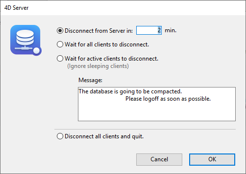

La página **Mantenimiento** de la ventana de administración de 4D Server ofrece información relativa al funcionamiento actual de la aplicación. También ofrece acceso a las funciones básicas de mantenimiento:

## Última verificación/compactación

Estas áreas indican la fecha, la hora y el estado de la última [verificación de datos](MSC/verify.md) y [operación de compactación](MSC/compact.md) efectuadas en la base.

### Verificar registros e índices

Este botón permite lanzar directamente la operación de verificación, sin interrumpir el servidor. Tenga en cuenta que el servidor puede ralentizarse notablemente durante la operación.

Se verifican todos los registros y todos los índices de la base de datos. Si desea poder orientar la verificación o disponer de opciones adicionales, deberá utilizar el [Centro de mantenimiento y seguridad](MSC/overview.md) (CSM).

Tras la verificación, se genera un archivo de informe en formato XML en el servidor, en la carpeta [maintenance Logs](Project/architecture.md#logs). El botón **Ver informe** (llamado **Descargar informe** si la operación se ha realizado desde una máquina remota) le permite visualizar el archivo en su navegador.

### Compactar los datos...

Este botón puede utilizarse para lanzar directamente una operación de compactación de datos. Esta operación requiere detener el servidor: al hacer clic en este botón, aparece la caja de diálogo de cierre de 4D Server para que pueda elegir cómo interrumpir la operación:

Tras la interrupción efectiva del servicio de la aplicación, 4D Server efectúa una operación estándar de compactación de los datos de la base. Si desea disponer de opciones adicionales, deberá utilizar el [Centro de seguridad y de mantenimiento (CSM)](MSC/overview.md).

Una vez finalizada la compactación, 4D Server relanza automáticamente la aplicación. A continuación, los usuarios de 4D pueden volver a conectarse.

> Si la solicitud de compactación se realizó desde una máquina remota 4D, esta máquina es reconectada automáticamente por 4D Server.

Tras la verificación, se genera un archivo de informe en formato XML en el servidor, en la carpeta [maintenance Logs](Project/architecture.md#logs). El botón **Ver informe** (llamado **Descargar informe** si la operación se ha realizado desde una máquina remota) le permite visualizar el archivo en su navegador.

## Tiempo de funcionamiento

Esta área indica la duración de la ejecución de la aplicación 4D Server desde la última vez que se inició (días, horas y minutos).

### Reiniciar el servidor...

Este botón permite cerrar inmediatamente el proyecto y reiniciarlo. Cuando presione este botón, aparecerá la caja de diálogo de cierre de 4D Server para que pueda elegir cómo interrumpir la operación. Tras la validación, 4D Server cierra automáticamente el proyecto y lo vuelve a abrir. A continuación, los usuarios de 4D pueden volver a conectarse.

> Si la solicitud de reinicio se realizó desde una máquina 4D remota, esta máquina es reconectada automáticamente por 4D Server.

## Última copia de seguridad

Esta área indica la fecha y la hora de la [última copia de seguridad](MSC/backup.md) de la base y ofrece información sobre la próxima copia de seguridad automática programada (si la hay). Las copias de seguridad automáticas se configuran en la página **Periodicidad** de las propiedades de estructura.

- **Última copia de seguridad**: fecha y hora de la última copia de seguridad.
- **Próxima copia de seguridad**: fecha y hora de la próxima copia de seguridad programada.
- **Espacio necesario**: espacio estimado necesario para la copia de seguridad. El tamaño real del archivo de copia de seguridad puede variar en función de la configuración (compresión, etc.) y de acuerdo a las variaciones del archivo de datos.
- **Espacio disponible**: espacio disponible en el volumen de copia de seguridad.

El botón **Iniciar copia de seguridad** permite realizar una copia de seguridad inmediata de la base utilizando los parámetros de copia de seguridad actuales (archivos de copia de seguridad, ubicación de los archivos, opciones, etc.). Puede ver estos parámetros haciendo clic en el botón **Propiedades...**. Durante una copia de seguridad en el servidor, los equipos cliente quedan "bloqueados" (pero no desconectados) y no es posible que se conecten nuevos clientes.

## Historial de peticiones y depuración

Esta área indica la duración de registro de los archivos de historial (cuando se activan) y le permite controlar su activación.

Consulte la sección [**Descripción de los archivos de historial**](Debugging/debugLogFiles.md) para obtener más información sobre los archivos de historial.

### Iniciar/Detener Solicitud y Depurar Registros

El botón **Iniciar los registros de peticiones y de depuración** inicia los archivos de registro. Dado que esto puede deteriorar notablemente el rendimiento del servidor, debe reservarse para la fase de desarrollo de la aplicación.

> Este botón sólo registra las operaciones que se ejecutan en el servidor.

Una vez activados los registros, el título del botón cambia a **Detener los registros de peticiones y depurar**, para que pueda detener el registro de peticiones en cualquier momento. Preste atención al hecho de que reiniciar el registro después de detenerlo "borra" el archivo anterior.

### Ver el informe

El botón **Ver informe** (llamado **Descargar el informe** si la operación se ha realizado desde un cliente de escritorio remoto) permite abrir una ventana sistema en la que se muestra el archivo de registro de peticiones.

### Cargar archivo de configuración de logs

Este botón le permite cargar un [archivo de configuración de log](Debugging/debugLogFiles.md#using-a-log-configuration-file)(archivo`.json`) para un servidor específico. Este archivo puede ser facilitado por los servicios técnicos de 4D para el seguimiento y estudio de casos concretos.

### Detener el registro

Este botón suspende todas las operaciones de registro iniciadas en el servidor. Esta funcionalidad puede ser útil para aligerar temporalmente las tareas del servidor.

Cuando los registros se han puesto en pausa, el título del botón cambia a **Reanudar registro**, para que pueda reanudar las operaciones de registro.

> Puede pausar y reanudar el registro utilizando el comando [SET DATABASE PARAMETER](https://doc.4d.com/4dv19/help/command/en/page642.html).
