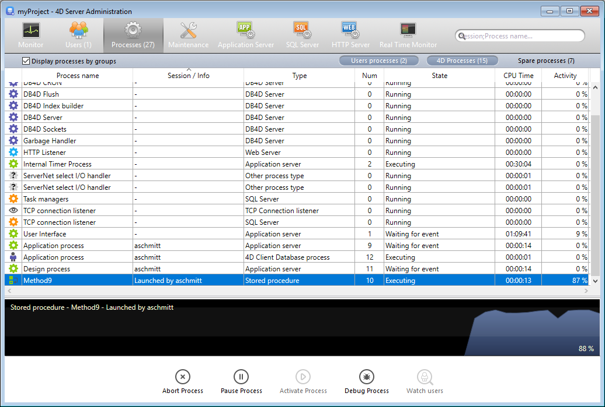
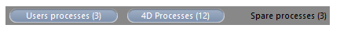

La página **Procesos** lita todos los procesos en ejecución.

El botón "Procesos" indica, entre paréntesis el número total de procesos en ejecución en el servidor (este número no tiene en cuenta los filtros de visualización aplicados a la ventana ni el estado de la opción **Mostrar los procesos por grupos**).

Puede cambiar el orden de las columnas simplemente arrastrando y soltando las áreas de encabezado de las columnas. También puede ordenar la lista de los valores de las columnas haciendo clic en su encabezado.

Al igual que la página Usuarios, esta página contiene un [área de búsqueda/filtrado](users.md#searchfiltering-area) dinámica que puede utilizarse para reducir el número de líneas mostradas en la lista a las que corresponden al texto introducido en el área La búsqueda/filtrado se realiza en las columnas Sesión y Nombre del proceso.

También hay tres botones de acceso directo que se pueden utilizar para filtrar por el tipo de proceso que se muestra en la ventana:

- **Procesos usuarios**: procesos generados por y para las sesiones usuarios. Estos procesos van precedidos de un icono en forma de una persona.
- **Procesos 4D**: procesos generados por el motor de 4D Server. Estos procesos van precedidos de un icono en forma de rueda dentada.
- **Procesos de reserva**: procesos inactivos pero que se mantienen temporalmente y que pueden reutilizarse en cualquier momento. Este mecanismo optimiza la reactividad de 4D Server. Estos procesos van precedidos de un icono en forma de figura atenuada.

La opción **Mostrar los procesos por grupos** le permite agrupar los procesos internos de 4D Server así como los procesos cliente, para una mejor legibilidad. Cuando seleccione esta opción:

- los procesos cliente 4D "gemelos" (proceso cliente 4D principal y proceso base cliente 4D, véase [Tipo de proceso ](#process-type)) se agrupan como uno solo,
- se crea un grupo "Gestores de tareas", que incluye los procesos internos dedicados al reparto de tareas (Shared balancer, Net session manager, Exclusive pool worker),
- se crea un grupo "Gestores de clientes", que incluye varios procesos internos clientes.

La área inferior de la ventana se utiliza para mostrar la representación gráfica de la actividad del proceso(s) seleccionados.

> Puede seleccionar varias líneas manteniendo presionada la tecla **Mayús** para una selección adyacente o **Ctrl** (Windows) / **Comando** (macOS) para una selección no adyacente.

La actividad del proceso es el porcentaje de tiempo que 4D Server ha dedicado a este proceso (ratio). La ventana ofrece la siguiente información para cada proceso:

- Tipo de proceso (ver abajo),
- Sesión/Información:
  - Proceso 4D - en blanco,
  - Proceso usuario - Nombre del usuario 4D,
  - Proceso web - ruta URL,
- Nombre del proceso,
- Número del proceso (devuelto por el comando [`New process`](https://doc.4d.com/4dv19/help/command/en/page317.html) por ejemplo). El número de proceso es el número asignado en el servidor. En el caso de un proceso global, este número puede ser diferente del asignado en la máquina cliente.
- Estado actual del proceso,
- Tiempo de ejecución (en segundos) del proceso desde su creación,
- Porcentaje de tiempo que 4D Server ha dedicado a este proceso (ratio).

## Tipo del proceso

Cada proceso se identifica con un icono y un tipo. El color y la forma del icono indican el tipo de proceso:

| icon                                       | type                                                                                                                                                                                                                      |
| ------------------------------------------ | ------------------------------------------------------------------------------------------------------------------------------------------------------------------------------------------------------------------------- |
|   | Servidor de aplicación                                                                                                                                                                                                    |
|   | Servidor SQL                                                                                                                                                                                                              |
|   | Servidor DB4D (motor de base de datos)                                                                                                                                                                 |
|   | Servidor Web                                                                                                                                                                                                              |
|   | Servidor SOAP                                                                                                                                                                                                             |
|   | Proceso cliente 4D protegido (proceso de desarrollo de un 4D conectado)                                                                                                                                |
|   | Proceso principal de un cliente 4D conectado o proceso creado con `New process` en un cliente 4D conectado (Proceso colaborativo, equivalente en el servidor del proceso creado en la máquina cliente) |
|   | Proceso cliente 4D principal (proceso paralelo a un proceso cliente 4D. Proceso apropiativo responsable de controlar el proceso cliente 4D principal correspondiente)                  |
|   | Proceso de reserva (antiguo o futuro "¨Proceso cliente 4D base de datos")                                                                                                                              |
|  | Worker servidor SQL                                                                                                                                                                                                       |
|  | Proceso worker servidor HTTP                                                                                                                                                                                              |
|  | Procedimiento almacenado (proceso lanzado por un 4D conectado y ejecutado en el servidor)                                                                                                              |
|  | Método web (lanzado por 4DACTION por ejemplo)                                                                                                                                                          |
|  | Método web (apropiativo)                                                                                                                                                                               |
|  | Método SOAP (lanzado por un Web Service)                                                                                                                                                               |
|  | Método SOAP (apropiativo)                                                                                                                                                                              |
|  | Logger (registrador)                                                                                                                                                                                   |
|  | Listener conexión TCP                                                                                                                                                                                                     |
|  | Gestor de sesiones TCP                                                                                                                                                                                                    |
|  | Otro proceso                                                                                                                                                                                                              |
|  | Proceso worker (cooperativo)                                                                                                                                                                           |
|  | Proceso 4D client (apropiativo)                                                                                                                                                                        |
|  | Procedimiento almacenado (proceso apropiativo)                                                                                                                                                         |
|  | Proceso worker (apropiativo)                                                                                                                                                                           |

> Cada proceso cliente 4D principal y su proceso base 4D cliente "gemelo" se agrupan cuando se marca la opción **Mostrar los procesos por grupos**.

## Botones de administración

La página también tiene cinco botones de control que actúan sobre el proceso o procesos seleccionados. Tenga en cuenta que sólo se puede actuar sobre los procesos usuario.

- **Abortar proceso**: permite abortar el proceso o los procesos seleccionados. Al presionar este botón, aparece una caja de diálogo de alerta para que pueda confirmar o cancelar la operación.

> También puede abortar directamente el proceso o procesos seleccionados sin que aparezca la caja de diálogo de confirmación, manteniendo pulsada la tecla **Alt** mientras hace clic en este botón, o utilizando el comando [`ABORT PROCESS BY ID`](https://doc.4d.com/4dv19/help/command/en/page1634.html).

- **Pausar proceso**: permite pausar los procesos seleccionados.
- **Activar proceso**: permite reactivar los procesos seleccionados. Los procesos deben haberse pausado previamente (utilizando el botón anterior o por programación); de lo contrario, este botón no tiene ningún efecto.
- **Depurar proceso**: permite abrir en el equipo servidor una o varias ventanas de depuración para el proceso o procesos seleccionados. Al presionar este botón, aparece una caja de diálogo de alerta para que pueda confirmar o cancelar la operación. Tenga en cuenta que la ventana del depurador sólo se muestra cuando el código 4D se ejecuta efectivamente en la máquina servidor (por ejemplo, en un trigger o en la ejecución de un método que tenga el atributo "Ejecutar en servidor").

> También puede depurar un proceso directamente sin mostrar la caja de diálogo de confirmación manteniendo presionada la tecla **Alt** mientras presiona este botón.

- **Ver usuarios**: permite visualizar, en la [página Usuarios](users.md), todos los procesos del usuario o usuarios seleccionados. Este botón se activa cuando se selecciona al menos un proceso de usuario.
