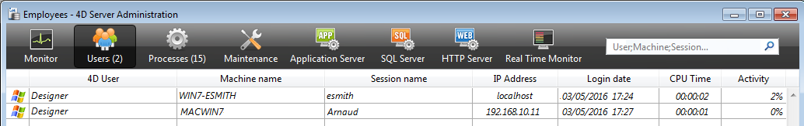

La página **Usuarios** lista los usuarios 4D conectados al servidor.

El botón "Usuarios" indica, entre paréntesis, el número total de usuarios conectados al servidor (este número no tiene en cuenta los filtros de visualización aplicados a la ventana). La página también contiene un área de búsqueda dinámica y botones de control. Puede modificar el orden de las columnas arrastrando y soltando sus áreas de encabezados.

También puede ordenar la lista de los valores de las columnas haciendo clic en su encabezado. Haga clic varias veces para especificar a su vez un orden ascendente/descendente.

## Lista de usuarios

Para cada usuario conectado al servidor, la lista ofrece la siguiente información:

- Sistema de la máquina cliente (macOS o Windows) como un icono.
- **Usuario 4D**: nombre del usuario 4D, o alias si se ha establecido con el comando [`SET USER ALIAS`](https://doc.4d.com/4dv19/help/command/en/page1666.html) en la máquina del usuario. Si las contraseñas no están activadas y no se ha definido ningún alias, todos los usuarios se denominan "Diseñador".
- **Nombre de máquina**: Nombre de la máquina remota.
- **Nombre de sesión**: nombre de la sesión abierta en la máquina remota.
- **Dirección IP**: dirección IP de la máquina remota.
- **Fecha de conexión**: fecha y hora de la conexión de la máquina remota.
- **Tiempos CPU**: tiempos procesador consumidos por este usuario desde la conexión.
- **Actividad**: ratio de tiempo que 4D Server dedica a este usuario (visualización dinámica). "En reposo" si la máquina remota ha pasado al modo reposo (ver abajo).

### Gestión de usuarios dormidos

4D Server gestiona específicamente los casos en los que una máquina que ejecuta una aplicación remota 4D pasa al modo de reposo mientras su conexión con la máquina servidor sigue activa. En este caso, la aplicación remota 4D conectada notifica automáticamente a 4D Server su desconexión inminente. En el servidor, el usuario conectado pasa a un estado de actividad **Dormido**:

Este estado libera recursos en el servidor. Además, la aplicación 4D remota se reconecta automáticamente a 4D Server después de despertar del modo de suspensión.

Se soporta el siguiente escenario: un usuario remoto deja de trabajar durante un tiempo, por ejemplo durante una pausa para comer, pero mantiene abierta la conexión con el servidor. La máquina pasa al modo reposo. Cuando el usuario regresa, despierta la máquina y la aplicación 4D remota recupera automáticamente su conexión con el servidor, así como el contexto de la sesión.

> Una sesión remota durmiente es abandonada automáticamente por el servidor tras 48 horas de inactividad. Puede modificar este tiempo de espera por defecto utilizando el comando [`SET DATABASE PARAMETER`](https://doc.4d.com/4dv19/help/command/en/page642.html) con el selector `Remote connection sleep timeout`.

## Área de búsqueda/filtrado

Esta función permite reducir el número de líneas que aparecen en la lista a las que corresponden al texto introducido en el área de búsqueda. El área indica las columnas en las que se realizará la búsqueda/filtrado. En la página Usuarios, serán las columnas Usuario 4D, Nombre de máquina y Nombre de sesión.

La lista se actualiza en tiempo real a medida que se introduce texto en el área. Es posible introducir más de un valor a buscar: separe los valores con punto y coma. En este caso se utiliza el operador de tipo `OR`. Por ejemplo, si introduce "Juan;María;Pedro", sólo se conservarán las líneas con Juan O María O Pedro en las columnas objetivo.

## Botones de administración

Esta página incluye tres botones de control. Estos botones están activos si se selecciona al menos una línea. Puede seleccionar varias líneas manteniendo presionada la tecla **Mayús** para una selección adyacente o **Ctrl** (Windows) / **Comando** (macOS) llave para una selección no adyacente.

### Enviar mensaje

Este botón permite enviar un mensaje a los usuarios 4D seleccionados en la ventana. Si no se selecciona ningún usuario, el botón no está activo. Al hacer clic en este botón, aparece un diálogo que le permite introducir el mensaje. El diálogo indica el número de usuarios que recibirán este mensaje:

El mensaje se mostrará como una alerta en las máquinas remotas.

> Puede realizar la misma acción para usuarios remotos con el comando [`SEND MESSAGE TO REMOTE USER`](https://doc.4d.com/4dv19/help/command/en/page1632.html).

### Visualizar procesos

Este botón permite mostrar directamente los procesos del usuario o usuarios seleccionados en la página [**Procesos**](processes.md) de la ventana. Al hacer clic en este botón, 4D Server cambia a la página Procesos e introduce los nombres de usuario seleccionados en el área de búsqueda/filtrado.

### Desconectar

Este botón puede utilizarse para forzar al usuario(s) seleccionado a desconectarse. Al hacer clic en este botón, aparece un diálogo de alerta para que pueda confirmar o cancelar esta operación (mantenga presionada la tecla **Alt** mientras hace clic en el botón **Desconectar** para desconectar directamente a los usuarios seleccionados sin que aparezca el diálogo de confirmación).

> Puede realizar la misma acción para usuarios remotos con el comando [`DROP REMOTE USER`](https://doc.4d.com/4dv19/help/command/en/page1633.html).
