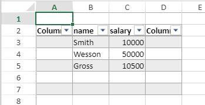

<details><summary>Historia</summary>

| Lanzamiento | Modificaciones |
| ----------- | -------------- |
| 19 R7       | Añadidos       |

</details>

<!-- REF #_method_.VP RESIZE TABLE.Syntax -->

**VP RESIZE TABLE** ( *rangeObj* : Object; *tableName* : Text )<!-- END REF -->

<!-- REF #_method_.VP RESIZE TABLE.Params -->

| Parámetros | Tipo   |    | Descripción               |                  |
| ---------- | ------ | -- | ------------------------- | ---------------- |
| rangeObj   | Object | -> | Nuevo rango para la tabla |                  |
| tableName  | Text   | -> | Nombre de la tabla        | <!-- END REF --> |

#### Descripción

El comando `VP RESIZE TABLE` <!-- REF #_method_.VP RESIZE TABLE.Summary -->cambia el tamaño de *tableName* con respecto al *rangeObj*<!-- END REF -->.

Se aplican las siguientes reglas:

- Los encabezados deben permanecer en la misma línea y el rango de la tabla resultante debe superponerse al rango de la tabla original.
- Si el conteo de líneas de la tabla redimensionada es inferior al conteo de líneas inicial, los valores dentro de las líneas o columnas recortadas se mantienen si no estaban vinculados a un [contexto de datos](vp-set-data-context.md), de lo contrario se eliminan.
- Si la tabla se expande en las celdas que contienen datos:
  - si se añaden líneas, se eliminan datos,
  - si se añaden columnas, los datos se mantienen y se muestran en nuevas columnas.

Si *tableName* no existe, no pasa nada.

#### Ejemplo

Usted crea una tabla con un contexto de datos:

```4d
var $context : Object
$context:=New object()

$context.col:=New collection
$context.col.push(New object("name"; "Smith"; "salary"; 10000))
$context.col.push(New object("name"; "Wesson"; "salary"; 50000))
$context.col.push(New object("name"; "Gross"; "salary"; 10500))

VP SET DATA CONTEXT("ViewProArea"; $context)

VP CREATE TABLE(VP Cells("ViewProArea"; 1; 1; 3; 3); "PeopleTable"; "col")
```


Quiere añadir una columna antes y después de la tabla, así como dos líneas vacías. Puede escribir:

```4d
VP RESIZE TABLE(VP Cells("ViewProArea"; 0; 1; 4; 6); "PeopleTable")
```



#### Ver también

[VP CREATE TABLE](vp-create-table.md)<br/>
[VP Get table range](vp-get-table-range.md)
