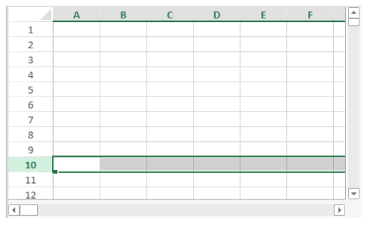

<!-- REF #_method_.VP Row.Syntax -->

**VP Row** ( *vpAreaName* : Text; *row* : Integer { ; *rowCount* : Integer { ; *sheet* : Integer } } ) : Object <!-- END REF -->

<!-- REF #_method_.VP Row.Params -->

| Parámetros | Tipo    |                             | Descripción                                                    |                  |
| ---------- | ------- | --------------------------- | -------------------------------------------------------------- | ---------------- |
| vpAreaName | Text    | ->                          | Nombre de objeto formulario área 4D View Pro                   |                  |
| row        | Integer | ->                          | Índice de la línea                                             |                  |
| rowCount   | Integer | ->                          | Número de líneas                                               |                  |
| sheet      | Integer | ->                          | Índice de la hoja (hoja actual si se omite) |                  |
| Result     | Object  | <- | Range object of row(s)                      | <!-- END REF --> |

#### Descripción

El comando `VP Row` <!-- REF #_method_.VP Row.Summary -->devuelve un nuevo objeto de rango que hace referencia a una fila o filas específicas<!-- END REF -->.

En *vpAreaName*, pase el nombre del área 4D View Pro. Si pasa un nombre que no existe, se devuelve un error.

El parámetro *row* define la primera fila del rango de filas. Pase el índice de la línea (el conteo comienza en 0) en este parámetro. Si el rango contiene varias columnas, también debe utilizar el parámetro opcional *columnCount*.

El parámetro opcional *rowCount* permite definir el número total de líneas del rango. *rowCount* debe ser mayor que 0. Si se omite, el valor será 1 por defecto.

En el parámetro opcional *sheet*, puede designar una hoja específica donde se definirá el rango (la numeración comienza en 0). Si no se especifica, se utiliza por defecto la hoja de cálculo actual. Puede seleccionar explícitamente la hoja de cálculo actual con la siguiente constante:

- `vk current sheet`

#### Ejemplo

Desea definir un objeto rango para la línea que se muestra a continuación (en la hoja de cálculo actual):



Puede escribir:

```4d
$row:=VP Row("ViewProArea";9) // línea 10
```

#### Ver también

[VP All](vp-all.md)<br/>
[VP Cell](vp-cell.md)<br/>
[VP Cells](vp-cells.md)<br/>
[VP Column](vp-column.md)<br/>
[VP Combine ranges](vp-combine-ranges.md)<br/>
[VP Name](vp-name.md)
