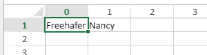

<details><summary>Historia</summary>

| Lanzamiento | Modificaciones |
| ----------- | -------------- |
| 19 R5       | Añadidos       |

</details>

<!-- REF #_method_.VP SET BINDING PATH.Syntax -->

**VP SET BINDING PATH** ( *rangeObj* : Object  ; *dataContextAttribute*  : Text) <!-- END REF -->

<!-- REF #_method_.VP SET BINDING PATH.Params -->

| Parámetros           | Tipo   |    | Descripción                                 |                  |
| -------------------- | ------ | -- | ------------------------------------------- | ---------------- |
| rangeObj             | Object | -> | Objeto rango                                |                  |
| dataContextAttribute | Text   | -> | Nombre del atributo a vincular a *rangeObj* | <!-- END REF --> |

#### Descripción

El comando `VP SET BINDING PATH` <!-- REF #_method_.VP SET BINDING PATH.Summary -->vincula un atributo del contexto de datos de una hoja a *rangeObj*<!-- END REF -->. Después de definir un contexto de datos utilizando el método [SET DATA CONTEXT](vp-set-data-context.md). Cuando se carga, si el contexto de datos contiene el atributo, el valor de *dataContextAttribute* se muestra automáticamente en las celdas en *rangeObj*.

En *rangeObj*, pase un objeto que es un rango de celdas o un rango combinado de celdas.

- Si *rangeObj* es un rango con varias celdas, el comando vincula el atributo a la primera celda del rango.
- Si *rangeObj* contiene varios rangos de celdas, el comando vincula el atributo a la primera celda de cada rango.

En *dataContextAttribute*, pase el nombre del atributo a vincular a *rangeObj*. Si *dataContextAttribute* es una cadena vacía, la función elimina el enlace actual.

> Los atributos de tipo colección no están soportados. Cuando se pasa el nombre de un atributo de la colección, el comando no hace nada.

#### Ejemplo

Define un contexto de datos y vincula el atributo `firstName`y `lastName`a las celdas:

```4d
var $p : Object

$p:=New object
$p.firstName:="Freehafer"
$p.lastName:="Nancy"

VP SET DATA CONTEXT("ViewProArea"; $p)

VP SET BINDING PATH(VP Cell("ViewProArea"; 0; 0); "firstName")
VP SET BINDING PATH(VP Cell("ViewProArea"; 1; 0); "lastName")
```



#### Ver también

[VP Get binding path](vp-get-binding-path.md)<br/>
[VP Get data context](vp-get-data-context.md)<br/>
[VP SET DATA CONTEXT](vp-get-data-context.md)
