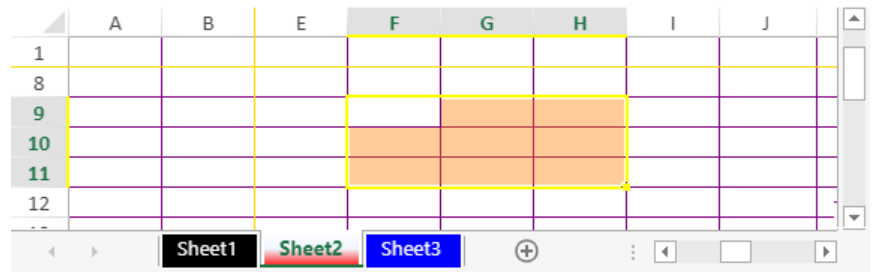

<!-- REF #_method_.VP SET SHEET OPTIONS.Syntax -->

**VP SET SHEET OPTIONS** ( *vpAreaName* : Text; *sheetOptions* : Object { ; *sheet* : Integer}  ) <!-- END REF -->

<!-- REF #_method_.VP SET SHEET OPTIONS.Params -->

| Parámetros   | Tipo    |    | Descripción                                                    |                  |
| ------------ | ------- | -- | -------------------------------------------------------------- | ---------------- |
| vpAreaName   | Text    | -> | Nombre del área 4D View Pro                                    |                  |
| sheetOptions | Object  | -> | Opciones de la hoja a definir                                  |                  |
| sheet        | Integer | -> | Índice de la hoja (hoja actual si se omite) | <!-- END REF --> |

#### Descripción

El comando `VP SET SHEET OPTIONS` <!-- REF #_method_.VP SET SHEET OPTIONS.Summary -->permite definir varias opciones de hoja del área *vpAreaName*<!-- END REF -->.

Pase el nombre del área de 4D View Pro en *vpAreaName*. Si pasa un nombre que no existe, se devuelve un error.

Pase un objeto que contenga las definiciones de las opciones a definir en el parámetro *sheetOptions*. Para ver la lista completa de las opciones disponibles, consulte el párrafo [Opciones de hoja](../configuring.md#sheet-options).

En el parámetro opcional *sheet*, puede designar una hoja específica (la numeración comienza en 0). Si se omite, se utiliza por defecto la hoja de cálculo actual. Puede seleccionar explícitamente la hoja de cálculo actual con la siguiente constante:

- `vk current sheet`

#### Ejemplo 1

Quiere proteger todas las celdas excepto el rango C5:D10:

```4d
// Activar la protección en la hoja actual
var $options : Object
  
$options:=New object
$options.isProtected:=True
VP SET SHEET OPTIONS("ViewProArea";$options)

// marcar las celdas C5:D10 como "desbloqueadas"
VP SET CELL STYLE(VP Cells("ViewProArea";2;4;2;6);New object("locked";False))
```

#### Ejemplo 2

Necesita proteger su documento mientras sus usuarios pueden redimensionar las líneas y columnas:

```4d
var $options : Object
  
$options:=New object
// Activar la protección
$options.isProtected:=True
$options.protectionOptions:=New object
// Permitir al usuario cambiar el tamaño de las líneas
$options.protectionOptions.allowResizeRows=True;
// Permitir al usuario cambiar el tamaño de las columnas
$options.protectionOptions.allowResizeColumns=True;

// Aplicar la protección en la hoja actual
VP SET SHEET OPTIONS("ViewProArea";$options)
```

#### Ejemplo 3

Desea personalizar los colores de sus pestañas, líneas congeladas, líneas de cuadrícula, fondo de selección y borde de selección:

```4d
var $options : Object
   
$options:=New object
// Personalizar el color de la pestaña de la hoja 1
$options.sheetTabColor:="Black"
$options.gridline:=New object("color";"Purple")
$options.selectionBackColor:="rgb(255,128,0,0.4)"
$options.selectionBorderColor:="Yellow"
$options.frozenlineColor:="Gold"
   
VP SET SHEET OPTIONS("ViewProArea";$options;0)
 
// Personaliza el color de la pestaña de la joja 2
$options.sheetTabColor:="red"
   
VP SET SHEET OPTIONS("ViewProArea";$options;1)
 
// Personalizar el color de la pestaña de la hoja 3
$options.sheetTabColor:="blue"
  
VP SET SHEET OPTIONS("ViewProArea";$options;2)
```

Resultado:



#### Ejemplo 4

Quiere ocultar las líneas de la cuadrícula, así como los encabezados de las líneas y columnas.

```4d
var $options : Object
  
$options:=New object
$options.gridline:=New object()
$options.gridline.showVerticalGridline:=False
$options.gridline.showHorizontalGridline:=False
$options.rowHeaderVisible:=False
$options.colHeaderVisible:=False
  
VP SET SHEET OPTIONS("ViewProArea";$options)
```

Resultado:


#### Ver también

[4D View Pro sheet options](../configuring.md#sheet-options)<br/>
[VP Get sheet options](vp-get-sheet-options.md)
