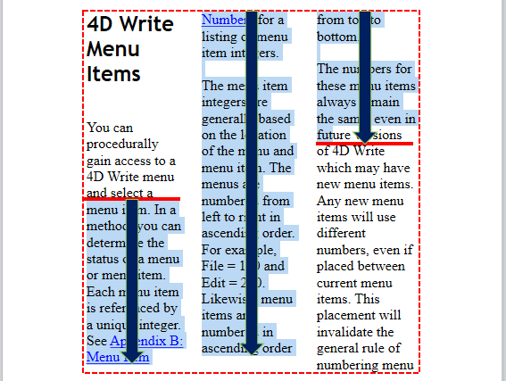

<!--REF #_command_.WP Get position.Syntax-->**WP Get position** ( *objRango* {; *layout*} ) -> Resultado<!-- END REF-->
<!--REF #_command_.WP Get position.Params-->
| Parámetro | Tipo |  | Descripción |
| --- | --- | --- | --- |
| objRango | Object | &#8594;  | Rango o elemento o documento 4D Write Pro |
| layout | Integer | &#8594;  | Diseño de documento 4D Write Pro utilizado para la evaluación: 0 (predeterminado)= diseño 4D Write Pro, 1=HTML WYSIWYG |
| Resultado | Object | &#8592; | Información de la posición |

<!-- END REF-->

#### Descripción 

<!--REF #_command_.WP Get position.Summary-->El comando **WP Get position** devuelve un objeto que describe la posición actual de *objRango*.<!-- END REF-->

En el parámetro *objRango*, puede pasar:

* un rango, o
* un elemento (tabla / línea / párrafo / cuerpo / encabezado / pie de página / imagen / sección / subsección / caja de texto), o
* un documento 4D Write Pro

El comando devuelve la información de posición en un objeto con las siguientes propiedades:

| **Nombre de la propiedad** | **Tipo** | **Descripción**                                                                                                                                                                                                                                                                     |
| -------------------------- | -------- | ----------------------------------------------------------------------------------------------------------------------------------------------------------------------------------------------------------------------------------------------------------------------------------- |
| sección                    | Número   | Número de la primera sección que intersecta *objRango*                                                                                                                                                                                                                              |
| página                     | Número   | Número de la primera página que intersecta *objRango*                                                                                                                                                                                                                               |
| columna                    | Número   | Índice de la primera columna que intersecta *objRango* (basado-1)                                                                                                                                                                                                                   |
| linea                      | Número   | Índice de la primera línea que intersecta *objRango* (relativo a la columna - o página si no hay ninguna columna con base - 1)                                                                                                                                                      |
| posición                   | Número   | Posición en la línea del primer caracter de *objRango* (basado -1)                                                                                                                                                                                                                  |
| delimitadores              | Objeto   | Coordenadas del rectángulo delimitador del *objRango*, expresadas en la unidad de documento actual y en relación con la esquina superior izquierda de la página. Se tienen en cuenta los tamaños de relleno y borde (si los hay); Los márgenes y las reglas no se tienen en cuenta. |
| arriba                     | Número   | Coordenada superior del rectángulo                                                                                                                                                                                                                                                  |
| izquierda                  | Número   | Coordenada izquierda del rectángulo                                                                                                                                                                                                                                                 |
| abajo                      | Número   | Coordenada inferior del rectángulo                                                                                                                                                                                                                                                  |
| derecha                    | Número   | Coordenada derecha del rectángulo                                                                                                                                                                                                                                                   |
| rangoAltura                | Número   | Altura del rectángulo delimitador del *objRango*. Este valor puede ser diferente de las opciones *bounds.bottom-bounds.top* si el *objRango* se extiende sobre varias columnas (ver ejemplo 4)                                                                                      |

Si *objRango* es un rango vacío, **WP Get position** devuelve la información de posición al inicio del rango. Tenga en cuenta que en el caso de un rango vacío del tipo predeterminado (texto), la altura del rango (*rangeHeight* o *bounds.bottom*\-*bounds.top*) es la altura del cursor y el ancho del rango (*bounds.right*\-*bounds.left*) es de 1 píxel .  
Si *objRango* es texto en un encabezado o pie de página, **WP Get position** devuelve la información de posición donde se muestran el encabezado y el pie de página en la primera sección/página.  
Si *objRango* es una imagen anclada (que se puede replicar en varias páginas), **WP Get position** devuelve la información de posición donde la imagen está anclada en la primera sección/página.  
Si *objRango* es una subsección, **WP Get position** devuelve la información de posición de la primera página de la sección padre.

El parámetro opcional *layout* se puede usar para definir la vista HTML wysiwyg para la evaluación *objRango*. Puede pasar una de las siguientes constantes del tema "4D Write Pro":

| Constante              | Tipo         | Valor | Comentario                                                                                                         |
| ---------------------- | ------------ | ----- | ------------------------------------------------------------------------------------------------------------------ |
| wk 4D Write Pro layout | Entero largo | 0     | Formato 4D Write Pro estándar, puede incluir algunos atributos de estilo específicos                               |
| wk html wysiwyg        | Entero largo | 1     | En este formato, los atributos avanzados 4D Write Pro que no son compatibles con todos los navegadores se eliminan |

Si se omite *layout*, el diseño de 4D Write Pro se usa de forma predeterminada.

**Notas sobre rendimiento**

* La misma configuración de visualización que para el comando [WP PRINT](wp-print.md) se usa con **WP Get position**:  
   * encabezados: visibles  
   * pies de página: visibles  
   * expresiones: computadas y mostradas  
   * modo página: página o borrador (vista wysiwyg HTML según lo definido por el comando)  
Si *objRango* se muestra en un área de formulario 4D Write Pro, asegúrese de que la configuración de visualización del área coincida con la configuración de visualización del comando para obtener información consistente. Tenga en cuenta también que si estas configuraciones son diferentes en el área, 4D Write Pro tendrá que "clonar" el documento para calcular el diseño en cada llamada del comando, lo que puede tomar mucho tiempo. Por motivos de rendimiento, en este caso, se recomienda construir el documento fuera de línea y copiarlo en el área de objetos de formulario solo cuando se complete la compilación.
* No se debe llamar a este comando dentro de los eventos que se generan con frecuencia (como On After Edit) ya que *result.rangeHeight* por ejemplo, puede requerir cálculos de renderización que requieren mucho tiempo y que deben realizarse en cada llamada de evento.

#### Ejemplo 1 

Desea saber el número de página de un rango:

```4d
 var $range;$rangePosition : Object
 $range:=WP Text range(WParea) //range from user selection
 $rangePosition:=WP Get position($range;wk 4D Write Pro layout)
 ALERT("First page number in selection is "+String($rangePosition.page))
```

#### Ejemplo 2 

Desea definir en color azul el texto en la primera y última página del documento:

```4d
 var $nbPages : Integer
 var $body : Object
 var $_paragraphs : Collection
 
 $nbPages:=WP Get page count([DOC]Sample)
 $body:=WP Get body([DOC]Sample)
 $_paragraphs:=WP Get elements($body;wk type paragraph)
 For each($paragraph;$_paragraphs)
    $info:=WP Get position($paragraph)
    If($info.page=1)|($info.page=$nbPages) //párrafos de la primera y última página en azul
       WP SET ATTRIBUTES($paragraph;wk text color;"blue")
    Else //other pages paragraphs in black
       WP SET ATTRIBUTES($paragraph;wk text color;"black")
    End if
 End for each
```
  
  
#### Ejemplo 3 

Mientras crea un documento, desea evitar divisiones de párrafo:

```4d
 var WParea;$body : Object
 var $_paragraphs : Collection
 WParea:=WP New
 
 $body:=WP Get body([DOC]Sample)
 $_paragraphs:=WP Get elements($body;wk type paragraph)
 
 For each($paragraph;$_paragraphs)
    $insert:=WP New($paragraph)
 
  //memoriza el rango actual y el número de página
    $rangeBefore:=WP Text range(WParea;wk end text;wk end text)
    $info:=WP Get position($rangeBefore)
    $memoPage:=$info.page
 
  //inserta el contenido, conserva el rango intacto
    WP INSERT DOCUMENT($rangeBefore;$insert;wk append;wk exclude from range)
 
  //verifica la posición después de la inserción
    $rangeAfter:=WP Text range(WParea;wk end text;wk end text)
    $info:=WP Get position($rangeAfter)
 
    If($memoPage#$info.page) // si la página ha cambiado, inserta un salto de página
       WP INSERT BREAK($rangeBefore;wk page break;wk replace)
    End if
 
 End for each
```

#### Ejemplo 4 

Los siguientes ejemplos ilustran las coordenadas del rectángulo delimitador devueltas, según el *objRango*.

```4d
 $default:=WP Text range(WPArea) //rango predeterminado (texto)
 $textCoordinates:=WP Get position($default) //línea de puntos roja
 
 $paragraph:=WP Create paragraph range($default) //rango de párrafo
 $paraCoordinates:=WP Get position($paragraph) // línea punteada verde
```


*Línea de puntos roja:* *valores de objeto $textCoordinates* 
*Línea de puntos verde:* *valores de objeto $* *paraCoordinates* 

**Nota:** en el caso de una visualización en varias columnas, la propiedad *rangeHeight* (líneas sin formato) podría ser más grande que *bounds.bottom*\-*bounds.top* (líneas de puntos):

  

#### Ver también 

[WP PRINT](wp-print.md)  