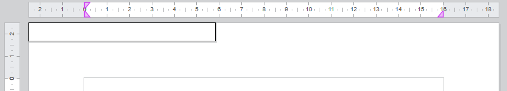

<!--REF #_command_.WP New text box.Syntax-->**WP New text box** ( *wpDoc* ; *numPag* ) -> Resultado<!-- END REF-->
<!--REF #_command_.WP New text box.Params-->
| Parámetro | Tipo |  | Descripción |
| --- | --- | --- | --- |
| wpDoc | Object | &#8594;  | Documento 4D Write Pro |
| numPag | Number | &#8594;  | Número de página donde anclar la caja de texto |
| Resultado | Object | &#8592; | Objeto de caja de texto |

<!-- END REF-->

*Este comando no es hilo seguro, no puede ser utilizado en código apropiativo.*


#### Descripción 

<!--REF #_command_.WP New text box.Summary-->El comando **WP New text box** crea y devuelve un nuevo objeto caja de texto en la página *numPag* de *wpDoc*.<!-- END REF-->

**Nota:** para más información sobre las cajas de texto, consulte el párrafo *Gestión de cajas de texto*.

En el parámetro *wpDoc*, pase un documento 4D Write Pro. 

En *numPag*, pase el número de página al que debe anclarse la caja de texto. Si *numPag* < 0 se utiliza el número de página **1** (no se genera ningún error).

El comando crea un nuevo elemento caja de texto con los siguientes atributos por defecto:

* ancho = 8 cm,
* alto = auto,
* borde negro sólido 1 pt,
* relleno = 4 pt,
* margen = 0 pt,
* color de fondo = blanco,
* id = "textBoxN" donde N es un número,
* anclado delante del cuerpo en la esquina superior izquierda del rectángulo de la página (al igual que una imagen anclada, una caja de texto puede anclarse al modo anidado, o a una sección, a todas las secciones o a una subsección en modo página, y a la capa de fondo o frontal).

Consulte la sección *Atributos 4D Write Pro* para obtener una descripción detallada de estos atributos.

La nueva caja de texto se renderiza sólo en la página *numPag* *,* por lo que puede que no se renderice si:

* no hay ninguna página con el número de página pasado
* el modo de visualización actual es anidado o borrador

Sin embargo, la caja de texto sigue existiendo y es propiedad del documento aunque no se muestre.

#### Ejemplo 1 

Desea crear una caja de texto vacía por defecto:

```4d
 $textBox:=WP New text box(WParea;1)
```

Resultado:



#### Ejemplo 2 

En una plantilla de una carta, desea añadir una caja de texto para mostrar la dirección del destinatario (que se almacena en el contexto):

```4d
  // #1 crear la caja de texto
 $textBox:=WP New text box(WParea;1)
 
  // #2 definir algunos atributos de la caja de texto
 WP SET ATTRIBUTES($textBox;wk id;"AddressArea")
 WP SET ATTRIBUTES($textBox;wk anchor origin;wk paper box)
 WP SET ATTRIBUTES($textBox;wk anchor horizontal align;wk left;wk vertical align;wk top)
 WP SET ATTRIBUTES($textBox;wk anchor horizontal offset;$form.offsetX.values[$form.offsetX.index])
 WP SET ATTRIBUTES($textBox;wk anchor vertical offset;$form.offsetY.values[$form.offsetY.index])
 WP SET ATTRIBUTES($textBox;wk width;$form.width.values[$form.width.index])
 WP SET ATTRIBUTES($textBox;wk height;$form.height.values[$form.height.index])
 WP SET ATTRIBUTES($textBox;wk padding;$form.padding.values[$form.padding.index]) // inside margins
 WP SET ATTRIBUTES($textBox;wk border style;wk dashed;wk border color;"Blue";wk border width;"1pt";wk border radius;"10pt")
 WP SET ATTRIBUTES($textBox;wk vertical align;wk center)
 
  // #3: definir las fórmulas dentro de la caja de texto
 WP INSERT FORMULA($textBox;Formula(This.data.fullName);wk append)
 WP INSERT BREAK($textBox;wk paragraph break;wk append)
 WP INSERT FORMULA($textBox;Formula(This.data.fullAddress);wk append)
 
  // #4: Dar estilo al contenido de la caja de texto
 WP SET ATTRIBUTES($textBox;wk font;"Arial";wk font bold;wk true;wk font size;"18pt")
```

Resultado:


#### Ver también 

[WP DELETE TEXT BOX](wp-delete-text-box.md)  