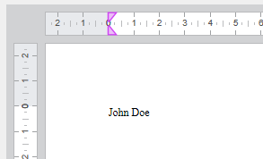

<!--REF #_command_.WP SET DATA CONTEXT.Syntax-->**WP SET DATA CONTEXT** ( *wpDoc* ; *datosContext* )<!-- END REF-->
<!--REF #_command_.WP SET DATA CONTEXT.Params-->
| Parámetro | Tipo |  | Descripción |
| --- | --- | --- | --- |
| wpDoc | Object | &#8594;  | Documento 4D Write Pro |
| datosContext | Object | &#8594;  | Datos para poner en el contexto |

<!-- END REF-->

*Este comando no es hilo seguro, no puede ser utilizado en código apropiativo.*


#### Descripción 

<!--REF #_command_.WP SET DATA CONTEXT.Summary-->El comando **WP SET DATA CONTEXT** define el objeto *datosContext* como contexto de datos del documento 4D Write Pro *wpDoc*.<!-- END REF--> Definir un nuevo contexto en el mismo proceso reemplaza todo contexto existente para el documento.

En *wpDoc*, pase el documento 4D Write Pro que recibirá el contexto de datos.

En *datosContext*, pase un objeto que determine el contenido del contexto de datos. Puede pasar cualquier tipo de objeto 4D, incluyendo objetos pertenecientes a clases ORDA, como 4D.Entity. Para restablecer un contexto, pase un objeto *null*.

Un contexto de datos de 4D Write Pro es volátil:

* Se puede acceder a él dentro de un documento 4D Write Pro en tiempo de ejecución.
* No se guarda en el documento de 4D Write Pro, a diferencia de otras propiedades de 4D Write Pro.

Una vez que se define un contexto de datos, sus datos están disponibles en el área de 4D Write Pro dentro del proceso actual a través de la fórmula **This.data**.

**Nota:** hay otras fórmulas disponibles a través de **This** cuando se trabaja con fuentes de datos de tablas, ver *Expresiones con This*.

Un contexto de datos sólo puede utilizarse en el proceso en el que se ha definido:

* Cuando se utiliza el contexto de datos en fórmulas calculadas de otro proceso, es *null* y **This.data** es indefinido
* Si se establece un contexto de datos que ya ha sido definido para el mismo documento en otro proceso, se produce un error
 Para calcular fórmulas con diferentes contextos de datos en diferentes procesos (es decir, generar diferentes facturas a partir del mismo documento modelo), se recomienda duplicar el documento utilizando [WP New](wp-new.md) en cada uno de esos procesos para evitar errores. Tenga en cuenta que el contexto de datos no se copia cuando se duplica un documento.

#### Ejemplo 1 

Inserta un objeto en el contexto del documento de 4D Write Pro y muestra su información en la página:

```4d
 var $person;$info: Object
 
  // Crear objeto person
 $person:=New object()
 $person.firstName:="John"
 $person.lastName:="Doe"
 
  // Definir el contexto utilizando el objeto person
 WP SET DATA CONTEXT(WParea;$person)
 
  // Acceder a los datos de contexto con la palabra clave "This"
 $info:=Formula(This.data.firstName+" "+This.data.lastName)
 
  // Mostrar los datos de contexto en la página
 WP INSERT FORMULA(WParea;$info;wk replace) // muestra "John Doe" en la página.
```

Este es el resultado:



  
//   
WP SET DATA CONTEXT(WParea; $person)  
  
// 

#### Ejemplo 2 

Cuando se trabaja con un documento plantilla, se puede asociar un contexto a él para llenar la página con datos. Esto es útil, por ejemplo, para las campañas de correo.

Una vez que se carga una plantilla y se establece el contexto de datos, una plantilla de carta podría tener el siguiente aspecto:


El siguiente ejemplo recorre una selección de entidades y crea una vista previa de impresión para cada entidad:

```4d
 var $person: 4D.Entity
 var $people: 4D.EntitySelection
 
 SET PRINT PREVIEW(True)
 $people:=ds.People.all()
 For each($person;$people)
    WP SET DATA CONTEXT(WParea;$person)
    WP PRINT(WParea)
 End for each
```

#### Ver también 

  
[WP COMPUTE FORMULAS](wp-compute-formulas.md)  
[WP Get data context](wp-get-data-context.md)  