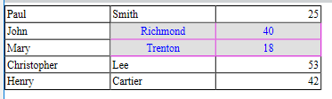

<!--REF #_command_.WP Table get cells.Syntax-->**WP Table get cells** ( *objTarget* ) | ( *refTabla* ; *colIni* ; *filaIni* {; *NumCol*{; *numFilas*}} )  -> Resultado<!-- END REF-->
<!--REF #_command_.WP Table get cells.Params-->
| Parámetro | Tipo |  | Descripción |
| --- | --- | --- | --- |
| objTarget | Object | &#8594;  | Rango o elemento o documento 4D Write Pro |
| refTabla | Object | &#8594;  | Referencia de tabla |
| colIni | Integer | &#8594;  | Posición de la primera columna de celda |
| filaIni | Integer | &#8594;  | Posición de la primera fila de la columna |
| NumCol | Integer | &#8594;  | Número de columnas a obtener |
| numFilas | Integer | &#8594;  | Número de filas a obtener |
| Resultado | Object | &#8592; | Nuevo rango que contiene celdas |

<!-- END REF-->

#### Descripción 

<!--REF #_command_.WP Table get cells.Summary-->El comando **WP Table get cells** devuelve un nuevo objeto de rango de celdas que contiene la selección de celdas en *objTarget* o *refTabla* (definida por *colIni*, *filaIni*, *numCol* y *numFilas*).<!-- END REF-->

Pase:

* *objTarget* *:*  
   * un rango, o  
   * un elemento (fila / párrafo / cuerpo / encabezado / pie de página / imagen en línea / sección / subsección), o  
   * un documento 4D Write Pro

Si *objTarget* no se cruza con una tabla o rango de texto donde se puede recuperar una selección de celdas, el comando devuelve Null.

**O**

* *colIni* y *filaIni* \- definen las coordenadas superiores izquierdas de la primera celda a obtener.
* (opcional) *numCol* y *numFilas*\- especifican respectivamente el número de columnas y el número de filas a obtener para el rango de celdas.  
    
Si se omite *numFilas*, se devuelve una sola fila. Si se omiten *numCol* y *numFilas*, el rango devuelto contiene una sola celda.

Si *colIni* más *numCol* o *filaIni* más *numFilas* exceden el número de columnas/filas en *refTabla*, o si *colIni* o *filaIni* es mayor que el número de columnas/filas en *refTabla*, el rango devuelto contiene el máximo posible de columnas/filas.

#### Ejemplo 1 

Usted desea modificar los atributos de un rango de celdas:

```4d
 var $wpTable;$wpRange;$wpRow1;$wpRow2;$wpRow3;$wpRow4;$wpRow5;$cells : Object
 $wpRange:=WP Create range(WParea;wk start text;wk end text)
 
 $wpTable:=WP Insert table($wpRange;wk append)
 $wpRow1:=WP Table append row($wpTable;"Paul";"Smith";25)
 $wpRow2:=WP Table append row($wpTable;"John";"Richmond";40)
 $wpRow3:=WP Table append row($wpTable;"Mary";"Trenton";18)
 $wpRow4:=WP Table append row($wpTable;"Christopher";"Lee";53)
 $wpRow5:=WP Table append row($wpTable;"Henry";"Cartier";42)
 
 $cells:=WP Table get cells($wpTable;2;2;2;2)
 WP SET ATTRIBUTES($cells;wk background color;0x00E0E0E0)
 WP SET ATTRIBUTES($cells;wk text color;"blue")
 WP SET ATTRIBUTES($cells;wk border color;0x00E000E0)
 WP SET ATTRIBUTES($cells;wk text align;wk center)
```

Resultado: 



#### Ejemplo 2 

Para obtener un rango de celdas desde la celda "5x7" hasta el final de la fila:

```4d
 $cellRange:=WP Table get cells(tableRef;5;7;MAXLONG;1)
```

Para obtener un rango de celdas desde la celda "5x7" hasta el final de la columna:

```4d
 $cellRange:=WP Table get cells(tableRef;5;7;1;MAXLONG)
```

Para obtener un rango de celdas desde la celda "5x7" hasta el final de la tabla:

```4d
 $cellRange:=WP Table get cells(tableRef;5;7;MAXLONG;MAXLONG)
```

  
#### Ejemplo 3 

Desea recuperar las celdas que un usuario ha seleccionado:

```4d
 var $userSelection;$cells : Object
 
 $userSelection:=WP Selection range(myWPArea)
 
 $cells:=WP Table get cells($userSelection)
```

#### Ver también 

[WP Table get columns ](wp-table-get-columns.md)  
[WP Table get rows](wp-table-get-rows.md)  