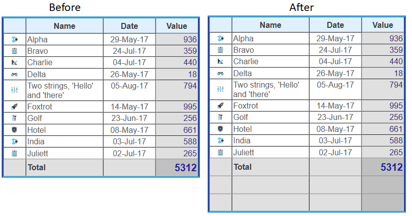

<!--REF #_command_.WP Table insert rows.Syntax-->**WP Table insert rows** ( objTarget | {*refTabla* ; *numLinea*} {; *numLineas*} )  -> Resultado<!-- END REF-->
<!--REF #_command_.WP Table insert rows.Params-->
| Parámetro | Tipo |  | Descripción |
| --- | --- | --- | --- |
| objTarget | Object | &#8594;  | Rango o elemento o documento 4D Write Pro |
| refTabla | Object | &#8594;  | Referencia de tabla |
| numLinea | Integer | &#8594;  | Número de índice de línea |
| numLineas | Integer | &#8594;  | Número de líneas a insertar (valor po defecto = 1) |
| Resultado | Object | &#8592; | Rango de líneas de tabla |

<!-- END REF-->

#### Descripción 

<!--REF #_command_.WP Table insert rows.Summary-->El comando **WP Table insert rows** inserta una o varias líneas en una tabla 4D Write Pro.<!-- END REF-->

Este comando soporta dos sintaxis:

* Si pasa un objTarget como primer parámetro, el comando insertará las líneas en la primera tabla que intersecta el target. objTarget puede contener:  
   * un rango, o  
   * un elemento (línea / párrafo / cuerpo / encabezado / pie de página / imagen en línea / sección / subsección), o  
   * un documento 4D Write Pro.  
         
   Si objTarget no se intersecta con una tabla o un rango de texto donde se pueden insertar las líneas, el comando no hace nada y devuelve Null (no se genera ningún error).
* Si pasa los parámetros *refTabla* y *numLineas*, el comando insertará las líneas en la tabla designada y en el índice de línea especificado. Si *numLineas* es mayor que el número de líneas en *refTabla*, las líneas se anexan en la tabla en lugar de insertarse.

El parámetro opcional *numLineas* define el número de líneas a insertar en objTarget o *refTabla*. De manera predeterminada, si se omite este parámetro, se inserta una línea.

**Resultado**  
  
El comando devuelve un rango de líneas que representa las líneas insertadas o Null si no se insertó nada.

#### Ejemplo 

Desea insertar dos líneas al final de la tabla *Invoice*: 

```4d
 var $row : Object
 var $table;$row : Object
 var $rowNum : Integer
 
 $table:=WP Get element by ID(WParea;"Invoice") //recuperar la tabla "Invoice"
 
 If($table#Null)
    $rowNum:=$table.rowCount+1 //agregue 1 a la última línea para designar dónde insertar las líneas
    $row:=WP Table insert rows($table;$rowNum;2)
 End if
```

Insertará las dos filas nuevas en la ubicación correcta:

 

#### Ver también 

[WP Table insert columns](wp-table-insert-columns.md)  