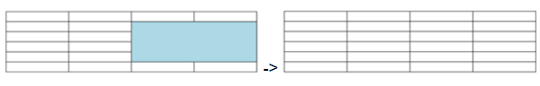

<!--REF #_command_.WP TABLE SPLIT CELLS.Syntax-->**WP TABLE SPLIT CELLS** ( *targetObj* ) | ( *tableRef* ; *startColumn* ; *startRow* {; *columnCount*{; *rowCount*}} )<!-- END REF-->
<!--REF #_command_.WP TABLE SPLIT CELLS.Params-->
| Parámetro | Tipo |  | Descripción |
| --- | --- | --- | --- |
| targetObj | Object | &#8594;  | Rango o elemento o documento 4D Write Pro |
| tableRef | Object | &#8594;  | Referencia de la tabla |
| startColumn | Integer | &#8594;  | Posición de la primera columna de celdas |
| startRow | Integer | &#8594;  | Posición de la primera línea de columna |
| columnCount | Integer | &#8594;  | Número de columnas a dividir |
| rowCount | Integer | &#8594;  | Número de líneas a dividir |

<!-- END REF-->

*Este comando no es hilo seguro, no puede ser utilizado en código apropiativo.*


#### Descripción 

<!--REF #_command_.WP TABLE SPLIT CELLS.Summary-->El comando **WP TABLE SPLIT CELLS** divide la selección de intersección de celdas en el *targetObj* o *tableRef* (definido por *startColumn*, *startRow*, *columnCount* y *rowCount*).<!-- END REF--> Una celda será dividida sólo si ya ha sido combinada horizontalmente, verticalmente, o ambas; de lo contrario, la celda no será modificada.

Pase cualquiera de los dos:

* *targetObj:*  
   * un rango, o  
   * un elemento (tabla / línea / cuerpo / párrafo / imagen anclada / encabezado / pie / sección / subsección), o bien  
   * un documento 4D Write Pro

Si *targetObj* no intersecta con una tabla o rango de texto donde se pueda recuperar una selección de celdas, el comando no hace nada.

Si *targetObj* intersecta una o muchas celdas que no han sido fusionadas antes, el comando **WP TABLE SPLIT CELLS** no hace nada.

**O**

* startColumn y *startRow* \- definen las coordenadas superior izquierda de la primera celda a dividir.
* columnCount y rowCount (opcionales) - especifican respectivamente el número de columnas y el número de líneas a dividir.  
    
Si rowCount equivale a pasar 1 (valor por defecto). Si se omiten tanto columnCount como rowCount, equivale a dividir una única celda y si no se ha fusionado antes no ocurre nada.

Si se omite startColumn más ColumnCount o *startRow* más rowCount excede el número de columnas/líneas en *tableRef*, o si startColumn o *startRow* es mayor que el número de columnas/líneas en *tableRef*, el rango devuelto contiene el máximo posible de columnas/líneas, lo que significa que cada celda de la tabla (si se ha fusionado antes) se divide.

#### Ejemplo 

Desea designar un rango de celdas (que contenga algunas celdas ya combinadas) y dividirlo:

```4d
 WP TABLE SPLIT CELLS($table;3;2;1;1)
  //o
 $cells:=WP Table get cells($table;3;2;1;1)
 WP TABLE SPLIT CELLS($cells)
```

Resultado:



Los datos de la celda ya fusionada se mantienen todos en la primera celda (superior izquierda) después de la división, las otras celdas resultantes de la división permanecen vacías.

Para más detalles, consulte *Fusión y división de celdas*.

#### Ver también 

*Manejo de tablas*  
[WP TABLE MERGE CELLS](wp-table-merge-cells.md)  