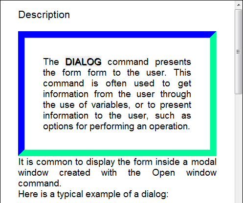

<!--REF #_command_.WP SET ATTRIBUTES.Syntax-->**WP SET ATTRIBUTES** ( *targetObj* ; *attribName* ; *attribValue* {; *attribName2* ; *attribValue2* ; ... ; *attribNameN* ; *attribValueN*} )<br/>**WP SET ATTRIBUTES** ( *targetObj* ; *attribObj* )<!-- END REF-->

<!--REF #_command_.WP SET ATTRIBUTES.Params-->

| Parámetros  | Tipo                                            |                             | Descripción                                                             |
| ----------- | ----------------------------------------------- | --------------------------- | ----------------------------------------------------------------------- |
| targetObj   | Object                                          | &#8594; | Rango o elemento o documento 4D Write Pro                               |
| attribName  | Text                                            | &#8594; | Name of attribute to set                                                |
| attribValue | Text, Number, Object, Collection, Picture, Date | &#8594; | Nuevo valor de atributo                                                 |
| attribObj   | Object                                          | &#8594; | Object containing attribute names and their corresponding values to set |

<!-- END REF-->

## Descripción

El comando **WP SET ATTRIBUTES** <!--REF #_command_.WP SET ATTRIBUTES.Summary-->le permite definir el valor de todo atributo en un rango, elemento, documento.<!-- END REF--> Este comando le da acceso a todo de atributo interno 4D Write Pro: carácter, párrafo, documento, tabla o imagen.

En *targetObj*, puede pasar :

- un rango, o
- an element (header / footer / body / table / row / paragraph / anchored or inline picture / section / subsection / style sheet), or
- un documento 4D Write Pro

Puede especificar atributos a definir para *targetObj* de una de dos maneras:

- Utilice los parámetros *attribName* y *attribValue*. In *attribName*, pass the name of the attribute to set for the target and in *attribValue*, pass the new value to set. You can pass as many *attribName*/*attribValue* pairs as you want in a single call.

- Use the *attribObj* parameter to pass a single object containing attribute names and their corresponding values as object properties.

For a comprehensive list of attributes to pass, as well as their scope and respective values, please refer to the *4D Write Pro Attributes* section.

## Ejemplo 1

En esta área 4D Write Pro, ha seleccionado una palabra:


Si ejecuta el siguiente código:

```4d
 $range:=WP Get selection(*;"WParea") //obtener el rango seleccionado
 
  // definir el shadow offset en pt para el texto seleccionado
 WP SET ATTRIBUTES($range;wk text shadow offset;1)
  //establecer el relleno del párrafo
 WP SET ATTRIBUTES($range;wk padding;1)
  //define un borde de 10 pt
 WP SET ATTRIBUTES($range;wk border style;wk solid;wk border width;10)
  //define los colores del borde
 WP SET ATTRIBUTES($range;wk border color;"blue";wk border color bottom;"#00FA9A";wk border color right;"#00FA9A")
```

Obtiene el siguiente resultado:



## Ejemplo 2

This example illustrates the use of wk inside and wk outside constants:

```4d
 $wpRange:=WP Get selection(writeProdoc)
 WP SET ATTRIBUTES($wpRange;wk border style+wk inside;wk dotted)
 WP SET ATTRIBUTES($wpRange;wk border style+wk outside;wk solid)
 WP SET ATTRIBUTES($wpRange;wk border color+wk outside;"#00FA9A")
```

Assuming all of the contents were selected, the result is:


## Ejemplo 3

You want to set a background image for the document:

```4d
 var WParea : Object
 WParea:=WP New
 
 READ PICTURE FILE("C:\\Pictures\\boats.jpg";$picture)
 
 WP SET ATTRIBUTES(WParea;wk background image;$picture)
```

El resultado es:


You want to set a background image that covers the whole printable area. All attributes are passed using a single object:

```4d
 var WParea : Object
 WParea:=WP New
 
 READ PICTURE FILE("C:\\Pictures\\boats.jpg";$picture)
 
 $myAttributes:=New object()
 $myAttributes[wk background image]:=$picture
 $myAttributes[wk background clip]:=wk paper box
 $myAttributes[wk background origin]:=wk paper box

 WP SET ATTRIBUTES(WParea;$myAttributes)
```

El resultado es:


:::note

The paper box value is only applicable to documents and sections.

:::

## Ejemplo 4

You want to set tabs at varying intervals and designate a character as the leading character for the last tab:

```4d
 $tab1:=New object()
 $tab1[wk type]:=wk left
 $tab1[wk offset]:="3cm"
 $tab1[wk leading]:=""
 
 $tab2:=New object()
 $tab2[wk type]:=wk center
 $tab2[wk offset]:="8cm"
 $tab2[wk leading]:=""
 
 $tab3:=New object()
 $tab3[wk type]:=wk right
 $tab3[wk offset]:="12cm"
 $tab3[wk leading]:="."
 
 $_tabs:=New collection($tab1;$tab2;$tab3)
 WP SET ATTRIBUTES(wpArea;wk tabs;$_tabs)
```

El resultado es:


## Ver también

*4D Write Pro Attributes*\
[WP GET ATTRIBUTES](../commands/wp-get-attributes.md)\
[WP RESET ATTRIBUTES](../commands/wp-reset-attributes.md)