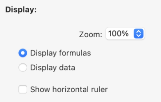

4D WritePro Interface ofrece un conjunto de paletas, que permiten a los usuarios finales personalizar fácilmente un documento 4D Write Pro.

Un desarrollador 4D puede implementar fácilmente estas paletas en su aplicación. Así, los usuarios finales pueden gestionar todas las propiedades de 4D Write Pro, como las fuentes, la alineación del texto, los marcadores, la disposición de las tablas y los marcos.

La documentación principal de [la interfaz de 4D Write Pro](https://doc.4d.com/4Dv20/4D/20/Entry-areas.300-6263967.en.html) se encuentra en el manual _Diseño 4D_.

A continuación encontrará la documentación de configuración del Asistente para tablas.

## Asistente de tablas

El asistente de tablas está aquí para simplificar aún más la creación de tablas basadas en datos de bases d utilizando contextos, fuentes de datos y fórmulas.

El asistente de tablas, accesible a los usuarios finales, carga plantillas suministradas y configuradas por los desarrolladores de 4D. Esto permite a los desarrolladores personalizar la plantilla según los casos de uso específicos y los requisitos empresariales de los usuarios.

El Asistente de tablas viene con plantillas y temas predeterminados, que los desarrolladores pueden configurar para adaptar su contenido a los requisitos específicos de la aplicación.

Para implementar el Asistente de tablas en su aplicación, los desarrolladores pueden crear y configurar archivos de plantilla.

### Interfaz del Asistente de tablas WP

El usuario abre el diálogo Asistente para tablas desde el elemento de menú "Insertar tabla" de la barra de herramientas y la barra lateral de la interfaz de 4D Write Pro.


Desde esta interfaz, el usuario puede seleccionar una plantilla o una tabla en la primera lista desplegable y un tema en la segunda.

##### En Columnas:


Dependiendo de si el usuario selecciona un modelo o una tabla, puede ver la lista de campos almacenados en el modelo (los tipos Blob y objeto se excluyen automáticamente). A continuación, pueden seleccionar las columnas que se mostrarán en la tabla marcando la casilla situada delante del nombre del campo y ordenarlas moviendo y arrastrando la lista de campos.

##### En líneas:


En el Asistente para tablas, el usuario también puede definir el número de filas de encabezado y filas adicionales (de 0 a 5 cada una), definir [filas de interrupción](https://doc.4d.com/4Dv20/4D/20/Handling-tables.200-6229469.en.html#6233076) (filas de resumen) encima o debajo de la fila de datos, y elegir mostrar/ocultar [filas de arrastre](https://doc.4d.com/4Dv20/4D/20/Handling-tables.200-6229469.en.html#6236686).

Además, el usuario tiene la posibilidad de elegir el comportamiento de la tabla cuando su fuente de datos está vacía con las siguientes opciones: Mostrar fila de datos, Ocultar fila de fecha, Ocultar tabla, Mostrar fila de marcador de posición.

##### En pantalla:



El usuario ajusta el nivel de zoom según sus preferencias seleccionando la opción deseada de una lista desplegable, utiliza botones de opción para mostrar fórmulas o datos para una presentación clara y elige mostrar una regla horizontal utilizando una casilla de verificación.

Tras finalizar la creación y personalización de la tabla, el usuario puede hacer clic en el botón **Insertar** para añadir la tabla a su documento WP.

Una vez integrada la tabla en el documento, el usuario puede personalizar su estilo. Las herramientas de formato de la barra de herramientas y la barra lateral siguen estando disponibles.

### Configuración de la plantilla WP Table Wizard

La configuración de las plantillas incluye:

- Definición de tablas y campos, así como preparación de fórmulas adaptadas a la aplicación desde el [archivo de plantilla](#template-files).
- Traducción de nombres de tablas, campos y fórmulas del [archivo de traducción](#translation-files).
- Diseño de estilos gráficos y temas personalizados a partir del [ archivo de temas](#theme-files).

Estos tres tipos de archivos contribuyen a la configuración del Asistente para tablas y, aunque cada uno de ellos tiene una finalidad distinta, ninguno de ellos se considera un componente esencial.

#### Archivos de plantillas

El archivo de plantilla permite definir lo siguiente:

- la fórmula que devuelve una selección de entidades utilizada como fuente de datos de la tabla,
- las fórmulas de ruptura (si se puede insertar una línea de ruptura)
- los atributos de la clase de datos que pueden utilizarse como columnas de la tabla,
- las fórmulas disponibles como menús contextuales dentro de las filas de interrupción, fila de arrastre, fila de marcador de posición o filas adicionales.

El archivo de plantillas debe ser almacenado en una carpeta "[`Resources`](../Project/architecture.md#resources)/4DWP_Wizard/Templates" dentro de su proyecto.

El archivo de plantilla en formato JSON contiene los siguientes atributos:

| Atributo                             | Tipo       | Obligatorio | Descripción                                                                                                                                                                                                              |
| :----------------------------------- | :--------- | :---------- | :----------------------------------------------------------------------------------------------------------------------------------------------------------------------------------------------------------------------- |
| tableDataSource                      | Text       | x           | Fórmula de la fuente de datos de la tabla                                                                                                                                                                                |
| columns                              | Collection | x           | Colección de columnas de tabla                                                                                                                                                                                           |
| columns.check        | Text       | x           | True cuando la columna ya está marcada en el editor de plantillas. False cuando la columna está desmarcada en el editor de plantillas.                                                   |
| columns.header       | Text       | x           | Etiqueta mostrada al usuario                                                                                                                                                                                             |
| columns.source       | Text       | x           | Formula                                                                                                                                                                                                                  |
| breaks                               | Collection |             | Colección de objetos de ruptura. El orden de las interrupciones es importante. Corresponde al orden en el documento cuando las rupturas están sobre las líneas de datos. |
| breaks.label         | Text       | x           | Etiqueta mostrada al usuario                                                                                                                                                                                             |
| breaks.source        | Text       | x           | Formula                                                                                                                                                                                                                  |
| breakFormulas                        | Collection |             | Colección de objetos de fórmula aplicables a las líneas de ruptura                                                                                                                                                       |
| breakFormulas.label  | Text       | x           | Etiqueta mostrada al usuario                                                                                                                                                                                             |
| breakFormulas.source | Text       | x           | Formula                                                                                                                                                                                                                  |
| bcorFormulas                         | Collection |             | Colección de objetos de fórmula aplicables a las filas de transferencia inferiores                                                                                                                                       |
| bcorFormulas.label   | Text       | x           | Etiqueta mostrada al usuario                                                                                                                                                                                             |
| bcorFormulas.source  | Text       | x           | Formula                                                                                                                                                                                                                  |
| extraFormulas                        | Collection |             | Colección de objetos de fórmula aplicables a líneas adicionales                                                                                                                                                          |
| extraFormulas.label  | Text       | x           | Etiqueta mostrada al usuario                                                                                                                                                                                             |
| extraFormulas.source | Text       | x           | Formula                                                                                                                                                                                                                  |
| placeholderFormulas                  | Collection |             | Colección de objetos de fórmula que se insertan en la fila del marcador de posición                                                                                                                                      |

:::note Francés

Si es probable que su aplicación se ejecute en un 4D con el idioma configurado en francés, asegúrese de utilizar [tokens](https://doc.4d.com/4Dv20/4D/20/Using-tokens-in-formulas.300-6237731.en.html) en sus fórmulas para que se interpreten correctamente independientemente de la configuración de idioma del usuario.

:::

##### Ejemplo

He aquí un breve ejemplo del aspecto que podría tener su archivo JSON:

```json
{
    "tableDataSource": "ds.People.all().orderBy(\"toCompany.name asc, continent asc, country asc, city asc\")",
    "columns": [{
            "check": true,
            "header": "Firstname",
            "source": "This.item.firstname"
        }, {
            "check": true,
            "header": "Lastname",
            "source": "This.item.lastname"
        }, {
            "check": true,
            "header": "Salary",
            "source": "String(This.item.salary;\"###,###.00\")"
        }
    ],
    "breaks": [{
            "label": "Company",
            "source": "This.item.toCompany.name"
        }
    ],
    "breakFormulas": [{
            "label": "Company",
            "source": "This.item.toCompany.name"
	}, {
            "label": "Sum of salaries",
            "source": "String(This.breakItems.sum(\"salary\"); \"###,###.00\")"
        }
    ],
    "bcorFormulas": [{
            "label": "Sum of salaries",
            "source": "String(This.tableData.sum(\"salary\"); \"###,###.00\")"
        }
    ],
    "extraFormulas": [{
            "label": "Sum of salaries",
            "source": "String(This.tableData.sum(\"salary\"); \"###,###.00\")"
        }
    ]
}

```

#### Archivos de traducción

Los archivos de traducción traducen los nombres de plantillas, temas, tablas, campos y fórmulas. Estos archivos se añaden a la carpeta "[`Resources`](../Project/architecture.md#resources)/4DWP_Wizard/Translations" de su proyecto.

Cada archivo de traducción debe nombrarse con el código de idioma correspondiente (por ejemplo, "en" para inglés o "fr" para francés).

El archivo de traducción en formato JSON contiene los siguientes atributos:

| Atributo  | Tipo       | Obligatorio | Descripción                                                                                                  |
| :-------- | :--------- | :---------- | :----------------------------------------------------------------------------------------------------------- |
| tablas    | Collection |             | Colección de objetos de tabla traducidos                                                                     |
| fields    | Collection |             | Colección de objetos de campo traducidos                                                                     |
| formulas  | Collection |             | Colección de objetos fórmula traducidos                                                                      |
| fileNames | Collection |             | Colección de objetos fileName traducidos (aplicables al tema y al nombre de la plantilla) |

En cada uno de estos atributos, el objeto de traducción incluye los atributos siguientes:

| Atributo    | Tipo | Obligatorio | Descripción                           |
| :---------- | :--- | :---------- | :------------------------------------ |
| original    | Text | x           | Texto original destinado a traducción |
| translation | Text | x           | Versión traducida del texto original  |

La definición de estos atributos dentro del objeto de traducción garantiza una organización y alineación adecuadas entre el contenido original y el traducido.

Si el nombre de la plantilla o la fórmula (ruptura, línea de arrastre o extra) existe en el archivo traducido, su traducción se aplica en el Asistente de tablas. Además, solo se visualiza y traduce la tabla definida en el archivo de traducción.

El archivo de traducción cumple una función adicional cuando un usuario selecciona una tabla en la interfaz. Puede filtrar las tablas y los campos propuestos al usuario. Por ejemplo, para ocultar los ID de tabla, este comportamiento es similar a los comandos `SET TABLE TITLES` y `SET FIELD TITLES`.

##### Ejemplo

```json
{
    "tables": [{
            "original": "People",
            "translation": "Personne"
        }
    ],
    "fields": [{
            "original": "lastname",
            "translation": "Nom"
        }, {
            "original": "firstname",
            "translation": "Prénom"
        }, {
            "original": "salary",
            "translation": "Salaire"
        }, {
            "original": "company",
            "translation": "Société"
        }
    ],
    "formulas": [{
            "original": "Sum of salary",
            "translation": "Somme des salaires"
        }
    ]
}
    
```

#### Archivos de temas

El componente 4D Write Pro Interface proporciona por defecto una lista de temas, como "Arial", "CourierNew" y "YuGothic", disponibles en múltiples variaciones como "Blue" y "Green". Sin embargo, puede crear su propio tema colocándolo en la carpeta "[`Resources`](../Project/architecture.md#resources)/4DWP_Wizard/Themes" dentro de su proyecto.

El archivo del tema en formato JSON contiene los siguientes atributos:

| Atributo    | Tipo   | Obligatorio | Descripción                                                                                                                                                                                                                                   |
| :---------- | :----- | :---------- | :-------------------------------------------------------------------------------------------------------------------------------------------------------------------------------------------------------------------------------------------- |
| default     | Object |             | Objeto que contiene el estilo por defecto aplicable a todas las líneas.                                                                                                                                                       |
| tabla       | Object |             | Objeto que contiene la definición de estilo aplicable a la tabla.                                                                                                                                                             |
| rows        | Object |             | Objeto que contiene la definición de estilo aplicable a todas las líneas.                                                                                                                                                     |
| cells       | Object |             | Objeto que contiene la definición de estilo aplicable a todas las celdas.                                                                                                                                                     |
| header1     | Object |             | Objeto que contiene la definición de estilo aplicable a la primera línea del encabezado.                                                                                                                                      |
| header2     | Object |             | Objeto que contiene la definición de estilo aplicable a la segunda línea del encabezado.                                                                                                                                      |
| header3     | Object |             | Objeto que contiene la definición de estilo aplicable a la tercera línea del encabezado.                                                                                                                                      |
| header4     | Object |             | Objeto que contiene la definición de estilo aplicable a la cuarta línea del encabezado.                                                                                                                                       |
| header5     | Object |             | Objeto que contiene la definición de estilo aplicable a la quinta línea del encabezado.                                                                                                                                       |
| headers     | Object |             | Objeto que contiene la definición de estilo aplicable a las líneas de encabezado, si un encabezado específico (como header1, header2...) no está definido. |
| data        | Object |             | Objeto que contiene la definición de estilo aplicable a la línea de datos repetida.                                                                                                                                           |
| break1      | Object |             | Objeto que contiene la definición de estilo aplicable a la primera línea de ruptura.                                                                                                                                          |
| break2      | Object |             | Objeto que contiene la definición de estilo aplicable a la segunda línea de ruptura.                                                                                                                                          |
| break3      | Object |             | Objeto que contiene la definición de estilo aplicable a la tercera línea de ruptura.                                                                                                                                          |
| break4      | Object |             | Objeto que contiene la definición de estilo aplicable a la cuarta línea de ruptura.                                                                                                                                           |
| break5      | Object |             | Objeto que contiene la definición de estilo aplicable a la quinta línea de ruptura.                                                                                                                                           |
| breaks      | Object |             | Objeto que contiene la definición de estilo aplicable a las líneas de ruptura, si una ruptura específica (como break1, break2...) no está definido.        |
| bcor        | Object |             | Objeto que contiene la definición de estilo aplicable a la línea de arrastre inferior.                                                                                                                                        |
| placeholder | Object |             | Objeto que contiene el estilo por defecto aplicable a la fila del marcador de posición.                                                                                                                                       |

Por cada atributo usado en su archivo JSON (encabezado, datos, arrastre, resumen y líneas adicionales), puede definir los siguientes atributos WP, mencionados con su [constante WP correspondiente](https://doc.4d.com/4Dv20/4D/20/4D-Write-Pro-Attributes.300-6229528.en.html):

| Atributos WP    | Constante WP correspondiente |
| :-------------- | :--------------------------- |
| textAlign       | wk text align                |
| backgroundColor | wk background color          |
| borderColor     | wk border color              |
| borderStyle     | wk border style              |
| borderWidth     | wk border width              |
| font            | wk font                      |
| color           | wk font color                |
| fontFamily      | wk font family               |
| fontSize        | wk font size                 |
| padding         | wk padding                   |

##### Ejemplo

```json
{
    "default": {
           "backgroundColor": "#F0F0F0",
           "borderColor": "#101010",
           "borderStyle": 1,
           "borderWidth": "0.5pt",
           "font": "Times New Roman",
           "color": "#101010",
           "fontFamily": "Times New Roman",
           "fontSize": "7pt",
           "padding": "2pt"
    },
    "table": {
           "backgroundColor": "#E1EAF3"
    },
    "header1": {
           "textAlign": 2,
           "borderColor": "#41548F",
           "borderWidth": "1.5pt",
           "backgroundColor": "#979BA9",
           "color": "#F4F4FF",
           "font": "Times New Roman Bold"
    },
    "data": {
           "fontSize": "13pt",
           "textAlign": 0
    },
    "break1": {
           "textAlign": 2,
           "fontSize": "15pt"
    }
}
    
```

#### Ver también

[4D Write Pro - Asistente para tablas (vídeo tutorial)](https://www.youtube.com/watch?v=2ChlTju-mtM)
