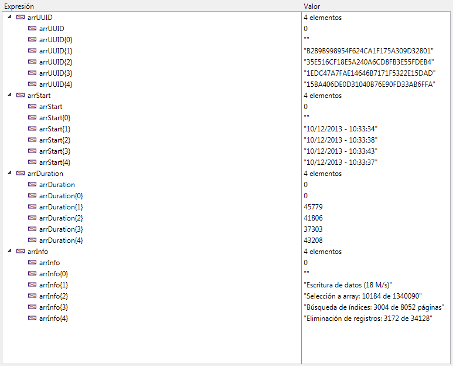

<!--REF #_command_.ACTIVITY SNAPSHOT.Syntax-->**ACTIVITY SNAPSHOT** ( arrActividades | arrUUID ; *arrInicio* ; *arrDuracion* ; *arrInfo* {; *arrDetails*}{; *} )<!-- END REF-->
<!--REF #_command_.ACTIVITY SNAPSHOT.Params-->
| Parámetro | Tipo |  | Descripción |
| --- | --- | --- | --- |
| arrActividades &#124; arrUUID | Array objeto, Array texto | &#8592; | Descripción completa de operaciones (array objeto) o<br/>UUIDs de las operaciones (array texto) |
| arrInicio | Text array | &#8592; | Horas de inicio de las operaciones |
| arrDuracion | Integer array | &#8592; | Duración de las operaciones en milisegundos |
| arrInfo | Text array | &#8592; | Descripción |
| arrDetails | Object array | &#8592; | Detalles del contexto y sub operaciones (si las hay) |
| * | Operador | &#8594;  | Si se pasa = Traer actividad del servidor |

<!-- END REF-->

#### Descripción 

<!--REF #_command_.ACTIVITY SNAPSHOT.Summary-->El comando **ACTIVITY SNAPSHOT** retorna un array o varios que describen las operaciones en progreso sobre los datos 4D.<!-- END REF--> Estas operaciones usualmente muestran una ventana de progreso.

Este comando se usa para traer una imagen de las x operaciones que más consumen tiempo tiempo y/o que corren más frecuentemente, tales como escritura de caché o ejecución de fórmulas.

**Nota:** La información devuelta por el comando **ACTIVITY SNAPSHOT** es la misma mostrada en la página "Monitor en tiempo real" (RTM) de la ventana de administración de 4D Server (vea el *Manual de 4D Server*). 

Por defecto, **ACTIVITY SNAPSHOT** procesa las operaciones realizadas a nivel local (con 4D monopuesto, 4D Server o 4D en modo remoto). Sin embargo, con 4D en modo remoto, también puede obtener una instantánea de las operaciones realizadas en el servidor: sólo tiene que pasar el asterisco (\*) como último parámetro. En este caso, el servidor de datos se recupera localmente.  
El parámetro *\** se ignora cuando el comando se ejecuta en 4D Server o 4D monopuesto.  
  
El comando **ACTIVITY SNAPSHOT**  acepta dos sintaxis:

* sintaxis usando solamente un array de objetos.
* sintaxis utilizando varios arrays.

##### Primera sintaxis: ACTIVITY SNAPSHOT ( {\* ;} arrActivities ) 

Con esta sintaxis, todas las operaciones se devuelven en un formulario estructurado en el array objetos 4D (*arrActividades*). Cada elemento del array es un objeto construido de la siguiente manera:

```json
[    {        "message":"xxx",        "maxValue":12321,        "currentValue":63212,        "interruptible:0,        "remote":0,        "uuid":"deadbeef",        "taskId":xxx,        "startTime":"2014-03-20 13:37:00:123",        "duration":92132,        "dbContextInfo":{            "task_id": xxx,            "user_name": Jean,            "host_name": HAL,            "task_name": "CreateIndexLocal",            "client_uid": "DE4DB33F33F"            "user4d_id ": 1,            "client_version ": 123456        },        "dbOperationDetails":{            table: "myTable"            field: "Field_1"        },        "subOperations":[            {"message":"xxx",            ...}            ]    },    {...}]
```

Esta es un descripción de cada propiedad devuelta:

* *message* (texto): etiqueta de la operación
* *maxValue* (número): número de iteraciones definidas para la operación (-1 si la operación no es iterativa)
* *currentValue* (número): iteración actual
* *interruptible* (número): la operación puede ser interrumpida por el usuario (0=true, 1=false)
* *remote* (número): operación por pares entre cliente y servidor (0=true, 1=false)
* *uuid* (text): identificador UUID de la operación
* *taskId* (número): identificador interno del proceso en el origen de la operación
* *startTime* (texto): la hora de inicio de la operación en formato "aaaa:mm:dd hh:mm:ss:mls"
* *duration* (número): duración de la operación en milisegundos
* *dbContextInfo* (objeto): información relativa a las operaciones manejadas por el motor de la base de datos. Contiene las siguientes propiedades:  
   * *host\_name* (cadena): nombre del host que lanzó la operación  
   * *user\_name* (cadena): nombre del usuario 4D cuya sesión lanzó la operación  
   * *task\_name* (cadena): nombre del proceso que lanzó la operación  
   * *task\_id* (num): número del ID del proceso que lanzó la operación  
   * *client\_uid* (cadena): opcional, uuid del cliente que lanzó la operación  
   * *is\_remote\_context* (booleano, 0 o 1): opcional, indica si la operación de la base fue lanzada por un cliente (valor 1) o por el servidor por medio del procedimiento almacenado (valor 0)  
   * *user4d\_id* (num): número del ID del usuario 4D actual del lado del cliente  
   * *client\_version* (cadena): cuatro dígitos representan la versión del motor 4D de la aplicación, como los devolvió el comando [Application version](application-version.md).  
**Nota:** client\_uid and is\_remote\_context sólo está disponible en modo cliente/servidor. client\_uid sólo se devuelve si la operación de la base de datos se inició en un equipo cliente.
* *dbOperationDetails* (objeto): propiedad devuelta únicamente si la operación llama al motor de base de datos (este es el caso, por ejemplo, para búsqueda y ordenaciones). Este es un objeto que contiene información específica relacionada con la operación en sí. Las propiedades disponibles dependen del tipo de la operación de base de datos realizada. Más específicamente, estas propiedades incluyen:  
   * table (cadena): nombre de la tabla implicado en la operación  
   * field (cadena): nombre del campo implicado en la operación  
   * queryPlan (cadena): plan de búsqueda definido para la operación  
   * ...
* *subOperations* (array): array de objetos que contienen sub-operaciones de la operación actual (si existe). La estructura de cada sub-elemento es idéntica a la del objeto principal. Si la operación actual no tiene sub-operaciones, entonces subOperations está vacío.

##### Segunda sintaxis: ACTIVITY SNAPSHOT ( {\* ;} arrUUID ; arrStart ; arrDuration ; arrInfo {;arrSubOp} ) 

Con esta sintaxis, todas las operaciones se devuelven en varios arrays sincronizados (cada operación provoca que un elemento se añada a todos los arrays). Los siguientes arrays se devuelven:

* *arrUUID*: contiene los identificadores UUID de cada operación (corresponde a la propiedad *uuid* del objeto *arrActividades* en la sintaxis anterior).
* *arrInicio*: contiene las horas de inicio de cada operación (corresponde a la propiedad *startTime* del objeto *arrActividades*).
* *arrDuracion*: contiene las duraciones de cada operación en milisegundos (corresponde a la propiedad *duration* del objeto *arrActividades*).
* *arrInfo*: contiene las etiquetas que describen cada operación (corresponde a la propiedad *message* del objeto *arrActividades*).
* *arrDetalles* (opcional): cada elemento de este array es un objeto que contiene las siguientes propiedades:  
   * *"dbContextInfo"* (objeto): ver arriba  
   * *"dbOperationDetails"* (objeto): ver arriba  
   * "subOperaciones". El valor de esta propiedad es un array objeto que contiene todas las sub-operaciones de la operación actual. Si la operación actual no tiene sub-operaciones, el valor de la propiedad *suboperaciones* es un array vacío. (corresponde a la propiedad *subOperations* del objeto *arrActividades*).

#### Ejemplo 

Este método, ejecutado en un proceso separado en 4D o 4D Server, ofrece una instantánea de las operaciones que están en marcha:

```4d
 ARRAY TEXT(arrUUID;0)
 ARRAY TEXT(arrStart;0)
 ARRAY LONGINT(arrDuration;0)
 ARRAY TEXT(arrInfo;0)
 
 Repeat
    ACTIVITY SNAPSHOT(arrUUID;arrStart;arrDuration;arrInfo)
    If(Size of array(arrUUID)>0)
       TRACE // llamada del depurador
    End if
 Until(False) // Bucle infinito
```

Obtiene arrays del tipo:




#### Propiedades

|  |  |
| --- | --- |
| Número de comando | 1277 |
| Hilo seguro | &check; |


